# 🧱 Encontro 1
## Introdução e Fundamentos

<div class="text-sm opacity-60 mt-4">3 horas · O que é um agente, anatomia, ReAct, primeiro agente em Python</div>

---
layout: center
class: text-center
---

# 💭 Uma pergunta para começar

<div class="text-2xl mt-8 opacity-90">
Você pede ao ChatGPT para <b>reservar um voo</b> pra São Paulo na sexta.<br>
Ele responde: <i>"Não posso fazer reservas."</i>
</div>

<div class="text-xl mt-8 text-cyan-400">
E se pudesse?
</div>

<div class="mt-8 text-sm opacity-60">
Esse é o problema que vamos resolver hoje: transformar um LLM que <b>conversa</b> em um agente que <b>age</b>.
</div>

---

# 🗺️ Agenda do Encontro 1

<div class="grid grid-cols-2 gap-6 mt-6">

<div>

**Bloco 1 — Teoria (~90 min)**
- 1.1 Roadmap da disciplina
- 1.2 O que é (e o que NÃO é) um agente
- 1.3 Anatomia de um agente
- 1.4 Como o LLM "pensa"
- 1.5 O padrão ReAct

</div>

<div>

**Bloco 2 — Prática (~90 min)**
- 1.6 Setup do ambiente Python
- 1.7 Hands-on: agente do zero, sem framework
- 1.8 Exercícios (4 atividades)

</div>

</div>

<div class="mt-8 p-4 rounded-xl bg-cyan-500/10 border border-cyan-500/30">
🎯 <b>Objetivo:</b> ao final, você terá rodado seu primeiro agente em Python, entendendo cada linha — sem mágica de framework.
</div>

---
layout: two-cols
---

# 1.1 Roadmap da disciplina

Em **4 encontros** vamos sair de *"não sei o que é um agente"* para *"sei desenhar, implementar, avaliar e debugar agentes"*.

**Filosofia da disciplina:**
- 🛠️ Toda aula tem código rodando
- 🧪 Erros são parte do aprendizado
- 📚 Teoria só o suficiente pra entender o porquê
- 🌍 Exemplos de produtos reais (Cursor, Claude Code, Devin…)

::right::

# Como aproveitar (assíncrono)

<v-clicks>

<div class="p-3 rounded-lg bg-white/5 mt-4">
⏰ <b>~90 min:</b> assistir/ler com atenção, copiar código, rodar
</div>

<div class="p-3 rounded-lg bg-white/5">
⏰ <b>~90 min:</b> exercícios sem olhar a solução
</div>

<div class="p-3 rounded-lg bg-amber-500/10 border border-amber-500/30">
⚠️ <b>Não pule os exercícios.</b> É onde o aprendizado realmente acontece. Ler sobre agentes ≠ construir agentes.
</div>

</v-clicks>

---

---

# 🧭 Antes de começar — vocabulário essencial

Você vai ouvir 5 palavras o tempo todo. Vamos defini-las em **uma frase cada**:

<div class="grid grid-cols-1 gap-2 text-sm mt-4">

<div class="p-3 rounded-lg bg-purple-500/10 border border-purple-500/30">
<b>🤖 IA (Inteligência Artificial)</b> — software que faz coisas que normalmente exigiriam pessoas: entender texto, ver imagens, conversar, decidir.
</div>

<div class="p-3 rounded-lg bg-cyan-500/10 border border-cyan-500/30">
<b>🧠 LLM (Large Language Model)</b> — o "cérebro" do ChatGPT/Claude/Gemini. Treinado em bilhões de páginas para <b>prever a próxima palavra</b> — e isso surpreendentemente o torna capaz de raciocinar.
</div>

<div class="p-3 rounded-lg bg-green-500/10 border border-green-500/30">
<b>💬 Prompt</b> — o texto que você manda para o LLM. <i>"Resume esse artigo em 3 linhas"</i> é um prompt. Melhor input → melhor output.
</div>

<div class="p-3 rounded-lg bg-amber-500/10 border border-amber-500/30">
<b>🔌 API</b> — uma "tomada" pela qual seu programa fala com outro serviço pela internet. <b>API da OpenAI</b> = jeito de chamar o ChatGPT a partir do seu código, sem abrir o site.
</div>

<div class="p-3 rounded-lg bg-pink-500/10 border border-pink-500/30">
<b>🦾 Agente</b> — um LLM com <b>permissão para agir</b>: buscar na web, escrever em uma planilha, mandar email, executar código… Em vez de só conversar, ele <i>faz coisas</i>.
</div>

</div>

<div class="mt-3 text-xs opacity-70 text-center">
Vamos abrir cada um desses termos com calma. Por enquanto, basta o reconhecimento.
</div>

---

# 🧩 Onde você já viu isso no dia-a-dia

Mesmo sem perceber, você provavelmente já usou **agentes de IA** nas últimas 24h:

<div class="grid grid-cols-2 gap-3 text-sm mt-4">
<div class="p-3 rounded-lg bg-white/5 border border-white/10"><b>📱 Celular</b><br>Meta AI, Siri/Alexa/Assistente, ChatGPT/Claude/Gemini app.</div>
<div class="p-3 rounded-lg bg-white/5 border border-white/10"><b>💻 Trabalho/estudo</b><br>Copilot no Office, Gemini no Gmail/Docs, Notion AI, Slack AI.</div>
<div class="p-3 rounded-lg bg-white/5 border border-white/10"><b>🛒 Consumo</b><br>Atendimento Magalu/Nubank/iFood, resumo da Amazon, recomendações de streaming.</div>
<div class="p-3 rounded-lg bg-white/5 border border-white/10"><b>👨‍💻 Programação</b><br>GitHub Copilot, Cursor/Windsurf, v0.dev, Bolt.new.</div>
</div>

<div class="mt-3 p-3 rounded-lg bg-cyan-500/10 border border-cyan-500/30 text-xs">
🎯 <b>O que esses produtos têm em comum?</b> Por baixo do capô, todos seguem o mesmo padrão de "LLM + ferramentas + loop" que vamos desmontar hoje.
</div>

---
layout: center
class: text-center
---

# 🧵 Percebeu o padrão?

<div class="text-xl mt-6 opacity-90">
Todos esses produtos fazem <b>a mesma coisa</b>:<br><br>
<span class="text-cyan-400">LLM pensa</span> → <span class="text-purple-400">ferramenta executa</span> → <span class="text-green-400">resultado volta</span> → <span class="text-cyan-400">LLM pensa de novo</span>
</div>

<div class="mt-8 text-sm opacity-70">
Nas próximas seções, vamos <b>abrir o capô</b> e ver cada peça.
</div>

---

# 🎬 Uma cena para fixar a ideia

Imagine que você pede ao ChatGPT:

<div class="mt-4 p-3 rounded-lg bg-purple-500/10 border border-purple-500/30 italic">
"Qual foi o time campeão do Brasileirão 2024 e quantos gols o artilheiro fez?"
</div>

<div class="mt-4 grid grid-cols-2 gap-4 text-sm">

<div class="p-4 rounded-xl bg-red-500/10 border border-red-500/30">
<b>🚫 LLM puro (sem ser agente)</b><br>
"Não tenho informações sobre eventos posteriores a janeiro de 2024..."<br><br>
<i>Ou pior: inventa uma resposta plausível mas errada.</i>
</div>

<div class="p-4 rounded-xl bg-green-500/10 border border-green-500/30">
<b>✅ Agente</b><br>
1. Percebe que precisa de dado atualizado<br>
2. Chama uma <b>ferramenta</b> de busca na web<br>
3. Lê os resultados<br>
4. Verifica e responde: <i>"Botafogo foi campeão; Alerrandro foi artilheiro com 19 gols. Fonte: …"</i>
</div>

</div>

<div class="mt-4 text-sm opacity-80 text-center">
Essa é a diferença prática entre <b>LLM</b> e <b>agente</b>: o agente <b>sabe quando pedir ajuda</b> e <b>sabe como usar ferramentas</b>.
</div>

---

# 1.2 O que é um Agente de IA?

Existem dezenas de definições. A mais útil, pragmática, vem da **Anthropic (2024)**:

<div class="mt-8 p-6 rounded-xl bg-cyan-500/10 border-2 border-cyan-500/40 text-center">
<div class="text-xl">
Um <b>agente</b> é um sistema onde um <b>LLM dirige seu próprio fluxo de execução em loop</b>,
</div>
<div class="text-xl mt-2">
decidindo <b>quais ferramentas chamar</b>, com base nas <b>observações</b> que recebe,
</div>
<div class="text-xl mt-2">
até atingir um <b>objetivo</b>.
</div>
</div>

<div class="mt-8 text-sm opacity-70 text-center">
Vamos quebrar essa definição em partes nos próximos slides.
</div>

---

# Espectro: do script ao agente

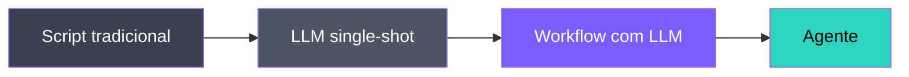

| Nível | Quem decide o próximo passo? | Exemplo |
|---|---|---|
| Script tradicional | Programador (`if/else` fixo) | Pipeline ETL |
| LLM single-shot | Programador (prompt único) | "Resuma este texto" |
| Workflow com LLM | Programador (DAG fixo, LLM em cada nó) | Extração → Tradução → Resumo |
| **Agente** | **O próprio LLM, em loop** | "Pesquise X na web e me entregue um relatório" |

---

# A regra de ouro 🥇

<div class="mt-8 p-6 rounded-xl bg-amber-500/10 border-2 border-amber-500/40 text-center">
<div class="text-2xl font-bold text-amber-300">"Use a complexidade mínima necessária."</div>
<div class="mt-3 opacity-70">— Anthropic, <i>Building Effective Agents</i> (2024)</div>
</div>

<div class="mt-8 grid grid-cols-2 gap-6 text-sm">
<div class="p-4 rounded-xl bg-green-500/10 border border-green-500/30"><div class="font-bold text-green-300 mb-2">✅ Use AGENTE quando…</div>passos não são conhecidos, o número de iterações varia e o modelo precisa escolher caminhos.</div>
<div class="p-4 rounded-xl bg-red-500/10 border border-red-500/30"><div class="font-bold text-red-300 mb-2">❌ Use WORKFLOW quando…</div>os passos são fixos, o SLA precisa ser baixo e o custo deve ser previsível.</div>
</div>

<div class="mt-4 text-center text-sm opacity-70">Agentes trazem flexibilidade <b>e</b> custo, latência e imprevisibilidade.</div>

---
layout: center
class: text-center
---

# 🔧 Hora de abrir o capô

<div class="text-xl mt-6 opacity-90">
Sabemos <b>o que</b> um agente faz e <b>quando</b> usar.<br>
Agora vamos ver <b>como</b> ele funciona por dentro.
</div>

<div class="mt-6 text-sm opacity-60">
Pense em montar um robô: vamos adicionar peça por peça.
</div>

---

# 1.3 Anatomia de um agente

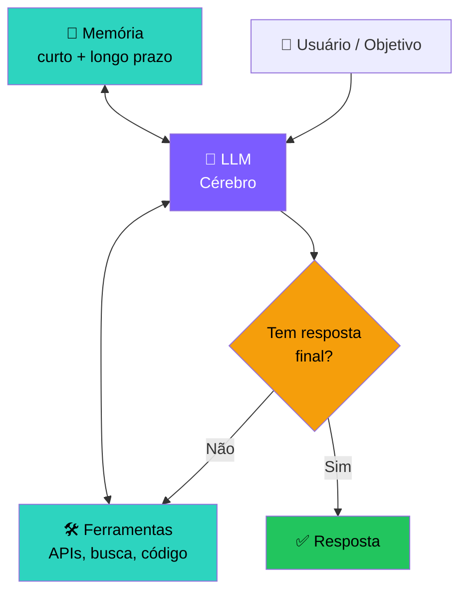

---

# Os 5 componentes essenciais

<div class="grid grid-cols-1 gap-3 text-sm">

<div class="p-3 rounded-lg bg-purple-500/10 border border-purple-500/30">
<b>1. 🧠 LLM (cérebro)</b> — faz reasoning e decide o próximo passo. Geralmente GPT-4o, Claude Sonnet, Gemini Pro, ou modelos open source (Llama, Qwen).
</div>

<div class="p-3 rounded-lg bg-cyan-500/10 border border-cyan-500/30">
<b>2. 🛠️ Ferramentas (tools)</b> — ações no mundo: HTTP requests, queries SQL, execução de código Python, leitura/escrita de arquivos, navegação web, controle de mouse…
</div>

<div class="p-3 rounded-lg bg-green-500/10 border border-green-500/30">
<b>3. 💾 Memória</b> — contexto da conversa (curto prazo) + base de conhecimento persistente (longo prazo, geralmente vector DB).
</div>

<div class="p-3 rounded-lg bg-amber-500/10 border border-amber-500/30">
<b>4. 🔄 Loop de controle</b> — o "run loop" que alimenta observações de volta ao LLM até a parada (sucesso, max steps, erro).
</div>

<div class="p-3 rounded-lg bg-pink-500/10 border border-pink-500/30">
<b>5. 🎯 Objetivo</b> — prompt do usuário + <i>system prompt</i> definindo missão, persona e restrições.
</div>

</div>

---

# Ciclo de vida de UM turno do agente

O "loop" parece simples, mas internamente cada iteração tem 7 etapas:

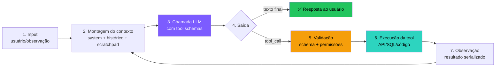

<div class="mt-4 text-sm opacity-80">
Cada iteração custa <b>uma chamada à API</b>. Agentes típicos rodam de 3 a 30 iterações por tarefa.
</div>

---

# 🤖 Mas afinal, o que é um LLM?

<div class="text-sm">

**LLM = Large Language Model** (Modelo de Linguagem de Grande Escala)

</div>

<div class="grid grid-cols-2 gap-4 mt-4">
<div class="p-3 rounded-xl bg-blue-500/10 border border-blue-500/30 text-sm">
<b>Definição simples:</b><br>
Um programa de computador que aprendeu a <b>prever a próxima palavra</b> lendo bilhões de textos da internet.
</div>
<div class="p-3 rounded-xl bg-green-500/10 border border-green-500/30 text-sm">
<b>🧩 Analogia:</b><br>
Imagine alguém que leu <b>toda a Wikipédia, Stack Overflow, livros e Reddit</b>. Não memorizou — mas aprendeu <i>padrões</i> de como texto funciona.
</div>
</div>

<div class="mt-4 p-3 rounded-lg bg-amber-500/10 border border-amber-500/30 text-sm">
⚠️ <b>LLM ≠ base de dados.</b> Ele não "guarda" frases; ele aprendeu <b>estatísticas de como palavras se relacionam</b>. Por isso pode inventar (alucinar).
</div>

<v-click>
<div class="mt-3 text-sm opacity-80">
Exemplos: GPT-4, Claude, Gemini, Llama, Qwen — todos são LLMs com arquiteturas similares.
</div>
</v-click>

---

# 🏗️ Como um LLM é treinado?

<div class="text-sm">O treinamento tem <b>3 fases</b> — cada uma adiciona uma camada de capacidade.</div>

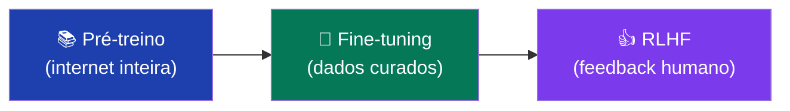

<div class="grid grid-cols-3 gap-2 mt-2 text-[11px] leading-tight">
<div class="p-1.5 rounded-lg bg-blue-500/10 border border-blue-500/30">
<b>1. Pré-treino</b><br>
Lê trilhões de tokens da web; aprende gramática, fatos e raciocínio. Objetivo: prever o próximo token. Custo: milhões de USD e meses de GPU.
</div>
<div class="p-1.5 rounded-lg bg-green-500/10 border border-green-500/30">
<b>2. Fine-tuning (SFT)</b><br>
Treina em exemplos de "pergunta → resposta ideal". Ensina formato de diálogo e como seguir instruções.
</div>
<div class="p-1.5 rounded-lg bg-purple-500/10 border border-purple-500/30">
<b>3. RLHF</b> (Reinforcement Learning from Human Feedback)<br>
Humanos comparam pares de respostas e escolhem a melhor. Um "modelo de recompensa" aprende esse ranking, e o LLM é otimizado para maximizar essa recompensa. Resultado: respostas úteis, seguras e naturais.
</div>
</div>

---

# 🧱 A arquitetura: Transformer (simplificado)

<div class="text-sm mb-2">Desde 2017, <b>todos</b> os LLMs usam a mesma base: a arquitetura <b>Transformer</b>.</div>

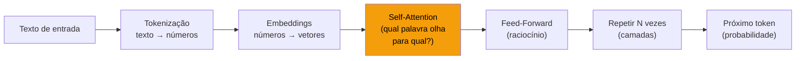

<div class="grid grid-cols-2 gap-2 mt-2 text-[11px] leading-tight">
<div class="p-1.5 rounded-lg bg-amber-500/10 border border-amber-500/30">
<b>🔑 Self-Attention</b> (o segredo)<br>
Cada palavra "decide" quais outras são relevantes. Ex.: em "O gato que eu vi <b>dormia</b>", "dormia" olha para "gato" — não para "eu".
</div>
<div class="p-1.5 rounded-lg bg-white/5 border border-white/10">
<b>📐 Escala importa</b><br>
GPT-2: 12 camadas, 1.5B params<br>
GPT-4: ~120 camadas, ~1.8T params<br>
Mais camadas = raciocínio mais profundo.
</div>
</div>

---

# 🎯 O que o LLM realmente faz: prever o próximo token

<div class="text-center mt-4">

```
Entrada: "O céu é"  →  Saída mais provável: "azul" (87%)
```

</div>

<div class="mt-3 text-sm">Ele gera texto <b>um token por vez</b>, escolhendo o mais provável a cada passo:</div>

<div class="mt-3 p-3 rounded-lg bg-white/5 text-sm font-mono">
"O" → "céu" → "é" → "azul" → "durante" → "o" → "dia" → "."
</div>

---

# 🎯 O que o LLM realmente faz: prever o próximo token

<div class="text-xs opacity-75">Consequência prática: esse mecanismo é poderoso — mas tem limites claros.</div>

<div class="grid grid-cols-2 gap-3 mt-4 text-xs">
<div class="p-3 rounded-lg bg-green-500/10 border border-green-500/30">
<b>✅ O que ele faz bem:</b><br>
• Completar padrões conhecidos<br>
• Seguir instruções<br>
• Raciocinar sobre texto<br>
• Gerar código, resumos, traduções
</div>
<div class="p-3 rounded-lg bg-red-500/10 border border-red-500/30">
<b>❌ O que ele NÃO faz:</b><br>
• Acessar a internet (sem tools)<br>
• Lembrar conversas anteriores<br>
• Executar código<br>
• Garantir fatos (pode alucinar)
</div>
</div>

<v-click>
<div class="mt-3 p-2 rounded-lg bg-cyan-500/10 border border-cyan-500/30 text-xs">
💡 <b>E é exatamente por isso que precisamos de AGENTES</b> — para dar ao LLM mãos (tools), memória e a capacidade de agir no mundo real.
</div>
</v-click>

---

# 🧠 Deep dive: o LLM (cérebro)

<div class="grid grid-cols-2 gap-4 text-sm">
<div class="p-4 rounded-xl bg-purple-500/10 border border-purple-500/30">
<b>O que ele faz num agente</b>
<ul><li>Lê o contexto inteiro a cada turno</li><li>Decide: respondo ou chamo tool?</li><li>Escolhe a ferramenta e monta os argumentos</li><li>Interpreta o resultado e segue</li></ul>
</div>
<div class="p-4 rounded-xl bg-white/5 border border-white/10">
<b>Famílias relevantes (2024-2025)</b>
<ul><li><b>Reasoning</b>: o3-pro, o4-mini, DeepSeek-R1, Claude Sonnet 4 Thinking</li><li><b>Generalistas</b>: GPT-4.1, Claude Sonnet 4, Gemini 2.5 Pro</li><li><b>Rápidos/baratos</b>: GPT-4.1-mini, Haiku, Gemini Flash</li><li><b>Open weights</b>: Llama 4, Qwen 3, Mistral Medium</li></ul>
</div>
</div>

<div class="mt-3 grid grid-cols-2 gap-3 text-sm">
<div class="p-3 rounded-lg bg-blue-500/10 border border-blue-500/30">🧩 <b>Analogia:</b> o LLM é o cérebro de um <b>estagiário brilhante e amnésico</b>: raciocina bem, mas esquece tudo ao fim da chamada.</div>
<div class="p-3 rounded-lg bg-amber-500/10 border border-amber-500/30"><b>Tradeoff central:</b> modelos maiores acertam mais, porém custam ~10–50× e respondem ~3–10× mais lento. Por isso o mercado usa <b>roteadores</b>.</div>
</div>

---
layout: center
class: text-center
---

# 🤔 Três números mandam no agente

<div class="text-2xl mt-6 opacity-90">
Se ele ficou <b>caro</b>, <b>lento</b> ou <b>inconsistente</b>, quase sempre há 3 suspeitos:
</div>

<div class="mt-8 text-3xl font-bold text-cyan-400">
tokens · janela de contexto · temperatura
</div>

---

# 🔤 O que é um Token?

<div class="text-sm mb-4">O LLM não lê letras nem palavras; ele lê <b>tokens</b>, pequenos pedaços de texto.</div>

| Texto original | Tokens |
|---|---|
| `"Olá, mundo!"` | `["Ol", "á", ",", " mundo", "!"]` → 5 tokens |
| `"Inteligência Artificial"` | `["Int", "elig", "ência", " Artificial"]` → 4 tokens |
| `"def hello():"` | `["def", " hello", "():"]` → 3 tokens |

<div class="mt-4 grid grid-cols-2 gap-3 text-xs">
<div class="p-3 rounded-lg bg-blue-500/10 border border-blue-500/30"><b>Por que importa?</b><br>Você paga por token; português costuma usar ~30% mais tokens que inglês; código é tokenizado de forma eficiente.</div>
<div class="p-3 rounded-lg bg-green-500/10 border border-green-500/30"><b>🧩 Analogia</b><br>É como ler um livro por sílabas. Quanto mais "sílabas", mais caro e lento fica.</div>
</div>

<div class="mt-3 text-xs opacity-70">💡 Teste: <a href="https://platform.openai.com/tokenizer" class="text-cyan-400">platform.openai.com/tokenizer</a></div>

---

# 📐 Context Window (Janela de Contexto)

<div class="text-sm mb-4">A <b>context window</b> é tudo o que o modelo consegue "ver" de uma vez: input + output.</div>

```mermaid {scale: 0.55}
flowchart LR
  subgraph CTX["📐 Context Window = 128K tokens"]
    direction LR
    SYS["🎭 System\n~500 tok"] --> HIST["💬 Histórico\n~20K tok"]
    HIST --> TOOLS["🛠️ Tools Schema\n~2K tok"]
    TOOLS --> USER["👤 Pergunta atual\n~200 tok"]
    USER --> RESP["✍️ Resposta\n~4K tok"]
  end
  style CTX fill:#0f1119,stroke:#22d3ee
```

<div class="grid grid-cols-3 gap-3 mt-4 text-xs">
<div class="p-3 rounded-lg bg-white/5 border border-white/10"><b>Limites típicos</b><br>GPT-4o: <b>128K</b><br>Claude Sonnet: <b>200K</b><br>Gemini 2.5: <b>1M</b><br>GPT-4 original: <b>8K</b></div>
<div class="p-3 rounded-lg bg-amber-500/10 border border-amber-500/30"><b>Problema para agentes</b><br>O histórico cresce a cada tool call. Depois de 10 passos, 30K+ tokens podem sumir só em contexto.</div>
<div class="p-3 rounded-lg bg-green-500/10 border border-green-500/30"><b>🧩 Analogia</b><br>É uma mesa de escritório: cabe muita coisa, mas nunca tudo.</div>
</div>

---

# 🌡️ Temperature (Temperatura)

<div class="text-sm mb-4">A <b>temperature</b> controla o quão previsível vs criativo o modelo será ao escolher o próximo token.</div>

<div class="grid grid-cols-3 gap-4 mt-3 text-xs">
<div class="text-center p-3 rounded-xl bg-white/5 border border-white/10"><div class="text-3xl">🧊</div><div class="font-bold mt-1">temp = 0</div><div class="mt-1 opacity-80">Mais provável, repetível.</div><div class="mt-2 text-cyan-400">Ideal para agentes e código</div></div>
<div class="text-center p-3 rounded-xl bg-white/5 border border-white/10"><div class="text-3xl">😊</div><div class="font-bold mt-1">temp = 0.7</div><div class="mt-1 opacity-80">Mais variedade, ainda coerente.</div><div class="mt-2 text-cyan-400">Ideal para chat e escrita</div></div>
<div class="text-center p-3 rounded-xl bg-white/5 border border-white/10"><div class="text-3xl">🎲</div><div class="font-bold mt-1">temp = 1.5+</div><div class="mt-1 opacity-80">Muito aleatório; pode gerar nonsense.</div><div class="mt-2 text-cyan-400">Ideal para brainstorm e arte</div></div>
</div>

<div class="grid grid-cols-2 gap-3 mt-4 text-xs">
<div class="p-3 rounded-lg bg-blue-500/10 border border-blue-500/30"><b>Exemplo</b><br><code>temp=0</code>: "sofá" sempre.<br><code>temp=0.7</code>: "sofá", "tapete", "telhado".<br><code>temp=1.5</code>: até "existencialismo".</div>
<div class="p-3 rounded-lg bg-amber-500/10 border border-amber-500/30"><b>🎯 Regra prática</b><br>Em produção, agentes costumam usar <code>temperature=0</code> para reduzir bugs imprevisíveis.</div>
</div>

<div class="mt-3 p-3 rounded-lg bg-green-500/10 border border-green-500/30 text-xs"><b>🧩 Analogia:</b> responder prova em temp alta é "chutar com estilo". Às vezes brilha; geralmente erra mais.</div>

---

# 🛠️ Deep dive: ferramentas (tools)

Uma tool tem **3 partes** que o LLM precisa entender:

<div class="grid grid-cols-3 gap-3 text-xs mt-4">
<div class="p-3 rounded-lg bg-cyan-500/10 border border-cyan-500/30"><b>1. Nome + descrição</b><br>Se a descrição é ambígua, o LLM chama errado.<pre class="text-[10px] mt-2"><code>name: "search_web"
desc: "Busca informações
atuais na web."</code></pre></div>
<div class="p-3 rounded-lg bg-cyan-500/10 border border-cyan-500/30"><b>2. Schema dos parâmetros</b><br>JSON Schema define tipos, obrigatoriedade e enums.<pre class="text-[10px] mt-2"><code>{"query":{"type":"string"},
"max_results":{"type":"integer"}}</code></pre></div>
<div class="p-3 rounded-lg bg-cyan-500/10 border border-cyan-500/30"><b>3. Implementação</b><br>O runtime executa; o LLM só pede.<pre class="text-[10px] mt-2"><code>def search_web(query):
    return requests.get(...)</code></pre></div>
</div>

---
layout: center
class: text-center
---

# ❓ Se o agente "sabe tudo", por que trava?

<div class="text-2xl mt-8 opacity-90">
Porque <b>agir</b> é diferente de <b>falar</b>.<br>
Sem tools bem descritas, ele vira um ótimo narrador de intenções.
</div>

---

# Ferramentas na prática

<div class="grid grid-cols-2 gap-3 text-sm">
<div class="p-3 rounded-lg bg-blue-500/10 border border-blue-500/30">🧩 <b>Analogia:</b> tools são as <b>mãos do estagiário</b>. Você decide quais mãos dar — e quais bloquear.</div>
<div class="p-3 rounded-lg bg-amber-500/10 border border-amber-500/30"><b>Guardrail:</b> leitor de email ≠ enviador de email; query SQL ≠ <code>DELETE</code>. Capacidade sem limite vira risco.</div>
</div>

<div class="mt-4 grid grid-cols-3 gap-3 text-xs">
<div class="p-3 rounded-lg bg-white/5 border border-white/10"><b>Retrieval</b><br>busca web, RAG, FAQ</div>
<div class="p-3 rounded-lg bg-white/5 border border-white/10"><b>Computação / I/O</b><br>Python, arquivos, banco, APIs</div>
<div class="p-3 rounded-lg bg-white/5 border border-white/10"><b>Ação / meta</b><br>email, PR no GitHub, delegar a outro agente</div>
</div>

<div class="mt-3 p-2 rounded-lg bg-white/5 text-xs">🏢 <b>Mercado:</b> <b>Anthropic MCP</b> e <b>OpenAI function calling</b> padronizaram a interface; <b>Zapier, Composio, Arcade</b> oferecem catálogos com centenas de integrações.</div>

---

# 💾 Deep dive: memória — 3 camadas

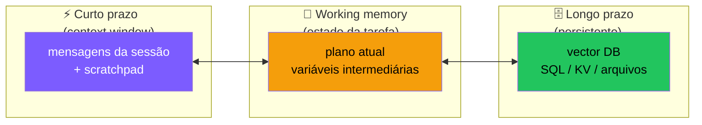

<div class="grid grid-cols-3 gap-3 mt-4 text-xs">
<div class="p-3 rounded-lg bg-white/5 border border-white/10"><b>Curto prazo</b><br>Histórico in-context. Cresce e satura.</div>
<div class="p-3 rounded-lg bg-white/5 border border-white/10"><b>Working memory</b><br>Scratchpad estruturado sem inflar o prompt inteiro.</div>
<div class="p-3 rounded-lg bg-white/5 border border-white/10"><b>Longo prazo</b><br>Busca semântica, fatos estruturados e artefatos.</div>
</div>

---

# Memória na prática

<div class="grid grid-cols-2 gap-3 text-xs">
<div class="p-3 rounded-lg bg-blue-500/10 border border-blue-500/30">🧩 <b>Analogia:</b> mesa agora = curto prazo; caderno ao lado = working memory; arquivo morto = longo prazo.</div>
<div class="p-3 rounded-lg bg-white/5 border border-white/10">🏢 <b>Mercado:</b> <b>ChatGPT Memory</b>, <b>Claude Projects</b>, <b>Cursor @-context</b>, além de <b>Pinecone, Weaviate, Qdrant, pgvector, Mem0 e Letta</b>.</div>
</div>

<div class="mt-4 p-3 rounded-lg bg-amber-500/10 border border-amber-500/30 text-xs"><b>Episódica</b> = o que aconteceu · <b>semântica</b> = fatos · <b>procedural</b> = como fazer. Voltamos nisso no Encontro 3.</div>

---

# 🔄 Deep dive: o loop de controle

<div class="grid grid-cols-2 gap-3 text-sm mt-3">
<div class="p-3 rounded-lg bg-purple-500/10 border border-purple-500/30"><b>O que o loop faz</b><ol class="text-xs"><li>Pergunta ao LLM o próximo passo</li><li>Se for resposta final, entrega</li><li>Se for tool, executa</li><li>Devolve a observação ao contexto</li><li>Repete</li></ol></div>
<div class="p-3 rounded-lg bg-amber-500/10 border border-amber-500/30"><b>Paradas obrigatórias</b><ul class="text-xs"><li>✅ resposta final</li><li>🛑 <code>max_steps</code></li><li>💸 orçamento de tokens/dinheiro</li><li>💥 erro irrecuperável</li></ul></div>
</div>

<div class="mt-3 p-2 rounded-lg bg-blue-500/10 border border-blue-500/30 text-xs">🧩 <b>Analogia:</b> o loop é o batimento cardíaco do agente; os limites de parada são o marca-passo.</div>

---

# Loop de controle no mercado

<div class="grid grid-cols-2 gap-3 text-xs">
<div class="p-3 rounded-lg bg-white/5 border border-white/10"><b>Frameworks prontos</b><br><b>LangGraph</b>, <b>LlamaIndex AgentWorkflow</b>, <b>Pydantic AI</b>, <b>OpenAI Agents SDK</b>, <b>Smolagents</b>.</div>
<div class="p-3 rounded-lg bg-cyan-500/10 border border-cyan-500/30"><b>Mensagem principal</b><br>Mesmo com framework, a responsabilidade continua sua: decidir quando parar e como recuperar erro.</div>
</div>

<div class="mt-3 text-xs opacity-60 text-center">👉 O loop que veremos no hands-on tem ~20 linhas. O importante é entender a lógica, não decorar framework.</div>

---

# 🎯 Deep dive: o objetivo e o system prompt

<div class="text-sm mb-3">Um bom system prompt costuma responder 6 perguntas. Primeiro, as 3 fundações:</div>

<div class="grid grid-cols-3 gap-3 text-xs">
<div class="p-3 rounded-lg bg-pink-500/10 border border-pink-500/30"><b>1. Quem é?</b><br>Identidade/papel.</div>
<div class="p-3 rounded-lg bg-pink-500/10 border border-pink-500/30"><b>2. O que quer?</b><br>Objetivo da missão.</div>
<div class="p-3 rounded-lg bg-pink-500/10 border border-pink-500/30"><b>3. Com o que trabalha?</b><br>Ferramentas disponíveis.</div>
</div>

---

# System prompt, parte 2

<div class="grid grid-cols-3 gap-3 text-xs">
<div class="p-3 rounded-lg bg-pink-500/10 border border-pink-500/30"><b>4. Como agir?</b><br>Procedimento e heurísticas.</div>
<div class="p-3 rounded-lg bg-pink-500/10 border border-pink-500/30"><b>5. O que não pode?</b><br>Restrições e políticas.</div>
<div class="p-3 rounded-lg bg-pink-500/10 border border-pink-500/30"><b>6. Como reporta?</b><br>Formato de saída.</div>
</div>

<div class="mt-4 grid grid-cols-2 gap-3 text-xs">
<div class="p-3 rounded-lg bg-blue-500/10 border border-blue-500/30">🧩 <b>Analogia:</b> é o manual do funcionário no primeiro dia.</div>
<div class="p-3 rounded-lg bg-amber-500/10 border border-amber-500/30"><b>Princípio:</b> trate o system prompt como constituição do agente: versione em git e teste regressão.</div>
</div>

<div class="mt-3 p-2 rounded-lg bg-white/5 text-xs">🏢 <b>Mercado:</b> Claude.ai, Cursor, Devin e v0.dev usam prompts longos, seccionados e testados como código.</div>

---

# Anatomia de uma mensagem — os 4 papéis

<div class="text-sm mb-3">Todo agente conversa em mensagens tipadas. Se você entender estas 4, já evita a maioria dos bugs.</div>

<div class="grid grid-cols-2 gap-3 text-xs">
<div class="p-3 rounded-lg bg-purple-500/10 border border-purple-500/30"><b>system</b><br>Instruções do desenvolvedor.<pre class="text-[10px] mt-1"><code>{"role":"system","content":"Você é..."}</code></pre></div>
<div class="p-3 rounded-lg bg-blue-500/10 border border-blue-500/30"><b>user</b><br>Input humano ou externo.<pre class="text-[10px] mt-1"><code>{"role":"user","content":"Qual o PIB?"}</code></pre></div>
<div class="p-3 rounded-lg bg-green-500/10 border border-green-500/30"><b>assistant</b><br>Resposta do LLM ou pedido de tool.<pre class="text-[10px] mt-1"><code>{"role":"assistant","tool_calls":[...]}</code></pre></div>
<div class="p-3 rounded-lg bg-cyan-500/10 border border-cyan-500/30"><b>tool</b><br>Resultado da ferramenta.<pre class="text-[10px] mt-1"><code>{"role":"tool","tool_call_id":"c1","content":"..."}</code></pre></div>
</div>

<div class="mt-3 text-xs opacity-70">Fluxo central: <code>assistant(tool_call) → tool(result) → assistant(...)</code>.</div>

---

# Estado: o que **flui** entre iterações

Diferente de uma chamada LLM solta, um agente carrega **estado acumulado**:

<div class="grid grid-cols-2 gap-4 text-sm mt-4">
<div class="p-3 rounded-lg bg-white/5 border border-white/10"><b>Estado explícito</b><br><span class="text-xs">Histórico, tool calls, resultados, scratchpad e system prompt.</span></div>
<div class="p-3 rounded-lg bg-white/5 border border-white/10"><b>Estado implícito</b><br><span class="text-xs">Iterações, custo, sessões abertas, cache e observabilidade.</span></div>
</div>

<div class="mt-4 p-3 rounded-lg bg-amber-500/10 border border-amber-500/30 text-xs">
<b>Implicação prática:</b> agentes não são "stateless" como uma API REST. Para escalar, persista o estado (Redis, banco) e torne o loop <b>retomável</b> — interrompido, deve poder continuar.
</div>

---

# Paradigmas de orquestração

Três arquiteturas que você vai encontrar no mercado:

<div class="grid grid-cols-3 gap-3 text-xs">
<div class="p-3 rounded-lg bg-purple-500/10 border border-purple-500/30"><b>🔁 ReAct</b><br>Pensa → age → observa.<br>✅ simples e flexível<br>❌ pode divagar</div>
<div class="p-3 rounded-lg bg-blue-500/10 border border-blue-500/30"><b>📋 Plan-and-Execute</b><br>Planeja tudo antes.<br>✅ previsível e auditável<br>❌ o plano envelhece</div>
<div class="p-3 rounded-lg bg-green-500/10 border border-green-500/30"><b>🔄 Reflexion</b><br>Executa, critica, tenta de novo.<br>✅ melhora qualidade<br>❌ custa mais</div>
</div>

<div class="mt-4 text-xs opacity-80">Na prática, sistemas fortes <b>combinam</b> os três: planejam em alto nível, executam em ReAct e refletem após blocos.</div>

---

# Autonomia: o espectro de controle

Quanto controle humano você dá ao agente?

<div class="mt-4">

| Nível | Descrição | Exemplo |
|---|---|---|
| **L0 — Suggest** | Agente propõe, humano executa tudo | Copilot autocomplete |
| **L1 — Confirm** | Cada ação requer aprovação | Cursor "accept all" por arquivo |
| **L2 — Bounded** | Autônomo dentro de limites (read-only, sandbox) | Pesquisa web, análise de dados |
| **L3 — Supervised** | Autônomo com revisão pós-fato | PRs abertos por bots, drafts de email |
| **L4 — Autonomous** | Roda sem humano no loop | Agentes de monitoramento, support tier 1 |
| **L5 — Self-improving** | Modifica seus próprios prompts/tools | Pesquisa de fronteira (Voyager, AutoML) |

</div>

<div class="mt-3 p-3 rounded-lg bg-amber-500/10 border border-amber-500/30 text-xs">
🎯 <b>Comece sempre em L1 ou L2.</b> Subir de nível só depois de telemetria provando que o agente acerta em &gt;95% dos casos do seu domínio.
</div>

---

# Onde os agentes **quebram** — mapa por componente

| Componente | Falha típica | Sintoma | Mitigação (preview) |
|---|---|---|---|
| 🧠 LLM | Alucina argumento de tool | Tool roda com dado inventado | Schema estrito + validação |
| 🛠️ Tool | Resultado enorme (10k tokens) | Janela satura em 2 turnos | Resumir / paginar / truncar |
| 💾 Memória | Histórico cresce sem limite | Custo explode, latência sobe | Sliding window, sumarização |
| 🔄 Loop | Sem condição de parada | Roda em loop infinito | `max_steps`, watchdog de custo |
| 🎯 Objetivo | System prompt ambíguo | Comportamento inconsistente | Versão + testes de regressão |
| 🤝 Multi-tool | Escolhe a tool errada | Tarefa nunca conclui | Descrições disjuntas, exemplos |

<div class="mt-4 text-xs opacity-80">
Cada uma dessas falhas vai ter um slot dedicado no Encontro 4. Por enquanto, <b>reconheça o vocabulário</b>.
</div>

---
layout: center
class: text-center
---

# ⏸️ Pausa — o que construímos até aqui

<div class="text-lg mt-6 opacity-90">
<b>✅ Sabemos:</b> o que é um agente, seus 5 componentes, como o loop funciona, onde quebra.<br><br>
<b>➡️ Agora:</b> vamos ver quem está construindo isso no mundo real — e depois <b>botar a mão na massa</b>.
</div>

---

# 🌐 Panorama de mercado — agentes em 2025

<div class="grid grid-cols-2 gap-3 text-xs">
<div class="p-3 rounded-lg bg-purple-500/10 border border-purple-500/30"><b>💻 Coding agents</b><br>GitHub Copilot Workspace / Coding Agent · Cursor (US$ 9B, mai/2025) · Devin/Cognition ($2B+) · Claude Code (fev/2025) · Replit Agent · v0.dev · Bolt.new</div>
<div class="p-3 rounded-lg bg-cyan-500/10 border border-cyan-500/30"><b>🔎 Research / browse</b><br>Perplexity Pro Search (US$ 9B) · OpenAI Deep Research (fev/2025) · Gemini Deep Research · You.com · Phind</div>
<div class="p-3 rounded-lg bg-green-500/10 border border-green-500/30"><b>🏢 Enterprise / vertical</b><br>Salesforce Agentforce (out/2024) · Copilot Studio + Autonomous Agents · ServiceNow Now Assist · Klarna AI assistant · Sierra (US$ 4B em CX)</div>
<div class="p-3 rounded-lg bg-amber-500/10 border border-amber-500/30"><b>🧑‍💼 Computer use</b><br>Anthropic Computer Use (out/2024) · OpenAI Operator (jan/2025) · Google Project Mariner · Adept ACT</div>
</div>

<div class="mt-3 text-xs opacity-70 text-center">Fontes: anúncios oficiais + relatórios públicos de funding (Crunchbase, TechCrunch).</div>

---
layout: center
class: text-center
---

# 💡 Pergunta importante

<div class="text-2xl mt-8 opacity-90">
Se há tantos produtos, <b>quem fabrica os cérebros</b> por trás deles?
</div>

---

# 🏢 Labs de fronteira — parte 1

<div class="grid grid-cols-3 gap-3 text-xs">
<div class="p-3 rounded-lg bg-emerald-500/10 border border-emerald-500/30"><b>🟢 OpenAI</b> <span class="opacity-60">(2015, SF)</span><br><i>Modelos:</i> GPT-4.1, o3-pro, o4-mini, GPT-4o<br><i>Aposta:</i> AGI via escala + reasoning models; o1/o3 foram substituídos por o3-pro/o4-mini<br><i>Parcerias:</i> Microsoft (US$ 13B+) e Apple Intelligence<br><i>Valuation:</i> ~US$ 500B (2025)</div>
<div class="p-3 rounded-lg bg-orange-500/10 border border-orange-500/30"><b>🟠 Anthropic</b> <span class="opacity-60">(2021, SF)</span><br><i>Modelos:</i> Claude Haiku/Sonnet/Opus<br><i>Aposta:</i> Constitutional AI + liderança em devs, MCP e Computer Use<br><i>Parcerias:</i> Amazon (US$ 8B) e Google (US$ 2B)<br><i>Valuation:</i> ~US$ 60B (2025)</div>
<div class="p-3 rounded-lg bg-blue-500/10 border border-blue-500/30"><b>🔵 Google DeepMind</b> <span class="opacity-60">(unificada em 2023)</span><br><i>Modelos:</i> Gemini 1.5/2.0/2.5 Pro/Flash<br><i>Aposta:</i> multimodal nativo + 1M–2M tokens<br><i>Trunfo:</i> operar chip → modelo → produto → distribuição</div>
</div>

---

# Labs de fronteira — parte 2

<div class="grid grid-cols-3 gap-3 text-xs">
<div class="p-3 rounded-lg bg-cyan-500/10 border border-cyan-500/30"><b>🪟 Microsoft</b> <span class="opacity-60">(via OpenAI + interno)</span><br><i>Modelo:</i> Phi + GPT via Azure<br><i>Aposta:</i> distribuição em Windows, Office, GitHub e Azure<br><i>Trunfo:</i> 1.4B de usuários corporativos</div>
<div class="p-3 rounded-lg bg-indigo-500/10 border border-indigo-500/30"><b>🦙 Meta</b> <span class="opacity-60">(FAIR)</span><br><i>Modelo:</i> Llama 3.x / 4<br><i>Aposta:</i> open weights para commoditizar o modelo<br><i>Impacto:</i> ecossistemas como Ollama, Groq e Together</div>
<div class="p-3 rounded-lg bg-zinc-500/10 border border-zinc-500/30"><b>⚫ xAI</b> <span class="opacity-60">(2023)</span><br><i>Modelo:</i> Grok 2 / 3 / 4<br><i>Aposta:</i> velocidade de escala + dados do X<br><i>Posição:</i> cluster Colossus com 100k+ H100s</div>
</div>

---

# 🌏 Open-source, novos entrantes e o eixo Ásia

<div class="grid grid-cols-2 gap-3 text-sm">
<div class="p-4 rounded-xl bg-purple-500/10 border border-purple-500/30"><b>🇫🇷 Mistral AI</b><br><span class="text-xs">Paris, 2023. Modelos abertos como <b>Mistral Large 2, Codestral e Pixtral</b>; foco em soberania digital europeia.</span></div>
<div class="p-4 rounded-xl bg-red-500/10 border border-red-500/30"><b>🇨🇳 DeepSeek</b><br><span class="text-xs"><b>DeepSeek-V3 / R1</b> (jan/2025) chegou perto de GPT-4o / o1 por fração do custo de treino (~US$ 6M vs US$ 100M+).</span></div>
<div class="p-4 rounded-xl bg-amber-500/10 border border-amber-500/30"><b>🇨🇳 Qwen / Kimi / 01.AI</b><br><span class="text-xs"><b>Qwen 2.5 / 3</b> domina rankings open-source; Kimi explora janelas de 2M tokens.</span></div>
<div class="p-4 rounded-xl bg-teal-500/10 border border-teal-500/30"><b>🇨🇦 Cohere · 🇮🇱 AI21 · 🇺🇸 Inflection</b><br><span class="text-xs">Players focados em enterprise, RAG e especialização de domínio.</span></div>
</div>

<div class="mt-4 p-3 rounded bg-cyan-500/10 border border-cyan-500/30 text-sm">🎯 <b>Implicação prática:</b> em agentes, você raramente fica preso a um fornecedor. Com LiteLLM, LangChain ou APIs compatíveis com OpenAI, trocar modelo costuma ser mudança de poucas linhas.</div>

---

# 📅 Linha do tempo — a corrida da IA generativa

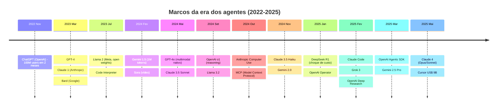

<div class="mt-3 text-xs opacity-70 text-center">Hoje há lançamento relevante quase toda semana. O framework mental vale mais que decorar uma API.</div>

---
layout: center
class: text-center
---

# 🤨 O que mudou tão rápido?

<div class="text-2xl mt-8 opacity-90">
Não foi "só mais dados".<br>
Houve <b>três saltos qualitativos</b>.
</div>

---

# 🚀 Os 3 grandes saltos

<div class="grid grid-cols-3 gap-3 text-xs">
<div class="p-4 rounded-xl bg-purple-500/10 border border-purple-500/30"><div class="text-2xl text-center mb-2">📈</div><b>1. Escala (2020)</b><div class="mt-2 opacity-80">De 1.5B (GPT-2) para 175B (GPT-3): surgem tradução, código e raciocínio sem treino específico.</div><div class="mt-2 text-purple-400 font-bold">Insight: escalar cria novas capacidades</div></div>
<div class="p-4 rounded-xl bg-cyan-500/10 border border-cyan-500/30"><div class="text-2xl text-center mb-2">🎯</div><b>2. Alinhamento (2022)</b><div class="mt-2 opacity-80">RLHF transformou "completar texto" em "seguir instruções"; ChatGPT = GPT-3.5 + RLHF.</div><div class="mt-2 text-cyan-400 font-bold">Insight: alinhar > só escalar</div></div>
<div class="p-4 rounded-xl bg-green-500/10 border border-green-500/30"><div class="text-2xl text-center mb-2">🧠</div><b>3. Raciocínio (2024)</b><div class="mt-2 opacity-80">Reasoning models passaram a "pensar antes de responder" e avançaram em PhD/math/código.</div><div class="mt-2 text-green-400 font-bold">Insight: pensar mais = acertar mais</div></div>
</div>

---

# 📊 Visualizando a evolução — de GPT-2 a o4-mini

| Modelo | Ano | Parâmetros | Breakthrough | O que mudou na prática |
|--------|-----|-----------|--------------|------------------------|
| GPT-2 | 2019 | 1.5B | Escala inicial | Gera texto coerente, mas divaga |
| GPT-3 | 2020 | 175B | Few-shot learning | Faz tarefas com exemplos no prompt |
| ChatGPT | 2022 | ~175B + RLHF | Alinhamento | Primeiro assistente conversacional útil |
| GPT-4 | 2023 | ~1.8T (MoE) | Multimodal + MoE | Vê imagens, raciocina melhor |
| o3-pro | 2025 | ? + CoT interno | Raciocínio profundo | Resolve problemas bem mais difíceis |
| o4-mini | 2025 | Compacto + reasoning | Reasoning barato | Leva raciocínio a custo menor |

<div class="mt-3 p-3 rounded-lg bg-amber-500/10 border border-amber-500/30 text-xs"><b>🧩 Analogia:</b> GPT-2 continuava frases; GPT-4 já age como profissional sênior; o3-pro parece especialista que para, testa hipóteses e revisa.</div>

---

# 🔬 O que é RLHF? (Reinforcement Learning from Human Feedback)

<div class="text-sm mb-2">O "segredo" do ChatGPT não foi só escala — foi ensinar o modelo a <b>se comportar como humanos esperam</b>.</div>

<div class="text-xs mb-2">A sigla significa: <b>Reinforcement Learning</b> (aprendizado por reforço) <b>from Human Feedback</b> (a partir de feedback humano). É uma técnica onde o modelo <b>melhora iterativamente</b> recebendo "notas" baseadas na preferência de avaliadores humanos.</div>

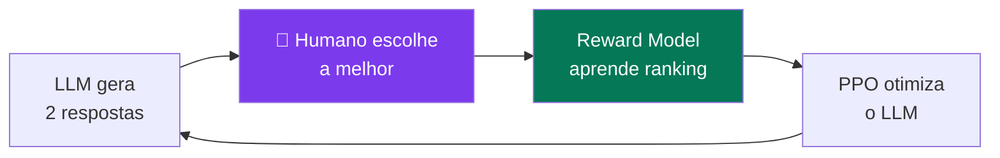

<div class="grid grid-cols-3 gap-2 text-[11px]">
<div class="p-2 rounded-lg bg-purple-500/10 border border-purple-500/30"><b>1. SFT</b> (Supervised Fine-Tuning)<br>Humanos escrevem respostas-modelo. O LLM aprende o <i>formato</i> desejado (diálogo, instruções).</div>
<div class="p-2 rounded-lg bg-cyan-500/10 border border-cyan-500/30"><b>2. Reward Model</b><br>Treinado com milhares de comparações humanas ("A é melhor que B"). Aprende a dar "nota" a qualquer resposta.</div>
<div class="p-2 rounded-lg bg-green-500/10 border border-green-500/30"><b>3. PPO</b> (Proximal Policy Optimization)<br>Algoritmo de RL que ajusta os pesos do LLM para maximizar a nota do Reward Model.</div>
</div>

---

# RLHF: antes e depois — exemplo concreto

<div class="grid grid-cols-2 gap-3 text-xs">
<div class="p-3 rounded-xl bg-red-500/10 border border-red-500/30">
<b>❌ GPT-3 (sem RLHF)</b><br>
<i>Prompt: "Escreva um email profissional recusando uma reunião"</i><br><br>
<div class="font-mono text-[10px] bg-black/20 p-2 rounded">Dear Sir, I am writing to inform you that the meeting scheduled for Tuesday will not be attended by me. The reasons are varied and complex...</div>
<div class="mt-1 opacity-70">Genérico, verboso, não-natural.</div>
</div>
<div class="p-3 rounded-xl bg-green-500/10 border border-green-500/30">
<b>✅ ChatGPT (com RLHF)</b><br>
<i>Mesmo prompt:</i><br><br>
<div class="font-mono text-[10px] bg-black/20 p-2 rounded">Olá João, obrigado pelo convite! Infelizmente não consigo participar terça. Podemos reagendar para quinta? Abraço, Alan</div>
<div class="mt-1 opacity-70">Natural, contextual, acionável.</div>
</div>
</div>

<div class="mt-3 p-2 rounded-lg bg-amber-500/10 border border-amber-500/30 text-xs">
💡 <b>Insight:</b> O modelo base já <b>sabia</b> escrever emails — o RLHF ensinou <b>qual estilo</b> os humanos preferem. É como um estagiário que sabe tudo mas precisa aprender as "normas sociais" do escritório.
</div>

---

# 🧠 Reasoning Models: o salto de 2024-2025

<div class="grid grid-cols-2 gap-4 mt-3 text-xs">
<div class="p-4 rounded-xl bg-white/5 border border-white/10"><b>Modelo tradicional</b><div class="font-mono mt-2 p-2 rounded bg-black/30">Pergunta → [1 passo] → Resposta</div><div class="mt-2 opacity-70">Mais rápido, mas erra em problemas complexos.</div></div>
<div class="p-4 rounded-xl bg-cyan-500/10 border border-cyan-500/30"><b>Reasoning model</b><div class="font-mono mt-2 p-2 rounded bg-black/30">Pergunta → [pensa] → [testa] → [verifica] → Resposta</div><div class="mt-2 opacity-70">Mais lento, porém muito mais forte em tarefas difíceis.</div></div>
</div>

---

# Por que reasoning models importam para agentes?

<div class="grid grid-cols-2 gap-3 mt-4 text-xs">
<div class="p-3 rounded-lg bg-amber-500/10 border border-amber-500/30"><b>Trade-off</b><ul><li>Mais tokens pensando = mais custo</li><li>Mais lento: segundos → minutos</li><li>Mas resolve tarefas antes inviáveis</li></ul></div>
<div class="p-3 rounded-lg bg-green-500/10 border border-green-500/30"><b>Impacto em agentes</b><ul><li>Planejam melhor</li><li>Fazem menos loops desnecessários</li><li>Decidem melhor quando chamar tool</li><li>SWE-bench: o3-pro chega a 70%+ em bugs reais</li></ul></div>
</div>

<div class="mt-3 p-3 rounded-lg bg-purple-500/10 border border-purple-500/30 text-xs"><b>🧩 Analogia:</b> um reasoning model é quem rascunha a prova antes de entregar.</div>

---

# 🧭 Como cada empresa se posiciona — parte 1

<div class="grid grid-cols-3 gap-3 text-xs mt-3">
<div class="p-3 rounded-lg bg-white/5 border border-white/10"><b>🟢 OpenAI</b><br>"Chegar primeiro à AGI" + ChatGPT como produto-mãe.<br><span class="opacity-70">Receita: Plus/Pro + API.</span></div>
<div class="p-3 rounded-lg bg-white/5 border border-white/10"><b>🟠 Anthropic</b><br>"Modelo mais confiável" para empresas e devs.<br><span class="opacity-70">Receita: API + Claude.ai + Bedrock.</span></div>
<div class="p-3 rounded-lg bg-white/5 border border-white/10"><b>🔵 Google</b><br>IA em Search, Android e Workspace para defender distribuição.<br><span class="opacity-70">Receita: ads + Workspace + Cloud.</span></div>
</div>

---

# Como cada empresa se posiciona — parte 2

<div class="grid grid-cols-3 gap-3 text-xs mt-3">
<div class="p-3 rounded-lg bg-white/5 border border-white/10"><b>🪟 Microsoft</b><br>Copilot em todo software — virar o "SO do trabalho".<br><span class="opacity-70">Receita: licenças + Azure.</span></div>
<div class="p-3 rounded-lg bg-white/5 border border-white/10"><b>🦙 Meta</b><br>Open-source para evitar gatekeepers e turbinar ads/feed.<br><span class="opacity-70">Receita: ads potencializados por IA.</span></div>
<div class="p-3 rounded-lg bg-white/5 border border-white/10"><b>🇨🇳 China (DeepSeek/Qwen)</b><br>Open-source agressivo + eficiência para driblar bloqueios de chips.<br><span class="opacity-70">Receita: B2B/B2G e exportação tecnológica.</span></div>
</div>

<div class="mt-4 p-3 rounded bg-amber-500/10 border border-amber-500/30 text-sm">🎓 <b>Mensagem para você:</b> o mais valioso não é casar com uma API; é saber desenhar agentes que trocam de modelo quando necessário.</div>

---

# 💰 O business case: por que agora?

<div class="grid grid-cols-2 gap-4 text-sm">
<div class="p-4 rounded-xl bg-white/5 border border-white/10"><b>📉 Custo despencou</b><br>GPT-3.5 (2022): US$ 20 / 1M tokens<br>GPT-4o-mini (2024): US$ 0,15 / 1M tokens<br><b>~130× mais barato</b> em 2 anos.</div>
<div class="p-4 rounded-xl bg-white/5 border border-white/10"><b>📈 Capacidade subiu</b><br>SWE-bench saiu de ~2% (2023) para ~50% (2024) e ~70%+ (2025) com agentes modernos.</div>
</div>

---

# O business case, na prática

<div class="grid grid-cols-2 gap-4 text-sm">
<div class="p-4 rounded-xl bg-purple-500/10 border border-purple-500/30"><b>🎯 ROI já medido</b><br>Klarna · Cosine · Harvey mostram ganho econômico em atendimento, código e jurídico.</div>
<div class="p-4 rounded-xl bg-cyan-500/10 border border-cyan-500/30"><b>🛠️ Tooling maduro</b><br>LangGraph, LlamaIndex, observabilidade, padrões abertos como MCP e frameworks de avaliação.</div>
</div>

<div class="mt-3 text-xs opacity-70 text-center">Gartner (out/2024): até 2028, 33% do software empresarial deve incluir IA agêntica, partindo de menos de 1% em 2024.</div>

---
layout: center
class: text-center
---

# 🎬 Da teoria à prática

<div class="text-xl mt-6 opacity-90">
Chega de slides.<br>
Vamos entender como o LLM funciona <b>por dentro</b> — e depois construir nosso primeiro agente.
</div>

<div class="mt-6 text-sm opacity-60">
🧰 A partir daqui: prepare seu terminal.
</div>

---

# 1.4 Como o LLM "pensa"

Antes de construir agentes, vale revisar os **3 controles** que mais mudam custo e comportamento:

<div class="grid grid-cols-3 gap-4 mt-6">
<div class="p-4 rounded-xl bg-white/5 border border-white/10"><h3>🔤 Tokens</h3><div class="text-sm">Unidade que o modelo enxerga. Português costuma gastar mais; você paga em input e output.</div></div>
<div class="p-4 rounded-xl bg-white/5 border border-white/10"><h3>🪟 Context window</h3><div class="text-sm">É a "mesa" onde cabem system, histórico e resultados. GPT-4o: 128k · Claude: 200k · Gemini: 1M+.</div></div>
<div class="p-4 rounded-xl bg-white/5 border border-white/10"><h3>🎲 Temperature</h3><div class="text-sm"><code>0.0</code> = mais estável; <code>1.0</code> = mais criativo. Em produção, agentes ficam perto de 0.</div></div>
</div>

---

# Mental model: o LLM é uma função pura

<div class="text-center text-2xl mt-8 font-mono">
<span class="text-cyan-400">f</span>(prompt) → texto
</div>

<div class="mt-8 p-4 rounded-xl bg-amber-500/10 border border-amber-500/30">
⚠️ <b>O LLM NÃO TEM MEMÓRIA entre chamadas.</b><br><br>
Toda "memória" de um agente é <b>reconstruída a cada chamada</b>, concatenando o histórico inteiro no prompt.
</div>

<div class="mt-6 grid grid-cols-2 gap-4">

<div class="p-3 rounded-lg bg-white/5">
<b>Chamada 1:</b><br>
<code>system + user_msg_1</code> → resposta_1
</div>

<div class="p-3 rounded-lg bg-white/5">
<b>Chamada 2:</b><br>
<code>system + user_msg_1 + resposta_1 + user_msg_2</code> → resposta_2
</div>

</div>

<div class="mt-4 text-sm opacity-70 text-center">
Isso explica por que o histórico longo fica caro <b>e</b> lento.
</div>

---

# 1.5 O padrão ReAct (Reason + Act)

📄 **Yao et al., 2022** — "ReAct: Synergizing Reasoning and Acting in Language Models"

A ideia é simples e poderosa: fazer o LLM **verbalizar** o raciocínio antes de agir.

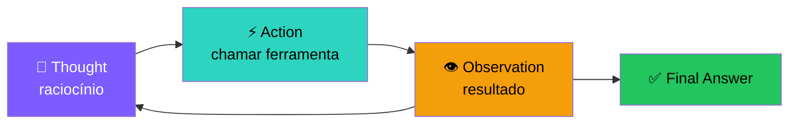

<div class="mt-4 text-sm opacity-80">
O loop repete até o modelo achar que tem a resposta. Esse padrão é a base de praticamente todos os agentes modernos — incluindo <b>function calling</b> que veremos no Encontro 2.
</div>

---

# ReAct em ação — exemplo

**Pergunta:** *"Qual a população do Brasil em milhões, multiplicada por 7?"*

<div class="mt-4 space-y-2 text-sm font-mono">

<div class="p-3 rounded bg-purple-500/10 border-l-4 border-purple-500">
<b>💭 Thought:</b> Preciso primeiro descobrir a população do Brasil, depois multiplicar por 7.
</div>

<div class="p-3 rounded bg-cyan-500/10 border-l-4 border-cyan-500">
<b>⚡ Action:</b> busca("população do Brasil")
</div>

<div class="p-3 rounded bg-amber-500/10 border-l-4 border-amber-500">
<b>👁️ Observation:</b> "Aproximadamente 215 milhões (IBGE, 2024)."
</div>

<div class="p-3 rounded bg-purple-500/10 border-l-4 border-purple-500">
<b>💭 Thought:</b> Agora multiplico 215 por 7.
</div>

<div class="p-3 rounded bg-cyan-500/10 border-l-4 border-cyan-500">
<b>⚡ Action:</b> calculadora("215 * 7")
</div>

<div class="p-3 rounded bg-amber-500/10 border-l-4 border-amber-500">
<b>👁️ Observation:</b> 1505
</div>

<div class="p-3 rounded bg-green-500/10 border-l-4 border-green-500">
<b>✅ Final Answer:</b> Aproximadamente 1.505 milhões.
</div>

</div>

---
layout: center
class: text-center
---

# 🚀 Vamos construir

<div class="text-xl mt-6 opacity-90">
Você já sabe o padrão: <b>Thought → Action → Observation → repeat</b>.<br><br>
Agora vamos implementar isso em <b>~50 linhas de Python</b>, sem nenhum framework.
</div>

<div class="mt-6 text-sm opacity-60">
Ao final: um agente funcional que busca na web, faz cálculos e responde com fontes.
</div>

---

# 1.6 Setup do ambiente

Vamos usar **Python 3.10+** e uma API de LLM.

```bash
# 1. Crie e ative um venv
python -m venv .venv
.\.venv\Scripts\activate   # Windows PowerShell
# source .venv/bin/activate  # Linux/Mac

# 2. Instale dependências base
pip install openai anthropic python-dotenv requests

# 3. (Opcional, encontros 2+) frameworks
pip install langchain langchain-openai langgraph
pip install chromadb sentence-transformers
```

Crie um arquivo `.env`:

```bash
OPENAI_API_KEY=sk-...
ANTHROPIC_API_KEY=sk-ant-...
```

---

# Sem cartão de crédito? Sem problema.

<div class="grid grid-cols-3 gap-4 mt-6">

<div class="p-4 rounded-xl bg-white/5 border border-white/10">
<div class="text-2xl mb-2">🦙</div>
<b>Ollama</b><br>
<span class="text-sm opacity-70">Modelos locais, 100% gratuito. Precisa de PC com ≥ 16GB RAM.</span><br><br>
<code class="text-xs">ollama pull llama3.1</code>
</div>

<div class="p-4 rounded-xl bg-white/5 border border-white/10">
<div class="text-2xl mb-2">⚡</div>
<b>Groq</b><br>
<span class="text-sm opacity-70">Free tier generoso, API compatível com OpenAI. Inferência ultra-rápida.</span><br><br>
<code class="text-xs">groq.com</code>
</div>

<div class="p-4 rounded-xl bg-white/5 border border-white/10">
<div class="text-2xl mb-2">🤗</div>
<b>HuggingFace</b><br>
<span class="text-sm opacity-70">Inference API gratuita para muitos modelos open source.</span><br><br>
<code class="text-xs">huggingface.co</code>
</div>

</div>

<div class="mt-6 p-4 rounded-xl bg-cyan-500/10 border border-cyan-500/30">
💡 Quase todo código deste curso roda <b>trocando apenas o client</b> por um compatível com OpenAI (<code>base_url</code> diferente).
</div>

---

# 1.7 Hands-on: seu primeiro agente do zero

Vamos construir um agente ReAct **sem framework**, em ~80 linhas.

Ele responde perguntas usando 2 ferramentas:
- 🧮 `calculadora(expr)` — avalia expressão matemática
- 🔍 `busca(query)` — consulta uma "base" mock

**Por que do zero?** Porque depois que você entende o loop manualmente, qualquer framework (LangChain, LangGraph, CrewAI…) faz sentido.

→ Próximo slide: o código completo, comentado.

---

# ❓ Por que um agente forte usa a ferramenta errada?

<div class="mt-8 p-5 rounded-xl bg-cyan-500/10 border-2 border-cyan-500/40 text-center">
Estudos da Anthropic sugerem que <b>muitas falhas vêm de tools mal descritas</b>, não do modelo.
</div>

---

# 🛠️ Princípio crítico: design de ferramentas

<div class="mt-6 grid grid-cols-2 gap-4">
<div class="p-4 rounded-xl bg-red-500/10 border border-red-500/30"><div class="font-bold mb-2 text-red-300">❌ Ruim</div><pre class="text-[10px]"><code>def get_data(q: str) -> str:
    """Get data."""</code></pre><div class="text-sm mt-3">Nome genérico, doc inútil, parâmetro sem contexto.</div></div>
<div class="p-4 rounded-xl bg-green-500/10 border border-green-500/30"><div class="font-bold mb-2 text-green-300">✅ Bom</div><pre class="text-[10px]"><code>def buscar_cliente_por_cpf(cpf: str) -> dict:
    """Busca dados cadastrais; retorna
    {nome, email, status}; use CPF
    com 11 dígitos sem pontuação;
    erros: 'NotFound' e 'Invalid'."""</code></pre><div class="text-sm mt-3">Nome claro, contexto, formato de saída e erros explícitos.</div></div>
</div>

<div class="mt-4 text-sm opacity-80">A descrição da tool <b>é</b> parte do prompt. O modelo decide se e como usar baseado nela.</div>

---

# Os 7 mandamentos de tool design

<v-clicks>

<div class="p-2 rounded bg-white/5 mt-2 text-sm">1. <b>Nome descritivo</b> — verbo + objeto (<code>enviar_email</code>, não <code>action1</code>)</div>

<div class="p-2 rounded bg-white/5 text-sm">2. <b>Docstring rica</b> — o que faz, quando usar, formato dos args, erros possíveis</div>

<div class="p-2 rounded bg-white/5 text-sm">3. <b>Argumentos tipados</b> — use type hints + JSON Schema estrito</div>

<div class="p-2 rounded bg-white/5 text-sm">4. <b>Erros amigáveis ao LLM</b> — retorne <code>"erro: CPF inválido, use 11 dígitos"</code>, não <code>ValueError("x")</code></div>

<div class="p-2 rounded bg-white/5 text-sm">5. <b>Output estruturado</b> — JSON > prosa. O LLM consome melhor.</div>

<div class="p-2 rounded bg-white/5 text-sm">6. <b>Poucas tools por agente</b> — &gt;15 começa a confundir. Use roteamento/skills.</div>

<div class="p-2 rounded bg-white/5 text-sm">7. <b>Idempotência quando possível</b> — chamar 2× = mesmo efeito de 1×. Protege contra loops.</div>

</v-clicks>

<div class="mt-4 p-3 rounded bg-amber-500/10 border border-amber-500/30 text-sm">
💡 <b>Teste prático:</b> mostre a docstring para outra pessoa. Se ela conseguir usar a função corretamente <b>sem ver o código</b>, o LLM também conseguirá.
</div>

---

# Parte 1: ferramentas em Python puro

```python
import os, re, json
from openai import OpenAI
from dotenv import load_dotenv

load_dotenv()
client = OpenAI()

# ---- Ferramentas (Python puro) ----
def calculadora(expr: str) -> str:
    """Avalia expressão matemática simples."""
    try:
        return str(eval(expr, {"__builtins__": {}}, {}))
    except Exception as e:
        return f"erro: {e}"

def busca(query: str) -> str:
    """Mock de base de conhecimento."""
    fake_db = {
        "população do brasil": "Aproximadamente 215 milhões (IBGE, 2024).",
        "capital da austrália": "Canberra.",
        "velocidade da luz": "299.792.458 m/s no vácuo.",
    }
    return fake_db.get(query.lower(), "Nenhum resultado encontrado.")

TOOLS = {"calculadora": calculadora, "busca": busca}
```

---

# Parte 2: prompt no estilo ReAct

```python
SYSTEM = """Você é um agente que resolve perguntas em ciclos.
Em cada turno responda EXATAMENTE em um destes formatos:

Thought: <seu raciocínio>
Action: <nome_da_ferramenta>
Action Input: <argumento em texto>

OU, quando souber a resposta:

Thought: <raciocínio final>
Final Answer: <resposta para o usuário>

Ferramentas disponíveis:
- calculadora(expr): avalia expressão matemática Python.
- busca(query): consulta uma base interna.
"""
```

<div class="mt-4 p-3 rounded bg-amber-500/10 border border-amber-500/30 text-sm">
🎓 O <b>system prompt</b> é onde você define a "personalidade" e o protocolo do agente. Pequenas mudanças aqui geram comportamentos muito diferentes.
</div>

---

# Parte 3: o loop do agente

```python {all|2-6|7-12|13-20|all}
def run_agent(pergunta: str, max_steps: int = 6):
    msgs = [
        {"role": "system", "content": SYSTEM},
        {"role": "user",   "content": pergunta},
    ]
    
    for step in range(max_steps):
        resp = client.chat.completions.create(
            model="gpt-4o-mini", messages=msgs, temperature=0
        )
        out = resp.choices[0].message.content
        msgs.append({"role": "assistant", "content": out})
        
        if "Final Answer:" in out:
            return out.split("Final Answer:")[-1].strip()
        
        m = re.search(r"Action:\s*(\w+)\s*\nAction Input:\s*(.+)", out)
        if not m:  return "Agente não produziu ação válida."
        
        tool, arg = m.group(1).strip(), m.group(2).strip()
        obs = TOOLS.get(tool, lambda x: f"tool '{tool}' inexistente")(arg)
        msgs.append({"role": "user", "content": f"Observation: {obs}"})
    
    return "Máximo de passos atingido."
```

---

# Parte 4: rodando

```python
if __name__ == "__main__":
    pergunta = "Quanto é (123 * 7) + a população do Brasil em milhões?"
    resposta = run_agent(pergunta)
    print(f"\n>>> {resposta}")
```

**Saída esperada (resumida):**

```
Thought: Preciso da população do Brasil primeiro.
Action: busca
Action Input: população do brasil

Observation: Aproximadamente 215 milhões (IBGE, 2024).

Thought: Agora calculo 123*7 + 215.
Action: calculadora
Action Input: 123 * 7 + 215

Observation: 1076

Final Answer: O resultado é aproximadamente 1.076 milhões.
```

---

# O que observar ao rodar 👀

<v-clicks>

<div class="p-3 rounded bg-white/5 mt-4">
✅ O modelo <b>verbaliza</b> o "Thought" — isso é reasoning emergente. Ninguém ensinou explicitamente; ele aprendeu lendo a internet.
</div>

<div class="p-3 rounded bg-white/5">
⚠️ Quando ele <b>erra o formato</b> (esquece "Action Input:" ou inventa), o loop quebra. Robustez vem de <b>function calling estruturado</b> (Encontro 2).
</div>

<div class="p-3 rounded bg-white/5">
💸 <b>Cada passo adiciona mais tokens</b> ao contexto. Se a tarefa exige 10 passos, você paga 10× o histórico crescente. Esse é o início do problema de <b>context management</b> (Encontro 3).
</div>

<div class="p-3 rounded bg-amber-500/10 border border-amber-500/30">
🐛 Modelos pequenos (GPT-4o-mini, Llama 3.1 8B) <b>às vezes ignoram o protocolo</b>. Modelos maiores são mais consistentes. Isso é uma realidade prática importante.
</div>

</v-clicks>

---

# Anatomia de uma chamada à API — visualizando os tokens

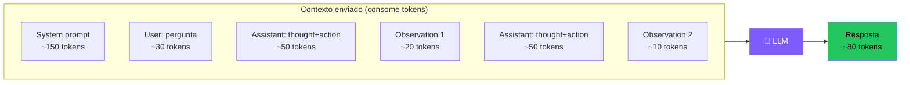

<div class="mt-4 text-sm">
Esse exemplo: <b>~390 tokens enviados</b> + 80 gerados a cada chamada.
Em <code>gpt-4o-mini</code> custa frações de centavo. Em <code>gpt-4o</code>, ~10× mais. Em agentes longos, vira US$ rapidinho.
</div>

---
layout: section
---

# 🏋️ 1.8 Exercícios — Encontro 1

4 atividades · Faça antes de partir para o Encontro 2

---

# Exercício 1.1 · Rodando o agente base

<div class="p-5 rounded-xl bg-purple-500/10 border-2 border-purple-500/40">

**Tarefa:** rode o código do agente e teste **5 perguntas diferentes**:

1. Pura matemática (ex: "quanto é 999 × 47?")
2. Pura busca (ex: "qual a capital da Austrália?")
3. Mista (ex: "qual a velocidade da luz em km/s?")
4. Impossível com as tools disponíveis (ex: "qual a previsão do tempo hoje?")
5. Ambígua (ex: "me fale sobre o Brasil")

**Para cada uma, anote:**
- Quantos passos o agente fez?
- A resposta foi correta?
- Algum comportamento estranho? (loops, alucinações, erros de formato)

</div>

---

# Exercício 1.2 · Nova ferramenta

<div class="p-5 rounded-xl bg-purple-500/10 border-2 border-purple-500/40">

**Tarefa:** adicione **duas ferramentas novas**:

```python
def hora_atual() -> str:
    """Retorna data e hora atual."""
    # implemente

def clima(cidade: str) -> str:
    """Mock — retorne valores fixos para 3 cidades."""
    # implemente
```

**Não esqueça de:**
- Adicionar no dicionário `TOOLS`
- Atualizar o `SYSTEM` prompt com a descrição

**Pergunta de teste:**
> *"Que horas são agora e como está o clima em Curitiba?"*

</div>

---

# Exercício 1.3 · Quebrando o agente

<div class="p-5 rounded-xl bg-red-500/10 border-2 border-red-500/40">

**Tarefa:** encontre **3 formas diferentes** de fazer o agente falhar.

Exemplos de falhas a tentar provocar:
- 🔁 Loop infinito (mesma ação várias vezes)
- 📝 Formato inválido (LLM "esquece" Action Input)
- 👻 Alucinação de ferramenta (chama tool que não existe)
- 💥 Exceção dentro da tool (passa argumento inválido)
- 🤔 Resposta sem chamar nenhuma tool

**Para cada falha:**
1. Descreva como você reproduziu
2. Qual o sintoma (output, erro, comportamento)
3. Proponha **uma mitigação** (vamos discutir no Encontro 4)

</div>

---

# Exercício 1.4 · Reflexão escrita (15 min)

<div class="p-5 rounded-xl bg-cyan-500/10 border-2 border-cyan-500/40">

Em **1 parágrafo**, responda:

> *"Qual é a diferença entre **um workflow com LLM** e **um agente**?"*

Inclua na sua resposta:

- ✅ Sua definição com suas palavras
- 🌍 **Um exemplo real** de workflow do seu dia a dia profissional/acadêmico
- 🌍 **Um exemplo real** de agente que faria sentido no mesmo contexto
- 💭 Por que cada exemplo se encaixa em uma categoria

Não há resposta certa. O objetivo é **calibrar sua intuição** antes do Encontro 2.

</div>

---
layout: center
class: text-center
---

---

# 📚 Referências públicas — Encontro 1

Todo o material apresentado é de **domínio público / publicações abertas**.

<div class="grid grid-cols-2 gap-3 text-xs mt-3">
<div class="p-3 rounded bg-purple-500/10 border border-purple-500/30"><b>Papers seminais</b><ul class="mt-1"><li>Vaswani et al. (2017) — <i>Attention Is All You Need</i> · arXiv:1706.03762</li><li>Yao et al. (2022) — <i>ReAct</i> · arXiv:2210.03629</li><li>Schick et al. (2023) — <i>Toolformer</i> · arXiv:2302.04761</li><li>Anthropic (2024) — <i>Building Effective Agents</i> · anthropic.com/research</li></ul></div>
<div class="p-3 rounded bg-cyan-500/10 border border-cyan-500/30"><b>Documentação oficial</b><ul class="mt-1"><li>OpenAI Function Calling Guide · platform.openai.com/docs</li><li>Anthropic Tool Use · docs.anthropic.com</li><li>LangChain Docs · python.langchain.com</li></ul></div>
</div>

---

# Referências — links e licenças

<div class="grid grid-cols-2 gap-3 text-xs mt-3">
<div class="p-3 rounded bg-green-500/10 border border-green-500/30"><b>Recursos didáticos</b><ul class="mt-1"><li>Hugging Face — Agents Course · huggingface.co/learn/agents-course</li><li>DeepLearning.AI — <i>Functions, Tools and Agents with LangChain</i> · deeplearning.ai</li><li>Lilian Weng — <i>LLM Powered Autonomous Agents</i> · lilianweng.github.io</li></ul></div>
<div class="p-3 rounded bg-amber-500/10 border border-amber-500/30"><b>Licenças</b><ul class="mt-1"><li>papers no arXiv: licenças abertas</li><li>logos/marcas: uso apenas educacional</li><li>código-exemplo: domínio público, sem garantia</li></ul></div>
</div>

<div class="mt-4 text-xs opacity-70">Todos os links completos foram resumidos aqui pelos domínios para caber no slide sem perder a referência.</div>

---

---

# 🔄 Recap — O que construímos no Encontro 1

<div class="grid grid-cols-2 gap-2 text-xs leading-tight">

<div class="p-2.5 rounded-xl bg-purple-500/10 border border-purple-500/30">
<b>📜 A história que conecta tudo:</b>
<ul class="mt-1 space-y-0.5">
<li><b>1950-2017:</b> Regras → ML → Deep Learning</li>
<li><b>2020:</b> GPT-3 mostra que escala gera habilidades emergentes</li>
<li><b>2022:</b> RLHF transforma completador de texto em assistente</li>
<li><b>2024-25:</b> Reasoning models (o3-pro, o4-mini) pensam antes de agir</li>
</ul>
</div>

<div class="p-2.5 rounded-xl bg-cyan-500/10 border border-cyan-500/30">
<b>🔧 O que você agora sabe fazer:</b>
<ul class="mt-1 space-y-0.5">
<li>Explicar token, context window e temperature</li>
<li>Descrever a anatomia: LLM + tools + memória + loop</li>
<li>Implementar o padrão ReAct do zero em Python</li>
<li>Construir um agente funcional sem framework</li>
</ul>
</div>

<div class="p-2.5 rounded-xl bg-green-500/10 border border-green-500/30">
<b>🏢 Produtos que usam isso hoje:</b>
<ul class="mt-1 space-y-0.5">
<li>ChatGPT (OpenAI) — loop ReAct + tools</li>
<li>GitHub Copilot — agente de código</li>
<li>Perplexity — agente de busca com fontes</li>
</ul>
</div>

<div class="p-2.5 rounded-xl bg-amber-500/10 border border-amber-500/30">
<b>❓ Perguntas que ficaram abertas:</b>
<ul class="mt-1 space-y-0.5">
<li>Como fazer o agente pensar <i>melhor</i>? (→ E2: CoT e Planning)</li>
<li>Como chamar ferramentas de forma <i>estruturada</i>? (→ E2: Function Calling)</li>
<li>E se o contexto estourar? (→ E3: Memória)</li>
</ul>
</div>

</div>

---

# ✅ Fim do Encontro 1

Você agora sabe:

- O que é (e o que não é) um agente
- A anatomia: LLM + tools + memória + loop + objetivo
- O padrão ReAct
- Como construir um agente do zero em Python

<div class="mt-12 text-xl text-cyan-400">
Próximo: <b>Encontro 2 — Reasoning, Planning & Tool Execution</b>
</div>

<div class="mt-4 text-sm opacity-60">
Onde tornamos tudo isso <i>robusto</i> com function calling estruturado e frameworks.
</div>
