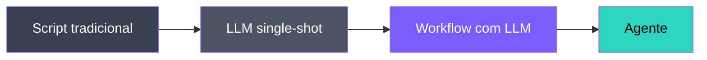
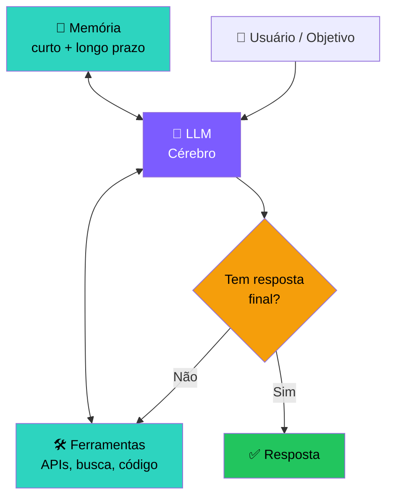
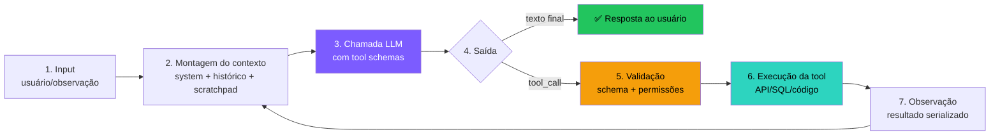
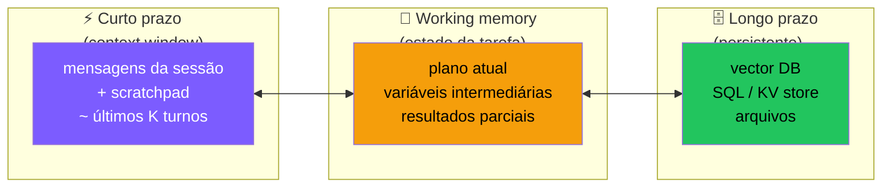
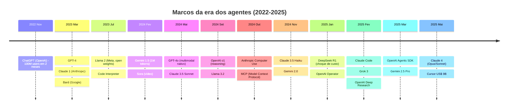
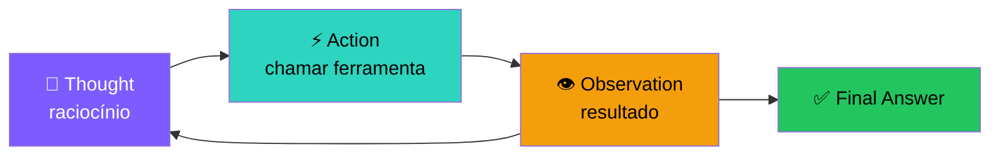
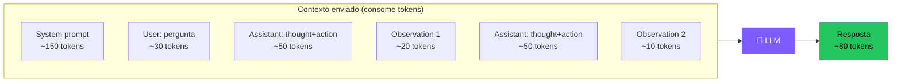

# 🧱 Encontro 1
## Introdução e Fundamentos

<div class="text-sm opacity-60 mt-4">3 horas · O que é um agente, anatomia, ReAct, primeiro agente em Python</div>

---

# 🗺️ Agenda do Encontro 1

<div class="grid grid-cols-2 gap-6 mt-6">

<div>

**Bloco 1 — Teoria (~90 min)**
- 1.1 Roadmap da disciplina
- 1.2 O que é (e o que NÃO é) um agente
- 1.3 Anatomia de um agente
- 1.4 Como o LLM "pensa"
- 1.5 O padrão ReAct

</div>

<div>

**Bloco 2 — Prática (~90 min)**
- 1.6 Setup do ambiente Python
- 1.7 Hands-on: agente do zero, sem framework
- 1.8 Exercícios (4 atividades)

</div>

</div>

<div class="mt-8 p-4 rounded-xl bg-cyan-500/10 border border-cyan-500/30">
🎯 <b>Objetivo:</b> ao final, você terá rodado seu primeiro agente em Python, entendendo cada linha — sem mágica de framework.
</div>

---
layout: two-cols
---

# 1.1 Roadmap da disciplina

Em **4 encontros** vamos sair de *"não sei o que é um agente"* para *"sei desenhar, implementar, avaliar e debugar agentes"*.

**Filosofia da disciplina:**
- 🛠️ Toda aula tem código rodando
- 🧪 Erros são parte do aprendizado
- 📚 Teoria só o suficiente pra entender o porquê
- 🌍 Exemplos de produtos reais (Cursor, Claude Code, Devin…)

::right::

# Como aproveitar (assíncrono)

<v-clicks>

<div class="p-3 rounded-lg bg-white/5 mt-4">
⏰ <b>~90 min:</b> assistir/ler com atenção, copiar código, rodar
</div>

<div class="p-3 rounded-lg bg-white/5">
⏰ <b>~90 min:</b> exercícios sem olhar a solução
</div>

<div class="p-3 rounded-lg bg-amber-500/10 border border-amber-500/30">
⚠️ <b>Não pule os exercícios.</b> É onde o aprendizado realmente acontece. Ler sobre agentes ≠ construir agentes.
</div>

</v-clicks>

---

---

# 🧭 Antes de começar — vocabulário essencial

Você vai ouvir 5 palavras o tempo todo. Vamos defini-las em **uma frase cada**:

<div class="grid grid-cols-1 gap-2 text-sm mt-4">

<div class="p-3 rounded-lg bg-purple-500/10 border border-purple-500/30">
<b>🤖 IA (Inteligência Artificial)</b> — software que faz coisas que normalmente exigiriam pessoas: entender texto, ver imagens, conversar, decidir.
</div>

<div class="p-3 rounded-lg bg-cyan-500/10 border border-cyan-500/30">
<b>🧠 LLM (Large Language Model)</b> — o "miolo" do ChatGPT, do Claude, do Gemini. Um modelo treinado em bilhões de páginas de texto que aprende a <b>prever a próxima palavra</b>. Surpreendentemente, isso o torna útil para responder perguntas, escrever código, traduzir, resumir…
</div>

<div class="p-3 rounded-lg bg-green-500/10 border border-green-500/30">
<b>💬 Prompt</b> — o texto que você manda para o LLM. <i>"Resume esse artigo em 3 linhas"</i> é um prompt. Quanto melhor o prompt, melhor a resposta.
</div>

<div class="p-3 rounded-lg bg-amber-500/10 border border-amber-500/30">
<b>🔌 API</b> — uma "tomada" pela qual seu programa fala com outro serviço pela internet. <b>API da OpenAI</b> = jeito de chamar o ChatGPT a partir do seu código, sem abrir o site.
</div>

<div class="p-3 rounded-lg bg-pink-500/10 border border-pink-500/30">
<b>🦾 Agente</b> — um LLM com <b>permissão para agir</b>: buscar na web, escrever em uma planilha, mandar email, executar código… Em vez de só conversar, ele <i>faz coisas</i>.
</div>

</div>

<div class="mt-3 text-xs opacity-70 text-center">
Vamos abrir cada um desses termos com calma. Por enquanto, basta o reconhecimento.
</div>

---

# 🧩 Onde você já viu isso no dia-a-dia

Mesmo sem perceber, você provavelmente já usou **agentes de IA** nas últimas 24h:

<div class="grid grid-cols-2 gap-3 text-sm mt-4">

<div class="p-3 rounded-lg bg-white/5 border border-white/10">
<b>📱 No seu celular</b><br>
• <b>WhatsApp Meta AI</b> — responde, busca, sumariza<br>
• <b>Siri / Google Assistente / Alexa</b> (versões novas)<br>
• <b>ChatGPT app, Claude app, Gemini app</b>
</div>

<div class="p-3 rounded-lg bg-white/5 border border-white/10">
<b>💻 No trabalho/estudo</b><br>
• <b>Copilot no Word/Excel/Outlook</b><br>
• <b>Gemini no Google Docs/Gmail</b><br>
• <b>Notion AI</b>, <b>Slack AI</b>
</div>

<div class="p-3 rounded-lg bg-white/5 border border-white/10">
<b>🛒 No consumo</b><br>
• <b>Atendimento Magalu, Nubank, iFood</b> (chat inicial)<br>
• <b>Recomendação do Spotify/Netflix</b> (não é agente puro, mas é IA)<br>
• <b>Resumo de avaliações na Amazon</b>
</div>

<div class="p-3 rounded-lg bg-white/5 border border-white/10">
<b>👨‍💻 Para quem programa</b><br>
• <b>GitHub Copilot</b> autocompleta código<br>
• <b>Cursor / Windsurf</b> editam o repositório inteiro<br>
• <b>v0.dev / Bolt.new</b> geram sites do zero
</div>

</div>

<div class="mt-3 p-3 rounded-lg bg-cyan-500/10 border border-cyan-500/30 text-xs">
🎯 <b>O que esses produtos têm em comum?</b> Por baixo do capô, todos seguem o mesmo padrão de "LLM + ferramentas + loop" que vamos desmontar hoje.
</div>

---

# 🎬 Uma cena para fixar a ideia

Imagine que você pede ao ChatGPT:

<div class="mt-4 p-3 rounded-lg bg-purple-500/10 border border-purple-500/30 italic">
"Qual foi o time campeão do Brasileirão 2024 e quantos gols o artilheiro fez?"
</div>

<div class="mt-4 grid grid-cols-2 gap-4 text-sm">

<div class="p-4 rounded-xl bg-red-500/10 border border-red-500/30">
<b>🚫 LLM puro (sem ser agente)</b><br>
"Não tenho informações sobre eventos posteriores a janeiro de 2024..."<br><br>
<i>Ou pior: inventa uma resposta plausível mas errada.</i>
</div>

<div class="p-4 rounded-xl bg-green-500/10 border border-green-500/30">
<b>✅ Agente</b><br>
1. Percebe que precisa de dado atualizado<br>
2. Chama uma <b>ferramenta</b> de busca na web<br>
3. Lê os resultados<br>
4. Verifica e responde: <i>"Botafogo foi campeão; Alerrandro foi artilheiro com 19 gols. Fonte: …"</i>
</div>

</div>

<div class="mt-4 text-sm opacity-80 text-center">
Essa é a diferença prática entre <b>LLM</b> e <b>agente</b>: o agente <b>sabe quando pedir ajuda</b> e <b>sabe como usar ferramentas</b>.
</div>

---

# 1.2 O que é um Agente de IA?

Existem dezenas de definições. A mais útil, pragmática, vem da **Anthropic (2024)**:

<div class="mt-8 p-6 rounded-xl bg-cyan-500/10 border-2 border-cyan-500/40 text-center">
<div class="text-xl">
Um <b>agente</b> é um sistema onde um <b>LLM dirige seu próprio fluxo de execução em loop</b>,
</div>
<div class="text-xl mt-2">
decidindo <b>quais ferramentas chamar</b>, com base nas <b>observações</b> que recebe,
</div>
<div class="text-xl mt-2">
até atingir um <b>objetivo</b>.
</div>
</div>

<div class="mt-8 text-sm opacity-70 text-center">
Vamos quebrar essa definição em partes nos próximos slides.
</div>

---

# Espectro: do script ao agente



| Nível | Quem decide o próximo passo? | Exemplo |
|---|---|---|
| Script tradicional | Programador (`if/else` fixo) | Pipeline ETL |
| LLM single-shot | Programador (prompt único) | "Resuma este texto" |
| Workflow com LLM | Programador (DAG fixo, LLM em cada nó) | Extração → Tradução → Resumo |
| **Agente** | **O próprio LLM, em loop** | "Pesquise X na web e me entregue um relatório" |

---

# A regra de ouro 🥇

<div class="mt-8 p-6 rounded-xl bg-amber-500/10 border-2 border-amber-500/40">
<div class="text-2xl font-bold text-amber-300 text-center">
"Use a complexidade mínima necessária."
</div>
<div class="text-center mt-3 opacity-70">— Anthropic, <i>Building Effective Agents</i> (2024)</div>
</div>

<div class="mt-8 grid grid-cols-2 gap-6">

<div class="p-4 rounded-xl bg-green-500/10 border border-green-500/30">
<div class="font-bold text-green-300 mb-2">✅ Use AGENTE quando…</div>
<ul class="text-sm">
<li>Os passos não são conhecidos antecipadamente</li>
<li>O número de iterações varia muito</li>
<li>O modelo precisa decidir entre caminhos</li>
</ul>
</div>

<div class="p-4 rounded-xl bg-red-500/10 border border-red-500/30">
<div class="font-bold text-red-300 mb-2">❌ Use WORKFLOW quando…</div>
<ul class="text-sm">
<li>Os passos são fixos e previsíveis</li>
<li>Você precisa de SLA / latência baixa</li>
<li>Custo precisa ser previsível</li>
</ul>
</div>

</div>

<div class="mt-4 text-center text-sm opacity-70">
Agentes trazem flexibilidade <b>e</b> custo, latência, imprevisibilidade.
</div>

---

# 1.3 Anatomia de um agente



---

# Os 5 componentes essenciais

<div class="grid grid-cols-1 gap-3 text-sm">

<div class="p-3 rounded-lg bg-purple-500/10 border border-purple-500/30">
<b>1. 🧠 LLM (cérebro)</b> — faz reasoning e decide o próximo passo. Geralmente GPT-4o, Claude Sonnet, Gemini Pro, ou modelos open source (Llama, Qwen).
</div>

<div class="p-3 rounded-lg bg-cyan-500/10 border border-cyan-500/30">
<b>2. 🛠️ Ferramentas (tools)</b> — ações no mundo: HTTP requests, queries SQL, execução de código Python, leitura/escrita de arquivos, navegação web, controle de mouse…
</div>

<div class="p-3 rounded-lg bg-green-500/10 border border-green-500/30">
<b>3. 💾 Memória</b> — contexto da conversa (curto prazo) + base de conhecimento persistente (longo prazo, geralmente vector DB).
</div>

<div class="p-3 rounded-lg bg-amber-500/10 border border-amber-500/30">
<b>4. 🔄 Loop de controle</b> — o "run loop" que alimenta observações de volta ao LLM até a parada (sucesso, max steps, erro).
</div>

<div class="p-3 rounded-lg bg-pink-500/10 border border-pink-500/30">
<b>5. 🎯 Objetivo</b> — prompt do usuário + <i>system prompt</i> definindo missão, persona e restrições.
</div>

</div>

---

# Ciclo de vida de UM turno do agente

O "loop" parece simples, mas internamente cada iteração tem 7 etapas:



<div class="mt-4 text-sm opacity-80">
Cada iteração custa <b>uma chamada à API</b>. Agentes típicos rodam de 3 a 30 iterações por tarefa.
</div>

---

# 🧠 Deep dive: o LLM (cérebro)

<div class="grid grid-cols-2 gap-4 text-sm">

<div class="p-4 rounded-xl bg-purple-500/10 border border-purple-500/30">
<b>O que ele faz num agente:</b>
<ul>
<li>Lê o contexto inteiro a cada turno</li>
<li>Decide: respondo? ou chamo uma tool?</li>
<li>Se tool: escolhe qual e gera os argumentos</li>
<li>Interpreta o resultado e segue</li>
</ul>
</div>

<div class="p-4 rounded-xl bg-white/5 border border-white/10">
<b>Famílias relevantes (2024-2025):</b>
<ul>
<li><b>Reasoning</b>: o1, o3, DeepSeek-R1, Claude Sonnet 4 Thinking</li>
<li><b>Generalistas</b>: GPT-4o, Claude Sonnet, Gemini Pro</li>
<li><b>Rápidos/baratos</b>: GPT-4o-mini, Haiku, Gemini Flash</li>
<li><b>Open weights</b>: Llama 3.x, Qwen 2.5, Mistral</li>
</ul>
</div>

</div>

<div class="mt-3 p-3 rounded-lg bg-blue-500/10 border border-blue-500/30 text-sm">
🧩 <b>Analogia</b>: o LLM é o <b>cérebro de um estagiário brilhante e amnésico</b>. Lê tudo que você colocar na frente dele, raciocina bem, mas <b>esquece tudo</b> assim que termina a tarefa. Cada chamada é um estagiário novo lendo a mesma pasta.
</div>

<div class="mt-3 p-3 rounded-lg bg-amber-500/10 border border-amber-500/30 text-sm">
<b>Tradeoff central:</b> modelos maiores acertam mais mas custam ~10–50× e respondem ~3–10× mais lento. Estratégia comum no mercado (<b>Perplexity, Cursor, GitHub Copilot</b>): <b>roteador</b> — modelo barato classifica/decide, modelo caro entra só nas etapas críticas.
</div>

---

# 🛠️ Deep dive: ferramentas (tools)

Uma tool tem **3 partes** que o LLM precisa entender:

<div class="grid grid-cols-3 gap-3 text-xs mt-4">

<div class="p-3 rounded-lg bg-cyan-500/10 border border-cyan-500/30">
<b>1. Nome + descrição</b><br>
O LLM escolhe pela descrição. Se for ambígua, ele chama errado.
<pre class="text-[10px] mt-2"><code>name: "search_web"
desc: "Busca informações
factuais atualizadas na
web. Use quando o usuário
pedir dados pós 2023."</code></pre>
</div>

<div class="p-3 rounded-lg bg-cyan-500/10 border border-cyan-500/30">
<b>2. Schema dos parâmetros</b><br>
JSON Schema (OpenAI/Anthropic). Define tipos, obrigatoriedade, enums.
<pre class="text-[10px] mt-2"><code>{ "query": {
    "type": "string",
    "description": "..."},
  "max_results": {
    "type": "integer",
    "default": 5 }}</code></pre>
</div>

<div class="p-3 rounded-lg bg-cyan-500/10 border border-cyan-500/30">
<b>3. Implementação</b><br>
Código Python que o seu runtime executa. O LLM <b>nunca</b> roda nada — ele só pede.
<pre class="text-[10px] mt-2"><code>def search_web(query, max_results=5):
    r = requests.get(...)
    return r.json()</code></pre>
</div>

</div>

<div class="mt-3 p-3 rounded-lg bg-blue-500/10 border border-blue-500/30 text-sm">
🧩 <b>Analogia</b>: tools são as <b>mãos do estagiário</b>. Ele sabe descrever o que quer fazer, mas sem mãos não toca em nada do mundo real. <b>Você</b> decide quais mãos dar (e quais não): leitor de email ≠ enviador de email; query SQL ≠ DELETE.
</div>

<div class="mt-3 text-sm opacity-80">
Categorias úteis: <b>retrieval</b> (busca, RAG), <b>computação</b> (Python sandbox, calc), <b>I/O</b> (arquivos, DB), <b>ação no mundo</b> (envio email, PR no GitHub), <b>meta</b> (delegar a outro agente).
</div>

<div class="mt-2 p-2 rounded-lg bg-white/5 text-xs">
🏢 <b>Mercado</b>: <b>Anthropic MCP</b> (Model Context Protocol, nov/2024) e <b>OpenAI function calling</b> padronizaram a interface. <b>Zapier, Composio, Arcade</b> oferecem catálogos de 1000+ tools prontas (Slack, GitHub, Salesforce…).
</div>

---

# 💾 Deep dive: memória — 3 camadas



<div class="grid grid-cols-3 gap-3 text-xs mt-4">
<div><b>Curto prazo</b>: histórico in-context. Limitado pela janela. Cresce a cada turno → eventualmente <b>satura</b>.</div>
<div><b>Working memory</b>: scratchpad estruturado (JSON, markdown). Sobrevive entre turnos sem inflar o prompt todo.</div>
<div><b>Longo prazo</b>: vector DB (Chroma, Qdrant, pgvector) p/ busca semântica; SQL p/ fatos estruturados; arquivos p/ artefatos.</div>
</div>

<div class="mt-3 p-3 rounded-lg bg-blue-500/10 border border-blue-500/30 text-xs">
🧩 <b>Analogia</b>: pense em um <b>consultor</b>. Curto prazo = o que está na <b>mesa agora</b> (papéis abertos). Working memory = o <b>caderno de anotações</b> ao lado. Longo prazo = o <b>arquivo morto</b> do escritório que ele consulta quando precisa.
</div>

<div class="mt-2 p-2 rounded-lg bg-white/5 text-xs">
🏢 <b>Mercado</b>: <b>ChatGPT Memory</b> (abr/2024), <b>Claude Projects</b>, <b>Cursor @-context</b>. Vector DBs líderes: <b>Pinecone, Weaviate, Qdrant, pgvector</b>. <b>Mem0 e Letta (ex-MemGPT)</b> são frameworks dedicados a memória de agente.
</div>

<div class="mt-2 p-2 rounded-lg bg-amber-500/10 border border-amber-500/30 text-xs">
<b>Episódica</b> (o que aconteceu) vs <b>semântica</b> (fatos/conhecimento) vs <b>procedural</b> (como fazer algo). Veremos no Encontro 3.
</div>

---

# 🔄 Deep dive: o loop de controle

É **seu código** (não o LLM) que decide quando parar. Pense no loop como **um maestro** regendo a orquestra:

<div class="grid grid-cols-2 gap-3 text-sm mt-3">

<div class="p-3 rounded-lg bg-purple-500/10 border border-purple-500/30">
<b>O que o loop faz, em palavras:</b>
<ol class="text-xs">
<li>Pergunta ao LLM: "qual o próximo passo?"</li>
<li>Se for resposta final → entrega ao usuário</li>
<li>Se for "use a ferramenta X" → executa X</li>
<li>Coloca o resultado de volta no contexto</li>
<li>Volta ao passo 1</li>
</ol>
</div>

<div class="p-3 rounded-lg bg-amber-500/10 border border-amber-500/30">
<b>4 condições de parada (obrigatórias):</b>
<ul class="text-xs">
<li>✅ Resposta final entregue</li>
<li>🛑 Atingiu <code>max_steps</code> (ex: 15 iterações)</li>
<li>💸 Estourou o orçamento de tokens/dinheiro</li>
<li>💥 Erro irrecuperável</li>
</ul>
</div>

</div>

<div class="mt-3 p-2 rounded-lg bg-blue-500/10 border border-blue-500/30 text-xs">
🧩 <b>Analogia</b>: o loop é o <b>batimento cardíaco</b> do agente — e os limites de parada são os <b>marca-passos</b>. Sem eles o coração entra em fibrilação (loop infinito) e o paciente (sua conta da nuvem) morre.
</div>

<div class="mt-2 p-2 rounded-lg bg-white/5 text-xs">
🏢 <b>Mercado</b>: frameworks que já trazem o loop pronto: <b>LangGraph</b>, <b>LlamaIndex AgentWorkflow</b>, <b>Pydantic AI</b>, <b>OpenAI Agents SDK</b> (mar/2025), <b>Smolagents</b> (Hugging Face). Você vai conhecê-los no Encontro 2.
</div>

<div class="mt-2 text-xs opacity-60 text-center">
👉 O código completo do loop está no Encontro 1 (Hands-on) — não se preocupe agora, é só ~20 linhas de Python.
</div>

---

# 🎯 Deep dive: o objetivo e o system prompt

Um bom system prompt para agentes tem **6 seções**:

<div class="grid grid-cols-2 gap-3 text-xs">

<div class="p-3 rounded-lg bg-pink-500/10 border border-pink-500/30">
<b>1. Identidade/papel</b> — "Você é um analista de dados sênior…"
</div>
<div class="p-3 rounded-lg bg-pink-500/10 border border-pink-500/30">
<b>2. Objetivo</b> — "Sua missão é responder perguntas usando apenas dados do BD."
</div>
<div class="p-3 rounded-lg bg-pink-500/10 border border-pink-500/30">
<b>3. Ferramentas disponíveis</b> — lista resumida (o schema já vai no parâmetro <code>tools</code>).
</div>
<div class="p-3 rounded-lg bg-pink-500/10 border border-pink-500/30">
<b>4. Procedimento / heurísticas</b> — "Sempre confirme o schema da tabela antes de fazer JOIN."
</div>
<div class="p-3 rounded-lg bg-pink-500/10 border border-pink-500/30">
<b>5. Restrições</b> — "Nunca execute DELETE. Em caso de dúvida, peça confirmação."
</div>
<div class="p-3 rounded-lg bg-pink-500/10 border border-pink-500/30">
<b>6. Formato de saída</b> — "Responda em markdown com seção 'Conclusão' no final."
</div>

</div>

<div class="mt-3 p-2 rounded-lg bg-blue-500/10 border border-blue-500/30 text-xs">
🧩 <b>Analogia</b>: o system prompt é o <b>manual do funcionário no primeiro dia</b>. Diz quem ele é, o que pode/não pode, e como se reportar. Se o manual é vago, todo funcionário improvisa de um jeito diferente.
</div>

<div class="mt-2 p-3 rounded-lg bg-amber-500/10 border border-amber-500/30 text-xs">
⚠️ <b>Princípio</b>: o system prompt é a <b>constituição</b> do agente. Mudanças aqui têm efeito multiplicado. Versionе-o como código (git) e teste com regressão.
</div>

<div class="mt-2 p-2 rounded-lg bg-white/5 text-xs">
🏢 <b>Mercado</b>: prompts vazados de produção mostram esse padrão — <b>Anthropic Claude.ai</b>, <b>Cursor</b>, <b>Devin</b>, <b>v0.dev</b> usam system prompts de 2k–10k tokens com seções nomeadas (repositórios públicos: <i>"system prompts leaked" no GitHub</i>).
</div>

---

# Anatomia de uma mensagem — os 4 papéis

Todo agente conversa em mensagens tipadas. Conhecer cada uma evita 80% dos bugs:

<div class="grid grid-cols-2 gap-3 text-xs">

<div class="p-3 rounded-lg bg-purple-500/10 border border-purple-500/30">
<b>system</b> — instruções imutáveis do desenvolvedor. Aparece <b>uma vez</b> no início.
<pre class="text-[10px] mt-1"><code>{"role": "system",
 "content": "Você é..."}</code></pre>
</div>

<div class="p-3 rounded-lg bg-blue-500/10 border border-blue-500/30">
<b>user</b> — input externo (humano ou outro sistema). Pode haver várias ao longo da sessão.
<pre class="text-[10px] mt-1"><code>{"role": "user",
 "content": "Qual o PIB do BR em 2023?"}</code></pre>
</div>

<div class="p-3 rounded-lg bg-green-500/10 border border-green-500/30">
<b>assistant</b> — resposta do LLM. Pode ter <code>content</code> e/ou <code>tool_calls</code>.
<pre class="text-[10px] mt-1"><code>{"role": "assistant",
 "tool_calls": [{
   "id": "c1",
   "name": "search_web",
   "args": {...}}]}</code></pre>
</div>

<div class="p-3 rounded-lg bg-cyan-500/10 border border-cyan-500/30">
<b>tool</b> — resultado de uma ferramenta. <b>Deve</b> referenciar o <code>tool_call_id</code>.
<pre class="text-[10px] mt-1"><code>{"role": "tool",
 "tool_call_id": "c1",
 "content": "PIB 2023: US$ 2,17 tri"}</code></pre>
</div>

</div>

<div class="mt-3 text-xs opacity-70">
Esse vai-e-vem <code>assistant(tool_call) → tool(result) → assistant(...) → tool(...) → assistant(content)</code> é o coração de qualquer agente.
</div>

---

# Estado: o que **flui** entre iterações

Diferente de uma chamada LLM solta, um agente carrega **estado acumulado**:

<div class="grid grid-cols-2 gap-4 text-sm mt-4">

<div class="p-3 rounded-lg bg-white/5 border border-white/10">
<b>Estado explícito (no prompt)</b>
<ul class="text-xs">
<li>Histórico completo de mensagens</li>
<li>Tool calls anteriores e seus resultados</li>
<li>Scratchpad / plano atual</li>
<li>System prompt</li>
</ul>
</div>

<div class="p-3 rounded-lg bg-white/5 border border-white/10">
<b>Estado implícito (no seu código)</b>
<ul class="text-xs">
<li>Contador de iterações</li>
<li>Custo acumulado (tokens, $$)</li>
<li>Sessões de DB/HTTP abertas</li>
<li>Cache de resultados de tools</li>
<li>Trace para observabilidade</li>
</ul>
</div>

</div>

<div class="mt-4 p-3 rounded-lg bg-amber-500/10 border border-amber-500/30 text-xs">
<b>Implicação prática:</b> agentes não são "stateless" como uma API REST. Para escalar, persista o estado (Redis, banco) e torne o loop <b>retomável</b> — interrompido, deve poder continuar.
</div>

---

# Paradigmas de orquestração

Três arquiteturas que você vai encontrar no mercado:

<div class="grid grid-cols-3 gap-3 text-xs">

<div class="p-3 rounded-lg bg-purple-500/10 border border-purple-500/30">
<b>🔁 ReAct (loop reativo)</b><br>
Pensa → age → observa → repete. Decisões <b>turno a turno</b>.<br><br>
✅ Simples, flexível<br>
❌ Pode divagar
<br><br>
<i>Yao et al., 2022 — o que veremos hoje.</i>
</div>

<div class="p-3 rounded-lg bg-blue-500/10 border border-blue-500/30">
<b>📋 Plan-and-Execute</b><br>
Faz um plano completo primeiro, depois executa cada passo.<br><br>
✅ Previsível, auditável<br>
❌ Plano fica desatualizado se algo muda
<br><br>
<i>BabyAGI, LangChain PlanAndExecute.</i>
</div>

<div class="p-3 rounded-lg bg-green-500/10 border border-green-500/30">
<b>🔄 Reflexion / Self-critique</b><br>
Executa → critica o próprio resultado → tenta de novo.<br><br>
✅ Melhora qualidade<br>
❌ Mais caro, pode entrar em loop de auto-crítica
<br><br>
<i>Shinn et al., 2023.</i>
</div>

</div>

<div class="mt-4 text-xs opacity-80">
Na prática, sistemas state-of-art <b>combinam</b> os três: planejam em alto nível, executam em ReAct, refletem após blocos. Veremos isso no Encontro 2.
</div>

---

# Autonomia: o espectro de controle

Quanto controle humano você dá ao agente?

<div class="mt-4">

| Nível | Descrição | Exemplo |
|---|---|---|
| **L0 — Suggest** | Agente propõe, humano executa tudo | Copilot autocomplete |
| **L1 — Confirm** | Cada ação requer aprovação | Cursor "accept all" por arquivo |
| **L2 — Bounded** | Autônomo dentro de limites (read-only, sandbox) | Pesquisa web, análise de dados |
| **L3 — Supervised** | Autônomo com revisão pós-fato | PRs abertos por bots, drafts de email |
| **L4 — Autonomous** | Roda sem humano no loop | Agentes de monitoramento, support tier 1 |
| **L5 — Self-improving** | Modifica seus próprios prompts/tools | Pesquisa de fronteira (Voyager, AutoML) |

</div>

<div class="mt-3 p-3 rounded-lg bg-amber-500/10 border border-amber-500/30 text-xs">
🎯 <b>Comece sempre em L1 ou L2.</b> Subir de nível só depois de telemetria provando que o agente acerta em &gt;95% dos casos do seu domínio.
</div>

---

# Onde os agentes **quebram** — mapa por componente

| Componente | Falha típica | Sintoma | Mitigação (preview) |
|---|---|---|---|
| 🧠 LLM | Alucina argumento de tool | Tool roda com dado inventado | Schema estrito + validação |
| 🛠️ Tool | Resultado enorme (10k tokens) | Janela satura em 2 turnos | Resumir / paginar / truncar |
| 💾 Memória | Histórico cresce sem limite | Custo explode, latência sobe | Sliding window, sumarização |
| 🔄 Loop | Sem condição de parada | Roda em loop infinito | `max_steps`, watchdog de custo |
| 🎯 Objetivo | System prompt ambíguo | Comportamento inconsistente | Versão + testes de regressão |
| 🤝 Multi-tool | Escolhe a tool errada | Tarefa nunca conclui | Descrições disjuntas, exemplos |

<div class="mt-4 text-xs opacity-80">
Cada uma dessas falhas vai ter um slot dedicado no Encontro 4. Por enquanto, <b>reconheça o vocabulário</b>.
</div>

---

# 🌐 Panorama de mercado — agentes em 2025

<div class="grid grid-cols-2 gap-3 text-xs">

<div class="p-3 rounded-lg bg-purple-500/10 border border-purple-500/30">
<b>💻 Coding agents</b><br>
• <b>GitHub Copilot Workspace / Coding Agent</b><br>
• <b>Cursor</b> (US$ 9B valuation, mai/2025)<br>
• <b>Devin / Cognition</b> ($2B+)<br>
• <b>Claude Code</b> (Anthropic, fev/2025)<br>
• <b>Replit Agent</b>, <b>v0.dev</b>, <b>Bolt.new</b>
</div>

<div class="p-3 rounded-lg bg-cyan-500/10 border border-cyan-500/30">
<b>🔎 Research / browse agents</b><br>
• <b>Perplexity</b> (US$ 9B), <b>Pro Search</b><br>
• <b>OpenAI Deep Research</b> (fev/2025)<br>
• <b>Google Gemini Deep Research</b><br>
• <b>You.com</b>, <b>Phind</b>
</div>

<div class="p-3 rounded-lg bg-green-500/10 border border-green-500/30">
<b>🏢 Enterprise / vertical</b><br>
• <b>Salesforce Agentforce</b> (out/2024)<br>
• <b>Microsoft Copilot Studio</b> + Autonomous Agents<br>
• <b>ServiceNow Now Assist</b><br>
• <b>Klarna AI assistant</b> (substituiu 700 atendentes)<br>
• <b>Sierra</b> (Bret Taylor, US$ 4B em CX)
</div>

<div class="p-3 rounded-lg bg-amber-500/10 border border-amber-500/30">
<b>🧑‍💼 Computer use / desktop</b><br>
• <b>Anthropic Computer Use</b> (out/2024)<br>
• <b>OpenAI Operator</b> (jan/2025)<br>
• <b>Google Project Mariner</b><br>
• <b>Adept ACT</b> (adquirida pela Amazon)
</div>

</div>

<div class="mt-3 text-xs opacity-70 text-center">
Fontes: relatórios públicos de funding (Crunchbase, TechCrunch), anúncios oficiais das empresas.
</div>

---

# 🏢 Quem está construindo a fronteira — os laboratórios

<div class="text-sm mb-3 opacity-80">
Antes de falar de <i>produtos</i>, é importante entender <b>quem</b> está fazendo os modelos que alimentam todos os agentes. Conheça os "labs de fronteira" (frontier labs):
</div>

<div class="grid grid-cols-3 gap-3 text-xs">

<div class="p-3 rounded-lg bg-emerald-500/10 border border-emerald-500/30">
<b>🟢 OpenAI</b> <span class="opacity-60">(2015, SF)</span><br>
<i>Modelo:</i> <b>GPT-4o, o1, o3, GPT-5</b><br>
<i>Aposta:</i> AGI via escala + <b>reasoning models</b> (cadeia de raciocínio interna). Liderou a onda generativa em nov/2022 com o ChatGPT.<br>
<i>Parcerias:</i> Microsoft (US$ 13B+), Apple Intelligence.<br>
<i>Valuation:</i> ~US$ 500B (2025).
</div>

<div class="p-3 rounded-lg bg-orange-500/10 border border-orange-500/30">
<b>🟠 Anthropic</b> <span class="opacity-60">(2021, SF)</span><br>
<i>Modelo:</i> <b>Claude (Haiku/Sonnet/Opus)</b><br>
<i>Aposta:</i> "Constitutional AI" — segurança alinhada via princípios. Líder em <b>uso por desenvolvedores</b> e em agentes (MCP, Computer Use).<br>
<i>Parcerias:</i> Amazon (US$ 8B), Google (US$ 2B).<br>
<i>Valuation:</i> ~US$ 60B (2025).
</div>

<div class="p-3 rounded-lg bg-blue-500/10 border border-blue-500/30">
<b>🔵 Google DeepMind</b> <span class="opacity-60">(unificada em 2023)</span><br>
<i>Modelo:</i> <b>Gemini 1.5/2.0/2.5 Pro/Flash</b><br>
<i>Aposta:</i> <b>multimodal nativo</b> + <b>contexto gigante (1M-2M tokens)</b>. Integração profunda com Search, Workspace, Android.<br>
<i>Vantagem:</i> única que opera <b>todo o stack</b> (chip TPU → modelo → produto → distribuição).
</div>

<div class="p-3 rounded-lg bg-cyan-500/10 border border-cyan-500/30">
<b>🪟 Microsoft</b> <span class="opacity-60">(via OpenAI + interno)</span><br>
<i>Modelo:</i> <b>Phi (próprio)</b> + GPT via Azure.<br>
<i>Aposta:</i> <b>distribuição</b> — Copilot dentro de Windows, Office, GitHub, Azure. Lançou <b>Copilot Studio</b> e <b>autonomous agents</b> em 2024.<br>
<i>Trunfo:</i> já está no desktop de <b>1.4B</b> de usuários corporativos.
</div>

<div class="p-3 rounded-lg bg-indigo-500/10 border border-indigo-500/30">
<b>🦙 Meta</b> <span class="opacity-60">(FAIR)</span><br>
<i>Modelo:</i> <b>Llama 3.x / 4</b> — <b>open weights</b>.<br>
<i>Aposta:</i> <b>commoditizar o modelo</b> — entregar de graça pra que ninguém cobre Meta por usar IA. Padrão de fato em open-source.<br>
<i>Impacto:</i> viabilizou ecossistemas como Ollama, Groq, Together.
</div>

<div class="p-3 rounded-lg bg-zinc-500/10 border border-zinc-500/30">
<b>⚫ xAI</b> <span class="opacity-60">(2023, Elon Musk)</span><br>
<i>Modelo:</i> <b>Grok 2 / 3 / 4</b><br>
<i>Aposta:</i> <b>velocidade de escala</b> — cluster Colossus com 100k+ H100s em Memphis. Acesso em tempo real ao X (Twitter).<br>
<i>Posição:</i> entrou tarde, mas com poder de fogo computacional inédito.
</div>

</div>

---

# 🌏 Open-source, novos entrantes e o eixo Ásia

<div class="grid grid-cols-2 gap-3 text-sm">

<div class="p-4 rounded-xl bg-purple-500/10 border border-purple-500/30">
<b>🇫🇷 Mistral AI</b> (Paris, 2023)<br>
<span class="text-xs">Campeã europeia. Modelos abertos (<b>Mistral Large 2, Codestral, Pixtral</b>) e API. Parceria com Microsoft. Foco em <b>soberania digital</b> europeia.</span>
</div>

<div class="p-4 rounded-xl bg-red-500/10 border border-red-500/30">
<b>🇨🇳 DeepSeek</b> (Hangzhou, 2023)<br>
<span class="text-xs"><b>DeepSeek-V3 / R1</b> (jan/2025) chocaram o mercado: performance equivalente a GPT-4o / o1 por <b>fração do custo de treino</b> (~US$ 6M vs US$ 100M+). Caiu 17% da Nvidia em um dia.</span>
</div>

<div class="p-4 rounded-xl bg-amber-500/10 border border-amber-500/30">
<b>🇨🇳 Alibaba (Qwen)</b> · <b>🇨🇳 Moonshot (Kimi)</b> · <b>01.AI</b><br>
<span class="text-xs"><b>Qwen 2.5 / 3</b> domina rankings open-source. Kimi com contexto de 2M tokens. Polo chinês move-se mais rápido em open weights que o ocidental.</span>
</div>

<div class="p-4 rounded-xl bg-teal-500/10 border border-teal-500/30">
<b>🇨🇦 Cohere</b> · <b>🇮🇱 AI21</b> · <b>🇺🇸 Inflection</b> (absorvida pela MSFT)<br>
<span class="text-xs">Players focados em <b>enterprise</b> e RAG (Cohere Command R+). Especialização em vez de fronteira generalista.</span>
</div>

</div>

<div class="mt-4 p-3 rounded bg-cyan-500/10 border border-cyan-500/30 text-sm">
🎯 <b>Implicação prática:</b> para agentes, você raramente está preso a um único fornecedor. Frameworks como LangChain, LiteLLM e o próprio <b>OpenAI-compatible API</b> deixam você <b>trocar de modelo em uma linha</b> de código. Estratégia comum: <b>modelo barato (Gemini Flash / GPT-4o-mini / DeepSeek)</b> para 90% das chamadas, <b>modelo caro (Claude Opus / GPT-5 / o3)</b> só nas etapas críticas.
</div>

---

# 📅 Linha do tempo — a corrida da IA generativa



<div class="mt-3 text-xs opacity-70 text-center">
A cadência se acelerou: hoje há lançamento relevante <b>toda semana</b>. Aprender o <b>framework mental</b> de agentes vale mais que decorar API X.
</div>

---

# 🧭 Como cada empresa se posiciona — em 1 frase

<div class="grid grid-cols-2 gap-3 text-xs mt-3">

<div class="p-3 rounded-lg bg-white/5 border border-white/10">
<b>🟢 OpenAI:</b> "Vamos chegar primeiro à AGI e construir o produto-mãe (ChatGPT) para todos."<br>
<span class="opacity-70">Modelo de receita: subscription (Plus/Pro) + API.</span>
</div>

<div class="p-3 rounded-lg bg-white/5 border border-white/10">
<b>🟠 Anthropic:</b> "Construir o modelo mais confiável, especialmente para uso empresarial e desenvolvedores."<br>
<span class="opacity-70">Modelo de receita: API + Claude.ai + Bedrock.</span>
</div>

<div class="p-3 rounded-lg bg-white/5 border border-white/10">
<b>🔵 Google:</b> "Integrar IA em tudo que já temos (Search, Android, Workspace) — defender o monopólio de busca."<br>
<span class="opacity-70">Modelo de receita: ads + Workspace + Cloud.</span>
</div>

<div class="p-3 rounded-lg bg-white/5 border border-white/10">
<b>🪟 Microsoft:</b> "Colocar Copilot em todo software que vendemos — virar o sistema operacional do trabalho."<br>
<span class="opacity-70">Modelo de receita: Copilot license (US$ 30/usuário/mês) + Azure.</span>
</div>

<div class="p-3 rounded-lg bg-white/5 border border-white/10">
<b>🦙 Meta:</b> "Open-source para impedir que concorrentes virem gatekeepers — e usar IA para feed/ads."<br>
<span class="opacity-70">Modelo de receita: ads (Instagram/FB) potencializados por IA.</span>
</div>

<div class="p-3 rounded-lg bg-white/5 border border-white/10">
<b>🇨🇳 China (DeepSeek/Qwen):</b> "Open-source agressivo + eficiência de custo para furar o bloqueio de chips."<br>
<span class="opacity-70">Modelo: B2B/B2G doméstico, exportação tecnológica.</span>
</div>

</div>

<div class="mt-4 p-3 rounded bg-amber-500/10 border border-amber-500/30 text-sm">
🎓 <b>Para você, aluno:</b> não existe vencedor único. O mercado tem espaço para fronteira (OpenAI/Anthropic), distribuição (MSFT/Google), open-source (Meta/Mistral/DeepSeek) e nichos (Cohere, Harvey, Sierra). <b>Saber montar agentes é mais valioso que dominar uma API específica.</b>
</div>

---

# 💰 O business case: por que agora?

<div class="grid grid-cols-2 gap-4 text-sm">

<div class="p-4 rounded-xl bg-white/5 border border-white/10">
<b>📉 Queda brutal de custo</b><br>
GPT-3.5 (2022): US$ 20 / 1M tokens<br>
GPT-4o-mini (2024): US$ 0,15 / 1M tokens<br>
→ <b>~130× mais barato</b> em 2 anos.<br><br>
Isso viabiliza loops com dezenas de chamadas.
</div>

<div class="p-4 rounded-xl bg-white/5 border border-white/10">
<b>📈 Salto de capacidade</b><br>
SWE-bench (engenharia de software):<br>
• 2023: ~2% (GPT-4 puro)<br>
• 2024: ~50% (Devin, Claude 3.5)<br>
• 2025: <b>~70%+</b> (Claude Sonnet 4 + agentes)<br><br>
Tarefas reais já estão dentro do alcance.
</div>

<div class="p-4 rounded-xl bg-purple-500/10 border border-purple-500/30">
<b>🎯 Casos com ROI medido</b><br>
• <b>Klarna</b>: AI faz trabalho de 700 atendentes, NPS estável<br>
• <b>Cosine</b>: SWE-bench 71%, dev sintético comercial<br>
• <b>Harvey</b>: pesquisa jurídica usada em 235 firmas
</div>

<div class="p-4 rounded-xl bg-cyan-500/10 border border-cyan-500/30">
<b>🛠️ Tooling maduro</b><br>
• Frameworks estáveis (LangGraph, LlamaIndex)<br>
• Observabilidade (LangSmith, Langfuse, Arize)<br>
• Padrões abertos (MCP, A2A)<br>
• Eval frameworks (Braintrust, Promptfoo)
</div>

</div>

<div class="mt-3 text-xs opacity-70 text-center">
Gartner (out/2024): "by 2028, 33% of enterprise software applications will include agentic AI" — partindo de &lt;1% em 2024.
</div>

---

# 1.4 Como o LLM "pensa"

Antes de construir agentes, é crucial entender 3 conceitos:

<div class="grid grid-cols-3 gap-4 mt-6">

<div class="p-4 rounded-xl bg-white/5 border border-white/10">

### 🔤 Tokens
A unidade que o modelo enxerga.

- ~4 caracteres em inglês
- ~0,75 palavra
- Português usa **mais tokens** que inglês (~1.5×)

Você paga por token de **input** *e* **output**.

</div>

<div class="p-4 rounded-xl bg-white/5 border border-white/10">

### 🪟 Context window
O limite de tokens que o modelo "vê" de uma vez.

- GPT-4o: **128k**
- Claude 3.5 Sonnet: **200k**
- Gemini 1.5 Pro: **1M+**

Toda mensagem, histórico e resultado de ferramenta **consome** dessa janela.

</div>

<div class="p-4 rounded-xl bg-white/5 border border-white/10">

### 🎲 Temperature
Controle de aleatoriedade.

- `0.0` → mais determinístico
- `1.0` → mais criativo
- Agentes em produção: **0.0 – 0.3**

Mas <b>nunca</b> 100% determinístico, mesmo em 0.

</div>

</div>

---

# Mental model: o LLM é uma função pura

<div class="text-center text-2xl mt-8 font-mono">
<span class="text-cyan-400">f</span>(prompt) → texto
</div>

<div class="mt-8 p-4 rounded-xl bg-amber-500/10 border border-amber-500/30">
⚠️ <b>O LLM NÃO TEM MEMÓRIA entre chamadas.</b><br><br>
Toda "memória" de um agente é <b>reconstruída a cada chamada</b>, concatenando o histórico inteiro no prompt.
</div>

<div class="mt-6 grid grid-cols-2 gap-4">

<div class="p-3 rounded-lg bg-white/5">
<b>Chamada 1:</b><br>
<code>system + user_msg_1</code> → resposta_1
</div>

<div class="p-3 rounded-lg bg-white/5">
<b>Chamada 2:</b><br>
<code>system + user_msg_1 + resposta_1 + user_msg_2</code> → resposta_2
</div>

</div>

<div class="mt-4 text-sm opacity-70 text-center">
Isso explica por que o histórico longo fica caro <b>e</b> lento.
</div>

---

# 1.5 O padrão ReAct (Reason + Act)

📄 **Yao et al., 2022** — "ReAct: Synergizing Reasoning and Acting in Language Models"

A ideia é simples e poderosa: fazer o LLM **verbalizar** o raciocínio antes de agir.



<div class="mt-4 text-sm opacity-80">
O loop repete até o modelo achar que tem a resposta. Esse padrão é a base de praticamente todos os agentes modernos — incluindo <b>function calling</b> que veremos no Encontro 2.
</div>

---

# ReAct em ação — exemplo

**Pergunta:** *"Qual a população do Brasil em milhões, multiplicada por 7?"*

<div class="mt-4 space-y-2 text-sm font-mono">

<div class="p-3 rounded bg-purple-500/10 border-l-4 border-purple-500">
<b>💭 Thought:</b> Preciso primeiro descobrir a população do Brasil, depois multiplicar por 7.
</div>

<div class="p-3 rounded bg-cyan-500/10 border-l-4 border-cyan-500">
<b>⚡ Action:</b> busca("população do Brasil")
</div>

<div class="p-3 rounded bg-amber-500/10 border-l-4 border-amber-500">
<b>👁️ Observation:</b> "Aproximadamente 215 milhões (IBGE, 2024)."
</div>

<div class="p-3 rounded bg-purple-500/10 border-l-4 border-purple-500">
<b>💭 Thought:</b> Agora multiplico 215 por 7.
</div>

<div class="p-3 rounded bg-cyan-500/10 border-l-4 border-cyan-500">
<b>⚡ Action:</b> calculadora("215 * 7")
</div>

<div class="p-3 rounded bg-amber-500/10 border-l-4 border-amber-500">
<b>👁️ Observation:</b> 1505
</div>

<div class="p-3 rounded bg-green-500/10 border-l-4 border-green-500">
<b>✅ Final Answer:</b> Aproximadamente 1.505 milhões.
</div>

</div>

---

# 1.6 Setup do ambiente

Vamos usar **Python 3.10+** e uma API de LLM.

```bash
# 1. Crie e ative um venv
python -m venv .venv
.\.venv\Scripts\activate   # Windows PowerShell
# source .venv/bin/activate  # Linux/Mac

# 2. Instale dependências base
pip install openai anthropic python-dotenv requests

# 3. (Opcional, encontros 2+) frameworks
pip install langchain langchain-openai langgraph
pip install chromadb sentence-transformers
```

Crie um arquivo `.env`:

```bash
OPENAI_API_KEY=sk-...
ANTHROPIC_API_KEY=sk-ant-...
```

---

# Sem cartão de crédito? Sem problema.

<div class="grid grid-cols-3 gap-4 mt-6">

<div class="p-4 rounded-xl bg-white/5 border border-white/10">
<div class="text-2xl mb-2">🦙</div>
<b>Ollama</b><br>
<span class="text-sm opacity-70">Modelos locais, 100% gratuito. Precisa de PC com ≥ 16GB RAM.</span><br><br>
<code class="text-xs">ollama pull llama3.1</code>
</div>

<div class="p-4 rounded-xl bg-white/5 border border-white/10">
<div class="text-2xl mb-2">⚡</div>
<b>Groq</b><br>
<span class="text-sm opacity-70">Free tier generoso, API compatível com OpenAI. Inferência ultra-rápida.</span><br><br>
<code class="text-xs">groq.com</code>
</div>

<div class="p-4 rounded-xl bg-white/5 border border-white/10">
<div class="text-2xl mb-2">🤗</div>
<b>HuggingFace</b><br>
<span class="text-sm opacity-70">Inference API gratuita para muitos modelos open source.</span><br><br>
<code class="text-xs">huggingface.co</code>
</div>

</div>

<div class="mt-6 p-4 rounded-xl bg-cyan-500/10 border border-cyan-500/30">
💡 Quase todo código deste curso roda <b>trocando apenas o client</b> por um compatível com OpenAI (<code>base_url</code> diferente).
</div>

---

# 1.7 Hands-on: seu primeiro agente do zero

Vamos construir um agente ReAct **sem framework**, em ~80 linhas.

Ele responde perguntas usando 2 ferramentas:
- 🧮 `calculadora(expr)` — avalia expressão matemática
- 🔍 `busca(query)` — consulta uma "base" mock

**Por que do zero?** Porque depois que você entende o loop manualmente, qualquer framework (LangChain, LangGraph, CrewAI…) faz sentido.

→ Próximo slide: o código completo, comentado.

---

# 🛠️ Princípio crítico: design de ferramentas

<div class="mt-4 p-5 rounded-xl bg-cyan-500/10 border-2 border-cyan-500/40">
<div class="text-lg text-center">
Estudos da Anthropic mostram que <b>80% das falhas de agentes</b><br>
vêm de <b>tools mal descritas</b>, não do modelo.
</div>
</div>

<div class="mt-6 grid grid-cols-2 gap-4">

<div class="p-4 rounded-xl bg-red-500/10 border border-red-500/30">
<div class="font-bold mb-2 text-red-300">❌ Ruim</div>

```python
def get_data(q: str) -> str:
    """Get data."""
    ...
```

- Nome genérico
- Doc inútil
- Parâmetro sem contexto
</div>

<div class="p-4 rounded-xl bg-green-500/10 border border-green-500/30">
<div class="font-bold mb-2 text-green-300">✅ Bom</div>

```python
def buscar_cliente_por_cpf(cpf: str) -> dict:
    """Busca dados cadastrais de um cliente
    pelo CPF. Retorna {nome, email, status}.
    Use APENAS com CPF de 11 dígitos sem
    pontuação. Erros: 'NotFound', 'Invalid'."""
    ...
```
</div>

</div>

<div class="mt-4 text-sm opacity-80">
A descrição da tool <b>é</b> parte do prompt. O modelo decide se e como usar baseado nela.
</div>

---

# Os 7 mandamentos de tool design

<v-clicks>

<div class="p-2 rounded bg-white/5 mt-2 text-sm">1. <b>Nome descritivo</b> — verbo + objeto (<code>enviar_email</code>, não <code>action1</code>)</div>

<div class="p-2 rounded bg-white/5 text-sm">2. <b>Docstring rica</b> — o que faz, quando usar, formato dos args, erros possíveis</div>

<div class="p-2 rounded bg-white/5 text-sm">3. <b>Argumentos tipados</b> — use type hints + JSON Schema estrito</div>

<div class="p-2 rounded bg-white/5 text-sm">4. <b>Erros amigáveis ao LLM</b> — retorne <code>"erro: CPF inválido, use 11 dígitos"</code>, não <code>ValueError("x")</code></div>

<div class="p-2 rounded bg-white/5 text-sm">5. <b>Output estruturado</b> — JSON > prosa. O LLM consome melhor.</div>

<div class="p-2 rounded bg-white/5 text-sm">6. <b>Poucas tools por agente</b> — &gt;15 começa a confundir. Use roteamento/skills.</div>

<div class="p-2 rounded bg-white/5 text-sm">7. <b>Idempotência quando possível</b> — chamar 2× = mesmo efeito de 1×. Protege contra loops.</div>

</v-clicks>

<div class="mt-4 p-3 rounded bg-amber-500/10 border border-amber-500/30 text-sm">
💡 <b>Teste prático:</b> mostre a docstring para outra pessoa. Se ela conseguir usar a função corretamente <b>sem ver o código</b>, o LLM também conseguirá.
</div>

---

# Parte 1: ferramentas em Python puro

```python
import os, re, json
from openai import OpenAI
from dotenv import load_dotenv

load_dotenv()
client = OpenAI()

# ---- Ferramentas (Python puro) ----
def calculadora(expr: str) -> str:
    """Avalia expressão matemática simples."""
    try:
        return str(eval(expr, {"__builtins__": {}}, {}))
    except Exception as e:
        return f"erro: {e}"

def busca(query: str) -> str:
    """Mock de base de conhecimento."""
    fake_db = {
        "população do brasil": "Aproximadamente 215 milhões (IBGE, 2024).",
        "capital da austrália": "Canberra.",
        "velocidade da luz": "299.792.458 m/s no vácuo.",
    }
    return fake_db.get(query.lower(), "Nenhum resultado encontrado.")

TOOLS = {"calculadora": calculadora, "busca": busca}
```

---

# Parte 2: prompt no estilo ReAct

```python
SYSTEM = """Você é um agente que resolve perguntas em ciclos.
Em cada turno responda EXATAMENTE em um destes formatos:

Thought: <seu raciocínio>
Action: <nome_da_ferramenta>
Action Input: <argumento em texto>

OU, quando souber a resposta:

Thought: <raciocínio final>
Final Answer: <resposta para o usuário>

Ferramentas disponíveis:
- calculadora(expr): avalia expressão matemática Python.
- busca(query): consulta uma base interna.
"""
```

<div class="mt-4 p-3 rounded bg-amber-500/10 border border-amber-500/30 text-sm">
🎓 O <b>system prompt</b> é onde você define a "personalidade" e o protocolo do agente. Pequenas mudanças aqui geram comportamentos muito diferentes.
</div>

---

# Parte 3: o loop do agente

```python {all|2-6|7-12|13-20|all}
def run_agent(pergunta: str, max_steps: int = 6):
    msgs = [
        {"role": "system", "content": SYSTEM},
        {"role": "user",   "content": pergunta},
    ]
    
    for step in range(max_steps):
        resp = client.chat.completions.create(
            model="gpt-4o-mini", messages=msgs, temperature=0
        )
        out = resp.choices[0].message.content
        msgs.append({"role": "assistant", "content": out})
        
        if "Final Answer:" in out:
            return out.split("Final Answer:")[-1].strip()
        
        m = re.search(r"Action:\s*(\w+)\s*\nAction Input:\s*(.+)", out)
        if not m:  return "Agente não produziu ação válida."
        
        tool, arg = m.group(1).strip(), m.group(2).strip()
        obs = TOOLS.get(tool, lambda x: f"tool '{tool}' inexistente")(arg)
        msgs.append({"role": "user", "content": f"Observation: {obs}"})
    
    return "Máximo de passos atingido."
```

---

# Parte 4: rodando

```python
if __name__ == "__main__":
    pergunta = "Quanto é (123 * 7) + a população do Brasil em milhões?"
    resposta = run_agent(pergunta)
    print(f"\n>>> {resposta}")
```

**Saída esperada (resumida):**

```
Thought: Preciso da população do Brasil primeiro.
Action: busca
Action Input: população do brasil

Observation: Aproximadamente 215 milhões (IBGE, 2024).

Thought: Agora calculo 123*7 + 215.
Action: calculadora
Action Input: 123 * 7 + 215

Observation: 1076

Final Answer: O resultado é aproximadamente 1.076 milhões.
```

---

# O que observar ao rodar 👀

<v-clicks>

<div class="p-3 rounded bg-white/5 mt-4">
✅ O modelo <b>verbaliza</b> o "Thought" — isso é reasoning emergente. Ninguém ensinou explicitamente; ele aprendeu lendo a internet.
</div>

<div class="p-3 rounded bg-white/5">
⚠️ Quando ele <b>erra o formato</b> (esquece "Action Input:" ou inventa), o loop quebra. Robustez vem de <b>function calling estruturado</b> (Encontro 2).
</div>

<div class="p-3 rounded bg-white/5">
💸 <b>Cada passo adiciona mais tokens</b> ao contexto. Se a tarefa exige 10 passos, você paga 10× o histórico crescente. Esse é o início do problema de <b>context management</b> (Encontro 3).
</div>

<div class="p-3 rounded bg-amber-500/10 border border-amber-500/30">
🐛 Modelos pequenos (GPT-4o-mini, Llama 3.1 8B) <b>às vezes ignoram o protocolo</b>. Modelos maiores são mais consistentes. Isso é uma realidade prática importante.
</div>

</v-clicks>

---

# Anatomia de uma chamada à API — visualizando os tokens



<div class="mt-4 text-sm">
Esse exemplo: <b>~390 tokens enviados</b> + 80 gerados a cada chamada.
Em <code>gpt-4o-mini</code> custa frações de centavo. Em <code>gpt-4o</code>, ~10× mais. Em agentes longos, vira US$ rapidinho.
</div>

---
layout: section
---

# 🏋️ 1.8 Exercícios — Encontro 1

4 atividades · Faça antes de partir para o Encontro 2

---

# Exercício 1.1 · Rodando o agente base

<div class="p-5 rounded-xl bg-purple-500/10 border-2 border-purple-500/40">

**Tarefa:** rode o código do agente e teste **5 perguntas diferentes**:

1. Pura matemática (ex: "quanto é 999 × 47?")
2. Pura busca (ex: "qual a capital da Austrália?")
3. Mista (ex: "qual a velocidade da luz em km/s?")
4. Impossível com as tools disponíveis (ex: "qual a previsão do tempo hoje?")
5. Ambígua (ex: "me fale sobre o Brasil")

**Para cada uma, anote:**
- Quantos passos o agente fez?
- A resposta foi correta?
- Algum comportamento estranho? (loops, alucinações, erros de formato)

</div>

---

# Exercício 1.2 · Nova ferramenta

<div class="p-5 rounded-xl bg-purple-500/10 border-2 border-purple-500/40">

**Tarefa:** adicione **duas ferramentas novas**:

```python
def hora_atual() -> str:
    """Retorna data e hora atual."""
    # implemente

def clima(cidade: str) -> str:
    """Mock — retorne valores fixos para 3 cidades."""
    # implemente
```

**Não esqueça de:**
- Adicionar no dicionário `TOOLS`
- Atualizar o `SYSTEM` prompt com a descrição

**Pergunta de teste:**
> *"Que horas são agora e como está o clima em Curitiba?"*

</div>

---

# Exercício 1.3 · Quebrando o agente

<div class="p-5 rounded-xl bg-red-500/10 border-2 border-red-500/40">

**Tarefa:** encontre **3 formas diferentes** de fazer o agente falhar.

Exemplos de falhas a tentar provocar:
- 🔁 Loop infinito (mesma ação várias vezes)
- 📝 Formato inválido (LLM "esquece" Action Input)
- 👻 Alucinação de ferramenta (chama tool que não existe)
- 💥 Exceção dentro da tool (passa argumento inválido)
- 🤔 Resposta sem chamar nenhuma tool

**Para cada falha:**
1. Descreva como você reproduziu
2. Qual o sintoma (output, erro, comportamento)
3. Proponha **uma mitigação** (vamos discutir no Encontro 4)

</div>

---

# Exercício 1.4 · Reflexão escrita (15 min)

<div class="p-5 rounded-xl bg-cyan-500/10 border-2 border-cyan-500/40">

Em **1 parágrafo**, responda:

> *"Qual é a diferença entre **um workflow com LLM** e **um agente**?"*

Inclua na sua resposta:

- ✅ Sua definição com suas palavras
- 🌍 **Um exemplo real** de workflow do seu dia a dia profissional/acadêmico
- 🌍 **Um exemplo real** de agente que faria sentido no mesmo contexto
- 💭 Por que cada exemplo se encaixa em uma categoria

Não há resposta certa. O objetivo é **calibrar sua intuição** antes do Encontro 2.

</div>

---
layout: center
class: text-center
---

---

# 📚 Referências públicas — Encontro 1

Todo o material apresentado é de **domínio público / publicações abertas**.

<div class="grid grid-cols-2 gap-3 text-xs mt-3">

<div class="p-3 rounded bg-purple-500/10 border border-purple-500/30">
<b>Papers seminais</b>
<ul class="mt-1">
<li>Vaswani et al. (2017) — <i>Attention Is All You Need</i> · <a href="https://arxiv.org/abs/1706.03762">arXiv:1706.03762</a></li>
<li>Yao et al. (2022) — <i>ReAct: Synergizing Reasoning and Acting</i> · <a href="https://arxiv.org/abs/2210.03629">arXiv:2210.03629</a></li>
<li>Schick et al. (2023) — <i>Toolformer</i> · <a href="https://arxiv.org/abs/2302.04761">arXiv:2302.04761</a></li>
<li>Anthropic (2024) — <i>Building Effective Agents</i> · <a href="https://www.anthropic.com/research/building-effective-agents">anthropic.com/research</a></li>
</ul>
</div>

<div class="p-3 rounded bg-cyan-500/10 border border-cyan-500/30">
<b>Documentação oficial</b>
<ul class="mt-1">
<li>OpenAI Function Calling Guide · <a href="https://platform.openai.com/docs/guides/function-calling">platform.openai.com/docs</a></li>
<li>Anthropic Tool Use · <a href="https://docs.anthropic.com/en/docs/build-with-claude/tool-use">docs.anthropic.com</a></li>
<li>LangChain Docs · <a href="https://python.langchain.com/">python.langchain.com</a></li>
</ul>
</div>

<div class="p-3 rounded bg-green-500/10 border border-green-500/30">
<b>Recursos didáticos</b>
<ul class="mt-1">
<li>Hugging Face — Agents Course · <a href="https://huggingface.co/learn/agents-course">huggingface.co/learn/agents-course</a></li>
<li>DeepLearning.AI — <i>Functions, Tools and Agents with LangChain</i> · <a href="https://www.deeplearning.ai/short-courses/">deeplearning.ai</a></li>
<li>Lilian Weng (2023) — <i>LLM Powered Autonomous Agents</i> · <a href="https://lilianweng.github.io/posts/2023-06-23-agent/">lilianweng.github.io</a></li>
</ul>
</div>

<div class="p-3 rounded bg-amber-500/10 border border-amber-500/30">
<b>Licenças</b>
<ul class="mt-1">
<li>arXiv papers: licenças abertas (CC-BY / autores)</li>
<li>Logos/marcas: propriedade dos respectivos donos, uso apenas educacional</li>
<li>Código-exemplo: domínio público, sem garantia</li>
</ul>
</div>

</div>

---

# ✅ Fim do Encontro 1

Você agora sabe:

- O que é (e o que não é) um agente
- A anatomia: LLM + tools + memória + loop + objetivo
- O padrão ReAct
- Como construir um agente do zero em Python

<div class="mt-12 text-xl text-cyan-400">
Próximo: <b>Encontro 2 — Reasoning, Planning & Tool Execution</b>
</div>

<div class="mt-4 text-sm opacity-60">
Onde tornamos tudo isso <i>robusto</i> com function calling estruturado e frameworks.
</div>
