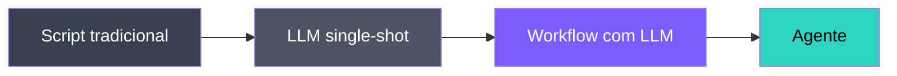
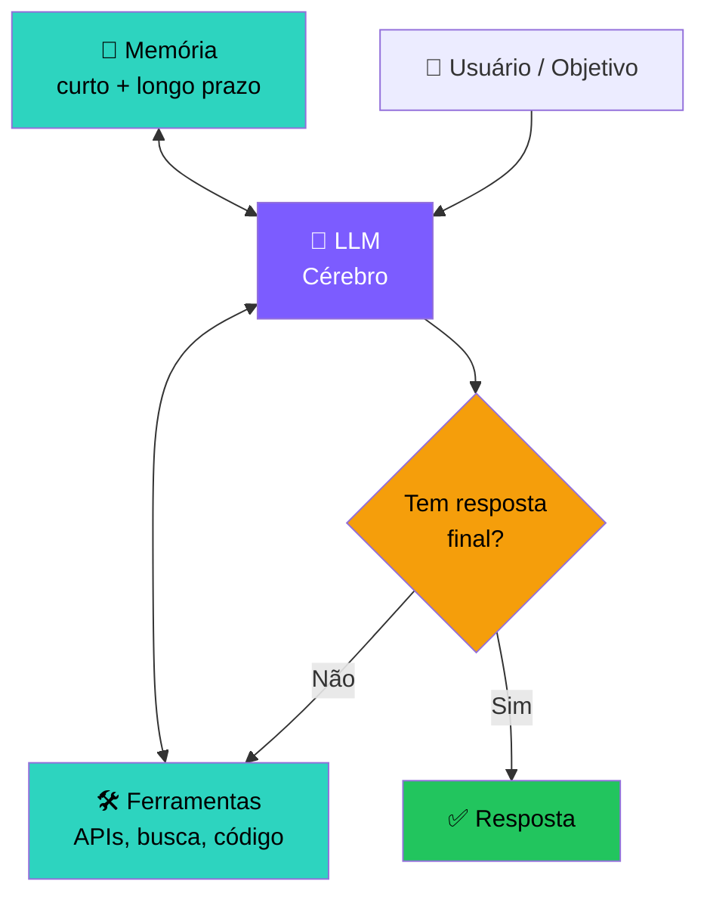
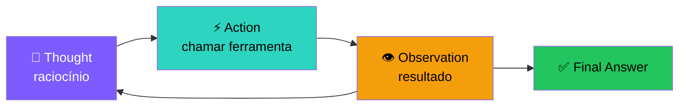
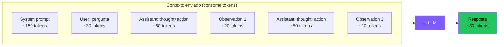

# 🧱 Encontro 1
## Introdução e Fundamentos

<div class="text-sm opacity-60 mt-4">3 horas · O que é um agente, anatomia, ReAct, primeiro agente em Python</div>

---

# 🗺️ Agenda do Encontro 1

<div class="grid grid-cols-2 gap-6 mt-6">

<div>

**Bloco 1 — Teoria (~90 min)**
- 1.1 Roadmap da disciplina
- 1.2 O que é (e o que NÃO é) um agente
- 1.3 Anatomia de um agente
- 1.4 Como o LLM "pensa"
- 1.5 O padrão ReAct

</div>

<div>

**Bloco 2 — Prática (~90 min)**
- 1.6 Setup do ambiente Python
- 1.7 Hands-on: agente do zero, sem framework
- 1.8 Exercícios (4 atividades)

</div>

</div>

<div class="mt-8 p-4 rounded-xl bg-cyan-500/10 border border-cyan-500/30">
🎯 <b>Objetivo:</b> ao final, você terá rodado seu primeiro agente em Python, entendendo cada linha — sem mágica de framework.
</div>

---
layout: two-cols
---

# 1.1 Roadmap da disciplina

Em **4 encontros** vamos sair de *"não sei o que é um agente"* para *"sei desenhar, implementar, avaliar e debugar agentes"*.

**Filosofia da disciplina:**
- 🛠️ Toda aula tem código rodando
- 🧪 Erros são parte do aprendizado
- 📚 Teoria só o suficiente pra entender o porquê
- 🌍 Exemplos de produtos reais (Cursor, Claude Code, Devin…)

::right::

# Como aproveitar (assíncrono)

<v-clicks>

<div class="p-3 rounded-lg bg-white/5 mt-4">
⏰ <b>~90 min:</b> assistir/ler com atenção, copiar código, rodar
</div>

<div class="p-3 rounded-lg bg-white/5">
⏰ <b>~90 min:</b> exercícios sem olhar a solução
</div>

<div class="p-3 rounded-lg bg-amber-500/10 border border-amber-500/30">
⚠️ <b>Não pule os exercícios.</b> É onde o aprendizado realmente acontece. Ler sobre agentes ≠ construir agentes.
</div>

</v-clicks>

---

# 1.2 O que é um Agente de IA?

Existem dezenas de definições. A mais útil, pragmática, vem da **Anthropic (2024)**:

<div class="mt-8 p-6 rounded-xl bg-cyan-500/10 border-2 border-cyan-500/40 text-center">
<div class="text-xl">
Um <b>agente</b> é um sistema onde um <b>LLM dirige seu próprio fluxo de execução em loop</b>,
</div>
<div class="text-xl mt-2">
decidindo <b>quais ferramentas chamar</b>, com base nas <b>observações</b> que recebe,
</div>
<div class="text-xl mt-2">
até atingir um <b>objetivo</b>.
</div>
</div>

<div class="mt-8 text-sm opacity-70 text-center">
Vamos quebrar essa definição em partes nos próximos slides.
</div>

---

# Espectro: do script ao agente



| Nível | Quem decide o próximo passo? | Exemplo |
|---|---|---|
| Script tradicional | Programador (`if/else` fixo) | Pipeline ETL |
| LLM single-shot | Programador (prompt único) | "Resuma este texto" |
| Workflow com LLM | Programador (DAG fixo, LLM em cada nó) | Extração → Tradução → Resumo |
| **Agente** | **O próprio LLM, em loop** | "Pesquise X na web e me entregue um relatório" |

---

# A regra de ouro 🥇

<div class="mt-8 p-6 rounded-xl bg-amber-500/10 border-2 border-amber-500/40">
<div class="text-2xl font-bold text-amber-300 text-center">
"Use a complexidade mínima necessária."
</div>
<div class="text-center mt-3 opacity-70">— Anthropic, <i>Building Effective Agents</i> (2024)</div>
</div>

<div class="mt-8 grid grid-cols-2 gap-6">

<div class="p-4 rounded-xl bg-green-500/10 border border-green-500/30">
<div class="font-bold text-green-300 mb-2">✅ Use AGENTE quando…</div>
<ul class="text-sm">
<li>Os passos não são conhecidos antecipadamente</li>
<li>O número de iterações varia muito</li>
<li>O modelo precisa decidir entre caminhos</li>
</ul>
</div>

<div class="p-4 rounded-xl bg-red-500/10 border border-red-500/30">
<div class="font-bold text-red-300 mb-2">❌ Use WORKFLOW quando…</div>
<ul class="text-sm">
<li>Os passos são fixos e previsíveis</li>
<li>Você precisa de SLA / latência baixa</li>
<li>Custo precisa ser previsível</li>
</ul>
</div>

</div>

<div class="mt-4 text-center text-sm opacity-70">
Agentes trazem flexibilidade <b>e</b> custo, latência, imprevisibilidade.
</div>

---

# 1.3 Anatomia de um agente



---

# Os 5 componentes essenciais

<div class="grid grid-cols-1 gap-3 text-sm">

<div class="p-3 rounded-lg bg-purple-500/10 border border-purple-500/30">
<b>1. 🧠 LLM (cérebro)</b> — faz reasoning e decide o próximo passo. Geralmente GPT-4o, Claude Sonnet, Gemini Pro, ou modelos open source (Llama, Qwen).
</div>

<div class="p-3 rounded-lg bg-cyan-500/10 border border-cyan-500/30">
<b>2. 🛠️ Ferramentas (tools)</b> — ações no mundo: HTTP requests, queries SQL, execução de código Python, leitura/escrita de arquivos, navegação web, controle de mouse…
</div>

<div class="p-3 rounded-lg bg-green-500/10 border border-green-500/30">
<b>3. 💾 Memória</b> — contexto da conversa (curto prazo) + base de conhecimento persistente (longo prazo, geralmente vector DB).
</div>

<div class="p-3 rounded-lg bg-amber-500/10 border border-amber-500/30">
<b>4. 🔄 Loop de controle</b> — o "run loop" que alimenta observações de volta ao LLM até a parada (sucesso, max steps, erro).
</div>

<div class="p-3 rounded-lg bg-pink-500/10 border border-pink-500/30">
<b>5. 🎯 Objetivo</b> — prompt do usuário + <i>system prompt</i> definindo missão, persona e restrições.
</div>

</div>

---

# 1.4 Como o LLM "pensa"

Antes de construir agentes, é crucial entender 3 conceitos:

<div class="grid grid-cols-3 gap-4 mt-6">

<div class="p-4 rounded-xl bg-white/5 border border-white/10">

### 🔤 Tokens
A unidade que o modelo enxerga.

- ~4 caracteres em inglês
- ~0,75 palavra
- Português usa **mais tokens** que inglês (~1.5×)

Você paga por token de **input** *e* **output**.

</div>

<div class="p-4 rounded-xl bg-white/5 border border-white/10">

### 🪟 Context window
O limite de tokens que o modelo "vê" de uma vez.

- GPT-4o: **128k**
- Claude 3.5 Sonnet: **200k**
- Gemini 1.5 Pro: **1M+**

Toda mensagem, histórico e resultado de ferramenta **consome** dessa janela.

</div>

<div class="p-4 rounded-xl bg-white/5 border border-white/10">

### 🎲 Temperature
Controle de aleatoriedade.

- `0.0` → mais determinístico
- `1.0` → mais criativo
- Agentes em produção: **0.0 – 0.3**

Mas <b>nunca</b> 100% determinístico, mesmo em 0.

</div>

</div>

---

# Mental model: o LLM é uma função pura

<div class="text-center text-2xl mt-8 font-mono">
<span class="text-cyan-400">f</span>(prompt) → texto
</div>

<div class="mt-8 p-4 rounded-xl bg-amber-500/10 border border-amber-500/30">
⚠️ <b>O LLM NÃO TEM MEMÓRIA entre chamadas.</b><br><br>
Toda "memória" de um agente é <b>reconstruída a cada chamada</b>, concatenando o histórico inteiro no prompt.
</div>

<div class="mt-6 grid grid-cols-2 gap-4">

<div class="p-3 rounded-lg bg-white/5">
<b>Chamada 1:</b><br>
<code>system + user_msg_1</code> → resposta_1
</div>

<div class="p-3 rounded-lg bg-white/5">
<b>Chamada 2:</b><br>
<code>system + user_msg_1 + resposta_1 + user_msg_2</code> → resposta_2
</div>

</div>

<div class="mt-4 text-sm opacity-70 text-center">
Isso explica por que o histórico longo fica caro <b>e</b> lento.
</div>

---

# 1.5 O padrão ReAct (Reason + Act)

📄 **Yao et al., 2022** — "ReAct: Synergizing Reasoning and Acting in Language Models"

A ideia é simples e poderosa: fazer o LLM **verbalizar** o raciocínio antes de agir.



<div class="mt-4 text-sm opacity-80">
O loop repete até o modelo achar que tem a resposta. Esse padrão é a base de praticamente todos os agentes modernos — incluindo <b>function calling</b> que veremos no Encontro 2.
</div>

---

# ReAct em ação — exemplo

**Pergunta:** *"Qual a população do Brasil em milhões, multiplicada por 7?"*

<div class="mt-4 space-y-2 text-sm font-mono">

<div class="p-3 rounded bg-purple-500/10 border-l-4 border-purple-500">
<b>💭 Thought:</b> Preciso primeiro descobrir a população do Brasil, depois multiplicar por 7.
</div>

<div class="p-3 rounded bg-cyan-500/10 border-l-4 border-cyan-500">
<b>⚡ Action:</b> busca("população do Brasil")
</div>

<div class="p-3 rounded bg-amber-500/10 border-l-4 border-amber-500">
<b>👁️ Observation:</b> "Aproximadamente 215 milhões (IBGE, 2024)."
</div>

<div class="p-3 rounded bg-purple-500/10 border-l-4 border-purple-500">
<b>💭 Thought:</b> Agora multiplico 215 por 7.
</div>

<div class="p-3 rounded bg-cyan-500/10 border-l-4 border-cyan-500">
<b>⚡ Action:</b> calculadora("215 * 7")
</div>

<div class="p-3 rounded bg-amber-500/10 border-l-4 border-amber-500">
<b>👁️ Observation:</b> 1505
</div>

<div class="p-3 rounded bg-green-500/10 border-l-4 border-green-500">
<b>✅ Final Answer:</b> Aproximadamente 1.505 milhões.
</div>

</div>

---

# 1.6 Setup do ambiente

Vamos usar **Python 3.10+** e uma API de LLM.

```bash
# 1. Crie e ative um venv
python -m venv .venv
.\.venv\Scripts\activate   # Windows PowerShell
# source .venv/bin/activate  # Linux/Mac

# 2. Instale dependências base
pip install openai anthropic python-dotenv requests

# 3. (Opcional, encontros 2+) frameworks
pip install langchain langchain-openai langgraph
pip install chromadb sentence-transformers
```

Crie um arquivo `.env`:

```bash
OPENAI_API_KEY=sk-...
ANTHROPIC_API_KEY=sk-ant-...
```

---

# Sem cartão de crédito? Sem problema.

<div class="grid grid-cols-3 gap-4 mt-6">

<div class="p-4 rounded-xl bg-white/5 border border-white/10">
<div class="text-2xl mb-2">🦙</div>
<b>Ollama</b><br>
<span class="text-sm opacity-70">Modelos locais, 100% gratuito. Precisa de PC com ≥ 16GB RAM.</span><br><br>
<code class="text-xs">ollama pull llama3.1</code>
</div>

<div class="p-4 rounded-xl bg-white/5 border border-white/10">
<div class="text-2xl mb-2">⚡</div>
<b>Groq</b><br>
<span class="text-sm opacity-70">Free tier generoso, API compatível com OpenAI. Inferência ultra-rápida.</span><br><br>
<code class="text-xs">groq.com</code>
</div>

<div class="p-4 rounded-xl bg-white/5 border border-white/10">
<div class="text-2xl mb-2">🤗</div>
<b>HuggingFace</b><br>
<span class="text-sm opacity-70">Inference API gratuita para muitos modelos open source.</span><br><br>
<code class="text-xs">huggingface.co</code>
</div>

</div>

<div class="mt-6 p-4 rounded-xl bg-cyan-500/10 border border-cyan-500/30">
💡 Quase todo código deste curso roda <b>trocando apenas o client</b> por um compatível com OpenAI (<code>base_url</code> diferente).
</div>

---

# 1.7 Hands-on: seu primeiro agente do zero

Vamos construir um agente ReAct **sem framework**, em ~80 linhas.

Ele responde perguntas usando 2 ferramentas:
- 🧮 `calculadora(expr)` — avalia expressão matemática
- 🔍 `busca(query)` — consulta uma "base" mock

**Por que do zero?** Porque depois que você entende o loop manualmente, qualquer framework (LangChain, LangGraph, CrewAI…) faz sentido.

→ Próximo slide: o código completo, comentado.

---

# 🛠️ Princípio crítico: design de ferramentas

<div class="mt-4 p-5 rounded-xl bg-cyan-500/10 border-2 border-cyan-500/40">
<div class="text-lg text-center">
Estudos da Anthropic mostram que <b>80% das falhas de agentes</b><br>
vêm de <b>tools mal descritas</b>, não do modelo.
</div>
</div>

<div class="mt-6 grid grid-cols-2 gap-4">

<div class="p-4 rounded-xl bg-red-500/10 border border-red-500/30">
<div class="font-bold mb-2 text-red-300">❌ Ruim</div>

```python
def get_data(q: str) -> str:
    """Get data."""
    ...
```

- Nome genérico
- Doc inútil
- Parâmetro sem contexto
</div>

<div class="p-4 rounded-xl bg-green-500/10 border border-green-500/30">
<div class="font-bold mb-2 text-green-300">✅ Bom</div>

```python
def buscar_cliente_por_cpf(cpf: str) -> dict:
    """Busca dados cadastrais de um cliente
    pelo CPF. Retorna {nome, email, status}.
    Use APENAS com CPF de 11 dígitos sem
    pontuação. Erros: 'NotFound', 'Invalid'."""
    ...
```
</div>

</div>

<div class="mt-4 text-sm opacity-80">
A descrição da tool <b>é</b> parte do prompt. O modelo decide se e como usar baseado nela.
</div>

---

# Os 7 mandamentos de tool design

<v-clicks>

<div class="p-2 rounded bg-white/5 mt-2 text-sm">1. <b>Nome descritivo</b> — verbo + objeto (<code>enviar_email</code>, não <code>action1</code>)</div>

<div class="p-2 rounded bg-white/5 text-sm">2. <b>Docstring rica</b> — o que faz, quando usar, formato dos args, erros possíveis</div>

<div class="p-2 rounded bg-white/5 text-sm">3. <b>Argumentos tipados</b> — use type hints + JSON Schema estrito</div>

<div class="p-2 rounded bg-white/5 text-sm">4. <b>Erros amigáveis ao LLM</b> — retorne <code>"erro: CPF inválido, use 11 dígitos"</code>, não <code>ValueError("x")</code></div>

<div class="p-2 rounded bg-white/5 text-sm">5. <b>Output estruturado</b> — JSON > prosa. O LLM consome melhor.</div>

<div class="p-2 rounded bg-white/5 text-sm">6. <b>Poucas tools por agente</b> — &gt;15 começa a confundir. Use roteamento/skills.</div>

<div class="p-2 rounded bg-white/5 text-sm">7. <b>Idempotência quando possível</b> — chamar 2× = mesmo efeito de 1×. Protege contra loops.</div>

</v-clicks>

<div class="mt-4 p-3 rounded bg-amber-500/10 border border-amber-500/30 text-sm">
💡 <b>Teste prático:</b> mostre a docstring para outra pessoa. Se ela conseguir usar a função corretamente <b>sem ver o código</b>, o LLM também conseguirá.
</div>

---

# Parte 1: ferramentas em Python puro

```python
import os, re, json
from openai import OpenAI
from dotenv import load_dotenv

load_dotenv()
client = OpenAI()

# ---- Ferramentas (Python puro) ----
def calculadora(expr: str) -> str:
    """Avalia expressão matemática simples."""
    try:
        return str(eval(expr, {"__builtins__": {}}, {}))
    except Exception as e:
        return f"erro: {e}"

def busca(query: str) -> str:
    """Mock de base de conhecimento."""
    fake_db = {
        "população do brasil": "Aproximadamente 215 milhões (IBGE, 2024).",
        "capital da austrália": "Canberra.",
        "velocidade da luz": "299.792.458 m/s no vácuo.",
    }
    return fake_db.get(query.lower(), "Nenhum resultado encontrado.")

TOOLS = {"calculadora": calculadora, "busca": busca}
```

---

# Parte 2: prompt no estilo ReAct

```python
SYSTEM = """Você é um agente que resolve perguntas em ciclos.
Em cada turno responda EXATAMENTE em um destes formatos:

Thought: <seu raciocínio>
Action: <nome_da_ferramenta>
Action Input: <argumento em texto>

OU, quando souber a resposta:

Thought: <raciocínio final>
Final Answer: <resposta para o usuário>

Ferramentas disponíveis:
- calculadora(expr): avalia expressão matemática Python.
- busca(query): consulta uma base interna.
"""
```

<div class="mt-4 p-3 rounded bg-amber-500/10 border border-amber-500/30 text-sm">
🎓 O <b>system prompt</b> é onde você define a "personalidade" e o protocolo do agente. Pequenas mudanças aqui geram comportamentos muito diferentes.
</div>

---

# Parte 3: o loop do agente

```python {all|2-6|7-12|13-20|all}
def run_agent(pergunta: str, max_steps: int = 6):
    msgs = [
        {"role": "system", "content": SYSTEM},
        {"role": "user",   "content": pergunta},
    ]
    
    for step in range(max_steps):
        resp = client.chat.completions.create(
            model="gpt-4o-mini", messages=msgs, temperature=0
        )
        out = resp.choices[0].message.content
        msgs.append({"role": "assistant", "content": out})
        
        if "Final Answer:" in out:
            return out.split("Final Answer:")[-1].strip()
        
        m = re.search(r"Action:\s*(\w+)\s*\nAction Input:\s*(.+)", out)
        if not m:  return "Agente não produziu ação válida."
        
        tool, arg = m.group(1).strip(), m.group(2).strip()
        obs = TOOLS.get(tool, lambda x: f"tool '{tool}' inexistente")(arg)
        msgs.append({"role": "user", "content": f"Observation: {obs}"})
    
    return "Máximo de passos atingido."
```

---

# Parte 4: rodando

```python
if __name__ == "__main__":
    pergunta = "Quanto é (123 * 7) + a população do Brasil em milhões?"
    resposta = run_agent(pergunta)
    print(f"\n>>> {resposta}")
```

**Saída esperada (resumida):**

```
Thought: Preciso da população do Brasil primeiro.
Action: busca
Action Input: população do brasil

Observation: Aproximadamente 215 milhões (IBGE, 2024).

Thought: Agora calculo 123*7 + 215.
Action: calculadora
Action Input: 123 * 7 + 215

Observation: 1076

Final Answer: O resultado é aproximadamente 1.076 milhões.
```

---

# O que observar ao rodar 👀

<v-clicks>

<div class="p-3 rounded bg-white/5 mt-4">
✅ O modelo <b>verbaliza</b> o "Thought" — isso é reasoning emergente. Ninguém ensinou explicitamente; ele aprendeu lendo a internet.
</div>

<div class="p-3 rounded bg-white/5">
⚠️ Quando ele <b>erra o formato</b> (esquece "Action Input:" ou inventa), o loop quebra. Robustez vem de <b>function calling estruturado</b> (Encontro 2).
</div>

<div class="p-3 rounded bg-white/5">
💸 <b>Cada passo adiciona mais tokens</b> ao contexto. Se a tarefa exige 10 passos, você paga 10× o histórico crescente. Esse é o início do problema de <b>context management</b> (Encontro 3).
</div>

<div class="p-3 rounded bg-amber-500/10 border border-amber-500/30">
🐛 Modelos pequenos (GPT-4o-mini, Llama 3.1 8B) <b>às vezes ignoram o protocolo</b>. Modelos maiores são mais consistentes. Isso é uma realidade prática importante.
</div>

</v-clicks>

---

# Anatomia de uma chamada à API — visualizando os tokens



<div class="mt-4 text-sm">
Esse exemplo: <b>~390 tokens enviados</b> + 80 gerados a cada chamada.
Em <code>gpt-4o-mini</code> custa frações de centavo. Em <code>gpt-4o</code>, ~10× mais. Em agentes longos, vira US$ rapidinho.
</div>

---
layout: section
---

# 🏋️ 1.8 Exercícios — Encontro 1

4 atividades · Faça antes de partir para o Encontro 2

---

# Exercício 1.1 · Rodando o agente base

<div class="p-5 rounded-xl bg-purple-500/10 border-2 border-purple-500/40">

**Tarefa:** rode o código do agente e teste **5 perguntas diferentes**:

1. Pura matemática (ex: "quanto é 999 × 47?")
2. Pura busca (ex: "qual a capital da Austrália?")
3. Mista (ex: "qual a velocidade da luz em km/s?")
4. Impossível com as tools disponíveis (ex: "qual a previsão do tempo hoje?")
5. Ambígua (ex: "me fale sobre o Brasil")

**Para cada uma, anote:**
- Quantos passos o agente fez?
- A resposta foi correta?
- Algum comportamento estranho? (loops, alucinações, erros de formato)

</div>

---

# Exercício 1.2 · Nova ferramenta

<div class="p-5 rounded-xl bg-purple-500/10 border-2 border-purple-500/40">

**Tarefa:** adicione **duas ferramentas novas**:

```python
def hora_atual() -> str:
    """Retorna data e hora atual."""
    # implemente

def clima(cidade: str) -> str:
    """Mock — retorne valores fixos para 3 cidades."""
    # implemente
```

**Não esqueça de:**
- Adicionar no dicionário `TOOLS`
- Atualizar o `SYSTEM` prompt com a descrição

**Pergunta de teste:**
> *"Que horas são agora e como está o clima em Curitiba?"*

</div>

---

# Exercício 1.3 · Quebrando o agente

<div class="p-5 rounded-xl bg-red-500/10 border-2 border-red-500/40">

**Tarefa:** encontre **3 formas diferentes** de fazer o agente falhar.

Exemplos de falhas a tentar provocar:
- 🔁 Loop infinito (mesma ação várias vezes)
- 📝 Formato inválido (LLM "esquece" Action Input)
- 👻 Alucinação de ferramenta (chama tool que não existe)
- 💥 Exceção dentro da tool (passa argumento inválido)
- 🤔 Resposta sem chamar nenhuma tool

**Para cada falha:**
1. Descreva como você reproduziu
2. Qual o sintoma (output, erro, comportamento)
3. Proponha **uma mitigação** (vamos discutir no Encontro 4)

</div>

---

# Exercício 1.4 · Reflexão escrita (15 min)

<div class="p-5 rounded-xl bg-cyan-500/10 border-2 border-cyan-500/40">

Em **1 parágrafo**, responda:

> *"Qual é a diferença entre **um workflow com LLM** e **um agente**?"*

Inclua na sua resposta:

- ✅ Sua definição com suas palavras
- 🌍 **Um exemplo real** de workflow do seu dia a dia profissional/acadêmico
- 🌍 **Um exemplo real** de agente que faria sentido no mesmo contexto
- 💭 Por que cada exemplo se encaixa em uma categoria

Não há resposta certa. O objetivo é **calibrar sua intuição** antes do Encontro 2.

</div>

---
layout: center
class: text-center
---

---

# 📚 Referências públicas — Encontro 1

Todo o material apresentado é de **domínio público / publicações abertas**.

<div class="grid grid-cols-2 gap-3 text-xs mt-3">

<div class="p-3 rounded bg-purple-500/10 border border-purple-500/30">
<b>Papers seminais</b>
<ul class="mt-1">
<li>Vaswani et al. (2017) — <i>Attention Is All You Need</i> · <a href="https://arxiv.org/abs/1706.03762">arXiv:1706.03762</a></li>
<li>Yao et al. (2022) — <i>ReAct: Synergizing Reasoning and Acting</i> · <a href="https://arxiv.org/abs/2210.03629">arXiv:2210.03629</a></li>
<li>Schick et al. (2023) — <i>Toolformer</i> · <a href="https://arxiv.org/abs/2302.04761">arXiv:2302.04761</a></li>
<li>Anthropic (2024) — <i>Building Effective Agents</i> · <a href="https://www.anthropic.com/research/building-effective-agents">anthropic.com/research</a></li>
</ul>
</div>

<div class="p-3 rounded bg-cyan-500/10 border border-cyan-500/30">
<b>Documentação oficial</b>
<ul class="mt-1">
<li>OpenAI Function Calling Guide · <a href="https://platform.openai.com/docs/guides/function-calling">platform.openai.com/docs</a></li>
<li>Anthropic Tool Use · <a href="https://docs.anthropic.com/en/docs/build-with-claude/tool-use">docs.anthropic.com</a></li>
<li>LangChain Docs · <a href="https://python.langchain.com/">python.langchain.com</a></li>
</ul>
</div>

<div class="p-3 rounded bg-green-500/10 border border-green-500/30">
<b>Recursos didáticos</b>
<ul class="mt-1">
<li>Hugging Face — Agents Course · <a href="https://huggingface.co/learn/agents-course">huggingface.co/learn/agents-course</a></li>
<li>DeepLearning.AI — <i>Functions, Tools and Agents with LangChain</i> · <a href="https://www.deeplearning.ai/short-courses/">deeplearning.ai</a></li>
<li>Lilian Weng (2023) — <i>LLM Powered Autonomous Agents</i> · <a href="https://lilianweng.github.io/posts/2023-06-23-agent/">lilianweng.github.io</a></li>
</ul>
</div>

<div class="p-3 rounded bg-amber-500/10 border border-amber-500/30">
<b>Licenças</b>
<ul class="mt-1">
<li>arXiv papers: licenças abertas (CC-BY / autores)</li>
<li>Logos/marcas: propriedade dos respectivos donos, uso apenas educacional</li>
<li>Código-exemplo: domínio público, sem garantia</li>
</ul>
</div>

</div>

---

# ✅ Fim do Encontro 1

Você agora sabe:

- O que é (e o que não é) um agente
- A anatomia: LLM + tools + memória + loop + objetivo
- O padrão ReAct
- Como construir um agente do zero em Python

<div class="mt-12 text-xl text-cyan-400">
Próximo: <b>Encontro 2 — Reasoning, Planning & Tool Execution</b>
</div>

<div class="mt-4 text-sm opacity-60">
Onde tornamos tudo isso <i>robusto</i> com function calling estruturado e frameworks.
</div>
