# 🧠 Encontro 2
## Reasoning, Planning & Tool Execution

<div class="text-sm opacity-60 mt-4">3 horas · CoT, ToT, Planning, Function Calling, LangChain/LangGraph</div>

---
layout: center
class: text-center
---

# 💭 Onde paramos…

<div class="text-xl mt-6 opacity-90">
No Encontro 1, você construiu um agente funcional.<br>
Mas ele tinha um problema: <b>era impulsivo</b>.
</div>

<div class="mt-6 text-lg text-amber-400">
Agia sem pensar. Escolhia ferramentas erradas. Não planejava.
</div>

<div class="mt-8 text-sm opacity-60">
Hoje vamos ensiná-lo a <b>raciocinar</b> antes de agir — e a usar ferramentas de forma <b>robusta</b>.
</div>

---

# 🗺️ Agenda do Encontro 2

<div class="grid grid-cols-2 gap-6 mt-6">

<div>

**Bloco 1 — Reasoning & Planning (~90 min)**
- 2.1 Recap: limites do ReAct manual
- 2.2 Chain-of-Thought (CoT)
- 2.3 Self-Consistency
- 2.4 Tree-of-Thoughts (ToT)
- 2.5 Planning: Plan-and-Execute, ReWOO

</div>

<div>

**Bloco 2 — Tool Execution (~90 min)**
- 2.6 Function Calling estruturado
- 2.7 Hands-on: agente robusto com OpenAI tools
- 2.8 LangChain — quando faz sentido
- 2.9 LangGraph — state machines explícitas
- 2.10 Exercícios

</div>

</div>

---

# 🧭 Vocabulário do dia — em 1 frase cada

Antes de mergulhar, os termos novos que você vai ouvir hoje:

<div class="grid grid-cols-1 gap-2 text-sm mt-3">

<div class="p-3 rounded-lg bg-purple-500/10 border border-purple-500/30">
<b>🧠 Reasoning model</b> — modelo que "pensa em voz alta" antes de responder. <i>Ex: o1, o3, DeepSeek R1.</i> Pague mais, espere mais, ganhe respostas melhores em problemas complexos.
</div>

<div class="p-3 rounded-lg bg-cyan-500/10 border border-cyan-500/30">
<b>🪜 Chain-of-Thought (CoT)</b> — pedir explicitamente: <i>"explique seu raciocínio passo a passo"</i>. Truque simples, ganho gigante em matemática e lógica.
</div>

<div class="p-3 rounded-lg bg-green-500/10 border border-green-500/30">
<b>📋 Planning</b> — em vez de decidir um passo de cada vez, o agente faz um <b>plano completo primeiro</b>. Como escrever o roteiro antes de filmar.
</div>

<div class="p-3 rounded-lg bg-amber-500/10 border border-amber-500/30">
<b>🔁 Reflexion</b> — agente <b>critica a própria resposta</b> e tenta de novo se não estiver bom. Como reler seu texto antes de enviar.
</div>

<div class="p-3 rounded-lg bg-pink-500/10 border border-pink-500/30">
<b>📦 Structured output</b> — forçar o LLM a responder em formato fixo (ex: JSON), não em texto livre. Essencial para integração com sistemas.
</div>

<div class="p-3 rounded-lg bg-blue-500/10 border border-blue-500/30">
<b>🛠️ Framework</b> — biblioteca pronta que esconde a "encanação" do agente. <i>Ex: LangGraph, LlamaIndex.</i> Como usar Django em vez de escrever um servidor HTTP do zero.
</div>

</div>

---

# 🧩 Onde você já viu isso

<div class="grid grid-cols-2 gap-3 text-sm">

<div class="p-3 rounded-lg bg-purple-500/10 border border-purple-500/30">
<b>🧠 Reasoning models em produto</b><br>
• Quando você usa <b>ChatGPT</b> e escolhe "o1" ou "o3" — a respostinha "thinking..." é literalmente o modelo gerando raciocínio antes de responder<br>
• <b>Cursor</b> oferece "Reasoning mode" para refatorações grandes
</div>

<div class="p-3 rounded-lg bg-cyan-500/10 border border-cyan-500/30">
<b>🪜 CoT no cotidiano</b><br>
• Toda vez que você adiciona <i>"explique passo a passo"</i> ao prompt, está usando CoT<br>
• Calculadoras avançadas como Wolfram Alpha exibem os passos da mesma forma
</div>

<div class="p-3 rounded-lg bg-green-500/10 border border-green-500/30">
<b>📋 Planning em produto</b><br>
• <b>Devin / Cognition</b>: mostra um plano com checkboxes antes de codar<br>
• <b>Manus, OpenAI Operator</b>: planeja a sequência de cliques antes de executar
</div>

<div class="p-3 rounded-lg bg-amber-500/10 border border-amber-500/30">
<b>🔁 Reflexion em produto</b><br>
• <b>Cursor</b>: gera código → roda os testes → se falham, ajusta sozinho<br>
• <b>Perplexity Pro Search</b>: refina busca se a primeira leva resultados ruins
</div>

</div>

<div class="mt-3 text-xs opacity-70 text-center">
Praticamente todo produto agentic em 2025 combina <b>2 ou 3</b> dessas técnicas.
</div>

---

# 2.1 Recap: por que o ReAct manual falha?

No Encontro 1 fizemos um agente "na unha" com `re.search`. Funciona, mas…

<div class="grid grid-cols-2 gap-4 mt-6">

<div class="p-4 rounded-xl bg-red-500/10 border border-red-500/30">
<div class="font-bold text-red-300 mb-2">😖 Problemas</div>
<ul class="text-sm">
<li>Parsing frágil (regex quebra fácil)</li>
<li>LLM alucina nomes de ferramentas</li>
<li>Argumentos viram strings mal formadas</li>
<li>Sem tipagem, sem validação</li>
<li>Difícil debugar quando dá errado</li>
</ul>
</div>

<div class="p-4 rounded-xl bg-green-500/10 border border-green-500/30">
<div class="font-bold text-green-300 mb-2">😎 Solução: Function Calling</div>
<ul class="text-sm">
<li>OpenAI, Anthropic, Gemini suportam nativamente</li>
<li>JSON schema valida argumentos</li>
<li>Modelo retorna estrutura, não texto livre</li>
<li>Suporte a múltiplas chamadas em paralelo</li>
<li>Padrão da indústria desde 2023</li>
</ul>
</div>

</div>

<div class="mt-6 text-center text-sm opacity-70">
Mas antes de chegar nas tools robustas, vamos entender <b>como melhorar o reasoning</b>.
</div>

---
layout: center
class: text-center
---

# 🧠 Parte 1: Ensinando a pensar

<div class="text-lg mt-6 opacity-80">
O segredo mais simples da IA: pedir ao modelo para <b>mostrar os passos</b><br>
já melhora a performance em <b>20-40%</b>.
</div>

<div class="mt-6 text-sm opacity-60">
Vamos ver 4 técnicas, da mais simples à mais sofisticada.
</div>

---

# 2.2 Chain-of-Thought (CoT)

📄 **Wei et al., 2022** — *"Chain-of-Thought Prompting Elicits Reasoning in LLMs"*

A descoberta: pedir ao modelo para **mostrar os passos** melhora performance em **20–40%** em tarefas de raciocínio.

<div class="grid grid-cols-2 gap-6 mt-6">

<div class="p-4 rounded-xl bg-red-500/10 border border-red-500/30">
<div class="font-bold mb-2">❌ Sem CoT</div>
<div class="text-sm font-mono">
P: Se Maria tem 5 maçãs e dá 2 para João, e depois compra mais 6, quantas tem?<br><br>
R: <b>11</b> ❌
</div>
</div>

<div class="p-4 rounded-xl bg-green-500/10 border border-green-500/30">
<div class="font-bold mb-2">✅ Com CoT</div>
<div class="text-sm font-mono">
P: ... <b>Pense passo a passo.</b><br><br>
R: Maria começa com 5. Dá 2 → fica com 3. Compra 6 → 3+6 = 9. <b>Resposta: 9</b> ✅
</div>
</div>

</div>

<div class="mt-6 p-4 rounded-xl bg-cyan-500/10 border border-cyan-500/30">
🪄 <b>A frase mágica:</b> <i>"Let's think step by step"</i> (Kojima et al., 2022) — funciona em quase qualquer modelo, sem nenhum exemplo.
</div>

---

# CoT em código

```python
# Sem CoT
prompt_simples = "Quanto é 17 * 23 + 41?"

# CoT zero-shot
prompt_cot = """Quanto é 17 * 23 + 41?

Pense passo a passo antes de dar a resposta final."""

# CoT few-shot (mostre exemplos)
prompt_few_shot = """Resolva os problemas mostrando o passo a passo.

P: Quanto é 5 * 4 + 2?
R: 5*4 = 20. 20+2 = 22. Resposta: 22.

P: Quanto é 17 * 23 + 41?
R:"""
```

<div class="mt-4 p-3 rounded bg-amber-500/10 border border-amber-500/30 text-sm">
💡 <b>Para agentes:</b> o "Thought" do ReAct <b>é</b> CoT aplicado. Cada Thought é uma cadeia de raciocínio antes de cada Action.
</div>

---

# 2.3 Self-Consistency

📄 **Wang et al., 2022**

A ideia: gere **N respostas** com temperatura > 0 e use **votação majoritária**.

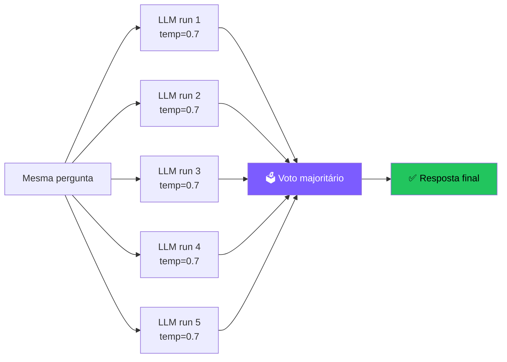

<div class="mt-4 text-sm">
<b>Trade-off:</b> 5× mais caro e lento, mas pode subir acurácia em ~10–20% em problemas complexos.<br>
<b>Quando usar:</b> tarefas onde existe uma resposta "certa" (matemática, código).
</div>

---

# 2.4 Tree-of-Thoughts (ToT)

📄 **Yao et al., 2023**

Em vez de uma única cadeia, **explore múltiplas** em árvore. Avalie e poda.

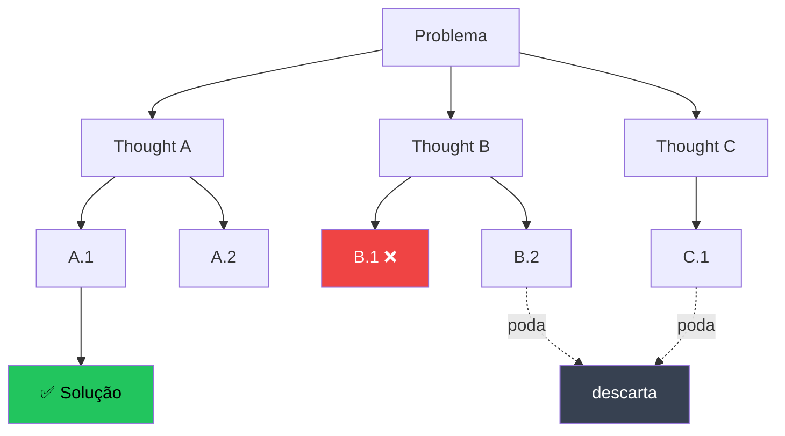

<div class="mt-4 text-sm">
Inspirado em busca clássica (BFS, DFS). Útil em problemas com múltiplos caminhos válidos.<br>
<b>Trade-off:</b> exponencialmente mais caro. Use só quando CoT/Self-Consistency não bastam.
</div>

---

# Comparativo das estratégias de reasoning

| Estratégia | Custo | Acurácia | Quando usar |
|---|---|---|---|
| **Direct** (sem CoT) | 💰 | ⭐ | Tarefas triviais, classificação |
| **CoT (zero-shot)** | 💰 | ⭐⭐⭐ | Default — quase sempre vale a pena |
| **CoT (few-shot)** | 💰💰 | ⭐⭐⭐⭐ | Tarefas com padrão claro |
| **Self-Consistency** | 💰💰💰 | ⭐⭐⭐⭐ | Há uma "resposta certa" |
| **Tree-of-Thoughts** | 💰💰💰💰💰 | ⭐⭐⭐⭐⭐ | Problemas complexos, exploratórios |
| **o1 / DeepSeek-R1** | 💰💰💰💰 | ⭐⭐⭐⭐⭐ | Reasoning treinado nativamente |

<div class="mt-4 p-3 rounded bg-cyan-500/10 border border-cyan-500/30 text-sm">
🎯 <b>Regra prática:</b> comece com CoT. Suba a escala só se medir melhoria real.
</div>

---

# 🧠 Reasoning Models — o paradigma novo (2024+)

📅 OpenAI **o1** (set/2024), **o3** (dez/2024), DeepSeek **R1** (jan/2025), Anthropic **extended thinking** (2025).

<div class="mt-4 p-5 rounded-xl bg-cyan-500/10 border-2 border-cyan-500/40">
<div class="text-lg text-center">
Em vez de "pensar via prompt", o modelo é <b>treinado via RL</b> para<br>
<b>pensar muito antes de responder</b> — gerando milhares de tokens internos invisíveis.
</div>
</div>

<div class="mt-6 grid grid-cols-2 gap-4 text-sm">

<div class="p-3 rounded bg-purple-500/10 border border-purple-500/30">
<b>Modelos clássicos (GPT-4o, Sonnet)</b><br>
Reasoning é <b>emergente</b> via prompt (CoT).<br>
Latência: ~1s por resposta.
</div>

<div class="p-3 rounded bg-green-500/10 border border-green-500/30">
<b>Reasoning models (o1, R1)</b><br>
Reasoning é <b>treinado</b>. Modelo "pensa" 5-60s.<br>
Acurácia em matemática/código: <b>+30-50%</b>.
</div>

</div>

<div class="mt-4 p-3 rounded bg-amber-500/10 border border-amber-500/30 text-sm">
⚠️ <b>Trade-offs:</b> 5-10× mais caro, 10-100× mais lento. <b>Não</b> use para chat casual. Use para: matemática, prova de teoremas, código complexo, planning multi-step.
</div>

---

# Reasoning models — como mudam o design do agente

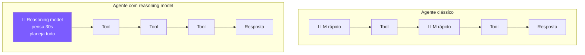

<div class="mt-4 text-sm">
<b>Padrão emergente:</b> use o1/R1 como <b>planner</b> (1 chamada cara, pensa muito), depois delegue execução para modelos rápidos/baratos (Haiku, GPT-4o-mini).<br>
→ Custo total <b>menor</b> e acurácia <b>maior</b>.
</div>

---

# 🪞 Self-Reflection & Reflexion

📄 **Shinn et al., 2023** — *"Reflexion: Language Agents with Verbal Reinforcement Learning"*

A ideia: depois de tentar uma tarefa, o agente **critica seu próprio output** e tenta de novo com a crítica no contexto.

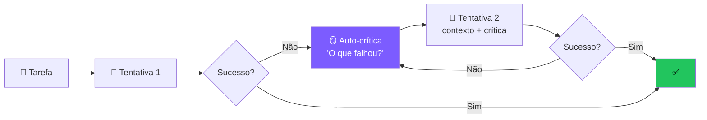

<div class="mt-3 text-sm">
Melhora performance em <b>20-30%</b> em benchmarks como HumanEval e ALFWorld, sem retreinar nada.
</div>

---

# Self-Reflection em código

<div class="mb-3 p-3 rounded bg-sky-500/10 border border-sky-500/30 text-sm">
📖 <b>Em palavras (sem ler código):</b> o agente <b>tenta resolver</b>, depois <b>se critica</b> ("isso de fato responde a pergunta?"), e se a crítica disser que não, ele <b>tenta de novo</b> levando a crítica em consideração. Repete até dar certo ou bater o limite de tentativas.
</div>

```python
def agent_with_reflection(tarefa: str, max_tries: int = 3):
    historico = []
    for tentativa in range(max_tries):
        # 1) Tenta resolver
        contexto = f"Tarefa: {tarefa}\n"
        if historico:
            contexto += f"Tentativas anteriores e críticas:\n{historico}\n"
        resposta = llm.invoke(contexto + "Sua resposta:")
        
        # 2) Critica o próprio output
        critica = llm.invoke(f"""
        Tarefa original: {tarefa}
        Resposta proposta: {resposta}
        
        A resposta resolve a tarefa? Aponte erros específicos.
        Responda em JSON: {{"ok": bool, "criticas": [str]}}
        """)
        critica = json.loads(critica)
        
        if critica["ok"]:
            return resposta
        historico.append({"tentativa": resposta, "criticas": critica["criticas"]})
    
    return resposta  # devolve melhor esforço
```

<div class="mt-3 p-3 rounded bg-amber-500/10 border border-amber-500/30 text-sm">
⚠️ <b>Cuidado:</b> usar o <b>mesmo modelo</b> pra gerar e criticar tem viés (overconfidence). Idealmente, use um modelo diferente — ou um <b>maior</b> — como crítico.
</div>

---

# 📐 Structured Outputs

Em produção, você quase nunca quer **texto livre** do LLM. Você quer **dados tipados**.

<div class="mt-4 grid grid-cols-2 gap-4">

<div class="p-4 rounded-xl bg-red-500/10 border border-red-500/30">
<b>❌ Sem structured output</b>

```python
out = llm.invoke("Extraia nome e idade")
# "O nome é João, tem 30 anos"
# parsing manual frágil 😖
```
</div>

<div class="p-4 rounded-xl bg-green-500/10 border border-green-500/30">
<b>✅ Com structured output</b>

```python
class Pessoa(BaseModel):
    nome: str
    idade: int

p = llm.with_structured_output(Pessoa).invoke(...)
# Pessoa(nome='João', idade=30) ✨
```
</div>

</div>

<div class="mt-4 text-sm">
Suportado nativamente por: <b>OpenAI</b> (Structured Outputs, ago/2024), <b>Anthropic</b> (tool use), <b>Gemini</b>, <b>Pydantic AI</b> (framework type-safe), <b>Instructor</b> (lib popular).
</div>

---

# Pydantic AI — framework type-safe

<div class="mb-3 p-3 rounded bg-sky-500/10 border border-sky-500/30 text-sm">
📖 <b>Em palavras:</b> você <b>descreve a forma do resultado</b> que quer (ex: "um ticket com título, prioridade 1-5, departamento e flag de urgência") e o framework <b>obriga o LLM a obedecer</b>. Em vez de "espero que venha JSON certo", você ganha um objeto Python validado — pronto pra alimentar um banco, uma fila, outra API.
</div>

```python
from pydantic import BaseModel
from pydantic_ai import Agent

class Ticket(BaseModel):
    titulo: str
    prioridade: int  # 1-5
    departamento: str
    requer_resposta_imediata: bool

agent = Agent(
    "openai:gpt-4o-mini",
    result_type=Ticket,
    system_prompt="Você classifica tickets de suporte."
)

result = agent.run_sync("Cliente diz que servidor caiu, perdemos R$ 10k/h")
ticket = result.data  # ← objeto Pydantic validado!
print(ticket.prioridade)  # 5
print(ticket.requer_resposta_imediata)  # True
```

<div class="mt-3 p-3 rounded bg-cyan-500/10 border border-cyan-500/30 text-sm">
🎯 <b>Por que importa:</b> em produção, agentes alimentam <b>outros sistemas</b> (DBs, APIs, filas). Sem schema, você passa a vida fazendo parsing defensivo de texto livre.
</div>

---
layout: section
---

# 🏗️ Os 5 padrões agentic da Anthropic

<div class="text-sm opacity-60 mt-4">A referência da indústria · <i>"Building Effective Agents"</i> (Anthropic, 2024)</div>

<div class="mt-6 text-sm opacity-80">
Até agora vimos como o LLM <b>pensa</b>. Agora vamos ver como <b>organizar a execução</b> — os padrões que as melhores equipes usam.
</div>

---

# Os 5 padrões — visão geral

<div class="grid grid-cols-1 gap-3 text-sm mt-4">

<div class="p-3 rounded bg-purple-500/10 border border-purple-500/30">
<b>1. ⛓️ Prompt Chaining</b> — passos fixos, output de um vira input do próximo. Simples e previsível.
</div>

<div class="p-3 rounded bg-purple-500/10 border border-purple-500/30">
<b>2. 🔀 Routing</b> — um classificador decide qual prompt/modelo especializado usar.
</div>

<div class="p-3 rounded bg-purple-500/10 border border-purple-500/30">
<b>3. ⚡ Parallelization</b> — tarefas independentes rodam em paralelo, depois agrega.
</div>

<div class="p-3 rounded bg-purple-500/10 border border-purple-500/30">
<b>4. 🧑‍💼 Orchestrator-Workers</b> — orquestrador dinâmico decompõe e delega para workers.
</div>

<div class="p-3 rounded bg-purple-500/10 border border-purple-500/30">
<b>5. 🪞 Evaluator-Optimizer</b> — gerador propõe, avaliador critica, em loop.
</div>

<div class="mt-3 p-3 rounded bg-cyan-500/10 border border-cyan-500/30 text-sm">
🎯 <b>Lição central:</b> a maioria dos "agentes" de sucesso são <b>combinações</b> desses 5 padrões — não loops autônomos puros.
</div>

</div>

---

# Padrão 1 · Prompt Chaining

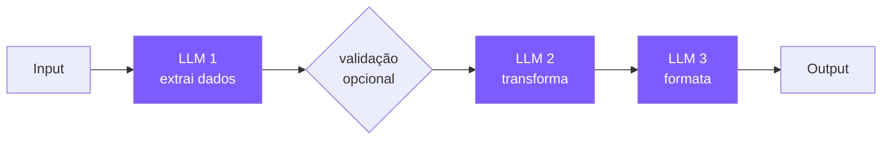

<div class="mt-4 text-sm">
<b>Quando usar:</b> tarefas com decomposição natural e <b>passos fixos</b>.<br>
<b>Exemplo:</b> "extrair dados → traduzir → resumir em bullet points"<br>
<b>Trade-off:</b> mais latência (sequencial), mas qualidade muito maior que 1 prompt monolítico.
</div>

---

# Padrão 2 · Routing

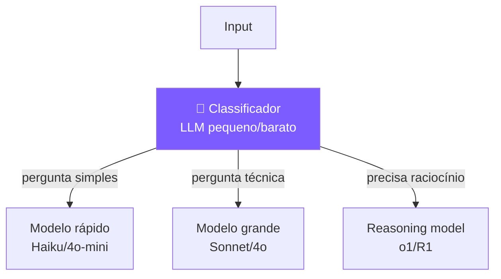

<div class="mt-4 text-sm">
<b>Quando usar:</b> diferentes tipos de input merecem diferentes tratamentos.<br>
<b>Vantagem prática:</b> economia gigante. 80% das queries vão pro modelo barato.
</div>

---

# Padrão 3 · Parallelization

<div class="grid grid-cols-2 gap-4 mt-4">

<div>

**3a. Sectioning** — dividir tarefa em partes independentes

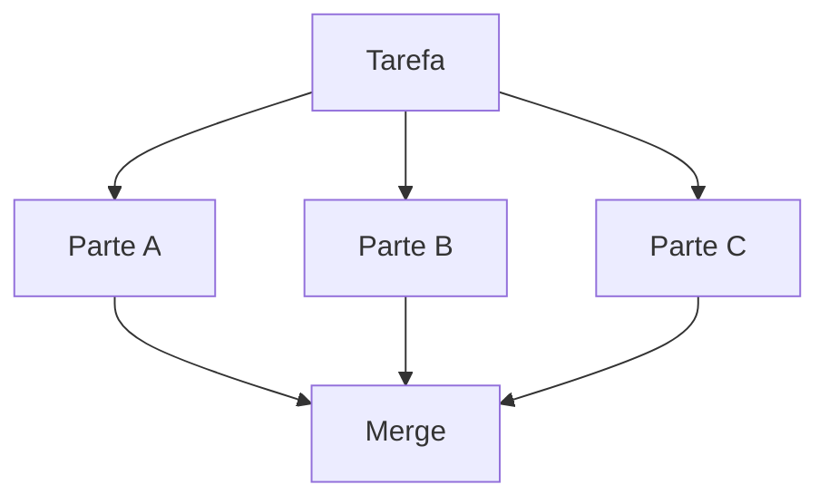
</div>

<div>

**3b. Voting** — várias respostas, votação

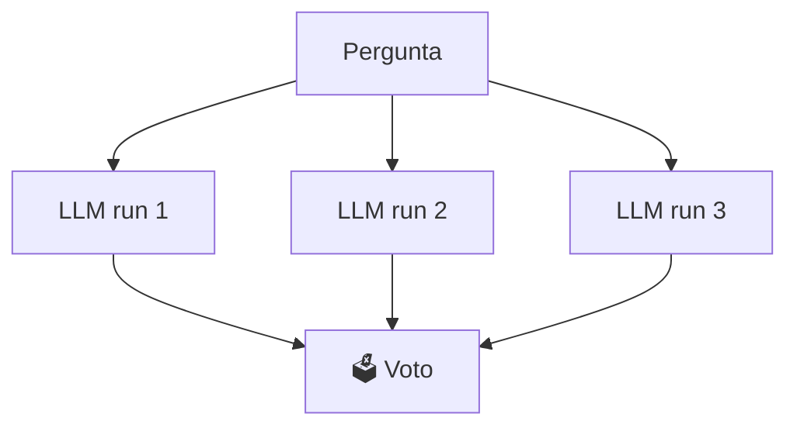
</div>

</div>

<div class="mt-4 text-sm">
<b>Sectioning:</b> classificar email + checar tom + extrair entidades em paralelo.<br>
<b>Voting:</b> code review por 3 instâncias — só commita se 2/3 aprovam.
</div>

---

# Padrão 4 · Orchestrator-Workers

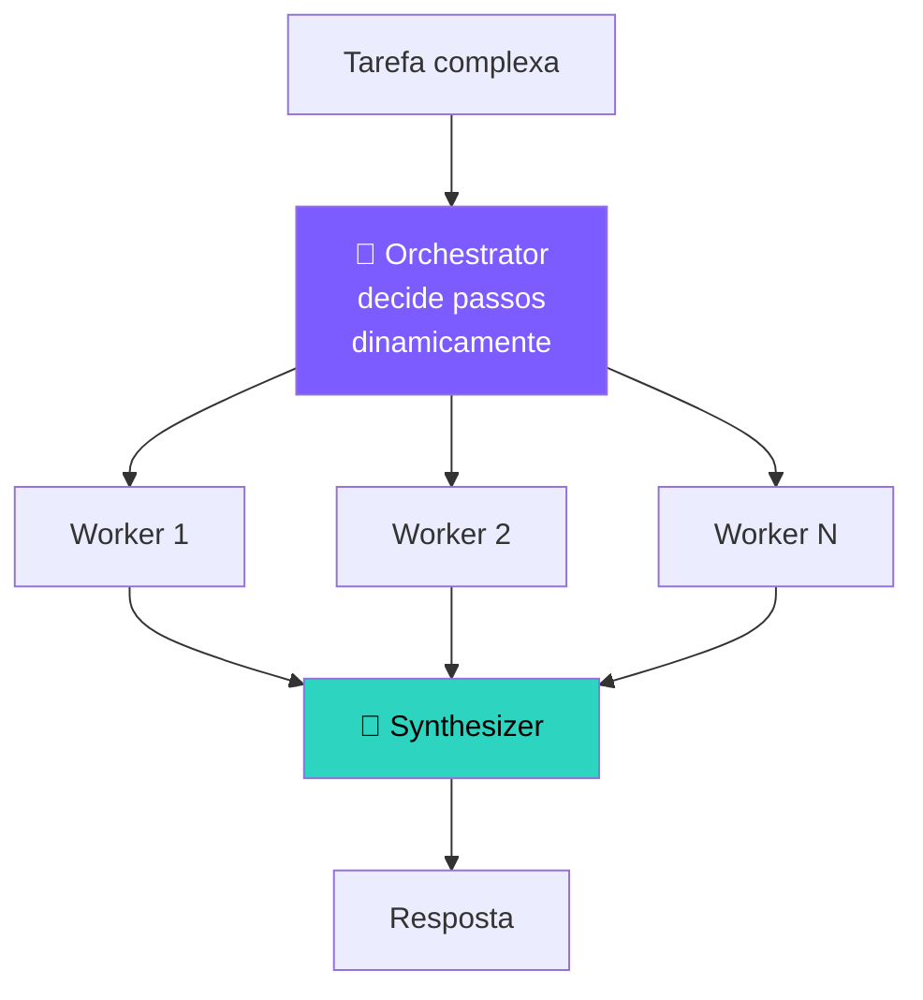

<div class="mt-4 text-sm">
<b>Diferença vs Parallelization:</b> aqui o orquestrador <b>decide quantos e quais workers</b> usar baseado na tarefa. É dinâmico.<br>
<b>Exemplo:</b> Claude Code lendo um repo gigante — orquestrador decide ler 3 arquivos, depois 5, depois 1.
</div>

---

# Padrão 5 · Evaluator-Optimizer

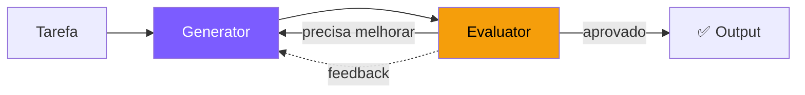

<div class="mt-4 text-sm">
Variante avançada do <b>Self-Reflection</b>, mas com agentes/prompts <b>separados</b> para gerar e avaliar.<br>
<b>Casos clássicos:</b> tradução literária (gerar → revisar → refinar), redação técnica, geração de código com testes.
</div>

---

# Decision tree: qual padrão usar?

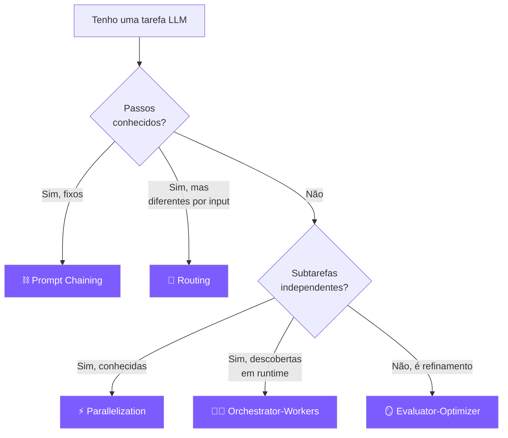

---

# 2.5 Planning — pensar antes de agir

ReAct decide **passo a passo**. Planning decide a **rota inteira** antes de começar.

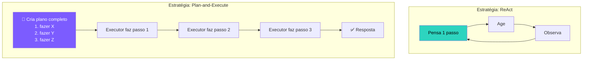

---

# Plan-and-Execute vs ReWOO

<div class="grid grid-cols-2 gap-4 mt-4">

<div class="p-4 rounded-xl bg-purple-500/10 border border-purple-500/30">

### 🗺️ Plan-and-Execute
*(LangChain, 2023)*

1. **Planner** LLM cria lista de passos
2. **Executor** LLM executa cada passo com ferramentas
3. Pode **re-planejar** se algo der errado

✅ Bom para tarefas multi-step com dependências claras<br>
❌ Mais lento (2 LLMs em série)

</div>

<div class="p-4 rounded-xl bg-cyan-500/10 border border-cyan-500/30">

### 🔀 ReWOO
*(Reasoning WithOut Observation, 2023)*

1. **Planner** lista todas as chamadas de tool de uma vez (com placeholders `#E1, #E2`)
2. **Worker** executa **em paralelo**
3. **Solver** junta tudo na resposta final

✅ Muito mais rápido e barato (menos chamadas LLM)<br>
❌ Não se adapta se tool falha no meio

</div>

</div>

<div class="mt-4 p-3 rounded bg-amber-500/10 border border-amber-500/30 text-sm">
🎓 Hoje em produção, a mistura mais comum é: <b>planner + ReAct executor + replanning quando necessário</b>.
</div>

---

---
layout: center
class: text-center
---

# 🎯 Parte 2: Agindo com precisão

<div class="text-lg mt-6 opacity-90">
O agente já sabe <b>pensar</b> (CoT, ToT, Planning).<br>
Agora precisa de <b>mãos firmes</b> — ferramentas estruturadas e confiáveis.
</div>

<div class="mt-6 text-sm opacity-60">
É aqui que o "artesanal" do Encontro 1 vira <b>padrão de indústria</b>.
</div>

---

# 2.6 Function Calling estruturado

📅 Lançado pela OpenAI em **junho/2023**. Mudou o jogo.

**Como funciona:**

1. Você descreve suas tools usando **JSON Schema**
2. Manda no parâmetro `tools=[...]` da API
3. O modelo retorna `tool_calls` com argumentos **JSON validado**
4. Você executa as funções e devolve o resultado
5. O modelo gera a resposta final (ou pede mais tools)

<div class="mt-4 p-3 rounded bg-cyan-500/10 border border-cyan-500/30 text-sm">
💡 É <b>basicamente ReAct</b>, mas o parsing/validação acontecem do lado da API, não na sua regex.
</div>

---

# Function Calling — definindo tools

<div class="mb-3 p-3 rounded bg-sky-500/10 border border-sky-500/30 text-sm">
📖 <b>Em palavras:</b> essa lista é um <b>"cardápio"</b> que você entrega ao LLM. Cada item descreve <i>uma função Python sua</i> em formato JSON: o <b>nome</b>, uma <b>descrição</b> (importantíssima — é o que o LLM usa pra decidir quando chamar) e os <b>parâmetros</b> que ela aceita. O LLM lê o cardápio, vê o que precisa pra resolver a tarefa, e pede o prato.
</div>

```python
tools = [
    {
        "type": "function",
        "function": {
            "name": "calculadora",
            "description": "Avalia uma expressão matemática Python.",
            "parameters": {
                "type": "object",
                "properties": {
                    "expr": {"type": "string", "description": "Ex: '2 + 3 * 4'"}
                },
                "required": ["expr"]
            }
        }
    },
    {
        "type": "function",
        "function": {
            "name": "busca",
            "description": "Busca informação em base interna.",
            "parameters": {
                "type": "object",
                "properties": {
                    "query": {"type": "string"}
                },
                "required": ["query"]
            }
        }
    },
]
```

---

# Function Calling — o loop

<div class="mb-3 p-3 rounded bg-sky-500/10 border border-sky-500/30 text-sm">
📖 <b>Em palavras:</b> é o <b>mesmo loop do Encontro 1</b>, mas agora o LLM responde com um campo estruturado <code>tool_calls</code> em vez de texto bagunçado. Você (1) chama o modelo, (2) se ele não pediu ferramenta, é resposta final, (3) se pediu, você executa a função real, anexa o resultado e volta. Sem regex, sem parsing frágil.
</div>

```python {all|1-9|11-15|17-25|all}
def run_agent_fc(pergunta: str, max_steps: int = 6):
    msgs = [{"role": "user", "content": pergunta}]
    
    for step in range(max_steps):
        resp = client.chat.completions.create(
            model="gpt-4o-mini",
            messages=msgs,
            tools=tools,        # 👈 schema das funções
        )
        msg = resp.choices[0].message
        
        # Sem tool_calls = resposta final
        if not msg.tool_calls:
            return msg.content
        
        msgs.append(msg)  # registra a chamada do modelo
        
        # Executa CADA tool chamada (pode ser várias em paralelo!)
        for tc in msg.tool_calls:
            fn = TOOLS[tc.function.name]
            args = json.loads(tc.function.arguments)
            result = fn(**args)
            msgs.append({
                "role": "tool",
                "tool_call_id": tc.id,
                "content": str(result)
            })
    return "Max steps atingido."
```

---

# O que mudou em relação ao ReAct manual

<div class="grid grid-cols-2 gap-4 mt-4">

<div class="p-4 rounded-xl bg-red-500/10 border border-red-500/30">
<div class="font-bold mb-2">Antes (ReAct regex)</div>
<ul class="text-sm">
<li>❌ Parsing manual de "Action:" / "Action Input:"</li>
<li>❌ Argumentos são strings</li>
<li>❌ Sem validação</li>
<li>❌ Quebra se modelo "criar" ferramenta</li>
<li>❌ 1 tool por turno</li>
</ul>
</div>

<div class="p-4 rounded-xl bg-green-500/10 border border-green-500/30">
<div class="font-bold mb-2">Agora (Function Calling)</div>
<ul class="text-sm">
<li>✅ API entrega JSON estruturado</li>
<li>✅ Argumentos tipados</li>
<li>✅ Schema valida automaticamente</li>
<li>✅ Modelo só chama tools registradas</li>
<li>✅ <b>Múltiplas tools em paralelo</b></li>
</ul>
</div>

</div>

<div class="mt-6 p-4 rounded-xl bg-cyan-500/10 border border-cyan-500/30">
🚀 <b>Multi-tool em paralelo:</b> se o agente precisa de "clima de SP" e "clima do RJ", ele faz <b>uma chamada LLM</b> que retorna <b>2 tool_calls simultâneas</b>. Latência cai pela metade.
</div>

---

# Parallel tool calls — exemplo visual

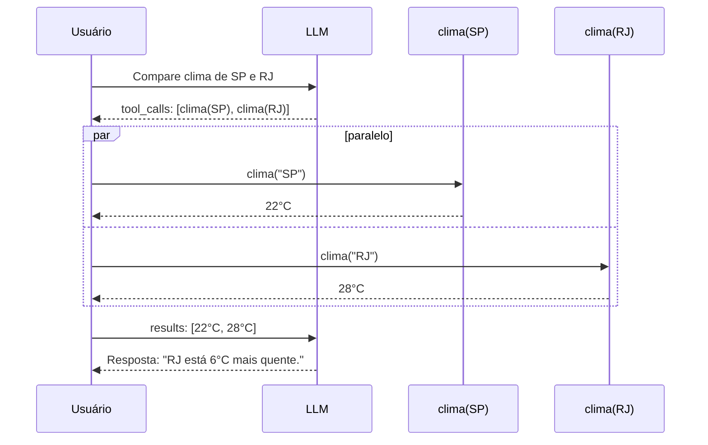

---

# 2.8 Quando usar LangChain?

LangChain é o framework mais popular para agentes em Python. Tem **prós e contras** importantes.

<div class="grid grid-cols-2 gap-4 mt-6">

<div class="p-4 rounded-xl bg-green-500/10 border border-green-500/30">
<div class="font-bold mb-2 text-green-300">✅ Use quando</div>
<ul class="text-sm">
<li>Você quer trocar de modelo facilmente</li>
<li>Precisa de integrações prontas (50+ vector DBs, 100+ loaders)</li>
<li>Está prototipando rápido</li>
<li>Time grande, padronização importa</li>
</ul>
</div>

<div class="p-4 rounded-xl bg-red-500/10 border border-red-500/30">
<div class="font-bold mb-2 text-red-300">❌ Evite quando</div>
<ul class="text-sm">
<li>Você só precisa de 2-3 chamadas simples</li>
<li>Performance/latência é crítica</li>
<li>Quer entender o que está acontecendo</li>
<li>Quer controle total do prompt</li>
</ul>
</div>

</div>

<div class="mt-6 p-3 rounded bg-amber-500/10 border border-amber-500/30 text-sm">
⚠️ <b>Crítica comum:</b> LangChain abstrai demais. Em 2024 a própria equipe criou o <b>LangGraph</b> como alternativa de menor nível, com controle explícito.
</div>

---

# Agente em LangChain — exemplo

<div class="mb-3 p-3 rounded bg-sky-500/10 border border-sky-500/30 text-sm">
📖 <b>Em palavras:</b> tudo o que fizemos "na unha" (loop + tools + prompt) vira <b>3 linhas</b>: declare as tools com <code>@tool</code>, monte o agente com <code>create_tool_calling_agent</code>, e rode com <code>executor.invoke()</code>. O framework esconde o loop, o parsing e o erro-handling. <b>Trade-off:</b> mais produtividade, menos visibilidade do que acontece por baixo.
</div>

```python
from langchain_openai import ChatOpenAI
from langchain.agents import AgentExecutor, create_tool_calling_agent
from langchain_core.tools import tool
from langchain_core.prompts import ChatPromptTemplate

@tool
def calculadora(expr: str) -> str:
    """Avalia expressão matemática."""
    return str(eval(expr, {"__builtins__": {}}, {}))

@tool
def busca(query: str) -> str:
    """Busca em base interna."""
    return {"capital do brasil": "Brasília"}.get(query.lower(), "Não encontrado")

llm = ChatOpenAI(model="gpt-4o-mini", temperature=0)
prompt = ChatPromptTemplate.from_messages([
    ("system", "Você é um agente útil. Use as ferramentas quando precisar."),
    ("user", "{input}"),
    ("placeholder", "{agent_scratchpad}"),
])
agent = create_tool_calling_agent(llm, [calculadora, busca], prompt)
executor = AgentExecutor(agent=agent, tools=[calculadora, busca], verbose=True)

print(executor.invoke({"input": "Qual a capital do Brasil e quanto é 47*13?"}))
```

---

# 2.9 LangGraph — state machines explícitas

📅 Lançado pela LangChain em 2024 como **antídoto** ao excesso de abstração.

**Ideia central:** seu agente é um **grafo de estados** que você desenha explicitamente.

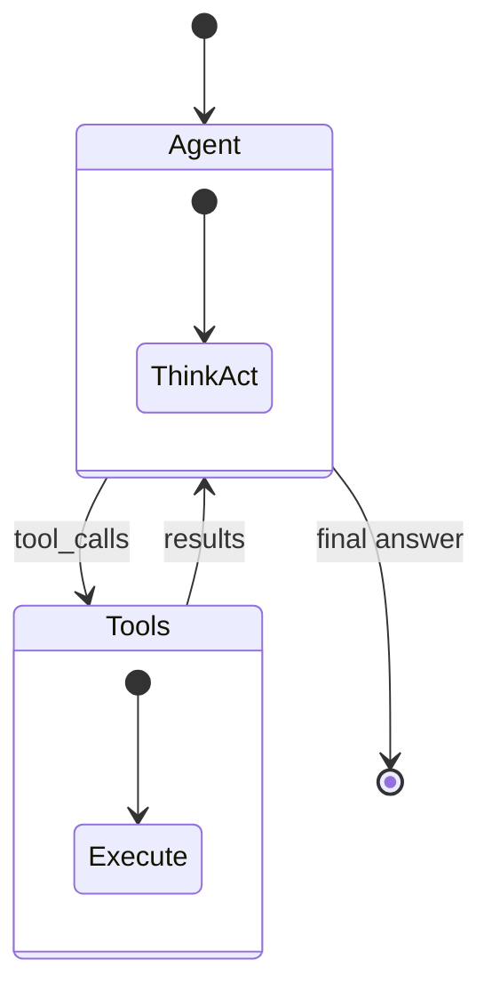

<div class="mt-4 text-sm">
Cada nó é uma função Python. Você controla <b>quando</b> ir para onde. Suporta loops, branches, paralelismo, checkpoints, human-in-the-loop.
</div>

---

# LangGraph — código mínimo

<div class="mb-3 p-3 rounded bg-sky-500/10 border border-sky-500/30 text-sm">
📖 <b>Em palavras:</b> você <b>desenha o agente como um diagrama</b>: tem um nó "agent" (que pensa) e um nó "tools" (que executa). Você diz "do agent, se tiver tool_call, vá pra tools; senão termine". O LangGraph cuida do estado entre os nós. Pense: <b>fluxograma executável</b>, não código procedural.
</div>

```python
from typing import Annotated, TypedDict
from langgraph.graph import StateGraph, END
from langgraph.graph.message import add_messages
from langchain_openai import ChatOpenAI
from langgraph.prebuilt import ToolNode, tools_condition

class State(TypedDict):
    messages: Annotated[list, add_messages]

llm = ChatOpenAI(model="gpt-4o-mini").bind_tools([calculadora, busca])

def agent_node(state: State):
    return {"messages": [llm.invoke(state["messages"])]}

graph = StateGraph(State)
graph.add_node("agent", agent_node)
graph.add_node("tools", ToolNode([calculadora, busca]))
graph.set_entry_point("agent")
graph.add_conditional_edges("agent", tools_condition)
graph.add_edge("tools", "agent")

app = graph.compile()
result = app.invoke({"messages": [("user", "Quanto é 17*23?")]})
print(result["messages"][-1].content)
```

---

# Por que LangGraph está dominando?

<div class="grid grid-cols-2 gap-4 mt-6">

<div class="p-4 rounded-xl bg-white/5">
<b>🔍 Visibilidade</b><br>
Você desenha o fluxo. Não há "mágica escondida".
</div>

<div class="p-4 rounded-xl bg-white/5">
<b>⏸️ Checkpoints</b><br>
Pausa, salva estado, retoma depois (até em outro processo).
</div>

<div class="p-4 rounded-xl bg-white/5">
<b>🧑‍💻 Human-in-the-loop</b><br>
Aprovação humana antes de tools sensíveis (mandar email, gastar $$).
</div>

<div class="p-4 rounded-xl bg-white/5">
<b>🌊 Streaming</b><br>
Streaming nativo de tokens e eventos para UI em tempo real.
</div>

<div class="p-4 rounded-xl bg-white/5">
<b>👥 Multi-agent</b><br>
Vários nós = vários agentes especializados se comunicando.
</div>

<div class="p-4 rounded-xl bg-white/5">
<b>🚀 Produção</b><br>
LangGraph Cloud, observabilidade nativa via LangSmith.
</div>

</div>

---

# 2.10 Decision tree: qual abordagem usar?

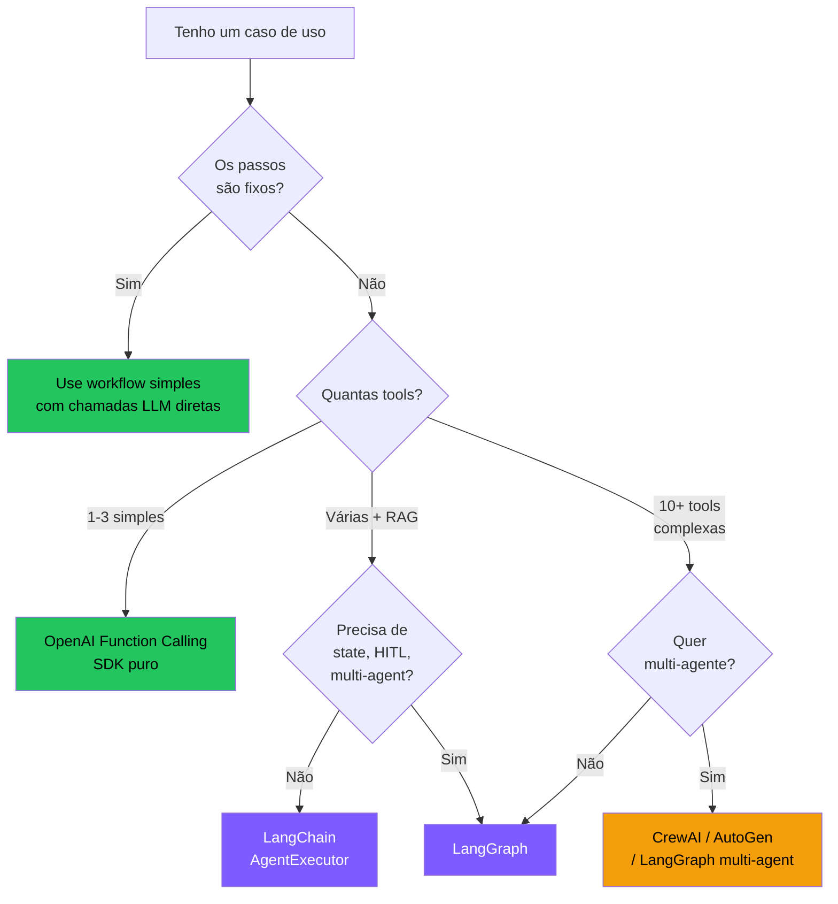

---
layout: section
---

# 🏋️ 2.11 Exercícios — Encontro 2

5 atividades · Aplique os conceitos de reasoning, planning e tool execution

---

# Exercício 2.1 · CoT vs Direct

<div class="p-5 rounded-xl bg-purple-500/10 border-2 border-purple-500/40">

**Tarefa:** com **gpt-4o-mini** (modelo pequeno, propenso a errar), teste 10 problemas de matemática de palavra (word problems).

**Compare:**
- Sem CoT: `"Resposta: ?"`
- Com CoT: `"Pense passo a passo. Resposta: ?"`

**Meça:**
- Acurácia (acertos / 10) em cada modo
- Latência média
- Tokens consumidos

**Pergunta de reflexão:** vale a pena pagar mais tokens por mais acurácia? Quando?

</div>

---

# Exercício 2.2 · Migre seu agente do Encontro 1

<div class="p-5 rounded-xl bg-purple-500/10 border-2 border-purple-500/40">

**Tarefa:** reescreva o agente do Encontro 1 usando **Function Calling estruturado** (sem regex).

**Requisitos:**
- 3 tools (calculadora, busca, hora_atual)
- Use JSON Schema apropriado para cada uma
- Loop com `max_steps`
- Imprima cada chamada de tool com seus argumentos

**Teste:** *"Que horas são, qual a capital da Austrália, e quanto é 99*99?"*

**Bônus:** ative paralelismo nativo — o agente deve resolver as 3 perguntas em **1 só turno** com 3 tool_calls.

</div>

---

# Exercício 2.3 · LangGraph básico

<div class="p-5 rounded-xl bg-purple-500/10 border-2 border-purple-500/40">

**Tarefa:** monte o mesmo agente em **LangGraph**, seguindo o exemplo dos slides.

**Adicione:**
- Um nó extra chamado `validator` que **roda DEPOIS do agent** mas **ANTES de finalizar**.
- O `validator` deve checar se a resposta final menciona números. Se sim, ok. Se não, manda de volta para o `agent` com a mensagem: *"Sua resposta não contém números — refine."*
- Limite de 3 iterações no total.

**O que isso ensina:** controle explícito do fluxo. Algo que é trivial em LangGraph e doloroso em LangChain puro.

</div>

---

# Exercício 2.4 · Plan-and-Execute na unha

<div class="p-5 rounded-xl bg-purple-500/10 border-2 border-purple-500/40">

**Tarefa:** implemente **Plan-and-Execute** sem framework. Estrutura:

```python
def planner(pergunta: str) -> list[str]:
    """Pede ao LLM para gerar uma lista de passos."""
    ...

def executor(passo: str, contexto: list[str]) -> str:
    """Executa 1 passo, podendo usar tools."""
    ...

def plan_and_execute(pergunta: str):
    plano = planner(pergunta)        # ex: ["buscar X", "calcular Y", "resumir"]
    resultados = []
    for passo in plano:
        resultados.append(executor(passo, resultados))
    return resultados[-1]
```

**Teste:** *"Compare o PIB do Brasil e da Argentina e diga em quantos % o do Brasil é maior."*

</div>

---

# Exercício 2.5 · Reflexão

<div class="p-5 rounded-xl bg-cyan-500/10 border-2 border-cyan-500/40">

Em **um parágrafo cada**:

1. Em que situação real (do seu trabalho/estudo) **Self-Consistency** valeria os 5× de custo?

2. Cite uma tarefa onde **Tree-of-Thoughts** seria justificado. E uma onde seria <b>exagero</b>.

3. Você prefere LangChain ou LangGraph para o seu próximo projeto? Por quê?

</div>

---
layout: center
class: text-center
---

---

---

# 🌐 Mercado de reasoning & frameworks (2024-2025)

<div class="grid grid-cols-2 gap-3 text-xs">

<div class="p-3 rounded-lg bg-purple-500/10 border border-purple-500/30">
<b>🧠 Reasoning models</b><br>
• <b>OpenAI o1, o3, o3-mini</b> (set/2024 – jan/2025)<br>
• <b>DeepSeek R1</b> (jan/2025) — open weights, abalou o mercado<br>
• <b>Claude Sonnet 4 Thinking</b> (mai/2025)<br>
• <b>Gemini 2.5 Pro Thinking</b><br>
• <b>Qwen QwQ</b>, <b>Kimi k1.5</b> (Moonshot)
</div>

<div class="p-3 rounded-lg bg-cyan-500/10 border border-cyan-500/30">
<b>🛠️ Frameworks de agente</b><br>
• <b>LangGraph</b> (LangChain) — grafo de estados<br>
• <b>OpenAI Agents SDK</b> (mar/2025)<br>
• <b>LlamaIndex AgentWorkflow</b><br>
• <b>Pydantic AI</b>, <b>Smolagents</b> (HF)<br>
• <b>CrewAI</b>, <b>AutoGen</b> (multi-agent)<br>
• <b>Mastra</b>, <b>Vercel AI SDK</b> (TS)
</div>

<div class="p-3 rounded-lg bg-green-500/10 border border-green-500/30">
<b>🧩 Padrões emergentes em produção</b><br>
• <b>Anthropic "Building effective agents"</b> (dez/2024) → 5 padrões adotados pelo mercado<br>
• <b>OpenAI Swarm → Agents SDK</b> handoffs<br>
• <b>LangGraph Supervisor</b> pattern<br>
• <b>MCP</b> (nov/2024) virou o padrão de tool calling
</div>

<div class="p-3 rounded-lg bg-amber-500/10 border border-amber-500/30">
<b>💸 Custos típicos por padrão (2025)</b><br>
• ReAct simples (5 turnos): <b>~$0,02</b><br>
• Reasoning model (o1) por query: <b>~$0,10–$1</b><br>
• Multi-agent (5 agentes, 20 turnos): <b>~$0,50</b><br>
• Deep Research run (OpenAI): <b>~$1–5</b>
</div>

</div>

<div class="mt-3 text-xs opacity-70 text-center">
Fontes: documentação oficial dos modelos, blogs Anthropic/OpenAI, repositórios públicos no GitHub.
</div>

---

# 📚 Referências públicas — Encontro 2

<div class="grid grid-cols-2 gap-3 text-xs mt-3">

<div class="p-3 rounded bg-purple-500/10 border border-purple-500/30">
<b>Reasoning & planning</b>
<ul class="mt-1">
<li>Wei et al. (2022) — <i>Chain-of-Thought Prompting</i> · <a href="https://arxiv.org/abs/2201.11903">arXiv:2201.11903</a></li>
<li>Wang et al. (2022) — <i>Self-Consistency Improves CoT</i> · <a href="https://arxiv.org/abs/2203.11171">arXiv:2203.11171</a></li>
<li>Yao et al. (2023) — <i>Tree of Thoughts</i> · <a href="https://arxiv.org/abs/2305.10601">arXiv:2305.10601</a></li>
<li>Xu et al. (2023) — <i>ReWOO</i> · <a href="https://arxiv.org/abs/2305.18323">arXiv:2305.18323</a></li>
<li>Shinn et al. (2023) — <i>Reflexion</i> · <a href="https://arxiv.org/abs/2303.11366">arXiv:2303.11366</a></li>
</ul>
</div>

<div class="p-3 rounded bg-cyan-500/10 border border-cyan-500/30">
<b>Reasoning models</b>
<ul class="mt-1">
<li>OpenAI (2024) — <i>Learning to Reason with LLMs (o1)</i> · <a href="https://openai.com/index/learning-to-reason-with-llms/">openai.com</a></li>
<li>DeepSeek-AI (2025) — <i>DeepSeek-R1</i> · <a href="https://arxiv.org/abs/2501.12948">arXiv:2501.12948</a></li>
<li>Snell et al. (2024) — <i>Scaling Test-Time Compute</i> · <a href="https://arxiv.org/abs/2408.03314">arXiv:2408.03314</a></li>
</ul>
</div>

<div class="p-3 rounded bg-green-500/10 border border-green-500/30">
<b>Padrões agentic</b>
<ul class="mt-1">
<li>Anthropic (2024) — <i>Building Effective Agents</i> · <a href="https://www.anthropic.com/research/building-effective-agents">anthropic.com/research</a> (fonte dos 5 padrões)</li>
<li>OpenAI (2024) — <i>Structured Outputs Guide</i> · <a href="https://platform.openai.com/docs/guides/structured-outputs">platform.openai.com</a></li>
<li>Pydantic AI Docs · <a href="https://ai.pydantic.dev/">ai.pydantic.dev</a></li>
</ul>
</div>

<div class="p-3 rounded bg-amber-500/10 border border-amber-500/30">
<b>Frameworks</b>
<ul class="mt-1">
<li>LangChain · <a href="https://python.langchain.com/">python.langchain.com</a></li>
<li>LangGraph · <a href="https://langchain-ai.github.io/langgraph/">langchain-ai.github.io/langgraph</a></li>
<li>Instructor (lib) · <a href="https://python.useinstructor.com/">python.useinstructor.com</a></li>
</ul>
</div>

</div>

<div class="mt-2 text-xs opacity-70">
Todo conteúdo deste encontro é de domínio público. Marcas mencionadas pertencem aos respectivos donos; uso exclusivamente educacional.
</div>

---

---

# 🔄 Recap — O que construímos no Encontro 2

<div class="grid grid-cols-2 gap-4 text-sm">

<div class="p-4 rounded-xl bg-purple-500/10 border border-purple-500/30">
<b>📜 Evolução que acompanhamos:</b>
<ul class="text-xs mt-2">
<li><b>2022:</b> Paper CoT (Wei et al.) — "pense passo a passo"</li>
<li><b>2023:</b> Function Calling (OpenAI) — JSON estruturado</li>
<li><b>2024:</b> Anthropic Patterns — workflows vs agentes</li>
<li><b>2024-25:</b> LangGraph, CrewAI — orquestração como grafo</li>
</ul>
</div>

<div class="p-4 rounded-xl bg-cyan-500/10 border border-cyan-500/30">
<b>🔧 O que você agora sabe fazer:</b>
<ul class="text-xs mt-2">
<li>Aplicar CoT, Self-Consistency, Tree-of-Thoughts</li>
<li>Implementar planning (Plan-and-Execute, ReWOO)</li>
<li>Usar Function Calling com schemas JSON</li>
<li>Escolher entre LangChain, LangGraph e SDK puro</li>
</ul>
</div>

<div class="p-4 rounded-xl bg-green-500/10 border border-green-500/30">
<b>🏢 Produtos que usam isso:</b>
<ul class="text-xs mt-2">
<li>ChatGPT — function calling + plugins</li>
<li>Cursor — planning antes de editar código</li>
<li>Devin — plan-and-execute multi-step</li>
</ul>
</div>

<div class="p-4 rounded-xl bg-amber-500/10 border border-amber-500/30">
<b>❓ Perguntas que ficaram abertas:</b>
<ul class="text-xs mt-2">
<li>E quando o histórico fica grande demais? (→ E3: Context)</li>
<li>Como dar "conhecimento" ao agente? (→ E3: RAG)</li>
<li>Como agentes colaboram? (→ E3: Multi-agentes)</li>
</ul>
</div>

</div>

---

# ✅ Fim do Encontro 2

Você agora sabe:

- Como melhorar reasoning (CoT, Self-Consistency, ToT)
- Estratégias de planning (Plan-and-Execute, ReWOO)
- Function calling robusto
- Quando usar LangChain vs LangGraph vs SDK puro

<div class="mt-12 text-xl text-cyan-400">
Próximo: <b>Encontro 3 — Skills, Memória & Contexto</b>
</div>

<div class="mt-4 text-sm opacity-60">
Onde o agente <i>aprende</i>, <i>lembra</i>, e <i>colabora</i>.
</div>
