# 🧠 Encontro 2
## Reasoning, Planning & Tool Execution

<div class="text-sm opacity-60 mt-4">3 horas · CoT, ToT, Planning, Function Calling, LangChain/LangGraph</div>

---
layout: center
class: text-center
---

# 💭 Onde paramos…

<div class="text-xl mt-6 opacity-90">
No Encontro 1, você construiu um agente funcional.<br>
Mas ele tinha um problema: <b>era impulsivo</b>.
</div>

<div class="mt-6 text-lg text-amber-400">
Agia sem pensar. Escolhia ferramentas erradas. Não planejava.
</div>

<div class="mt-8 text-sm opacity-60">
Hoje vamos ensiná-lo a <b>raciocinar</b> antes de agir — e a usar ferramentas de forma <b>robusta</b>.
</div>

---

# 🧪 A jornada — Nível 2: com Reasoning + Tools
<div class="p-3 rounded bg-zinc-800 border border-zinc-700 text-xs font-mono mb-2">
<span class="text-green-400">user:</span> Planeja uma viagem de 3 dias para Porto Alegre com R$2000<br><br>
<span class="text-yellow-400">thought:</span> Preciso decompor e buscar preços reais.<br>
<span class="text-blue-400">action:</span> buscar_hoteis("Porto Alegre", checkin="2025-03-01", budget=600)<br>
<span class="text-gray-400">observation:</span> Ibis Styles Centro: R$189/noite ✓ | Laghetto: R$280/noite<br>
<span class="text-yellow-400">thought:</span> 3×189=567. Sobram R$1433 para comida e passeios.<br>
<span class="text-blue-400">action:</span> buscar_restaurantes("Porto Alegre", tipo="gaúcho")<br>
<span class="text-gray-400">observation:</span> Barranco ($$), CTG Farroupilha ($), Na Brasa ($$$)
</div>
<div class="grid grid-cols-3 gap-2 text-xs">
<div class="p-2 rounded bg-green-500/10 border border-green-500/30 text-center"><b>✅ Preços reais</b></div>
<div class="p-2 rounded bg-green-500/10 border border-green-500/30 text-center"><b>✅ Raciocínio visível</b></div>
<div class="p-2 rounded bg-amber-500/10 border border-amber-500/30 text-center"><b>⚠️ Sem memória</b></div>
</div>
<div class="mt-2 text-xs text-center opacity-70">Agora o agente pensa e usa ferramentas — mas ainda não lembra suas preferências.</div>

---

# 🗺️ Agenda do Encontro 2 — a jornada de hoje

<div class="mb-3 p-3 rounded-lg bg-blue-500/10 border border-blue-500/30 text-sm">
Vamos transformar o agente do Encontro 1 em um agente que <b>decide melhor</b>, <b>age com contratos</b> e <b>é observável o suficiente para produção</b>.
</div>

<div class="grid grid-cols-2 gap-4 mt-3 text-sm">

<div>

**Bloco 1 — Pensar melhor (~90 min)**
- 2.1 Recap: limites do ReAct manual
- 2.2 Chain-of-Thought (CoT)
- 2.3 Self-Consistency, ToT e Reflexion
- 2.4 Padrões agentic da Anthropic
- 2.5 Planning: Plan-and-Execute, ReWOO, replanning

</div>

<div>

**Bloco 2 — Agir com precisão (~90 min)**
- 2.6 Function Calling estruturado
- 2.7 Tool loop robusto + parallel calls
- 2.8 Frameworks: SDK puro, LangChain, LangGraph
- 2.9 Boas práticas, riscos e custos
- 2.10 Exercícios guiados + PyRunner

</div>

</div>

<div class="mt-3 p-3 rounded-lg bg-green-500/10 border border-green-500/30 text-xs text-center">
<b>Produto da aula:</b> uma checklist para escolher entre prompt simples, workflow, agente com tools, planner e grafo de estado.
</div>

---

# 🧭 Vocabulário do dia — em 1 frase cada

Antes de mergulhar, os termos novos que você vai ouvir hoje:

<div class="grid grid-cols-1 gap-2 text-sm mt-3">

<div class="p-3 rounded-lg bg-purple-500/10 border border-purple-500/30">
<b>🧠 Reasoning model</b> — modelo que "pensa em voz alta" antes de responder. <i>Ex: o1, o3, DeepSeek R1.</i> Pague mais, espere mais, ganhe respostas melhores em problemas complexos.
</div>

<div class="p-3 rounded-lg bg-cyan-500/10 border border-cyan-500/30">
<b>🪜 Chain-of-Thought (CoT)</b> — pedir explicitamente: <i>"explique seu raciocínio passo a passo"</i>. Truque simples, ganho gigante em matemática e lógica.
</div>

<div class="p-3 rounded-lg bg-green-500/10 border border-green-500/30">
<b>📋 Planning</b> — em vez de decidir um passo de cada vez, o agente faz um <b>plano completo primeiro</b>. Como escrever o roteiro antes de filmar.
</div>

<div class="p-3 rounded-lg bg-amber-500/10 border border-amber-500/30">
<b>🔁 Reflexion</b> — agente <b>critica a própria resposta</b> e tenta de novo se não estiver bom. Como reler seu texto antes de enviar.
</div>

<div class="p-3 rounded-lg bg-pink-500/10 border border-pink-500/30">
<b>📦 Structured output</b> — forçar o LLM a responder em formato fixo (ex: JSON), não em texto livre. Essencial para integração com sistemas.
</div>

<div class="p-3 rounded-lg bg-blue-500/10 border border-blue-500/30">
<b>🛠️ Framework</b> — biblioteca pronta que esconde a "encanação" do agente. <i>Ex: LangGraph, LlamaIndex.</i> Como usar Django em vez de escrever um servidor HTTP do zero.
</div>

</div>

---

# 🧩 Onde você já viu isso

<div class="grid grid-cols-2 gap-2 text-xs">
<div class="p-2 rounded-lg bg-purple-500/10 border border-purple-500/30"><b>🧠 Reasoning models em produto</b><br>• ChatGPT com <b>o1/o3</b> mostra "thinking..." antes da resposta<br>• <b>Cursor</b> ativa "Reasoning mode" em refatorações grandes</div>
<div class="p-2 rounded-lg bg-cyan-500/10 border border-cyan-500/30"><b>🪜 CoT no cotidiano</b><br>• Adicionar <i>"explique passo a passo"</i> ao prompt já é CoT<br>• Wolfram Alpha exibe os passos pela mesma lógica</div>
<div class="p-2 rounded-lg bg-green-500/10 border border-green-500/30"><b>📋 Planning em produto</b><br>• <b>Devin / Cognition</b> mostra um plano com checkboxes antes de codar<br>• <b>Manus / OpenAI Operator</b> planeja a sequência de ações antes de executar</div>
<div class="p-2 rounded-lg bg-amber-500/10 border border-amber-500/30"><b>🔁 Reflexion em produto</b><br>• <b>Cursor</b> gera código, roda testes e ajusta se falhar<br>• <b>Perplexity Pro Search</b> refina a busca se a 1ª tentativa vier ruim</div>
</div>
<div class="mt-2 text-xs opacity-70 text-center">Em 2025, quase todo produto agentic combina <b>2 ou 3</b> dessas técnicas.</div>

---

# 🧭 Mapa mental — Encontro 2 em perspectiva

<div class="text-sm mb-3">A aula fica mais fácil quando você separa <b>pensar melhor</b> de <b>agir com precisão</b>. O agente moderno precisa dos dois.</div>

<div class="grid grid-cols-2 gap-3 text-xs">
<div class="p-3 rounded-xl bg-purple-500/10 border border-purple-500/30">
<div class="font-bold text-purple-200 mb-2">🧠 Pilar 1 — Reasoning & Planning</div>
<div class="leading-snug"><b>CoT</b>: explicitar passos<br><b>Self-Consistency</b>: várias tentativas + voto<br><b>ToT</b>: explorar alternativas<br><b>Reflexion</b>: criticar e tentar de novo<br><b>Planning</b>: plano antes de agir</div>
<div class="mt-2 pt-2 border-t border-white/10 opacity-80"><b>Objetivo:</b> decidir melhor antes de gastar tool/custo.</div>
</div>
<div class="p-3 rounded-xl bg-cyan-500/10 border border-cyan-500/30">
<div class="font-bold text-cyan-200 mb-2">🛠️ Pilar 2 — Tool Execution</div>
<div class="leading-snug"><b>Function Calling</b>: ferramentas com schema<br><b>Structured Output</b>: resposta tipada<br><b>Anthropic patterns</b>: chaining, routing, workers<br><b>LangChain</b>: abstração rápida<br><b>LangGraph</b>: estado explícito</div>
<div class="mt-2 pt-2 border-t border-white/10 opacity-80"><b>Objetivo:</b> agir de forma validável e recuperável.</div>
</div>
</div>

<div class="grid grid-cols-3 gap-2 text-xs mt-3">
<div class="p-2 rounded bg-green-500/10 border border-green-500/30 text-center"><b>Comece aqui</b><br>CoT + Function Calling</div>
<div class="p-2 rounded bg-amber-500/10 border border-amber-500/30 text-center"><b>Quando crescer</b><br>Planning + Structured Output</div>
<div class="p-2 rounded bg-red-500/10 border border-red-500/30 text-center"><b>Produção</b><br>LangGraph + avaliação + HITL</div>
</div>

<div class="mt-3 p-2 rounded-lg bg-blue-500/10 border border-blue-500/30 text-xs text-center"><b>Fio condutor:</b> reasoning sem tools vira resposta bonita; tools sem reasoning viram automação cega.</div>

---

# 🧪 Caso condutor — assistente de viagem corporativa

<div class="mb-3 text-sm">Para evitar uma aula abstrata, vamos usar o mesmo caso mental ao longo do encontro:</div>

<div class="grid grid-cols-2 gap-3 text-xs">
<div class="p-3 rounded-xl bg-purple-500/10 border border-purple-500/30">
<b>Pedido do usuário</b><br>
“Planeje uma viagem de 3 dias para Porto Alegre com orçamento de R$ 2.000, perto do centro, com justificativa de custos.”
</div>
<div class="p-3 rounded-xl bg-red-500/10 border border-red-500/30">
<b>Por que é difícil?</b><br>
Precisa decompor tarefa, buscar dados, comparar alternativas, respeitar orçamento, citar evidências e não comprar nada sem aprovação.
</div>
<div class="p-3 rounded-xl bg-cyan-500/10 border border-cyan-500/30">
<b>Reasoning resolve</b><br>
CoT, Self-Consistency, ToT e Planning ajudam a escolher a rota: o que buscar, em que ordem, quando replanejar e como justificar.
</div>
<div class="p-3 rounded-xl bg-green-500/10 border border-green-500/30">
<b>Tool execution resolve</b><br>
Function Calling, schemas, logs, max_steps e LangGraph transformam intenção em ação controlada e auditável.
</div>
</div>

<div class="mt-3 p-2 rounded-lg bg-amber-500/10 border border-amber-500/30 text-xs text-center">
Use este caso como régua: cada técnica nova precisa responder <b>qual falha ela reduz</b>.
</div>

---

# 2.1 Recap: por que o ReAct manual falha?

<div class="text-sm mb-3">No Encontro 1 o agente funcionava porque o mundo era controlado. Em produção, a resposta do LLM vira <b>entrada de outro sistema</b> — e texto livre quebra.</div>

<div class="grid grid-cols-3 gap-3 text-xs">
<div class="p-3 rounded-xl bg-red-500/10 border border-red-500/30">
<div class="font-bold text-red-200 mb-2 text-sm">1. Parser frágil</div>
<div class="font-mono leading-snug">Action: buscar("SP")<br>Action Input: São Paulo</div>
<div class="mt-2 opacity-80">Uma vírgula, aspas diferentes ou texto extra já quebram o <code>re.search</code>.</div>
</div>
<div class="p-3 rounded-xl bg-amber-500/10 border border-amber-500/30">
<div class="font-bold text-amber-200 mb-2 text-sm">2. Sem contrato</div>
<div class="font-mono leading-snug">Action: pesquisar_web<br>Action: busca<br>Action: google</div>
<div class="mt-2 opacity-80">O modelo pode inventar nome de tool, omitir campo ou mandar argumento no tipo errado.</div>
</div>
<div class="p-3 rounded-xl bg-cyan-500/10 border border-cyan-500/30">
<div class="font-bold text-cyan-200 mb-2 text-sm">3. Difícil recuperar</div>
<div class="font-mono leading-snug">Erro → prompt maior<br>Erro → regex maior<br>Erro → mais exceções</div>
<div class="mt-2 opacity-80">Você conserta sintomas, mas não cria validação, retry nem observabilidade.</div>
</div>
</div>

<div class="mt-3 p-3 rounded-xl bg-green-500/10 border border-green-500/30 text-sm text-center"><b>Virada do Encontro 2:</b> saímos de “parsear texto do modelo” para <b>contratos explícitos</b>: reasoning melhor + Function Calling + Structured Outputs.</div>

---
layout: center
class: text-center
---

# 🧠 Parte 1: Ensinando a pensar

<div class="text-lg mt-6 opacity-80">
O segredo mais simples da IA: pedir ao modelo para <b>mostrar os passos</b><br>
já melhora a performance em <b>20-40%</b>.
</div>

<div class="mt-6 text-sm opacity-60">
Vamos ver 4 técnicas, da mais simples à mais sofisticada.
</div>

---

# 2.2 Chain-of-Thought (CoT)

<div class="grid grid-cols-3 gap-2 text-xs mb-3">
<div class="p-2 rounded bg-purple-500/10 border border-purple-500/30"><b>📄 Origem</b><br>Wei et al. (2022): prompts com passos intermediários melhoram tarefas de raciocínio.</div>
<div class="p-2 rounded bg-cyan-500/10 border border-cyan-500/30"><b>🪄 Zero-shot</b><br>Kojima et al. (2022): “Let's think step by step” já ajuda sem exemplos.</div>
<div class="p-2 rounded bg-amber-500/10 border border-amber-500/30"><b>⚠️ Cuidado</b><br>Mais tokens e nem sempre mais verdade. Use quando há cálculo, lógica ou decisão multi-etapa.</div>
</div>

<div class="grid grid-cols-2 gap-3 text-xs">
<div class="p-3 rounded-xl bg-red-500/10 border border-red-500/30">
<div class="font-bold text-red-200 mb-2">❌ Resposta direta</div>
<div class="font-mono leading-snug">P: Maria tem 5 maçãs, dá 2 e compra 6. Quantas tem?<br><br>R: <b>11</b></div>
<div class="mt-2 opacity-80">O modelo pulou o estado intermediário: 5 - 2.</div>
</div>
<div class="p-3 rounded-xl bg-green-500/10 border border-green-500/30">
<div class="font-bold text-green-200 mb-2">✅ Com Chain-of-Thought</div>
<div class="font-mono leading-snug">1. Começa com 5<br>2. Dá 2 → fica com 3<br>3. Compra 6 → 3 + 6 = <b>9</b></div>
<div class="mt-2 opacity-80">O raciocínio cria checkpoints verificáveis.</div>
</div>
</div>

<div class="mt-3 p-2 rounded-lg bg-blue-500/10 border border-blue-500/30 text-xs text-center"><b>Regra prática:</b> CoT não é “pensar bonito”; é criar uma trilha que o humano, o teste ou outro modelo consegue auditar.</div>

---

# CoT em código

```python
# Sem CoT
prompt_simples = "Quanto é 17 * 23 + 41?"

# CoT zero-shot
prompt_cot = """Quanto é 17 * 23 + 41?

Pense passo a passo antes de dar a resposta final."""

# CoT few-shot (mostre exemplos)
prompt_few_shot = """Resolva os problemas mostrando o passo a passo.

P: Quanto é 5 * 4 + 2?
R: 5*4 = 20. 20+2 = 22. Resposta: 22.

P: Quanto é 17 * 23 + 41?
R:"""
```

<div class="mt-4 p-3 rounded bg-amber-500/10 border border-amber-500/30 text-sm">
💡 <b>Para agentes:</b> o "Thought" do ReAct <b>é</b> CoT aplicado. Cada Thought é uma cadeia de raciocínio antes de cada Action.
</div>

---

# 2.3 Self-Consistency

📄 **Wang et al., 2022**
A ideia: gere **N respostas** com temperatura > 0 e use **votação majoritária**.

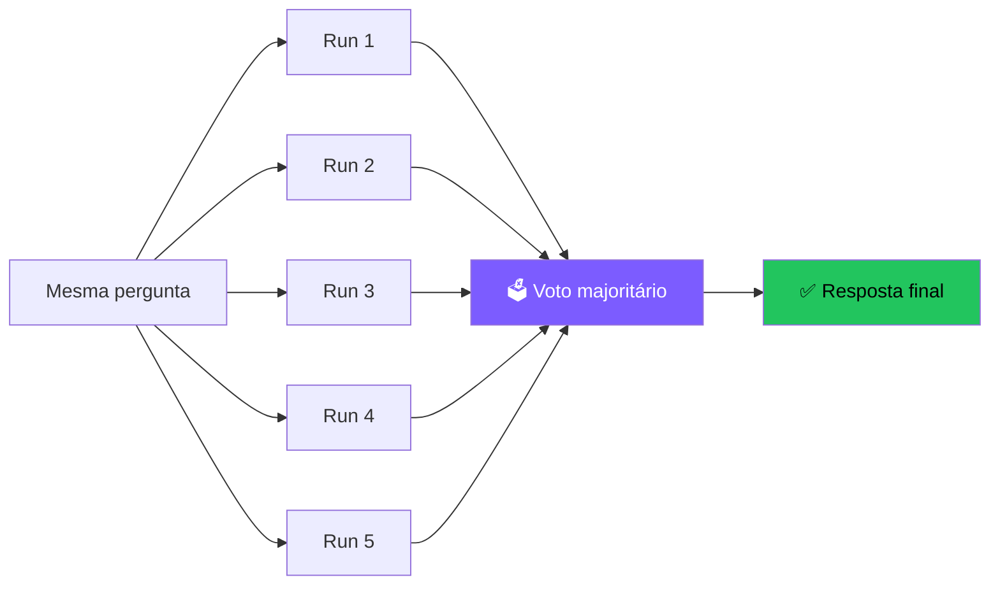

<div class="mt-3 text-xs"><b>Trade-off:</b> 5× mais caro e lento, mas pode subir acurácia em ~10–20% em problemas complexos.<br><b>Quando usar:</b> tarefas com resposta "certa" (matemática, código).</div>

---

# 2.4 Tree-of-Thoughts (ToT)

📄 **Yao et al., 2023**
Em vez de uma única cadeia, **explore múltiplas** em árvore, avalie e poda.

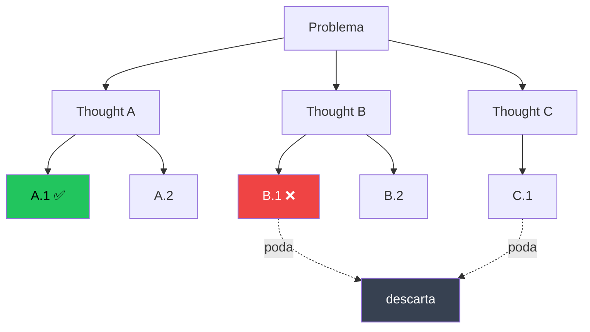

<div class="mt-3 text-xs">Inspirado em busca clássica (BFS/DFS). Útil quando há múltiplos caminhos válidos.<br><b>Trade-off:</b> exponencialmente mais caro; use só quando CoT/Self-Consistency não bastam.</div>

---

# Comparativo das estratégias de reasoning

| Estratégia | Custo | Acurácia | Quando usar |
|---|---|---|---|
| **Direct** (sem CoT) | 💰 | ⭐ | Tarefas triviais, classificação |
| **CoT (zero-shot)** | 💰 | ⭐⭐⭐ | Default — quase sempre vale a pena |
| **CoT (few-shot)** | 💰💰 | ⭐⭐⭐⭐ | Tarefas com padrão claro |
| **Self-Consistency** | 💰💰💰 | ⭐⭐⭐⭐ | Há uma "resposta certa" |
| **Tree-of-Thoughts** | 💰💰💰💰💰 | ⭐⭐⭐⭐⭐ | Problemas complexos, exploratórios |
| **o1 / DeepSeek-R1** | 💰💰💰💰 | ⭐⭐⭐⭐⭐ | Reasoning treinado nativamente |

<div class="mt-4 p-3 rounded bg-cyan-500/10 border border-cyan-500/30 text-sm">
🎯 <b>Regra prática:</b> comece com CoT. Suba a escala só se medir melhoria real.
</div>

---

# 📈 Reasoning melhora resultados — evidência
```mermaid {scale: 0.55}
xychart-beta
    title "Acurácia com e sem Chain-of-Thought (%)"
    x-axis ["GSM8K", "MATH", "MMLU", "ARC", "StrategyQA"]
    y-axis "%" 0 --> 100
    bar [56, 34, 70, 75, 65]
    bar [78, 58, 82, 88, 81]
```
<div class="mt-2 text-xs text-center opacity-70">🟦 Sem CoT &nbsp;&nbsp; 🟩 Com CoT — dados aproximados GPT-4 class models</div>
<div class="mt-2 p-2 rounded bg-cyan-500/10 border border-cyan-500/30 text-sm">💡 CoT dá ganhos de <b>+15 a +25 pontos percentuais</b> em tarefas de raciocínio.</div>

---

# 🧠 Reasoning Models — o paradigma novo (2024+)

📅 OpenAI **o1** (set/2024), **o3** (dez/2024), DeepSeek **R1** (jan/2025), Anthropic **extended thinking** (2025).
<div class="mt-3 p-3 rounded-xl bg-cyan-500/10 border-2 border-cyan-500/40 text-sm text-center">Em vez de "pensar via prompt", o modelo é <b>treinado via RL</b> para <b>pensar muito antes de responder</b> — gerando milhares de tokens internos invisíveis.</div>
<div class="mt-4 grid grid-cols-2 gap-3 text-xs">
<div class="p-2 rounded bg-purple-500/10 border border-purple-500/30"><b>Modelos clássicos</b><br>Reasoning emergente via prompt (CoT). Latência típica: ~1s.</div>
<div class="p-2 rounded bg-green-500/10 border border-green-500/30"><b>Reasoning models</b><br>Reasoning treinado; o modelo "pensa" 5–60s; matemática/código podem ganhar <b>+30–50%</b>.</div>
</div>
<div class="mt-3 p-2 rounded bg-amber-500/10 border border-amber-500/30 text-xs">⚠️ <b>Trade-offs:</b> 5–10× mais caro e 10–100× mais lento. Use para matemática, prova de teoremas, código complexo e planning multi-step — não para chat casual.</div>

---

# Reasoning models — como mudam o design do agente

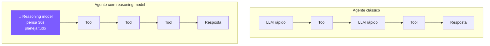

<div class="mt-4 text-sm">
<b>Padrão emergente:</b> use o1/R1 como <b>planner</b> (1 chamada cara, pensa muito), depois delegue execução para modelos rápidos/baratos (Haiku, GPT-4o-mini).<br>
→ Custo total <b>menor</b> e acurácia <b>maior</b>.
</div>

---

# 🪞 Self-Reflection & Reflexion

📄 **Shinn et al., 2023** — *"Reflexion: Language Agents with Verbal Reinforcement Learning"*

A ideia: depois de tentar uma tarefa, o agente **critica seu próprio output** e tenta de novo com a crítica no contexto.

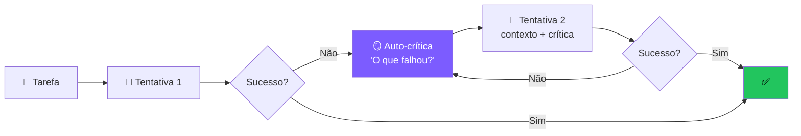

<div class="mt-3 text-sm">
Melhora performance em <b>20-30%</b> em benchmarks como HumanEval e ALFWorld, sem retreinar nada.
</div>

---

# Self-Reflection em código

<div class="mb-2 p-2 rounded bg-sky-500/10 border border-sky-500/30 text-xs">
📖 <b>Em palavras (sem ler código):</b> o agente <b>tenta resolver</b>, depois <b>se critica</b> ("isso de fato responde a pergunta?"), e se a crítica disser que não, ele <b>tenta de novo</b> levando a crítica em consideração. Repete até dar certo ou bater o limite de tentativas.
</div>

```python
def agent_with_reflection(tarefa: str, max_tries: int = 3):
    historico = []
    for _ in range(max_tries):
        contexto = f"Tarefa: {tarefa}\n"
        if historico:
            contexto += f"Tentativas anteriores e críticas:\n{historico}\n"
        resposta = llm.invoke(contexto + "Sua resposta:")
        critica_raw = llm.invoke(f"""
        Tarefa original: {tarefa}
        Resposta proposta: {resposta}
        A resposta resolve a tarefa? Aponte erros específicos.
        Responda em JSON: {{"ok": bool, "criticas": [str]}}
        """)
```

---

# Self-Reflection em código — continuação

```python
        critica = json.loads(critica_raw)
        if critica["ok"]:
            return resposta
        historico.append({
            "tentativa": resposta,
            "criticas": critica["criticas"],
        })

    return resposta  # devolve melhor esforço
```

<div class="mt-2 p-2 rounded bg-amber-500/10 border border-amber-500/30 text-xs">
⚠️ <b>Cuidado:</b> usar o <b>mesmo modelo</b> pra gerar e criticar tem viés (overconfidence). Idealmente, use um modelo diferente — ou um <b>maior</b> — como crítico.
</div>

---

# 📐 Structured Outputs

<div class="mb-3 p-3 rounded-lg bg-blue-500/10 border border-blue-500/30 text-sm">
O problema não é “o modelo escrever bonito”. O problema é: <b>outro sistema precisa consumir a resposta sem adivinhar formato</b>.
</div>

<div class="grid grid-cols-3 gap-3 text-xs">
<div class="p-3 rounded-xl bg-red-500/10 border border-red-500/30"><b>1. Texto livre quebra automação</b><br>“João tem 30 anos” parece correto para humanos, mas para código vira regex frágil: acento, ordem, campo faltando e frase extra quebram o parser.</div>
<div class="p-3 rounded-xl bg-purple-500/10 border border-purple-500/30"><b>2. Schema vira contrato</b><br>Você define <code>nome: str</code>, <code>idade: int</code>, <code>prioridade: 1..5</code>. O LLM precisa preencher exatamente esse contrato.</div>
<div class="p-3 rounded-xl bg-green-500/10 border border-green-500/30"><b>3. Falha fica tratável</b><br>Se vier inválido, a aplicação sabe: rejeita, pede retry, manda para humano ou registra erro. Isso é produção.</div>
</div>

```python
class Pessoa(BaseModel):
    nome: str
    idade: int

pessoa = llm.with_structured_output(Pessoa).invoke("Extraia nome e idade")
# Pessoa(nome="João", idade=30)  → pronto para DB, API ou fila
```

<div class="mt-2 text-xs opacity-80">Nativo em <b>OpenAI Structured Outputs</b>, <b>Anthropic tool use</b> e <b>Gemini</b>. No Python, <b>Pydantic AI</b> e <b>Instructor</b> popularizaram esse padrão.</div>

---

# Pydantic AI — framework type-safe

<div class="mb-2 p-2 rounded bg-sky-500/10 border border-sky-500/30 text-xs">📖 <b>Em palavras:</b> você descreve a forma do resultado e o framework devolve um objeto Python validado, pronto para DBs, filas e APIs — sem torcer para o JSON vir certo.</div>

```python
from pydantic import BaseModel; from pydantic_ai import Agent

class Ticket(BaseModel):
    titulo: str; prioridade: int; departamento: str; requer_resposta_imediata: bool

agent = Agent("openai:gpt-4o-mini", result_type=Ticket,
              system_prompt="Você classifica tickets de suporte.")
ticket = agent.run_sync("Cliente diz que servidor caiu, perdemos R$ 10k/h").data
print(ticket.prioridade, ticket.requer_resposta_imediata)  # 5 True
```

<div class="mt-3 p-2 rounded bg-cyan-500/10 border border-cyan-500/30 text-xs">🎯 <b>Por que importa:</b> agentes em produção alimentam <b>outros sistemas</b>. Com schema, você troca parsing defensivo por validação explícita.</div>

---
layout: section
---

# 🏗️ Os 5 padrões agentic da Anthropic

<div class="text-sm opacity-60 mt-4">A referência da indústria · <i>"Building Effective Agents"</i> (Anthropic, 2024)</div>

<div class="mt-6 text-sm opacity-80">
Até agora vimos como o LLM <b>pensa</b>. Agora vamos ver como <b>organizar a execução</b> — os padrões que as melhores equipes usam.
</div>

---

# Os 5 padrões — visão geral

<div class="grid grid-cols-1 gap-3 text-sm mt-4">

<div class="p-3 rounded bg-purple-500/10 border border-purple-500/30">
<b>1. ⛓️ Prompt Chaining</b> — passos fixos, output de um vira input do próximo. Simples e previsível.
</div>

<div class="p-3 rounded bg-purple-500/10 border border-purple-500/30">
<b>2. 🔀 Routing</b> — um classificador decide qual prompt/modelo especializado usar.
</div>

<div class="p-3 rounded bg-purple-500/10 border border-purple-500/30">
<b>3. ⚡ Parallelization</b> — tarefas independentes rodam em paralelo, depois agrega.
</div>

<div class="p-3 rounded bg-purple-500/10 border border-purple-500/30">
<b>4. 🧑‍💼 Orchestrator-Workers</b> — orquestrador dinâmico decompõe e delega para workers.
</div>

<div class="p-3 rounded bg-purple-500/10 border border-purple-500/30">
<b>5. 🪞 Evaluator-Optimizer</b> — gerador propõe, avaliador critica, em loop.
</div>

<div class="mt-3 p-3 rounded bg-cyan-500/10 border border-cyan-500/30 text-sm">
🎯 <b>Lição central:</b> a maioria dos "agentes" de sucesso são <b>combinações</b> desses 5 padrões — não loops autônomos puros.
</div>

</div>

---

# Padrão 1 · Prompt Chaining

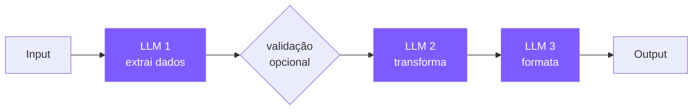

<div class="mt-4 text-sm">
<b>Quando usar:</b> tarefas com decomposição natural e <b>passos fixos</b>.<br>
<b>Exemplo:</b> "extrair dados → traduzir → resumir em bullet points"<br>
<b>Trade-off:</b> mais latência (sequencial), mas qualidade muito maior que 1 prompt monolítico.
</div>

---

# Padrão 2 · Routing

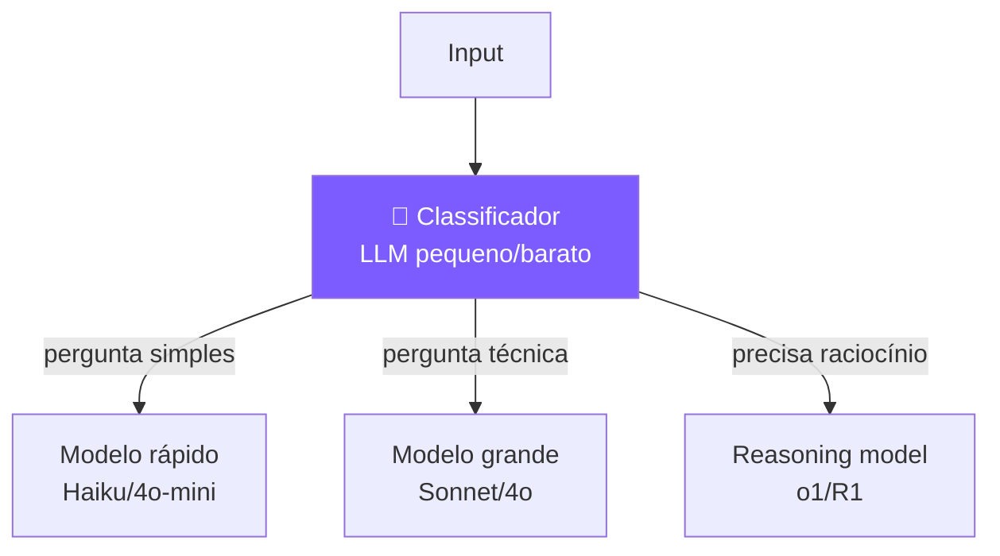

<div class="mt-4 text-sm">
<b>Quando usar:</b> diferentes tipos de input merecem diferentes tratamentos.<br>
<b>Vantagem prática:</b> economia gigante. 80% das queries vão pro modelo barato.
</div>

---

# Padrão 3 · Parallelization

<div class="grid grid-cols-2 gap-3 mt-3 text-xs">
<div class="p-2 rounded-lg bg-purple-500/10 border border-purple-500/30"><b>3a. Sectioning</b><br>Divide a tarefa em partes independentes.<br><span class="opacity-80">Ex: classificar e-mail + checar tom + extrair entidades.</span></div>
<div class="p-2 rounded-lg bg-cyan-500/10 border border-cyan-500/30"><b>3b. Voting</b><br>Gera várias respostas e escolhe por voto.<br><span class="opacity-80">Ex: 3 code reviews; só commita se 2/3 aprovam.</span></div>
</div>
<div class="mt-3 p-2 rounded bg-amber-500/10 border border-amber-500/30 text-xs"><b>Quando usar:</b> subtarefas que não dependem umas das outras. Ganho principal: <b>latência menor</b>; trade-off: precisa agregar os resultados no final.</div>

---

# Padrão 3 · Parallelization — sectioning

<div class="text-xs mb-2">Mesma tarefa, partes independentes, merge no final.</div>

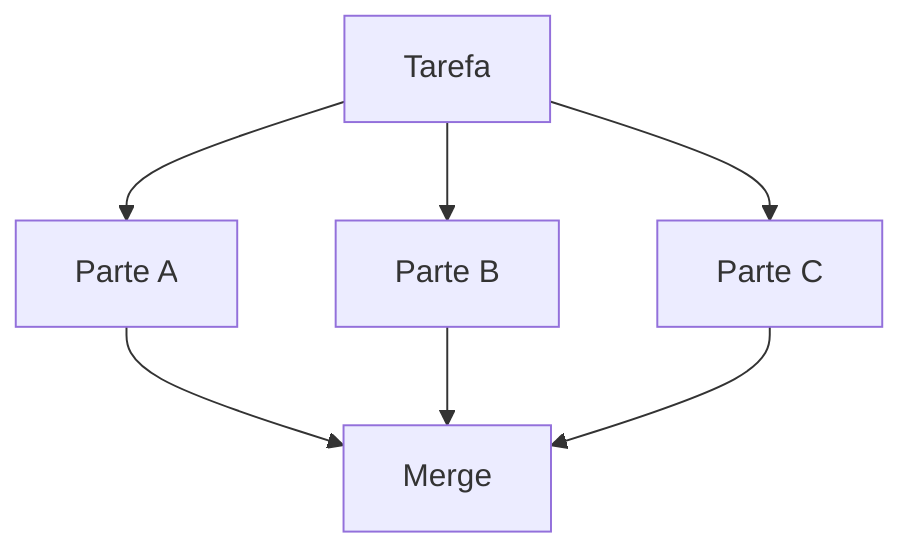

---

# Padrão 3 · Parallelization — voting

<div class="text-xs mb-2">Mesma pergunta, várias respostas, decisão por maioria.</div>

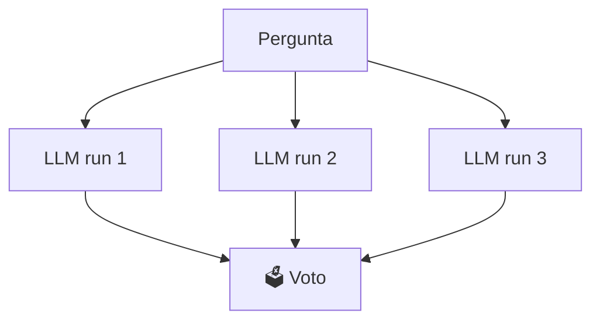

---

# Padrão 4 · Orchestrator-Workers

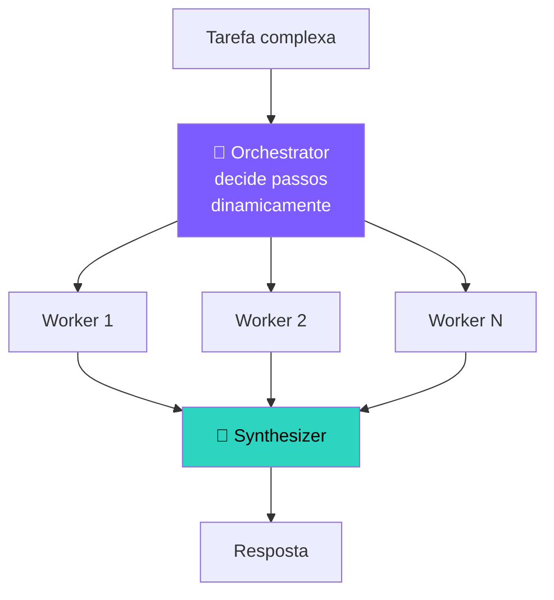

<div class="mt-4 text-sm">
<b>Diferença vs Parallelization:</b> aqui o orquestrador <b>decide quantos e quais workers</b> usar baseado na tarefa. É dinâmico.<br>
<b>Exemplo:</b> Claude Code lendo um repo gigante — orquestrador decide ler 3 arquivos, depois 5, depois 1.
</div>

---

# Padrão 5 · Evaluator-Optimizer

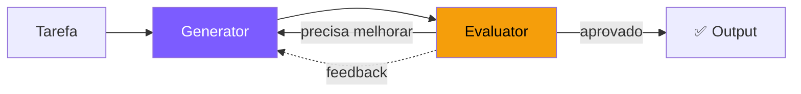

<div class="mt-4 text-sm">
Variante avançada do <b>Self-Reflection</b>, mas com agentes/prompts <b>separados</b> para gerar e avaliar.<br>
<b>Casos clássicos:</b> tradução literária (gerar → revisar → refinar), redação técnica, geração de código com testes.
</div>

---

# Decision tree: qual padrão usar?

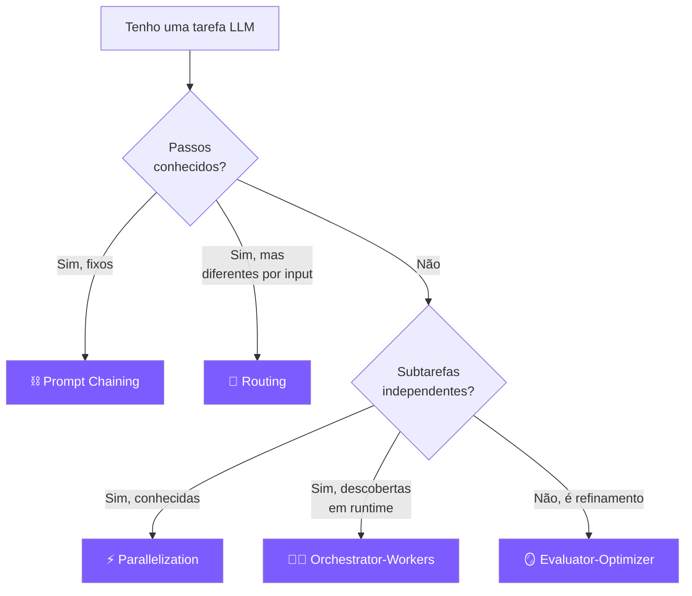

---

# Checkpoint — dos padrões para planejamento

<div class="grid grid-cols-2 gap-3 text-xs">
<div class="p-3 rounded-xl bg-purple-500/10 border border-purple-500/30">
<b>O que aprendemos até aqui</b><br>
CoT melhora uma resposta; Self-Consistency compara várias; ToT explora caminhos; Reflexion revisa; os 5 padrões organizam workflows previsíveis.
</div>
<div class="p-3 rounded-xl bg-cyan-500/10 border border-cyan-500/30">
<b>O problema que ainda falta</b><br>
Quando a tarefa tem dependências, tools caras, dados incertos e risco, o agente precisa decidir <b>uma rota de execução</b> antes de gastar ações.
</div>
</div>

<div class="mt-3 p-3 rounded-xl bg-green-500/10 border border-green-500/30 text-sm text-center">
É aqui que entramos em <b>Planning</b>: transformar raciocínio em plano executável, monitorável e revisável.
</div>

---

# 2.5 Planning — pensar antes de agir

ReAct decide **passo a passo**. Planning decide a **rota inteira** antes de começar.

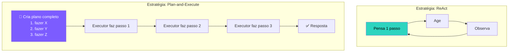

---

# Plan-and-Execute vs ReWOO

<div class="text-xs mb-2 opacity-80">O dilema pedagógico: <b>pensar a rota inteira</b> reduz improviso, mas pode ficar caro e rígido. Dois padrões aparecem na literatura e nos frameworks.</div>
<div class="grid grid-cols-2 gap-3 text-xs">
<div class="p-3 rounded-xl bg-purple-500/10 border border-purple-500/30">
<b>🗺️ Plan-and-Execute</b><br>
<span class="opacity-70">Planeja → executa → observa → replaneja.</span>
<div class="mt-2 leading-snug">Bom quando o ambiente muda: navegar web, debugar código, investigar dados. O executor aprende com cada observação antes de seguir.</div>
</div>
<div class="p-3 rounded-xl bg-cyan-500/10 border border-cyan-500/30">
<b>🔀 ReWOO</b> <span class="opacity-70">(Reasoning Without Observation)</span><br>
<span class="opacity-70">Planeja todas as evidências antes de chamar tools.</span>
<div class="mt-2 leading-snug">Bom quando as consultas são independentes: coletar cotações, buscar fatos paralelos, comparar documentos.</div>
</div>
</div>
<div class="mt-2 p-2 rounded bg-amber-500/10 border border-amber-500/30 text-xs">Referências: ReAct (Yao et al., 2023), Plan-and-Solve prompting (Wang et al., 2023), ReWOO (Xu et al., 2023).</div>

---

# Plan-and-Execute vs ReWOO — cont.

```text
Pergunta: "Compare laptops para ML até R$ 8k"

Plan-and-Execute:
  1. buscar opções → observar resultados
  2. filtrar GPUs → observar disponibilidade
  3. comparar preço/VRAM → responder

ReWOO:
  E1 = buscar("laptops RTX até 8k")
  E2 = buscar("benchmarks RTX 4060 laptop ML")
  E3 = buscar("preços varejo Brasil")
  Solver(E1, E2, E3) → recomendação
```

<div class="grid grid-cols-3 gap-2 text-xs mt-2">
<div class="p-2 rounded bg-green-500/10 border border-green-500/30"><b>Use Plan-and-Execute</b><br>quando há dependência, erro provável ou decisão sensível.</div>
<div class="p-2 rounded bg-cyan-500/10 border border-cyan-500/30"><b>Use ReWOO</b><br>quando evidências podem ser coletadas em paralelo.</div>
<div class="p-2 rounded bg-red-500/10 border border-red-500/30"><b>Evite ambos</b><br>quando uma única chamada direta resolve.</div>
</div>

---

# 🧠 Agentic Planning — como agentes criam e gerenciam planos

<div class="text-xs mb-2">A ideia não nasceu com LLMs. Ela vem de <b>planejamento em IA clássica</b>: estado, ações, pré-condições, efeitos e objetivo.</div>
<div class="grid grid-cols-2 gap-3 text-xs">
<div class="p-3 rounded-xl bg-purple-500/10 border border-purple-500/30"><b>🧱 Teoria clássica</b><div class="mt-1 leading-snug">STRIPS (Fikes & Nilsson, 1971) modelava o mundo como <i>estado inicial → ações válidas → estado objetivo</i>. HTN Planning quebrava metas em subtarefas hierárquicas.</div></div>
<div class="p-3 rounded-xl bg-cyan-500/10 border border-cyan-500/30"><b>🤖 O que muda com LLMs</b><div class="mt-1 leading-snug">O modelo não tem um simulador perfeito do mundo. Ele propõe um plano plausível, executa tools, observa evidências e corrige a rota.</div></div>
</div>
<div class="mt-2 p-2 rounded bg-green-500/10 border border-green-500/30 text-xs"><b>Intuição:</b> planning é a ponte entre “responder uma pergunta” e “gerenciar uma tarefa”.</div>

---

# 📋 Anatomia de um plano de agente

<div class="text-sm mb-2">Um bom plano é mais parecido com um <b>contrato de execução</b> do que com uma lista de tarefas.</div>

```python
plan = {
  "objetivo": "Escolher hotel para viagem corporativa em SP",
  "criterio_sucesso": "3 opções justificadas com preço, localização e risco",
  "restricoes": ["até R$ 900/noite", "perto da Av. Paulista"],
  "passos": [
    {"id": "S1", "acao": "buscar candidatos", "tool": "search_web",
     "depende_de": [], "status": "done"},
    {"id": "S2", "acao": "extrair preço e avaliação", "tool": "browser",
     "depende_de": ["S1"], "status": "running"},
  ]
}
```

---

# 📋 Anatomia de um plano de agente — cont.

```python
plan["passos"] += [
  {"id": "S3", "acao": "comparar trade-offs", "tool": "reasoning",
   "depende_de": ["S2"], "status": "pending"},
  {"id": "S4", "acao": "gerar recomendação auditável", "tool": "writer",
   "depende_de": ["S3"], "status": "pending"},
]

plan["guardrails"] = {
  "budget_max_tool_calls": 8,
  "replan_if": ["tool_error", "evidencia_conflitante", "restricao_violada"],
  "human_approval_if": ["compra", "cancelamento", "envio_externo"],
}
```

<div class="mt-2 grid grid-cols-3 gap-2 text-xs">
<div class="p-2 rounded bg-purple-500/10 border border-purple-500/30"><b>Observável</b><br>status e evidências por passo.</div>
<div class="p-2 rounded bg-cyan-500/10 border border-cyan-500/30"><b>Controlável</b><br>limites de custo, risco e aprovação.</div>
<div class="p-2 rounded bg-green-500/10 border border-green-500/30"><b>Avaliável</b><br>sucesso definido antes da resposta.</div>
</div>

---

# 🔄 Replanning — quando o plano precisa mudar

<div class="text-xs mb-2">Replanning é um <b>loop de controle</b>: monitorar o mundo, detectar desvio e ajustar a rota. É próximo do ciclo MAPE-K da IBM Autonomic Computing.</div>
<div class="grid grid-cols-4 gap-2 text-xs">
<div class="p-2 rounded-lg bg-blue-500/10 border border-blue-500/30"><b>Monitor</b><br>tool falhou? evidência chegou? custo subiu?</div>
<div class="p-2 rounded-lg bg-red-500/10 border border-red-500/30"><b>Analyze</b><br>falha local ou premissa do plano errada?</div>
<div class="p-2 rounded-lg bg-purple-500/10 border border-purple-500/30"><b>Plan</b><br>patch pequeno, subplano novo ou reinício total?</div>
<div class="p-2 rounded-lg bg-green-500/10 border border-green-500/30"><b>Execute</b><br>continua com trilha de auditoria.</div>
</div>
<div class="mt-2 p-2 rounded bg-amber-500/10 border border-amber-500/30 text-xs"><b>Anti-padrão:</b> replanejar a cada passo sem critério. Isso vira loop caro. Defina gatilhos objetivos.</div>

---

# 🔄 Replanning — exemplos em produto

<div class="grid grid-cols-3 gap-2 text-xs">
<div class="p-2 rounded-lg bg-purple-500/10 border border-purple-500/30"><b>Devin / coding agents</b><br>Planejam tarefas de engenharia, executam testes, abrem PR e replanejam quando build ou lint falha.</div>
<div class="p-2 rounded-lg bg-cyan-500/10 border border-cyan-500/30"><b>Browser agents</b><br>Manus, Operator e afins precisam trocar rota quando UI muda, login bloqueia ou dado não aparece.</div>
<div class="p-2 rounded-lg bg-sky-500/10 border border-sky-500/30"><b>Claude Code / Copilot agents</b><br>Transformam plano em checklist: editar arquivo, rodar teste, interpretar erro, ajustar hipótese.</div>
</div>
<div class="mt-2 grid grid-cols-2 gap-2 text-xs">
<div class="p-2 rounded-lg bg-green-500/10 border border-green-500/30"><b>Regra prática</b><br>Peça plano explícito quando há 3+ passos, tools externas, custo alto ou risco de ação irreversível.</div>
<div class="p-2 rounded-lg bg-amber-500/10 border border-amber-500/30"><b>Leitura recomendada</b><br>Anthropic, <i>Building Effective Agents</i> (2024); LangGraph docs sobre persistence/checkpoints; Yao et al., <i>ReAct</i>.</div>
</div>

---

# 💻 Implementando planning agentic em Python

```python
import json
import openai

def create_plan(objective: str) -> list[dict]:
    response = openai.chat.completions.create(
        model="gpt-4.1",
        messages=[
            {"role": "system", "content": "Decomponha o objetivo em passos ordenados. Retorne JSON: {\"passos\": [{id, acao, tool, depende_de}]}"},
            {"role": "user", "content": objective},
        ],
        response_format={"type": "json_object"},
        temperature=0,
    )
    return json.loads(response.choices[0].message.content)["passos"]
```

---

# 💻 Implementando planning agentic em Python — execução

```python
def execute_with_replanning(objective: str, max_retries: int = 2):
    plan = create_plan(objective)
    for step in plan:
        result = execute_step(step)
        if result.failed and step["retries"] < max_retries:
            plan = replan(objective, plan, step, result.error)
            continue
    return synthesize(plan)
```

<div class="mt-2 text-xs opacity-70">Fluxo: <b>planejar → executar → monitorar → re-planejar</b>. A sofisticação está em decidir <i>quando</i> e <i>como</i> recalcular.</div>

---
layout: center
class: text-center
---

# 🎯 Parte 2: Agindo com precisão

<div class="text-lg mt-6 opacity-90">
O agente já sabe <b>pensar</b> (CoT, ToT, Planning).<br>
Agora precisa de <b>mãos firmes</b> — ferramentas estruturadas e confiáveis.
</div>

<div class="mt-6 text-sm opacity-60">
É aqui que o "artesanal" do Encontro 1 vira <b>padrão de indústria</b>.
</div>

---

# 2.6 Function Calling estruturado

📅 Lançado pela OpenAI em **junho/2023**. Mudou o jogo.

**Como funciona:**

1. Você descreve suas tools usando **JSON Schema**
2. Manda no parâmetro `tools=[...]` da API
3. O modelo retorna `tool_calls` com argumentos **JSON validado**
4. Você executa as funções e devolve o resultado
5. O modelo gera a resposta final (ou pede mais tools)

<div class="mt-4 p-3 rounded bg-cyan-500/10 border border-cyan-500/30 text-sm">
💡 É <b>basicamente ReAct</b>, mas o parsing/validação acontecem do lado da API, não na sua regex.
</div>

---

# Function Calling — definindo tools

<div class="mb-2 p-2 rounded bg-sky-500/10 border border-sky-500/30 text-xs">
📖 <b>Em palavras:</b> essa lista é o <b>"cardápio"</b> do LLM: nome da função, descrição e parâmetros aceitos. É essa descrição que o modelo usa para decidir <i>quando</i> chamar cada tool.
</div>

```python
tools = [{
    "type": "function",
    "function": {
        "name": "calculadora",
        "description": "Avalia uma expressão matemática Python.",
        "parameters": {
            "type": "object",
            "properties": {"expr": {"type": "string", "description": "Ex: '2 + 3 * 4'"}},
            "required": ["expr"],
        },
    },
}]
```

<div class="mt-2 text-xs opacity-70">Para adicionar <code>busca(query: str)</code> ou outras tools, repita o mesmo schema como novos itens no array <code>tools</code>.</div>

---

# Function Calling — exemplo de chamada

```python
resp = client.chat.completions.create(
    model="gpt-4o-mini",
    messages=[{"role": "user", "content": "Quanto é (17 * 23) + 41?"}],
    tools=tools,
)
msg = resp.choices[0].message
tc = msg.tool_calls[0]
print(tc.function.name)       # calculadora
print(tc.function.arguments)  # {"expr":"(17 * 23) + 41"}
```

---

# Function Calling — o loop

<div class="mb-2 p-2 rounded bg-sky-500/10 border border-sky-500/30 text-xs">
📖 <b>Em palavras:</b> é o <b>mesmo loop do Encontro 1</b>, mas agora o LLM responde com um campo estruturado <code>tool_calls</code> em vez de texto bagunçado. Você (1) chama o modelo, (2) se ele não pediu ferramenta, é resposta final, (3) se pediu, você executa a função real, anexa o resultado e volta. Sem regex, sem parsing frágil.
</div>

```python {all|1-8|all}
def run_agent_fc(pergunta: str, max_steps: int = 6):
    msgs = [{"role": "user", "content": pergunta}]
    for _ in range(max_steps):
        resp = client.chat.completions.create(
            model="gpt-4o-mini",
            messages=msgs, tools=tools
        )
        msg = resp.choices[0].message
        if not msg.tool_calls:
            return msg.content
        msgs.append(msg)
```

---

# Function Calling — fluxo completo

```python
        for tc in msg.tool_calls:
            fn = TOOLS[tc.function.name]
            args = json.loads(tc.function.arguments)
            result = fn(**args)
            msgs.append({
                "role": "tool",
                "tool_call_id": tc.id,
                "content": str(result),
            })
    return "Max steps atingido."
```

<div class="mt-2 text-xs opacity-70">Se vierem 2 <code>tool_calls</code>, você pode executar ambas em paralelo e só depois devolver os resultados ao modelo.</div>

---

# O que mudou em relação ao ReAct manual

<div class="grid grid-cols-2 gap-3 mt-3 text-xs">
<div class="p-2 rounded-xl bg-red-500/10 border border-red-500/30"><b>Antes (ReAct regex)</b><div class="mt-1 leading-snug">❌ Parsing manual de "Action:" / "Action Input:"<br>❌ Argumentos são strings<br>❌ Sem validação<br>❌ Quebra se o modelo "criar" ferramenta<br>❌ 1 tool por turno</div></div>
<div class="p-2 rounded-xl bg-green-500/10 border border-green-500/30"><b>Agora (Function Calling)</b><div class="mt-1 leading-snug">✅ API entrega JSON estruturado<br>✅ Argumentos tipados<br>✅ Schema valida automaticamente<br>✅ Modelo só chama tools registradas<br>✅ <b>Múltiplas tools em paralelo</b></div></div>
</div>
<div class="mt-3 p-2 rounded-xl bg-cyan-500/10 border border-cyan-500/30 text-xs">🚀 <b>Multi-tool em paralelo:</b> se o agente precisa do clima de SP e RJ, uma chamada LLM já devolve <b>2 tool_calls</b>; você executa ambas e volta com os resultados. Latência cai quase pela metade.</div>

---

# Parallel tool calls — exemplo visual

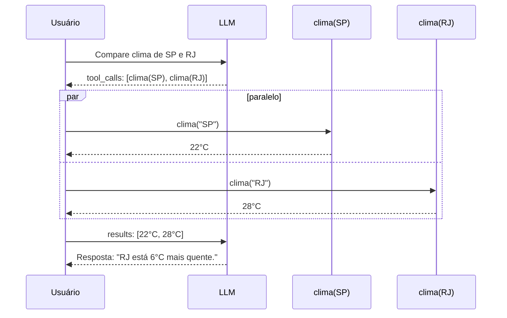

---

# Checkpoint — a régua de arquitetura

<div class="grid grid-cols-4 gap-2 text-xs">
<div class="p-2 rounded-lg bg-white/5 border border-white/10"><b>1 chamada</b><br>Resposta direta ou CoT leve.</div>
<div class="p-2 rounded-lg bg-purple-500/10 border border-purple-500/30"><b>Workflow</b><br>Passos fixos, validação simples.</div>
<div class="p-2 rounded-lg bg-cyan-500/10 border border-cyan-500/30"><b>Agente com tools</b><br>Loop, schemas, observações.</div>
<div class="p-2 rounded-lg bg-green-500/10 border border-green-500/30"><b>Grafo</b><br>Estado, HITL, checkpoints, retomada.</div>
</div>

<div class="mt-3 p-3 rounded-xl bg-amber-500/10 border border-amber-500/30 text-sm text-center">
Não use framework para parecer moderno. Use quando a arquitetura precisa de <b>controle explícito</b>.
</div>

---

# 2.8 Quando usar LangChain?

LangChain é o framework mais popular para agentes em Python — com **prós e contras** claros.
<div class="grid grid-cols-2 gap-3 mt-3">
<div class="p-2 rounded-xl bg-green-500/10 border border-green-500/30"><b class="text-green-300">✅ Use quando</b><div class="mt-1 text-xs leading-snug">• quer trocar de modelo facilmente<br>• precisa de integrações prontas (vector DBs, loaders)<br>• está prototipando rápido<br>• time grande precisa padronizar</div></div>
<div class="p-2 rounded-xl bg-red-500/10 border border-red-500/30"><b class="text-red-300">❌ Evite quando</b><div class="mt-1 text-xs leading-snug">• você só precisa de 2–3 chamadas simples<br>• performance/latência é crítica<br>• quer entender tudo que acontece<br>• quer controle total do prompt</div></div>
</div>
<div class="mt-3 p-2 rounded bg-amber-500/10 border border-amber-500/30 text-xs">⚠️ Crítica comum: abstrai demais. Em 2024 a própria equipe lançou o <b>LangGraph</b> como opção de menor nível e controle explícito.</div>

---

# 🎯 Quando usar cada framework?

<div class="text-xs mt-2">

| Framework | Controle | Complexidade | Melhor para |
|---|---|---|---|
| **Python puro** | 🟢🟢🟢 Total | 🟡 Média | Agentes simples, aprendizado |
| **OpenAI Agents SDK** | 🟢🟢 Alto | 🟢 Baixa | Protótipos rápidos, poucos tools |
| **smolagents** | 🟢🟢 Alto | 🟢 Baixa | HuggingFace ecosystem |
| **LangChain** | 🟡 Médio | 🟡 Média | RAG, chains complexas |
| **LangGraph** | 🟢🟢🟢 Total | 🔴 Alta | Produção, HITL, multi-agent |
| **CrewAI** | 🟡 Médio | 🟡 Média | Multi-agent colaborativo |
| **AutoGen** | 🟡 Médio | 🔴 Alta | Pesquisa, conversas multi-agent |

</div>

<div class="mt-2 p-2 rounded bg-cyan-500/10 border border-cyan-500/30 text-xs">
💡 <b>Regra prática:</b> comece com Python puro → migre para LangGraph quando precisar de checkpoints, HITL ou multi-agent.
</div>

---

# Agente em LangChain — exemplo

<div class="mb-2 p-2 rounded bg-sky-500/10 border border-sky-500/30 text-xs">📖 <b>Em palavras:</b> o loop, o parsing e o error-handling ficam escondidos. Você declara <code>@tool</code>, monta o agente com <code>create_tool_calling_agent</code> e executa com <code>AgentExecutor</code>.</div>

```python
from langchain_openai import ChatOpenAI; from langchain.agents import AgentExecutor, create_tool_calling_agent
from langchain_core.prompts import ChatPromptTemplate; from langchain_core.tools import tool
@tool
def calculadora(expr: str) -> str: return str(eval(expr, {"__builtins__": {}}, {}))
@tool
def busca(query: str) -> str: return {"capital do brasil": "Brasília"}.get(query.lower(), "Não encontrado")
llm = ChatOpenAI(model="gpt-4o-mini", temperature=0)
prompt = ChatPromptTemplate.from_messages([
    ("system", "Você é um agente útil. Use as ferramentas quando precisar."), ("user", "{input}"), ("placeholder", "{agent_scratchpad}")])
agent = create_tool_calling_agent(llm, [calculadora, busca], prompt)
executor = AgentExecutor(agent=agent, tools=[calculadora, busca], verbose=True)
print(executor.invoke({"input": "Qual a capital do Brasil e quanto é 47*13?"}))
```

---

# 2.9 LangGraph — controle total com grafos de estado

LangChain criou o LangGraph em **2024** como resposta à principal crítica: "abstrai demais, não sei o que está acontecendo".

**Conceito:** seu agente é um **grafo dirigido** onde cada nó é uma função Python e cada aresta é uma condição.

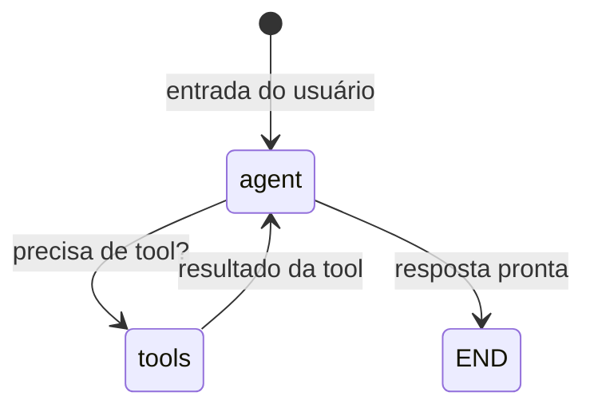

<div class="mt-3 p-2 rounded bg-cyan-500/10 border border-cyan-500/30 text-xs">
💡 Diferente do LangChain (loop implícito), aqui <b>você desenha o fluxo</b> — cada rota é explícita e debugável.
</div>

---

# LangGraph — exemplo completo comentado

```python
from langgraph.graph import StateGraph
from langgraph.prebuilt import ToolNode, tools_condition
from langgraph.graph.message import add_messages
from langchain_openai import ChatOpenAI
from typing import Annotated, TypedDict

class State(TypedDict):
    messages: Annotated[list, add_messages]

llm = ChatOpenAI(model="gpt-4o-mini").bind_tools([calc, busca])

def agent(state: State):
    return {"messages": [llm.invoke(state["messages"])]}

# Monta o grafo
graph = StateGraph(State)
graph.add_node("agent", agent)
graph.add_node("tools", ToolNode([calc, busca]))
graph.set_entry_point("agent")
graph.add_conditional_edges("agent", tools_condition)
graph.add_edge("tools", "agent")

app = graph.compile()
```

---

# LangGraph — executando e observando

```python
# Executa
result = app.invoke({
    "messages": [("user", "Quanto custa um hotel em SP?")]
})
print(result["messages"][-1].content)

# Streaming (token a token para UI)
for event in app.stream({"messages": [("user", "...")]}):
    print(event)  # mostra cada nó executado
```

<div class="mt-3 grid grid-cols-2 gap-3 text-xs">
<div class="p-2 rounded bg-green-500/10 border border-green-500/30"><b>✅ Vantagem</b>: veja exatamente qual nó rodou, em que ordem, com que dados.</div>
<div class="p-2 rounded bg-purple-500/10 border border-purple-500/30"><b>🔑 Killer feature</b>: checkpoints — pause, salve estado, retome depois (HITL).</div>
</div>

---

# Por que LangGraph domina em produção (2025)?

<div class="grid grid-cols-3 gap-3 mt-3 text-xs">
<div class="p-3 rounded-xl bg-purple-500/10 border border-purple-500/30">
<b>🔍 Transparência</b><br>Fluxo visível — sem mágica. Cada decisão é uma aresta no grafo.
</div>
<div class="p-3 rounded-xl bg-cyan-500/10 border border-cyan-500/30">
<b>⏸️ Checkpoint + HITL</b><br>Pausa antes de ações sensíveis. Humano aprova e o agente continua.
</div>
<div class="p-3 rounded-xl bg-green-500/10 border border-green-500/30">
<b>👥 Multi-agent nativo</b><br>Cada nó pode ser um agente diferente. Supervisor orquestra.
</div>
</div>

<div class="mt-3 grid grid-cols-3 gap-3 text-xs">
<div class="p-3 rounded-xl bg-amber-500/10 border border-amber-500/30">
<b>🌊 Streaming</b><br>Tokens e eventos em tempo real — essencial para UX.
</div>
<div class="p-3 rounded-xl bg-red-500/10 border border-red-500/30">
<b>☁️ LangGraph Cloud</b><br>Deploy gerenciado + persistência + cron tasks.
</div>
<div class="p-3 rounded-xl bg-white/5 border border-white/10">
<b>📊 LangSmith</b><br>Observabilidade integrada — traces, evals, custos.
</div>
</div>

---

# Síntese: qual abordagem usar?

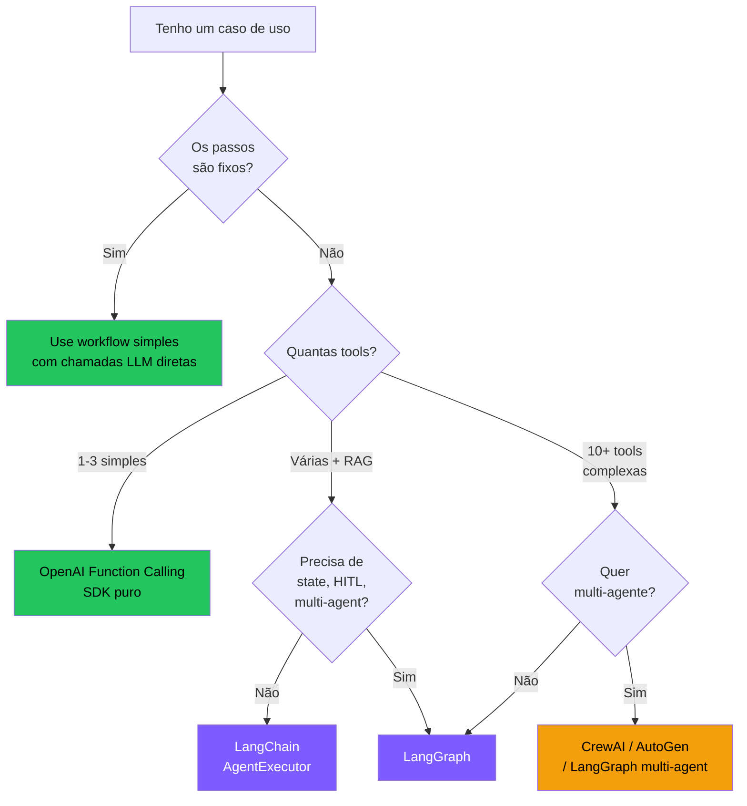

---

layout: section
---

# 🎯 2.10 Boas Práticas — tirando o melhor dos agentes

Como interagir com agentes para maximizar resultados

---

# 🎯 Boas práticas — prompts e contexto

<div class="grid grid-cols-2 gap-3 text-xs mt-2">
<div class="p-2 rounded-xl bg-purple-500/10 border border-purple-500/30"><b>✅ Faça</b><div class="mt-1 leading-snug">• seja específico<br>• dê contexto (stack, constraints, estilo)<br>• decomponha tarefas grandes<br>• itere em múltiplos turnos<br>• forneça exemplos few-shot</div></div>
<div class="p-2 rounded-xl bg-red-500/10 border border-red-500/30"><b>❌ Evite</b><div class="mt-1 leading-snug">• prompts vagos<br>• contexto implícito<br>• pedir tudo de uma vez<br>• ignorar erros do agente<br>• confiar cegamente no output</div></div>
</div>

---

# 🛠️ Boas práticas — ferramentas e workflow

<div class="grid grid-cols-2 gap-3 text-xs mt-2">
<div class="p-2 rounded-xl bg-cyan-500/10 border border-cyan-500/30"><b>🔧 Ferramentas</b><div class="mt-1 leading-snug">• limite o escopo das tools<br>• nomeie bem<br>• documente params e ranges<br>• trate erros sem stack trace<br>• teste cada tool isoladamente</div></div>
<div class="p-2 rounded-xl bg-green-500/10 border border-green-500/30"><b>🔄 Workflow</b><div class="mt-1 leading-snug">• comece simples<br>• observe logs<br>• limite iterações<br>• monitore custo<br>• versione prompts como código</div></div>
</div>

---

# ⚠️ Erros mais comuns (e como evitar)

<div class="text-xs mt-2 space-y-2">
<div class="p-2 rounded-lg bg-red-500/10 border border-red-500/30 flex gap-2"><span>🔴</span><div><b>Loop infinito:</b> agente repete a mesma ação. <i>Fix:</i> max_steps + detecção de repetição.</div></div>
<div class="p-2 rounded-lg bg-red-500/10 border border-red-500/30 flex gap-2"><span>🔴</span><div><b>Alucinação de tool:</b> inventa ferramenta que não existe. <i>Fix:</i> validação estrita do nome antes de executar.</div></div>
<div class="p-2 rounded-lg bg-red-500/10 border border-red-500/30 flex gap-2"><span>🔴</span><div><b>Context overflow:</b> conversa longa estoura a janela. <i>Fix:</i> summarize + sliding window.</div></div>
<div class="p-2 rounded-lg bg-amber-500/10 border border-amber-500/30 flex gap-2"><span>🟡</span><div><b>Custo explosivo:</b> agente usa modelo caro em loop. <i>Fix:</i> budget cap + modelo menor para subtarefas.</div></div>
<div class="p-2 rounded-lg bg-amber-500/10 border border-amber-500/30 flex gap-2"><span>🟡</span><div><b>Resposta genérica:</b> ignora contexto. <i>Fix:</i> melhore o system prompt com exemplos.</div></div>
<div class="p-2 rounded-lg bg-amber-500/10 border border-amber-500/30 flex gap-2"><span>🟡</span><div><b>Tool description ruim:</b> modelo não entende quando usar. <i>Fix:</i> reescreva com when/what/format.</div></div>
</div>

<div class="mt-3 p-2 rounded bg-green-500/10 border border-green-500/30 text-xs">
💡 <b>Regra de ouro:</b> se o agente falha repetidamente, o problema quase nunca é o modelo — é o <b>design do sistema</b> (prompt, tools, ou orquestração).
</div>

---
layout: section
---

# 🏋️ 2.11 Exercícios — Encontro 2

5 atividades · Aplique os conceitos de reasoning, planning e tool execution

---

# Exercício 2.1 · CoT vs Direct

<div class="p-5 rounded-xl bg-purple-500/10 border-2 border-purple-500/40">

**Tarefa:** com **gpt-4o-mini** (modelo pequeno, propenso a errar), teste 10 problemas de matemática de palavra (word problems).

**Compare:**
- Sem CoT: `"Resposta: ?"`
- Com CoT: `"Pense passo a passo. Resposta: ?"`

**Meça:**
- Acurácia (acertos / 10) em cada modo
- Latência média
- Tokens consumidos

**Pergunta de reflexão:** vale a pena pagar mais tokens por mais acurácia? Quando?

</div>

---

# Exercício 2.2 · Migre seu agente do Encontro 1

<div class="p-5 rounded-xl bg-purple-500/10 border-2 border-purple-500/40">

**Tarefa:** reescreva o agente do Encontro 1 usando **Function Calling estruturado** (sem regex).

**Requisitos:**
- 3 tools (calculadora, busca, hora_atual)
- Use JSON Schema apropriado para cada uma
- Loop com `max_steps`
- Imprima cada chamada de tool com seus argumentos

**Teste:** *"Que horas são, qual a capital da Austrália, e quanto é 99*99?"*

**Bônus:** ative paralelismo nativo — o agente deve resolver as 3 perguntas em **1 só turno** com 3 tool_calls.

</div>

---

# Exercício 2.3 · LangGraph básico

<div class="p-5 rounded-xl bg-purple-500/10 border-2 border-purple-500/40">

**Tarefa:** monte o mesmo agente em **LangGraph**, seguindo o exemplo dos slides.

**Adicione:**
- Um nó extra chamado `validator` que **roda DEPOIS do agent** mas **ANTES de finalizar**.
- O `validator` deve checar se a resposta final menciona números. Se sim, ok. Se não, manda de volta para o `agent` com a mensagem: *"Sua resposta não contém números — refine."*
- Limite de 3 iterações no total.

**O que isso ensina:** controle explícito do fluxo. Algo que é trivial em LangGraph e doloroso em LangChain puro.

</div>

---

# Exercício 2.4 · Plan-and-Execute na unha

<div class="p-5 rounded-xl bg-purple-500/10 border-2 border-purple-500/40">

**Tarefa:** implemente **Plan-and-Execute** sem framework. Estrutura:

```python
def planner(pergunta: str) -> list[str]:
    """Pede ao LLM para gerar uma lista de passos."""
    ...

def executor(passo: str, contexto: list[str]) -> str:
    """Executa 1 passo, podendo usar tools."""
    ...

def plan_and_execute(pergunta: str):
    plano = planner(pergunta)        # ex: ["buscar X", "calcular Y", "resumir"]
    resultados = []
    for passo in plano:
        resultados.append(executor(passo, resultados))
    return resultados[-1]
```

**Teste:** *"Compare o PIB do Brasil e da Argentina e diga em quantos % o do Brasil é maior."*

</div>

---

# Exercício 2.5 · Reflexão

<div class="p-5 rounded-xl bg-cyan-500/10 border-2 border-cyan-500/40">

Em **um parágrafo cada**:

1. Em que situação real (do seu trabalho/estudo) **Self-Consistency** valeria os 5× de custo?

2. Cite uma tarefa onde **Tree-of-Thoughts** seria justificado. E uma onde seria <b>exagero</b>.

3. Você prefere LangChain ou LangGraph para o seu próximo projeto? Por quê?

</div>

---
# 🌐 Mercado de reasoning & frameworks (2024-2026)

<div class="grid grid-cols-2 gap-3 text-xs">
<div class="p-2 rounded-lg bg-purple-500/10 border border-purple-500/30"><b>🧠 Reasoning models</b><div class="mt-1 leading-snug">• <b>OpenAI o1, o3, o3-mini</b> (set/2024–jan/2025)<br>• <b>DeepSeek R1</b> (jan/2025) — open weights, abalou o mercado<br>• <b>Claude Sonnet 4 Thinking</b> (mai/2025)<br>• <b>Gemini 2.5 Pro Thinking</b><br>• <b>Qwen QwQ</b>, <b>Kimi k1.5</b> (Moonshot)</div></div>
<div class="p-2 rounded-lg bg-cyan-500/10 border border-cyan-500/30"><b>🛠️ Frameworks de agente</b><div class="mt-1 leading-snug">• <b>LangGraph</b> — grafo de estados<br>• <b>OpenAI Agents SDK</b> (mar/2025)<br>• <b>LlamaIndex AgentWorkflow</b><br>• <b>Pydantic AI</b>, <b>Smolagents</b><br>• <b>CrewAI</b>, <b>AutoGen</b>, <b>Mastra</b>, <b>Vercel AI SDK</b></div></div>
</div>

---

# 🌐 Mercado de reasoning & frameworks (2024-2026) — cont.

<div class="grid grid-cols-2 gap-3 text-xs">
<div class="p-2 rounded-lg bg-green-500/10 border border-green-500/30"><b>🧩 Padrões emergentes em produção</b><div class="mt-1 leading-snug">• Anthropic <b>Building Effective Agents</b> (dez/2024) consolidou 5 padrões<br>• <b>OpenAI Swarm → Agents SDK</b> popularizou handoffs<br>• <b>LangGraph Supervisor</b> virou padrão de coordenação<br>• <b>MCP</b> (nov/2024) tornou-se padrão de tool calling</div></div>
<div class="p-2 rounded-lg bg-amber-500/10 border border-amber-500/30"><b>💸 Custos típicos por padrão (2025)</b><div class="mt-1 leading-snug">• ReAct simples (5 turnos): <b>~$0,02</b><br>• Reasoning model (o1) por query: <b>~$0,10–$1</b><br>• Multi-agent (5 agentes, 20 turnos): <b>~$0,50</b><br>• Deep Research run (OpenAI): <b>~$1–5</b></div></div>
</div>
<div class="mt-3 text-xs opacity-70 text-center">Fontes: documentação oficial dos modelos, blogs Anthropic/OpenAI e repositórios públicos no GitHub.</div>

---

# 📚 Referências públicas — Encontro 2

<div class="grid grid-cols-2 gap-3 text-xs mt-2">
<div class="p-2 rounded bg-purple-500/10 border border-purple-500/30"><b>Reasoning & planning</b><div class="mt-1 leading-snug">• Wei et al. (2022) — <i>Chain-of-Thought Prompting</i> · <a href="https://arxiv.org/abs/2201.11903">arXiv:2201.11903</a><br>• Wang et al. (2022) — <i>Self-Consistency Improves CoT</i> · <a href="https://arxiv.org/abs/2203.11171">arXiv:2203.11171</a><br>• Yao et al. (2023) — <i>Tree of Thoughts</i> · <a href="https://arxiv.org/abs/2305.10601">arXiv:2305.10601</a><br>• Xu et al. (2023) — <i>ReWOO</i> · <a href="https://arxiv.org/abs/2305.18323">arXiv:2305.18323</a><br>• Shinn et al. (2023) — <i>Reflexion</i> · <a href="https://arxiv.org/abs/2303.11366">arXiv:2303.11366</a></div></div>
<div class="p-2 rounded bg-cyan-500/10 border border-cyan-500/30"><b>Reasoning models</b><div class="mt-1 leading-snug">• OpenAI (2024) — <i>Learning to Reason with LLMs (o1)</i> · <a href="https://openai.com/index/learning-to-reason-with-llms/">openai.com</a><br>• DeepSeek-AI (2025) — <i>DeepSeek-R1</i> · <a href="https://arxiv.org/abs/2501.12948">arXiv:2501.12948</a><br>• Snell et al. (2024) — <i>Scaling Test-Time Compute</i> · <a href="https://arxiv.org/abs/2408.03314">arXiv:2408.03314</a></div></div>
</div>

---

# 📚 Referências públicas — Encontro 2 — cont.

<div class="grid grid-cols-2 gap-3 text-xs mt-2">
<div class="p-2 rounded bg-green-500/10 border border-green-500/30"><b>Padrões agentic</b><div class="mt-1 leading-snug">• Anthropic (2024) — <i>Building Effective Agents</i> · <a href="https://www.anthropic.com/research/building-effective-agents">anthropic.com/research</a> (fonte dos 5 padrões)<br>• OpenAI (2024) — <i>Structured Outputs Guide</i> · <a href="https://platform.openai.com/docs/guides/structured-outputs">platform.openai.com</a><br>• Pydantic AI Docs · <a href="https://ai.pydantic.dev/">ai.pydantic.dev</a></div></div>
<div class="p-2 rounded bg-amber-500/10 border border-amber-500/30"><b>Frameworks</b><div class="mt-1 leading-snug">• LangChain · <a href="https://python.langchain.com/">python.langchain.com</a><br>• LangGraph · <a href="https://langchain-ai.github.io/langgraph/">langchain-ai.github.io/langgraph</a><br>• Instructor · <a href="https://python.useinstructor.com/">python.useinstructor.com</a></div></div>
</div>
<div class="mt-2 text-xs opacity-70">Todo conteúdo deste encontro é de domínio público. Marcas citadas pertencem aos respectivos donos; uso exclusivamente educacional.</div>

---

# 🧭 Dois filtros antes de produção

<div class="grid grid-cols-2 gap-3 text-xs">
<div class="p-3 rounded-xl bg-green-500/10 border border-green-500/30">
<b>🔓 Open-source vs closed-source</b><br>
Closed acelera protótipo e entrega modelos fortes com suporte. Open dá controle, custo previsível, privacidade e menos lock-in. A pergunta não é “qual é melhor?” — é <b>qual restrição domina seu caso</b>.
</div>
<div class="p-3 rounded-xl bg-red-500/10 border border-red-500/30">
<b>🛡️ Risco operacional</b><br>
Prompt injection, vazamento via tool, custos em loop, autonomia excessiva e falha silenciosa. Quanto mais o agente age fora do chat, mais precisa de sandbox, allowlist, aprovação e logs.
</div>
</div>

<div class="mt-3 p-3 rounded-lg bg-blue-500/10 border border-blue-500/30 text-xs text-center">
<b>Regra prática:</b> prototipe com o melhor modelo disponível; produza com a combinação que maximiza <b>controle + avaliação + custo aceitável</b>.
</div>

---

# 🧪 Exercícios Interativos — Encontro 2

<div class="text-sm opacity-70 mb-3">Agora os conceitos viram prática no navegador.</div>

<div class="grid grid-cols-3 gap-3 text-xs">
<div class="p-3 rounded-xl bg-purple-500/10 border border-purple-500/30"><b>2.1 CoT manual</b><br>Compare prompt direto vs passo a passo e observe onde a decomposição reduz erro.</div>
<div class="p-3 rounded-xl bg-cyan-500/10 border border-cyan-500/30"><b>2.2 Function Calling</b><br>Simule tool calls em JSON e veja por que contrato vence regex.</div>
<div class="p-3 rounded-xl bg-green-500/10 border border-green-500/30"><b>2.3 Planner simples</b><br>Decomponha uma tarefa em passos e execute com contexto acumulado.</div>
</div>

---

# 🧪 Exercício Interativo 2.1 — Chain-of-Thought manual

<div class="text-xs mb-2 opacity-70">Implemente um prompt CoT e veja como a estruturação melhora a resposta.</div>

<PyRunner src="/topicos-especiais-ia/exercises/e2_1_cot.py" height="280px" />

---

# 🧪 Exercício Interativo 2.2 — Function Calling (JSON schema)

<div class="text-xs mb-2 opacity-70">Simule o parsing de uma resposta do LLM em formato function_call.</div>

<PyRunner src="/topicos-especiais-ia/exercises/e2_2_function_calling.py" height="320px" />

---

# 🧪 Exercício Interativo 2.3 — Planner simples

<div class="text-xs mb-2 opacity-70">Implemente um planejador que decompõe tarefas em subtarefas.</div>

<PyRunner src="/topicos-especiais-ia/exercises/e2_3_planner.py" height="320px" />

---

# 🔄 Recap — O que construímos no Encontro 2

<div class="grid grid-cols-2 gap-3 text-xs">
<div class="p-2 rounded-xl bg-purple-500/10 border border-purple-500/30"><b>📜 Evolução que acompanhamos</b><div class="mt-1 leading-snug">• <b>2022:</b> CoT — "pense passo a passo"<br>• <b>2023:</b> Function Calling — JSON estruturado<br>• <b>2024:</b> Anthropic Patterns — workflows vs agentes<br>• <b>2024-25:</b> LangGraph/CrewAI — orquestração como grafo</div></div>
<div class="p-2 rounded-xl bg-cyan-500/10 border border-cyan-500/30"><b>🔧 O que você agora sabe fazer</b><div class="mt-1 leading-snug">• Aplicar CoT, Self-Consistency e ToT<br>• Implementar planning (Plan-and-Execute, ReWOO)<br>• Usar Function Calling com schemas JSON<br>• Escolher entre LangChain, LangGraph e SDK puro</div></div>
</div>

---

# 🔄 Recap — O que construímos no Encontro 2 — cont.

<div class="grid grid-cols-2 gap-3 text-xs">
<div class="p-2 rounded-xl bg-green-500/10 border border-green-500/30"><b>🏢 Produtos que usam isso</b><div class="mt-1 leading-snug">• ChatGPT — function calling + plugins<br>• Cursor — planning antes de editar código<br>• Devin — plan-and-execute multi-step</div></div>
<div class="p-2 rounded-xl bg-amber-500/10 border border-amber-500/30"><b>❓ Perguntas que ficaram abertas</b><div class="mt-1 leading-snug">• E quando o histórico fica grande demais? (→ E3: Context)<br>• Como dar "conhecimento" ao agente? (→ E3: RAG)<br>• Como agentes colaboram? (→ E3: Multi-agentes)</div></div>
</div>

---

# ✅ Fim do Encontro 2

<div class="grid grid-cols-2 gap-3 text-xs">
<div class="p-3 rounded-xl bg-green-500/10 border border-green-500/30"><b>Você agora tem repertório</b><br>CoT, Self-Consistency, ToT, Reflexion, Planning, Function Calling, patterns da Anthropic, LangChain e LangGraph.</div>
<div class="p-3 rounded-xl bg-cyan-500/10 border border-cyan-500/30"><b>Você também tem critério</b><br>Quando aumentar custo, quando manter simples, quando exigir schema, quando desenhar grafo e quando colocar humano no loop.</div>
</div>

<div class="mt-12 text-xl text-cyan-400">
Próximo: <b>Encontro 3 — Skills, Memória & Contexto</b>
</div>

<div class="mt-4 text-sm opacity-60">
Onde o agente <i>aprende</i>, <i>lembra</i>, e <i>colabora</i>.
</div>
