# 💾 Encontro 3
## Skills, Memória & Contexto

<div class="text-sm opacity-60 mt-4">3 horas · Context window, RAG, vector DBs, memória, skills, MCP, multi-agentes</div>

---
layout: center
class: text-center
---

# 💭 Onde paramos…

<div class="text-xl mt-6 opacity-90">
Seu agente já <b>pensa</b> (CoT, Planning) e <b>age com precisão</b> (Function Calling).<br>
Mas tem um problema grave:
</div>

<div class="mt-6 text-2xl text-red-400 font-bold">
Ele é amnésico.
</div>

<div class="mt-6 text-sm opacity-60">
Não lembra da conversa de ontem. Não sabe quem você é. Não tem acesso aos seus documentos.<br>
Hoje vamos dar <b>memória</b>, <b>conhecimento</b> e <b>habilidades reutilizáveis</b> ao agente.
</div>

---

# 🧪 A jornada — Nível 3: com Memória + RAG
<div class="p-3 rounded bg-zinc-800 border border-zinc-700 text-xs font-mono mb-2">
<span class="text-green-400">user:</span> Planeja uma viagem de 3 dias para Porto Alegre com R$2000<br><br>
<span class="text-yellow-400">thought:</span> Usuário é vegetariano; na última viagem preferiu hotel boutique.<br>
<span class="text-blue-400">action:</span> buscar_hoteis("Porto Alegre", estilo="boutique", budget=800)<br>
<span class="text-blue-400">action:</span> RAG_query("restaurantes vegetarianos Porto Alegre avaliação > 4.5")<br>
<span class="text-gray-400">observation [RAG]:</span> Quinoa Real ⭐4.8 | Veggie Way ⭐4.6 | Manjericão ⭐4.7<br><br>
<span class="text-purple-400">assistant:</span> Baseado nas suas preferências, montei um roteiro boutique + vegetariano.<br>Orçamento: R$1.847 (sobram R$153).
</div>
<div class="grid grid-cols-3 gap-2 text-xs">
<div class="p-2 rounded bg-green-500/10 border border-green-500/30 text-center"><b>✅ Personalizado</b></div>
<div class="p-2 rounded bg-green-500/10 border border-green-500/30 text-center"><b>✅ Dados verificáveis</b></div>
<div class="p-2 rounded bg-green-500/10 border border-green-500/30 text-center"><b>✅ Orçamento exato</b></div>
</div>
<div class="mt-2 text-xs text-center opacity-70">Memória + RAG = agente que te conhece e busca fatos reais.</div>

---

# 🗺️ Agenda do Encontro 3

<div class="grid grid-cols-2 gap-6 mt-6">

<div>

**Bloco 1 — Contexto e Memória (~90 min)**
- 3.1 O problema da context window
- 3.2 Estratégias de context management
- 3.3 RAG (Retrieval-Augmented Generation)
- 3.4 Vector DBs (Chroma, Qdrant, pgvector)
- 3.5 Memória de curto e longo prazo

</div>

<div>

**Bloco 2 — Skills e Multi-Agent (~90 min)**
- 3.6 Skills — capacidades reutilizáveis
- 3.7 MCP — Model Context Protocol
- 3.8 Padrões multi-agente
- 3.9 Hands-on: agente com RAG + memória
- 3.10 Exercícios

</div>

</div>

---

# 🧭 Vocabulário do dia — em 1 frase cada

<div class="grid grid-cols-1 gap-1 text-xs mt-2">
<div class="p-2 rounded-lg bg-purple-500/10 border border-purple-500/30"><b>🎯 Grounding</b> — cada afirmação aponta para uma fonte real; sem isso vira “confia em mim”.</div>
<div class="p-2 rounded-lg bg-cyan-500/10 border border-cyan-500/30"><b>🧪 Synthesis</b> — juntar várias fontes em uma resposta única, coerente e sem contradições.</div>
<div class="p-2 rounded-lg bg-green-500/10 border border-green-500/30"><b>📚 RAG</b> — buscar documentos relevantes antes de responder e entregá-los ao LLM junto com a pergunta.</div>
<div class="p-2 rounded-lg bg-amber-500/10 border border-amber-500/30"><b>🧮 Embedding</b> — transformar texto em números que preservam significado; frases parecidas ficam próximas.</div>
<div class="p-2 rounded-lg bg-pink-500/10 border border-pink-500/30"><b>🗄️ Vector DB</b> — banco otimizado para achar conteúdo semanticamente parecido, não só palavra igual.</div>
<div class="p-2 rounded-lg bg-blue-500/10 border border-blue-500/30"><b>🪟 Context window</b> — o tanto de texto que o LLM consegue “ver” em uma única chamada.</div>
<div class="p-2 rounded-lg bg-purple-500/10 border border-purple-500/30"><b>💾 Memória de longo prazo</b> — fatos e preferências que o agente preserva entre conversas.</div>
</div>

---

# 🧩 Onde você já viu isso
<div class="grid grid-cols-2 gap-3 text-xs">
<div class="p-2 rounded-lg bg-purple-500/10 border border-purple-500/30"><b>🎯 Grounding em produto</b><br>• <b>Perplexity</b> mostra links de fonte sob cada parágrafo • <b>Bing Chat</b> e <b>Google AI Overviews</b> citam as páginas usadas</div>
<div class="p-2 rounded-lg bg-cyan-500/10 border border-cyan-500/30"><b>📚 RAG em produto</b><br>• <b>Notion AI Q&A</b> responde sobre seus docs • <b>Glean</b> busca em Slack/Drive/Jira • <b>NotebookLM</b> conversa com PDFs</div>
<div class="p-2 rounded-lg bg-green-500/10 border border-green-500/30"><b>💾 Memória em produto</b><br>• <b>ChatGPT Memory</b> lembra preferências • <b>Claude Projects</b> mantém contexto • <b>Cursor</b> indexa o repositório</div>
<div class="p-2 rounded-lg bg-amber-500/10 border border-amber-500/30"><b>🪟 Context window — implicação prática</b><br>• Quando o chat “esquece” 50 mensagens atrás, o contexto saturou • Por isso <b>Claude 200k</b> e <b>Gemini 1M</b> viraram diferencial</div>
</div>
<div class="mt-3 p-2 rounded-lg bg-cyan-500/10 border border-cyan-500/30 text-xs">🎯 <b>Insight</b>: todo agente que parece “inteligente sobre o seu negócio” está fazendo <b>RAG + grounding</b> por baixo. Não há mágica.</div>
---

---
layout: center
class: text-center
---

# 🧠 Parte 1: O desafio do contexto

<div class="text-lg mt-6 opacity-90">
Um LLM lê <b>tudo</b> a cada chamada — e paga por cada token lido.<br>
Quando a conversa cresce, três coisas acontecem:
</div>

<div class="mt-6 grid grid-cols-3 gap-4 text-sm">
<div class="p-3 rounded bg-red-500/10 border border-red-500/30">💸 Custo explode</div>
<div class="p-3 rounded bg-red-500/10 border border-red-500/30">🐢 Latência sobe</div>
<div class="p-3 rounded bg-red-500/10 border border-red-500/30">🧠 Qualidade cai</div>
</div>

<div class="mt-6 text-sm opacity-60">
Vamos entender por quê — e as soluções que o mercado usa.
</div>

---

# 3.1 O problema da context window

A janela é grande, mas **não é infinita** — e cada token custa.

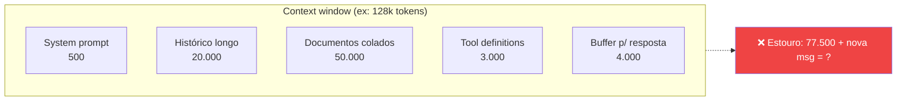

<div class="mt-4 p-4 rounded-xl bg-amber-500/10 border border-amber-500/30">
⚠️ <b>Os 3 problemas da context window:</b><br>
1. <b>Limite duro</b> — passou, a API rejeita.<br>
2. <b>Custo</b> — você paga por TODOS os tokens, toda chamada.<br>
3. <b>"Lost in the middle"</b> — modelos esquecem info no <i>meio</i> do contexto longo (Liu et al., 2023).
</div>

---

# Lost in the Middle — o efeito U

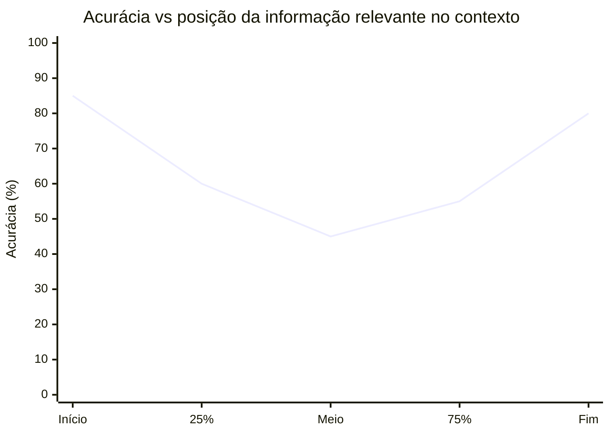

<div class="mt-4 text-sm">
Em contextos longos (>10k tokens), modelos prestam <b>mais atenção ao início e fim</b>, e tendem a "esquecer" o meio. Por isso colocar instruções importantes <b>no começo</b> e a pergunta <b>no fim</b> ajuda.
</div>

---

# 3.2 Estratégias de context management
<div class="grid grid-cols-2 gap-3 mt-3 text-xs">
<div class="p-3 rounded-xl bg-purple-500/10 border border-purple-500/30"><b>✂️ Truncamento (sliding window)</b><br>Mantém só as últimas N mensagens. <b>Prós:</b> simples. <b>Contras:</b> perde contexto antigo importante.</div>
<div class="p-3 rounded-xl bg-purple-500/10 border border-purple-500/30"><b>📝 Sumarização</b><br>Comprime histórico antigo em resumo. <b>Prós:</b> mantém essência. <b>Contras:</b> +1 chamada LLM, perde detalhes.</div>
<div class="p-3 rounded-xl bg-purple-500/10 border border-purple-500/30"><b>🔍 RAG (retrieval)</b><br>Busca só os trechos relevantes. <b>Prós:</b> escala para milhões de docs. <b>Contras:</b> depende do retriever.</div>
<div class="p-3 rounded-xl bg-purple-500/10 border border-purple-500/30"><b>🗄️ Sub-agentes / handoffs</b><br>Sub-agente processa contexto pesado e devolve síntese. <b>Prós:</b> isola contextos. <b>Contras:</b> orquestração complexa.</div>
</div>
<div class="mt-3 p-2 rounded bg-cyan-500/10 border border-cyan-500/30 text-xs">🎯 <b>Padrão moderno:</b> combinar <b>sumarização automática</b> + <b>file system como memória externa</b> + <b>sub-agentes</b> para tarefas isoladas.</div>
---

# Exemplo: sumarização automática
<div class="mb-3 p-2 rounded bg-sky-500/10 border border-sky-500/30 text-xs">📖 <b>Em palavras:</b> conte os tokens; se passar do limite, preserve as últimas 4 mensagens e resuma o restante em 200 palavras.</div>
```python
def manage_context(messages: list, max_tokens: int = 8000):
    """Se passar do limite, sumariza as mensagens antigas."""
    total = count_tokens(messages)
    if total < max_tokens:
        return messages
    # Mantém as últimas 4 mensagens, sumariza o resto
    keep = messages[-4:]
    to_summarize = messages[:-4]
```

---

# Exemplo: sumarização automática — continuação
```python
    summary = client.chat.completions.create(
        model="gpt-4o-mini",
        messages=[
            {"role": "system", "content": "Resuma esta conversa em 200 palavras, preservando fatos importantes e decisões."},
            *to_summarize,
        ],
    ).choices[0].message.content
    return [{"role": "system", "content": f"Resumo do histórico anterior:\\n{summary}"}, *keep]
```
<div class="mt-3 p-2 rounded bg-cyan-500/10 border border-cyan-500/30 text-xs">✅ Resultado: o histórico não cresce sem controle, mas as decisões importantes continuam acessíveis.</div>
---

# 3.3 RAG — Retrieval-Augmented Generation

A ideia: **busque** trechos relevantes de uma base externa e **injete** no prompt.

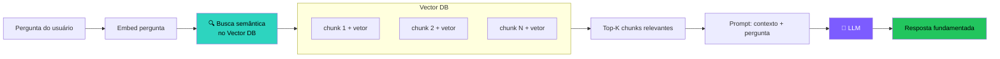

---

# RAG — anatomia da indexação (offline)

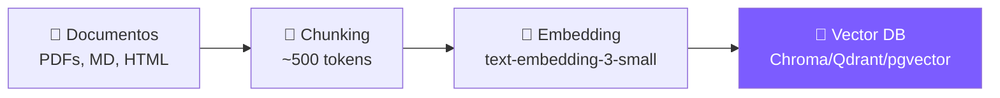

<div class="mt-4 grid grid-cols-3 gap-4 text-sm">

<div class="p-3 rounded bg-white/5">
<b>1. Loaders</b><br>
PyPDF, BeautifulSoup, Unstructured, Markdown loader.
</div>

<div class="p-3 rounded bg-white/5">
<b>2. Splitters</b><br>
RecursiveCharacterTextSplitter, SemanticChunker, by-header (para Markdown).
</div>

<div class="p-3 rounded bg-white/5">
<b>3. Embeddings</b><br>
OpenAI <code>text-embedding-3</code>, Cohere, BGE, ou local (sentence-transformers).
</div>

</div>

---

# Hands-on: RAG completo com Chroma

```python
from langchain_community.document_loaders import TextLoader
from langchain_text_splitters import RecursiveCharacterTextSplitter
from langchain_openai import OpenAIEmbeddings, ChatOpenAI
from langchain_chroma import Chroma
from langchain.chains import create_retrieval_chain
from langchain.chains.combine_documents import create_stuff_documents_chain
from langchain_core.prompts import ChatPromptTemplate
docs = TextLoader("manual.txt").load()
chunks = RecursiveCharacterTextSplitter(chunk_size=500, chunk_overlap=50).split_documents(docs)
vstore = Chroma.from_documents(chunks, OpenAIEmbeddings(model="text-embedding-3-small"))
```

---

# Hands-on: RAG completo com Chroma — continuação

```python
retriever = vstore.as_retriever(search_kwargs={"k": 4})
prompt = ChatPromptTemplate.from_template(
    "Responda baseado APENAS no contexto:\n\n{context}\n\nPergunta: {input}"
)
combine = create_stuff_documents_chain(ChatOpenAI(model="gpt-4o-mini"), prompt)
chain = create_retrieval_chain(retriever, combine)
print(chain.invoke({"input": "Como configuro o produto?"})["answer"])
```

---

# Advanced RAG — quando o básico não basta

RAG ingênuo (embeddings + top-K) tem **muitos pontos de falha**. Em produção, usa-se um pipeline:

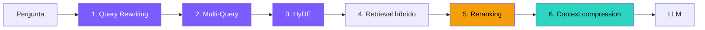

<div class="mt-3 text-sm">
Cada estágio recupera <b>+5-15% de qualidade</b> em benchmarks como BEIR, MS MARCO.
</div>

---

# Padrão 1 · Query Rewriting

A pergunta do usuário **raramente** é uma boa query de busca.

<div class="mt-4 grid grid-cols-2 gap-4 text-sm">

<div class="p-3 rounded bg-red-500/10 border border-red-500/30">
<b>❌ Pergunta do usuário</b><br>
<i>"e o problema que falei ontem, ainda tá acontecendo?"</i><br>
→ vetor sem contexto, retrieval inútil
</div>

<div class="p-3 rounded bg-green-500/10 border border-green-500/30">
<b>✅ Query reescrita pelo LLM</b><br>
<i>"erro 504 timeout no endpoint /api/login mencionado em 03/11/2025"</i><br>
→ vetor rico, retrieval certeiro
</div>

</div>

```python
def reescrever_query(historico, pergunta):
    return llm.invoke(f"""
    Histórico: {historico}
    Pergunta atual: {pergunta}
    Reescreva como query de busca standalone, com todos os termos técnicos.
    """)
```

---

# Padrão 2 · Multi-Query & HyDE
<div class="p-3 rounded-xl bg-purple-500/10 border border-purple-500/30 text-sm"><b>🔁 Multi-Query</b><br>Gere <b>N reformulações</b> da pergunta e busque com todas para aumentar <b>recall</b>.</div>
```python
queries = llm.invoke(f"""
Gere 4 reformulações da pergunta:
{pergunta}
"""
).split("\\n")
docs = []
for q in queries:
    docs += vectordb.search(q, k=5)
docs = dedupe(docs)
```
<div class="mt-3 p-2 rounded bg-cyan-500/10 border border-cyan-500/30 text-xs">📈 Na prática, costuma melhorar o <b>recall</b> em 20–40%.</div>

---

# Padrão 2 · Multi-Query & HyDE — continuação
<div class="p-3 rounded-xl bg-cyan-500/10 border border-cyan-500/30 text-sm"><b>🎭 HyDE</b> (<i>Hypothetical Document Embeddings</i>) cria uma <b>resposta hipotética</b> e usa o embedding dela para buscar.</div>
```python
hipo = llm.invoke(f"""
Escreva um trecho que responderia:
{pergunta}
"""
)
docs = vectordb.search(hipo, k=5)
```
<div class="mt-3 p-2 rounded bg-amber-500/10 border border-amber-500/30 text-xs">💡 Funciona porque “resposta → resposta” costuma ficar mais perto no espaço vetorial que “pergunta → resposta”.</div>
---

# Padrão 3 · Parent-Child Chunks & Agentic RAG
<div class="p-3 rounded-xl bg-purple-500/10 border border-purple-500/30 text-sm"><b>👨‍👦 Parent-Child Chunks</b><br>Indexe pedaços <b>pequenos</b> para busca precisa, mas devolva ao LLM o pedaço <b>grande</b> para manter contexto rico.</div>
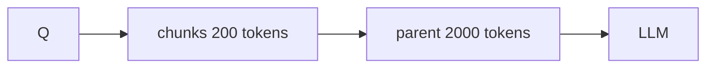
<div class="mt-3 p-2 rounded bg-cyan-500/10 border border-cyan-500/30 text-xs">🎯 O índice trabalha com alta precisão; a resposta final recebe contexto suficiente para sintetizar.</div>

---

# Padrão 3 · Parent-Child Chunks & Agentic RAG — continuação
<div class="p-3 rounded-xl bg-cyan-500/10 border border-cyan-500/30 text-sm"><b>🤖 Agentic RAG</b><br>O LLM decide <b>se precisa buscar</b>, <b>onde buscar</b> e <b>quando refinar</b> a busca.</div>
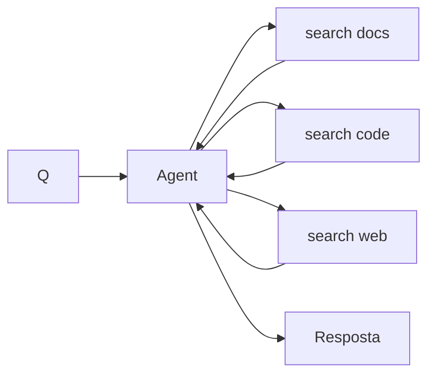
<div class="mt-3 p-2 rounded bg-amber-500/10 border border-amber-500/30 text-xs">🎯 É o padrão por trás de <b>Perplexity</b>, <b>ChatGPT Search</b> e <b>Cursor @docs</b>.</div>
---

# 3.4 Vector DBs comparativo

| DB | Quando usar | Open source | Notas |
|---|---|---|---|
| **Chroma** | Dev local, protótipos | ✅ | Mais fácil de começar |
| **Qdrant** | Produção, escala média | ✅ | Rust, rápido, ótimo filtro híbrido |
| **pgvector** | Já uso Postgres | ✅ | Extensão PG — uma coisa a menos pra operar |
| **Pinecone** | SaaS gerenciado | ❌ | Caro mas zero ops |
| **Weaviate** | Multi-modal, GraphQL | ✅ | Bom para casos complexos |
| **Milvus / Zilliz** | Bilhões de vetores | ✅/❌ | Casos extremos |
| **LanceDB** | Embedded + cloud | ✅ | Formato em disco, S3-friendly |

<div class="mt-4 p-3 rounded bg-cyan-500/10 border border-cyan-500/30 text-sm">
💡 <b>Recomendação 2025:</b> comece com Chroma local. Quando for pra produção, considere <b>pgvector</b> (se já usa Postgres) ou <b>Qdrant</b>.
</div>

---

# Search híbrido — porque puro vetor não basta

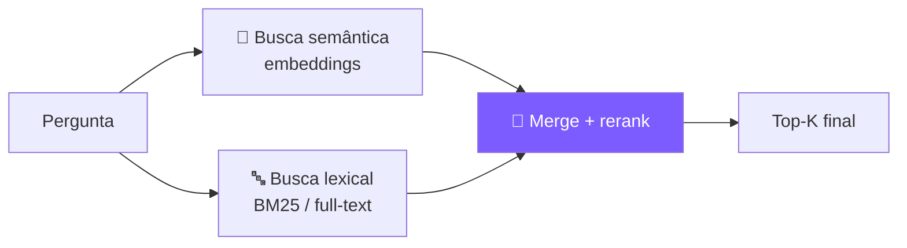

<div class="mt-3 grid grid-cols-2 gap-3 text-xs">
<div class="p-3 rounded bg-white/5"><b>Semântico</b><br>Entende conceitos e sinônimos; falha em termos exatos, números e códigos.</div>
<div class="p-3 rounded bg-white/5"><b>Lexical (BM25)</b><br>Acerta termos exatos e IDs; não entende paráfrases.</div>
</div>

<div class="mt-3 p-2 rounded bg-amber-500/10 border border-amber-500/30 text-xs">🥇 <b>Reranker:</b> reordena os top-20 com um cross-encoder (Cohere Rerank, BGE-reranker) e costuma melhorar a resposta final.</div>

---

# 📊 RAG vs Fine-tuning vs Prompt — quando usar
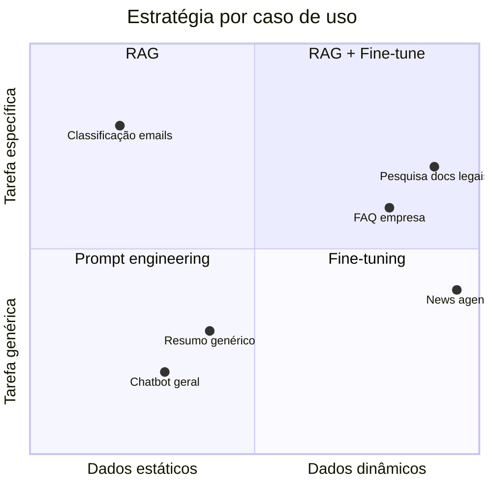

---
layout: section
---

# 🎯 Grounding

<div class="mt-8 text-center">
<div class="text-4xl mb-4">🎯</div>
<div class="text-xl font-bold mb-4">Grounding = Ancorar o agente na realidade</div>
</div>
<div class="grid grid-cols-2 gap-4 text-sm mt-4">
<div class="p-4 rounded-xl bg-red-500/10 border border-red-500/30"><b>Sem grounding:</b><br>o agente inventa fatos, cita fontes falsas e responde com confiança errada.</div>
<div class="p-4 rounded-xl bg-green-500/10 border border-green-500/30"><b>Com grounding:</b><br>ele busca informação real antes de responder e cita fontes verificáveis.</div>
</div>
<div class="mt-4 p-3 rounded bg-amber-500/10 border border-amber-500/30 text-sm">💡 RAG, busca web e bancos de dados são técnicas de grounding: conectam o LLM ao mundo real.</div>

---

# O que é Grounding?

<div class="mt-4 p-5 rounded-xl bg-cyan-500/10 border-2 border-cyan-500/40">
<div class="text-lg text-center">
<b>Grounding</b> = ancorar cada afirmação do modelo em uma <b>fonte verificável</b>.<br>
Toda resposta precisa responder: <b>"de onde isso veio?"</b>
</div>
</div>

<div class="mt-6 grid grid-cols-2 gap-4 text-sm">

<div class="p-4 rounded bg-red-500/10 border border-red-500/30">
<b>❌ Sem grounding</b><br>
<i>"O contrato exige aviso prévio de 60 dias."</i><br>
→ Verdade? Inventado? Impossível auditar.
</div>

<div class="p-4 rounded bg-green-500/10 border border-green-500/30">
<b>✅ Com grounding</b><br>
<i>"O contrato exige 60 dias de aviso prévio <b>[Cláusula 14.3, contrato_v3.pdf]</b>."</i><br>
→ Auditável, rastreável, defensável.
</div>

</div>

<div class="mt-4 p-3 rounded bg-purple-500/10 border border-purple-500/30 text-xs">
📚 <b>Leitura essencial:</b> Rashkin et al. (2023) — <i>"Measuring Attribution in NLG Models"</i> formaliza o conceito <b>AIS</b> (<i>Attributable to Identified Sources</i>). Bohnet et al. (2022) — <i>"Attributed Question Answering"</i> propõe o benchmark AQA. Em jurídico, médico e financeiro, grounding deixou de ser opcional — virou <b>compliance</b>.
</div>

---

# Por que grounding falha

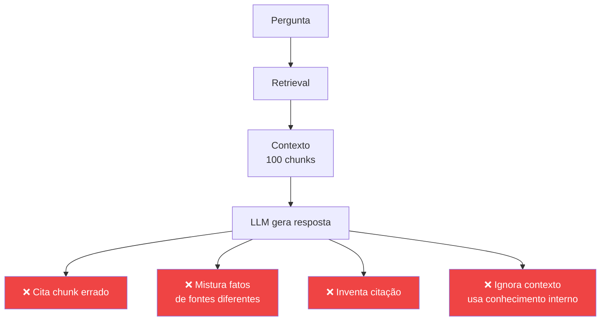

<div class="mt-3 text-sm">
Mesmo com RAG, a <b>"grounding rate"</b> (% de afirmações ancoradas) raramente passa de 70-80% sem técnicas dedicadas.
</div>

---

# Técnicas de grounding (1/2)

<div class="grid grid-cols-1 gap-3 text-sm mt-3">

<div class="p-3 rounded bg-purple-500/10 border border-purple-500/30">
<b>1. 🆔 Inline citations com IDs únicos</b><br>
Cada chunk recebe <code>[doc_id:chunk_id]</code>. Prompt pede citação após cada frase.
</div>

<div class="p-3 rounded bg-purple-500/10 border border-purple-500/30">
<b>2. 📋 "According to X" prompting</b><br>
Forçar prefixo "Segundo [fonte X]…" reduz alucinação em 20% (Weller et al., 2023).
</div>

<div class="p-3 rounded bg-purple-500/10 border border-purple-500/30">
<b>3. 🚪 Refusal explícito</b><br>
Prompt: <i>"Se o contexto não contém a resposta, responda 'Não encontrei nos documentos fornecidos.'"</i>
</div>

<div class="p-3 rounded bg-purple-500/10 border border-purple-500/30">
<b>4. 🔍 Contextual grounding check</b><br>
Após gerar, um <b>segundo LLM</b> verifica: "Cada afirmação é suportada pelo contexto?"
</div>

</div>

---

# Técnicas de grounding (2/2) — em código
<div class="mb-3 p-2 rounded bg-sky-500/10 border border-sky-500/30 text-xs">📖 <b>Camada 1:</b> force o LLM a responder só com base nos documentos e a citar a fonte de cada afirmação.</div>
```python
SYSTEM = """Responda APENAS com base nos documentos abaixo.
Para CADA afirmação, adicione [doc_id] da fonte.
Se não souber, responda exatamente: "Não encontrei nos documentos."
NÃO use conhecimento externo."""
contexto = "

".join([f"[doc_{d.id}] {d.content}" for d in docs_retrieved])
resposta = llm.invoke(f"{SYSTEM}

{contexto}

Pergunta: {q}")
```

---

# Técnicas de grounding (2/2) — continuação
<div class="mb-3 p-2 rounded bg-sky-500/10 border border-sky-500/30 text-xs">📖 <b>Camada 2:</b> rode uma verificação automática que classifica cada frase como suportada, parcial ou não suportada.</div>
```python
verificacao = llm.invoke(f"""
Resposta: {resposta}
Contexto disponível: {contexto}
Para cada afirmação na resposta, marque:
- SUPORTADA (existe no contexto)
- NÃO_SUPORTADA (alucinação)
- PARCIAL (parcialmente apoiada)
JSON: {{"afirmacoes": [{{"texto": ..., "status": ...}}]}}
""")
```
<div class="mt-3 p-2 rounded bg-cyan-500/10 border border-cyan-500/30 text-xs">🎯 Monitore <b>Groundedness</b>, <b>Citation accuracy</b> e <b>Answer relevance</b>.</div>
---

# Frameworks que ajudam com grounding

| Ferramenta | O que faz |
|---|---|
| **RAGAS** | Métricas automáticas: faithfulness, answer_relevancy, context_precision |
| **TruLens** | Tracing + avaliação de grounding em produção |
| **Vertex AI Grounding** | Google força citações em URL real |
| **Bing Grounding (Azure)** | Tool nativo para citar web |
| **Anthropic Citations API** | Citações estruturadas garantidas pelo modelo (2024) |
| **DeepEval** | Suite de testes incluindo hallucination + faithfulness |

<div class="mt-4 p-3 rounded bg-amber-500/10 border border-amber-500/30 text-sm">
⚠️ <b>"Faithfulness"</b> ≠ <b>"Correctness"</b>. Resposta pode ser <b>fiel</b> ao contexto mas o <b>contexto</b> estar errado. Garantir grounding é necessário, não suficiente.
</div>

---
layout: section
---

# 🧬 Synthesis

<div class="mt-8 text-center">
<div class="text-4xl mb-4">🧬</div>
<div class="text-xl font-bold mb-4">Synthesis = Gerar resposta a partir de evidências</div>
</div>
<div class="grid grid-cols-3 gap-3 text-xs mt-4">
<div class="p-3 rounded-xl bg-purple-500/10 border border-purple-500/30 text-center"><b>1. Retrieve</b><br>Buscar chunks relevantes</div>
<div class="p-3 rounded-xl bg-cyan-500/10 border border-cyan-500/30 text-center"><b>2. Augment</b><br>Montar prompt com contexto</div>
<div class="p-3 rounded-xl bg-green-500/10 border border-green-500/30 text-center"><b>3. Generate</b><br>LLM sintetiza a resposta final</div>
</div>
<div class="mt-4 p-3 rounded bg-amber-500/10 border border-amber-500/30 text-sm">💡 Boa synthesis não copia chunks: ela <b>integra, compara e contextualiza</b> a informação recuperada.</div>

---

# O problema da Synthesis

Recuperei 20 chunks de 5 fontes. **E agora?**

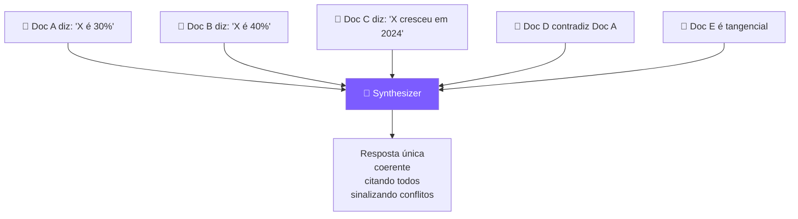

<div class="mt-3 text-sm">
Synthesis ≠ Retrieval. É um <b>passo de raciocínio</b> que requer: dedup, resolução de conflito, hierarquização, citação atribuída.
</div>

---

# Padrão 1 · Map-Reduce sobre documentos

Para muitos docs ou docs grandes — não cabem todos no contexto.

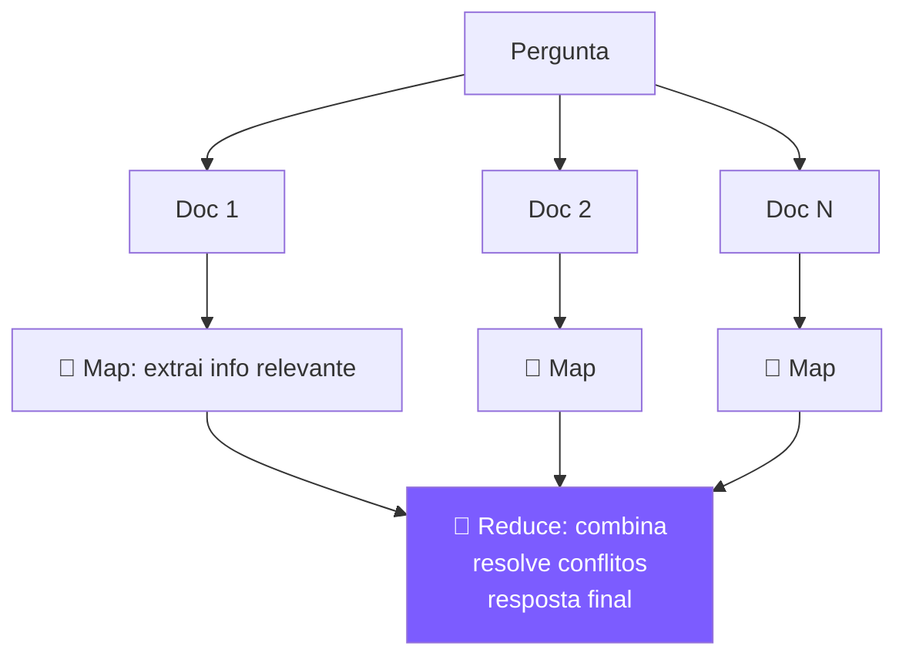

<div class="mt-3 text-sm">
<b>Map:</b> rodar em paralelo, barato (modelo menor). <b>Reduce:</b> modelo maior, com instruções de citação.<br>
Variante: <b>Refine</b> — atualiza resposta incrementalmente conforme lê cada doc.
</div>

---

# Padrão 2 · Resolução de conflitos

Quando fontes discordam, o agente **não pode** simplesmente escolher uma.

```python
SYNTH_PROMPT = """Sintetize a resposta usando os trechos abaixo.
REGRAS:
1. Se fontes CONCORDAM, afirme com confiança e cite todas.
2. Se fontes DISCORDAM, apresente as visões DIVERGENTES explicitamente:
   "Segundo [A], X = 30%. Já [B] reporta X = 40%."
3. Se a divergência tem causa identificável (data, escopo), explique:
   "A diferença pode se dever a [A] ser de 2023 e [B] de 2024."
"""
```

---

# Padrão 2 · Resolução de conflitos — continuação

```python
SYNTH_PROMPT = """
4. NUNCA invente uma 'média' entre fontes contraditórias.
5. Cite com [doc_id] após cada afirmação.
Trechos:
{contexto}
Pergunta: {pergunta}
"""
```

<div class="mt-3 p-3 rounded bg-amber-500/10 border border-amber-500/30 text-sm">
⚠️ <b>Anti-padrão clássico:</b> "média de alucinações" — pegar 3 números diferentes e dar a média. Pior que escolher um.
</div>

---

# Padrão 3 · Hierarchical Summarization

Para corpora gigantes (livros, repositórios, milhares de tickets):

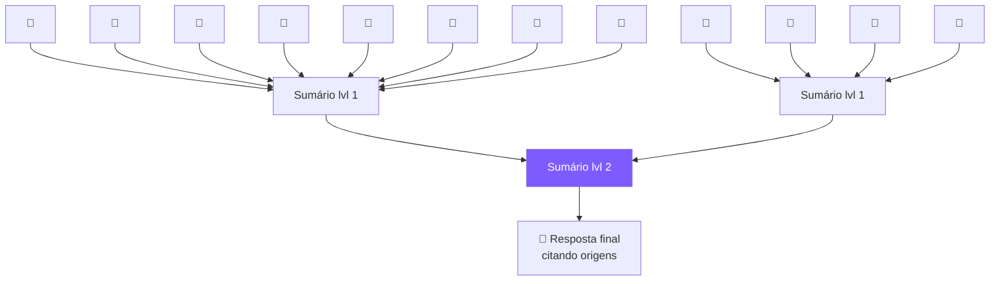

<div class="mt-3 text-sm">
Cada nível mantém <b>ponteiros</b> para o nível anterior — assim a resposta final ainda pode citar chunks específicos.<br>
Usado em: <b>Claude Projects</b>, <b>NotebookLM</b>, <b>Cursor codebase indexing</b>.
</div>

---

# Synthesis na prática · LangChain

```python
from langchain.chains.combine_documents import create_stuff_documents_chain
from langchain.chains import create_retrieval_chain

# 1) Map-reduce nativo
from langchain.chains.summarize import load_summarize_chain
chain = load_summarize_chain(llm, chain_type="map_reduce")

# 2) Refine — resposta evolui doc a doc
chain_refine = load_summarize_chain(llm, chain_type="refine")

# 3) Stuff — joga tudo no contexto (só se cabe)
chain_stuff = load_summarize_chain(llm, chain_type="stuff")
```

| Chain type | Quando usar | Pro | Contra |
|---|---|---|---|
| **Stuff** | Cabem todos os docs | Simples | Limitado por context window |
| **Map-Reduce** | Muitos docs | Paralelizável | Perde contexto cross-doc |
| **Refine** | Docs sequenciais | Mantém contexto | Sequencial, sem paralelizar |

---

# 🧪 Context Engineering — o novo nome do jogo
<div class="mt-3 p-3 rounded-xl bg-cyan-500/10 border-2 border-cyan-500/40 text-center text-sm"><b>Prompt engineering</b> → <b>Context engineering</b></div>
<div class="mt-3 grid grid-cols-2 gap-3 text-xs">
<div class="p-2 rounded bg-purple-500/10 border border-purple-500/30"><b>📦 O que entra</b><br>System, exemplos, retrievals, memória, tool results, histórico — em qual ordem?</div>
<div class="p-2 rounded bg-purple-500/10 border border-purple-500/30"><b>🗑️ O que sai</b><br>Compressão, summarization, eviction policies e mitigação de “lost in the middle”.</div>
<div class="p-2 rounded bg-purple-500/10 border border-purple-500/30"><b>🎚️ Quanto e quando</b><br>Dynamic context: recuperar só quando precisa e gastar tokens onde importa.</div>
<div class="p-2 rounded bg-purple-500/10 border border-purple-500/30"><b>🔁 Como evolui</b><br>O contexto muda turn a turn; ele não é estático.</div>
</div>
<div class="mt-3 p-2 rounded bg-amber-500/10 border border-amber-500/30 text-xs">📚 Termos atuais: <b>Context engineering</b> (Karpathy), <b>Context rot</b> (Anthropic) e <b>Context economy</b>.</div>
---

# 💰 Prompt Caching — 90% de economia
<div class="mt-3 p-3 rounded-xl bg-green-500/10 border-2 border-green-500/40 text-sm"><b>Como funciona:</b> partes <b>estáveis</b> do prompt (system, docs, exemplos) ficam cacheadas no servidor; as próximas chamadas pagam ~10% desse trecho.</div>
```python
response = client.messages.create(
    model="claude-sonnet-4-5",
    system=[
        {"type": "text", "text": "Você é um assistente legal..."},
        {"type": "text", "text": MEGA_DOCUMENTO_50K_TOKENS,
         "cache_control": {"type": "ephemeral"}},
    ],
    messages=[{"role": "user", "content": pergunta}],
)
```
<div class="mt-3 grid grid-cols-3 gap-2 text-xs"><div class="p-2 rounded bg-white/5"><b>1ª chamada</b><br>100% do custo</div><div class="p-2 rounded bg-white/5"><b>Subsequentes</b><br>~10% do trecho cacheado</div><div class="p-2 rounded bg-white/5"><b>TTL típico</b><br>5 min (ephemeral)</div></div>
<div class="mt-3 p-2 rounded bg-amber-500/10 border border-amber-500/30 text-xs">🎯 <b>Padrão:</b> conteúdo <b>estável no início</b> e <b>dinâmico no fim</b>; inverter a ordem quebra o cache.</div>
---

# 3.5 Memória — curto vs longo prazo

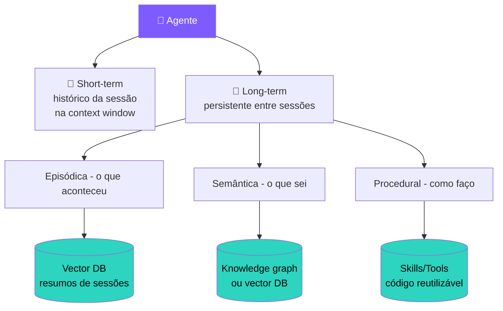

---

# Tipos de memória de longo prazo

<div class="grid grid-cols-3 gap-4 mt-6">

<div class="p-4 rounded-xl bg-white/5 border border-white/10">
<div class="text-2xl mb-2">📖</div>
<b>Episódica</b><br>
<span class="text-sm opacity-80">"O que aconteceu" — eventos, conversas passadas, ações tomadas.</span><br><br>
<i class="text-xs">Ex: ChatGPT memory, Claude Projects.</i>
</div>

<div class="p-4 rounded-xl bg-white/5 border border-white/10">
<div class="text-2xl mb-2">🧠</div>
<b>Semântica</b><br>
<span class="text-sm opacity-80">"O que sei sobre o mundo" — fatos, preferências do usuário, contexto persistente.</span><br><br>
<i class="text-xs">Ex: "usuário prefere respostas curtas".</i>
</div>

<div class="p-4 rounded-xl bg-white/5 border border-white/10">
<div class="text-2xl mb-2">⚙️</div>
<b>Procedural</b><br>
<span class="text-sm opacity-80">"Como fazer" — habilidades, ferramentas, scripts aprendidos.</span><br><br>
<i class="text-xs">Ex: Skills do Claude, comandos custom.</i>
</div>

</div>

---

# Frameworks de memória persistente

<div class="grid grid-cols-2 gap-4 mt-6">

<div class="p-4 rounded-xl bg-purple-500/10 border border-purple-500/30">
<b>mem0</b><br>
<span class="text-sm">Layer de memória plug-and-play. Detecta automaticamente o que vale a pena lembrar.</span><br>
<code class="text-xs mt-2 block">pip install mem0ai</code>
</div>

<div class="p-4 rounded-xl bg-purple-500/10 border border-purple-500/30">
<b>Zep</b><br>
<span class="text-sm">Open source. Knowledge graph temporal + vector. Foco em produção.</span><br>
<code class="text-xs mt-2 block">getzep.com</code>
</div>

<div class="p-4 rounded-xl bg-purple-500/10 border border-purple-500/30">
<b>LangGraph + checkpoints</b><br>
<span class="text-sm">Persiste o estado completo do agente em Postgres/Redis. Você controla tudo.</span>
</div>

<div class="p-4 rounded-xl bg-purple-500/10 border border-purple-500/30">
<b>Letta (ex-MemGPT)</b><br>
<span class="text-sm">Papers seminais sobre "OS para agentes" com memória hierárquica.</span>
</div>

</div>

---

# Exemplo: memória com mem0
<div class="mb-3 p-2 rounded bg-sky-500/10 border border-sky-500/30 text-xs">📖 <b>Em palavras:</b> o mem0 funciona como um caderno do usuário: você grava fatos com <code>add()</code> e recupera só as memórias relevantes com <code>search()</code>.</div>
```python
from mem0 import Memory
m = Memory()
user_id = "alan"
m.add("Prefiro respostas em português, tom técnico", user_id=user_id)
m.add("Trabalho com Python e TypeScript", user_id=user_id)
m.add("Não gosto de emojis em código", user_id=user_id)
```

---

# Exemplo: memória com mem0 — continuação
```python
def chat(pergunta: str):
    memorias = m.search(pergunta, user_id=user_id, limit=5)
    contexto = "\\n".join(m["memory"] for m in memorias["results"])
    return client.chat.completions.create(
        model="gpt-4o-mini",
        messages=[
            {"role": "system", "content": f"Sobre o usuário:\\n{contexto}"},
            {"role": "user", "content": pergunta},
        ],
    ).choices[0].message.content
print(chat("Me ajude a escrever uma função"))
```
<div class="mt-3 p-2 rounded bg-cyan-500/10 border border-cyan-500/30 text-xs">✅ Resultado: ele responde em português, tom técnico e sem emojis mesmo em outra sessão.</div>
---

---
layout: center
class: text-center
---

# 🔧 Parte 2: Habilidades e colaboração

<div class="text-lg mt-6 opacity-90">
O agente já tem <b>memória</b> e <b>conhecimento externo</b> (RAG).<br>
Agora vamos dar a ele <b>habilidades permanentes</b> — e a capacidade de <b>trabalhar em equipe</b>.
</div>

<div class="mt-6 text-sm opacity-60">
Skills, MCP, e padrões multi-agente.
</div>

---

# 3.6 Skills — capacidades reutilizáveis

📅 Lançado pela Anthropic em **outubro/2025**.

**Conceito:** uma "skill" é uma **pasta** com:
- Um `SKILL.md` descrevendo o que faz e quando usar
- Scripts auxiliares (Python, bash)
- Templates, dados, recursos

O agente **descobre** skills disponíveis e **carrega só o necessário** quando relevante.

```
~/.claude/skills/
├── pdf-extractor/
│   ├── SKILL.md          ← "use isto para extrair texto de PDFs"
│   └── extract.py
├── jira-integration/
│   ├── SKILL.md
│   └── jira_client.py
└── excel-formatter/
    ├── SKILL.md
    └── format.py
```

---

# Skills vs Tools — qual a diferença?

<div class="grid grid-cols-2 gap-3 mt-4 text-xs">
<div class="p-3 rounded-xl bg-cyan-500/10 border border-cyan-500/30"><div class="font-bold mb-1">🛠️ Tool</div><b>Sempre disponível</b><br>Schema JSON fixo<br>1 função = 1 tool<br>Ocupa contexto mesmo parada</div>
<div class="p-3 rounded-xl bg-purple-500/10 border border-purple-500/30"><div class="font-bold mb-1">🎓 Skill</div><b>Carrega sob demanda</b><br>Pode trazer docs e scripts<br>1 skill = competência inteira<br>Quase zero overhead</div>
</div>

<div class="mt-4 p-3 rounded-xl bg-amber-500/10 border border-amber-500/30 text-xs">💡 <b>Analogia:</b> tool é função da biblioteca padrão; skill é um pacote especializado que você só carrega quando precisa.</div>

---

# 3.7 MCP — Model Context Protocol

📅 Lançado pela **Anthropic em novembro/2024**. Adotado por OpenAI, Google e a maioria dos frameworks em 2025.

<div class="mt-6 p-5 rounded-xl bg-cyan-500/10 border-2 border-cyan-500/40 text-center">
<div class="text-xl">
MCP é o <b>"USB-C"</b> dos agentes:<br>
um protocolo padrão para conectar LLMs a <b>qualquer</b> fonte de dados ou ferramenta.
</div>
</div>

<div class="mt-6 grid grid-cols-2 gap-4 text-sm">

<div class="p-3 rounded bg-red-500/10 border border-red-500/30">
<b>Antes do MCP:</b><br>
Cada framework (LangChain, LlamaIndex, CrewAI…) tinha sua API de tools.<br>
Integrar com Slack? 5 implementações diferentes.
</div>

<div class="p-3 rounded bg-green-500/10 border border-green-500/30">
<b>Com MCP:</b><br>
1 servidor MCP do Slack → funciona em <b>todos</b> os agentes/clientes que falam MCP.<br>
Hoje: Claude Desktop, Cursor, VS Code, Cline, Continue…
</div>

</div>

---

# MCP — arquitetura
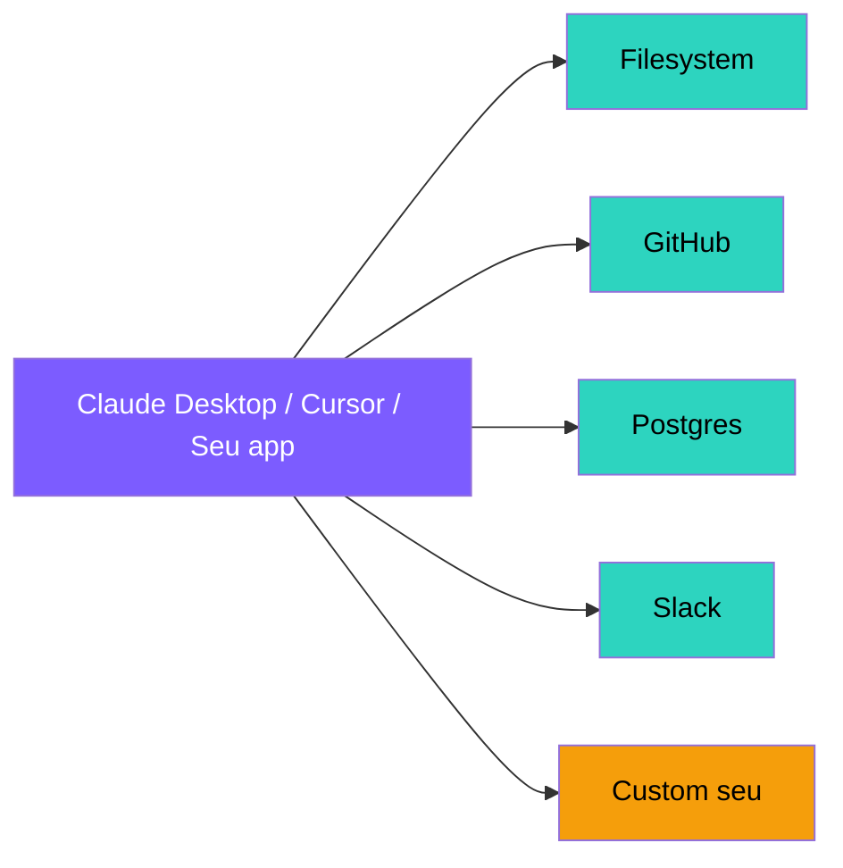
<div class="mt-3 text-xs">Comunicação por <b>JSON-RPC</b> (stdio local ou HTTP/SSE remoto). Cada servidor expõe <b>tools</b>, <b>resources</b> e <b>prompts</b>.</div>
---

# MCP em ação — servidor mínimo (Python)

```python
from mcp.server.fastmcp import FastMCP
mcp = FastMCP("minha-calculadora")
@mcp.tool()
def somar(a: int, b: int) -> int:
    """Soma dois números inteiros."""
    return a + b
```

---

# MCP em ação — servidor mínimo (Python) — continuação

```python
@mcp.tool()
def multiplicar(a: int, b: int) -> int:
    """Multiplica dois números inteiros."""
    return a * b
if __name__ == "__main__":
    mcp.run()
```

<div class="mt-4 p-3 rounded bg-cyan-500/10 border border-cyan-500/30 text-sm">
Pronto. Esse servidor funciona em <b>Claude Desktop</b>, <b>Cursor</b>, <b>VS Code Copilot</b>, ou qualquer cliente MCP, sem mudar uma linha. <b>Esse é o ponto</b>.
</div>

---

# Ecossistema MCP — alguns servidores prontos

<div class="grid grid-cols-3 gap-3 text-sm">

<div class="p-3 rounded bg-white/5"><b>filesystem</b> · ler/escrever arquivos</div>
<div class="p-3 rounded bg-white/5"><b>github</b> · issues, PRs, código</div>
<div class="p-3 rounded bg-white/5"><b>postgres / sqlite</b> · queries SQL</div>
<div class="p-3 rounded bg-white/5"><b>slack</b> · mensagens, canais</div>
<div class="p-3 rounded bg-white/5"><b>brave-search</b> · busca web</div>
<div class="p-3 rounded bg-white/5"><b>puppeteer</b> · navegação automatizada</div>
<div class="p-3 rounded bg-white/5"><b>memory</b> · KV store persistente</div>
<div class="p-3 rounded bg-white/5"><b>fetch</b> · HTTP requests</div>
<div class="p-3 rounded bg-white/5"><b>google-drive</b> · arquivos GDrive</div>

</div>

<div class="mt-4 text-center text-sm opacity-70">
Lista oficial: <a href="https://github.com/modelcontextprotocol/servers">github.com/modelcontextprotocol/servers</a> — centenas de servidores comunitários.
</div>

---

# 3.8 Padrões multi-agente

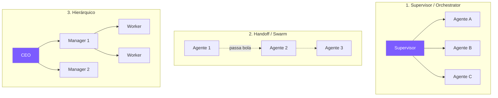

---

# Quando usar multi-agente?

<div class="grid grid-cols-2 gap-3 mt-4 text-xs">
<div class="p-3 rounded-xl bg-green-500/10 border border-green-500/30"><div class="font-bold mb-1 text-green-300">✅ Use quando</div>Fases bem diferentes<br>Prompts/contextos distintos<br>Especialistas com tools próprias<br>Paralelismo gera ganho real</div>
<div class="p-3 rounded-xl bg-red-500/10 border border-red-500/30"><div class="font-bold mb-1 text-red-300">❌ Evite quando</div>Um agente resolve sozinho<br>Latência é crítica<br>Custo precisa ser previsível<br>Você nem mediu o benefício</div>
</div>

<div class="mt-4 p-3 rounded bg-amber-500/10 border border-amber-500/30 text-xs">🎯 <b>Regra prática:</b> single-agent com bom contexto costuma vencer; só vá de multi-agent quando a tarefa realmente pedir especialização ou paralelismo.</div>

---

# Frameworks multi-agente

<div class="grid grid-cols-2 gap-4 mt-6">

<div class="p-4 rounded-xl bg-purple-500/10 border border-purple-500/30">
<b>CrewAI</b><br>
<span class="text-sm">"Crew" de agentes com roles (researcher, writer, reviewer). Sintaxe declarativa.</span>
</div>

<div class="p-4 rounded-xl bg-purple-500/10 border border-purple-500/30">
<b>AutoGen (Microsoft)</b><br>
<span class="text-sm">Agentes conversam entre si. Forte em geração de código colaborativa.</span>
</div>

<div class="p-4 rounded-xl bg-purple-500/10 border border-purple-500/30">
<b>LangGraph (multi-agent)</b><br>
<span class="text-sm">Cada nó do grafo = 1 agente. Controle total, padrão moderno.</span>
</div>

<div class="p-4 rounded-xl bg-purple-500/10 border border-purple-500/30">
<b>OpenAI Swarm / Agents SDK</b><br>
<span class="text-sm">Handoffs leves entre agentes. Lançado em 2024.</span>
</div>

</div>

---

# Exemplo: Crew com CrewAI

<div class="mb-3 p-3 rounded bg-sky-500/10 border border-sky-500/30 text-sm">
📖 <b>Em palavras:</b> imagine uma <b>equipe de funcionários</b>. Cada <code>Agent</code> tem um cargo (role), um objetivo e um "currículo" (backstory) — isso vira parte do prompt dele. Cada <code>Task</code> é uma entrega esperada, atribuída a um agente. O <code>Crew</code> orquestra: o pesquisador entrega, o escritor pega o resultado dele como contexto e produz o artigo. <b>Divisão de trabalho automatizada.</b>
</div>

```python
from crewai import Agent, Task, Crew
pesquisador = Agent(
    role="Pesquisador",
    goal="Encontrar informações precisas sobre o tema",
    backstory="Você é um analista meticuloso.",
    tools=[busca_web, leitor_pdf],
)
escritor = Agent(
    role="Escritor técnico",
    goal="Transformar pesquisa em artigo claro",
    backstory="Você escreve para devs juniores.",
)
```

---

# Exemplo: Crew com CrewAI — continuação

```python
t1 = Task(description="Pesquise tudo sobre {tema}", agent=pesquisador)
t2 = Task(description="Escreva artigo de 500 palavras baseado na pesquisa",
          agent=escritor, context=[t1])
crew = Crew(agents=[pesquisador, escritor], tasks=[t1, t2])
print(crew.kickoff(inputs={"tema": "agentes de IA"}))
```

---

# 3.9 Hands-on integrado — agente com RAG + memória
```python
from langgraph.graph import StateGraph, END
from langgraph.checkpoint.sqlite import SqliteSaver
# ... imports do RAG (Chroma, embeddings)
class State(TypedDict):
    messages: Annotated[list, add_messages]
    context_docs: list[str]
def retrieve_node(state):
    q = state["messages"][-1].content
    docs = retriever.invoke(q)
    return {"context_docs": [d.page_content for d in docs]}
```

---

# 3.9 Hands-on integrado — continuação
```python
def agent_node(state):
    sys = f"Use APENAS este contexto:\\n{state['context_docs']}"
    msgs = [SystemMessage(sys)] + state["messages"]
    return {"messages": [llm.invoke(msgs)]}
graph = StateGraph(State)
graph.add_node("retrieve", retrieve_node)
graph.add_node("agent", agent_node)
graph.set_entry_point("retrieve")
graph.add_edge("retrieve", "agent")
graph.add_edge("agent", END)
memory = SqliteSaver.from_conn_string("checkpoints.db")
app = graph.compile(checkpointer=memory)
```
<div class="mt-3 p-2 rounded bg-cyan-500/10 border border-cyan-500/30 text-xs">💾 Aqui o RAG busca contexto por turno e o <code>SqliteSaver</code> mantém memória persistente entre execuções.</div>
---
layout: section
---

# 🏋️ 3.10 Exercícios — Encontro 3

5 atividades · Memória, RAG, skills, multi-agente

---

# Exercício 3.1 · RAG sobre seus próprios docs

<div class="p-5 rounded-xl bg-purple-500/10 border-2 border-purple-500/40">

**Tarefa:** monte um RAG sobre <b>3-5 PDFs ou Markdowns reais</b> (manual técnico, artigos, sua tese, qualquer coisa).

**Requisitos:**
- Use Chroma local
- Chunking de 500 tokens com overlap de 50
- Top-K = 4
- Mostre os documentos recuperados antes da resposta

**Teste com 5 perguntas:**
- 2 fáceis (estão literais no doc)
- 2 difíceis (exigem síntese de 2+ trechos)
- 1 "pegadinha" (não está no doc — o agente deve dizer "não sei")

</div>

---

# Exercício 3.2 · Memória entre sessões

<div class="p-5 rounded-xl bg-purple-500/10 border-2 border-purple-500/40">

**Tarefa:** use **mem0** ou **LangGraph + SqliteSaver** para criar um chat que **lembra** do usuário entre execuções.

**Cenário:**
1. Sessão 1: usuário diz "me chamo Maria, sou engenheira de dados, prefiro Python"
2. Encerre o programa
3. Sessão 2 (novo `python script.py`): pergunta "qual minha profissão?"

O agente deve responder corretamente **sem** receber a info novamente.

</div>

---

# Exercício 3.3 · Crie um MCP server

<div class="p-5 rounded-xl bg-purple-500/10 border-2 border-purple-500/40">

**Tarefa:** crie um servidor MCP simples que expõe **2 ferramentas** úteis:

1. `listar_arquivos(diretorio: str)` — lista arquivos de um diretório
2. `contar_linhas(caminho_arquivo: str)` — conta linhas de um arquivo

**Conecte ao Claude Desktop** (ou Cursor) editando o `claude_desktop_config.json`.

**Teste:** pergunte ao Claude "quantas linhas tem o maior arquivo .py da pasta X?"

**O que isso ensina:** seu agente passa a ter ferramentas custom em <b>qualquer cliente MCP</b>, não só num script Python.

</div>

---

# Exercício 3.4 · Crew de 2 agentes

<div class="p-5 rounded-xl bg-purple-500/10 border-2 border-purple-500/40">

**Tarefa:** use **CrewAI** ou **LangGraph** para montar:

- **Agente 1 — Pesquisador:** recebe um tema, faz 3 buscas web, retorna fatos
- **Agente 2 — Crítico:** recebe os fatos, avalia se são confiáveis, marca os duvidosos

**Teste:** *"Quais foram os 3 maiores avanços em IA em 2025?"*

**Análise:** compare com a resposta de um único agente fazendo a mesma tarefa. O multi-agente foi melhor? Pior? Mais caro?

</div>

---

# Exercício 3.5 · Análise de context window

<div class="p-5 rounded-xl bg-cyan-500/10 border-2 border-cyan-500/40">

**Tarefa de análise (sem código obrigatório):**

Escolha um agente real que você usa (Cursor, Claude Code, ChatGPT, etc) e responda:

1. Qual a janela de contexto do modelo subjacente?
2. Como ele lida com **históricos longos** (você já viu o "histórico antigo" sumir)?
3. Ele usa **RAG**? Em que parte (busca no seu código? em docs?)
4. Tem memória **entre sessões**? Como ela funciona (na sua percepção)?
5. Que **falhas de contexto** você já viu? (Ex: "esqueceu" algo que você disse no início.)

Escreva 1 página. Será discutido no Encontro 4.

</div>

---
layout: center
class: text-center
---

---

---

# 🌐 Mercado: RAG, grounding & memória
<div class="grid grid-cols-2 gap-3 text-xs">
<div class="p-2 rounded-lg bg-purple-500/10 border border-purple-500/30"><b>🗄️ Vector DBs líderes</b><br>Pinecone · Weaviate · Qdrant · Chroma · pgvector (Supabase/Neon) · Turbopuffer · LanceDB · Elasticsearch/OpenSearch</div>
<div class="p-2 rounded-lg bg-cyan-500/10 border border-cyan-500/30"><b>🔎 RAG-as-a-service / search</b><br>Exa · Tavily · Perplexity API · You.com API · Brave Search API · Azure AI Search · Vertex AI Search</div>
<div class="p-2 rounded-lg bg-green-500/10 border border-green-500/30"><b>🧠 Memória para agentes</b><br>Mem0 · Letta (ex-MemGPT) · Zep · ChatGPT Memory · Claude Projects · Cursor codebase indexing</div>
<div class="p-2 rounded-lg bg-amber-500/10 border border-amber-500/30"><b>📦 Casos reais</b><br>Notion AI Q&A · Glean (US$ 4,6B) · Harvey · Perplexity · Klarna usando RAG sobre políticas</div>
</div>
<div class="mt-3 p-2 rounded-lg bg-blue-500/10 border border-blue-500/30 text-xs">🧩 <b>Analogia:</b> a <b>Glean</b> é o “Google interno da empresa” — grounding sobre Slack, Drive, Jira e Confluence. Esse é o produto-tipo de 2025.</div>
---

# 📚 Referências públicas — Encontro 3 (1/2)
<div class="grid grid-cols-2 gap-3 text-xs mt-3">
<div class="p-3 rounded bg-purple-500/10 border border-purple-500/30"><b>RAG & Context</b><ul class="mt-1"><li>Lewis et al. (2020) — <i>RAG for Knowledge-Intensive NLP</i> · <a href="https://arxiv.org/abs/2005.11401">arXiv:2005.11401</a></li><li>Gao et al. (2022) — <i>HyDE</i> · <a href="https://arxiv.org/abs/2212.10496">arXiv:2212.10496</a></li><li>Liu et al. (2023) — <i>Lost in the Middle</i> · <a href="https://arxiv.org/abs/2307.03172">arXiv:2307.03172</a></li><li>Gao et al. (2024) — <i>RAG Survey</i> · <a href="https://arxiv.org/abs/2312.10997">arXiv:2312.10997</a></li></ul></div>
<div class="p-3 rounded bg-cyan-500/10 border border-cyan-500/30"><b>Grounding & Attribution</b><ul class="mt-1"><li>Rashkin et al. (2023) — <i>Measuring Attribution in NLG</i> · <a href="https://aclanthology.org/2023.cl-4.2/">aclanthology.org/2023.cl-4.2</a></li><li>Bohnet et al. (2022) — <i>Attributed QA</i> · <a href="https://arxiv.org/abs/2212.08037">arXiv:2212.08037</a></li><li>Anthropic (2024) — <i>Citations API</i> · <a href="https://docs.anthropic.com/en/docs/build-with-claude/citations">docs.anthropic.com</a></li></ul></div>
</div>

---

# 📚 Referências públicas — Encontro 3 (2/2)
<div class="grid grid-cols-2 gap-3 text-xs mt-3">
<div class="p-3 rounded bg-green-500/10 border border-green-500/30"><b>Memória & Skills</b><ul class="mt-1"><li>Packer et al. (2023) — <i>MemGPT</i> · <a href="https://arxiv.org/abs/2310.08560">arXiv:2310.08560</a></li><li>Park et al. (2023) — <i>Generative Agents</i> · <a href="https://arxiv.org/abs/2304.03442">arXiv:2304.03442</a></li><li>Anthropic (2024) — <i>Prompt Caching</i> · <a href="https://docs.anthropic.com/en/docs/build-with-claude/prompt-caching">docs.anthropic.com</a></li><li>Anthropic (2024) — <i>MCP Specification</i> · <a href="https://modelcontextprotocol.io/">modelcontextprotocol.io</a></li></ul></div>
<div class="p-3 rounded bg-amber-500/10 border border-amber-500/30"><b>Multi-agente & Frameworks</b><ul class="mt-1"><li>Wu et al. (2023) — <i>AutoGen</i> · <a href="https://arxiv.org/abs/2308.08155">arXiv:2308.08155</a></li><li>CrewAI Docs · <a href="https://docs.crewai.com/">docs.crewai.com</a></li><li>Chroma · <a href="https://docs.trychroma.com/">docs.trychroma.com</a> · Qdrant · <a href="https://qdrant.tech/documentation/">qdrant.tech</a> · pgvector · <a href="https://github.com/pgvector/pgvector">github.com/pgvector</a></li></ul></div>
</div>
<div class="mt-2 text-xs opacity-70">Todo conteúdo deste encontro é de domínio público. Marcas mencionadas pertencem aos respectivos donos; uso exclusivamente educacional.</div>
---

---

# 🔄 Recap — O que construímos no Encontro 3
<div class="grid grid-cols-2 gap-3 text-xs">
<div class="p-3 rounded-xl bg-purple-500/10 border border-purple-500/30"><b>📜 Evolução</b><br>2020: paper RAG · 2023: vector DBs explodem · 2024: MCP · 2025: multi-agentes em produção.</div>
<div class="p-3 rounded-xl bg-cyan-500/10 border border-cyan-500/30"><b>🔧 O que você sabe fazer</b><br>Gerenciar contexto, construir RAG, implementar memória, criar Skills/MCP e orquestrar multi-agentes.</div>
<div class="p-3 rounded-xl bg-green-500/10 border border-green-500/30"><b>🏢 Produtos que usam isso</b><br>Perplexity, NotebookLM, Claude Projects e GitHub Copilot mostram RAG, grounding, memória e extensibilidade em ação.</div>
<div class="p-3 rounded-xl bg-amber-500/10 border border-amber-500/30"><b>❓ Perguntas abertas</b><br>Como agentes falham em produção, como medi-los e quais produtos estão vencendo — tudo isso entra no Encontro 4.</div>
</div>
---

# ✅ Fim do Encontro 3

Você agora sabe:

---

# 🔌 MCP — Conectando agentes ao ecossistema digital

<div class="text-xs mt-2">

**Model Context Protocol** (Anthropic, 2024) — padrão aberto para conectar agentes a ferramentas.

</div>

<div class="grid grid-cols-2 gap-3 text-xs mt-2">

<div class="p-3 rounded-xl border border-cyan-500/30 bg-cyan-500/5">

### Como funciona

1. **Server** expõe tools via JSON-RPC
2. **Client** (agente) descobre tools disponíveis
3. Agente chama tool → Server executa → retorna resultado
4. Padrão universal (como HTTP para web)

</div>

<div class="p-3 rounded-xl border border-purple-500/30 bg-purple-500/5">

### Exemplos reais

- **Spotify MCP** — busca músicas, cria playlists
- **GitHub MCP** — cria PRs, lê issues
- **Slack MCP** — envia mensagens, busca canais
- **Database MCP** — query SQL seguro

</div>

</div>

<div class="mt-2 p-2 rounded bg-amber-500/10 border border-amber-500/30 text-xs">
📌 <b>MIT Mod 3:</b> "A integração com sistemas existentes é onde 80% dos pilotos falham." O MCP resolve a fragmentação.
</div>

---

layout: section
---

# 🧪 Exercícios Interativos — Encontro 3

<div class="text-sm opacity-60 mt-4">Pratique memória, RAG e context management</div>

---

# 🧪 Exercício 3.1 — Sliding Window de contexto

<div class="text-xs mb-2 opacity-70">Implemente truncamento inteligente de histórico de mensagens.</div>

<PyRunner src="/topicos-especiais-ia/exercises/e3_1_sliding_window.py" height="300px" />

---

# 🧪 Exercício 3.2 — Mini RAG com busca por similaridade

<div class="text-xs mb-2 opacity-70">Implemente retrieval básico usando similaridade de palavras (sem embeddings).</div>

<PyRunner src="/topicos-especiais-ia/exercises/e3_2_mini_rag.py" height="320px" />

---

# 🧪 Exercício 3.3 — Memória de longo prazo

<div class="text-xs mb-2 opacity-70">Implemente um store de memória com save/recall.</div>

<PyRunner src="/topicos-especiais-ia/exercises/e3_3_memoria.py" height="320px" />

---

- Gerenciar context window (truncate, summarize, RAG)
- Construir um pipeline RAG completo
- Implementar memória de longo prazo
- Conceituar e criar Skills + MCP
- Orquestrar multi-agentes (e quando NÃO usar)

<div class="mt-12 text-xl text-cyan-400">
Próximo: <b>Encontro 4 — Problemas Comuns & State-of-the-Art</b>
</div>

<div class="mt-4 text-sm opacity-60">
Onde tudo isso encontra a <i>realidade</i>: falhas, custos, e os produtos que estão ganhando o mercado.
</div>
