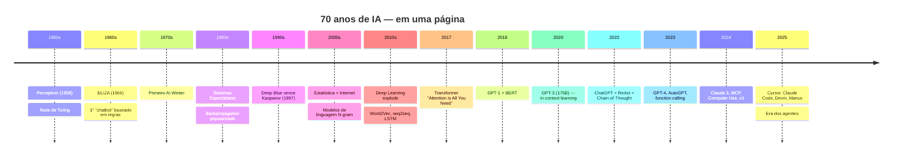
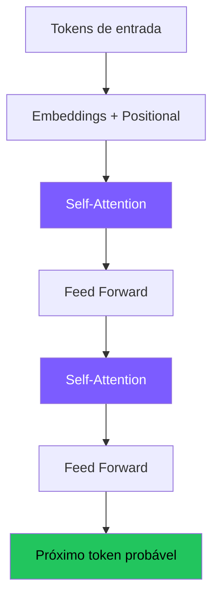
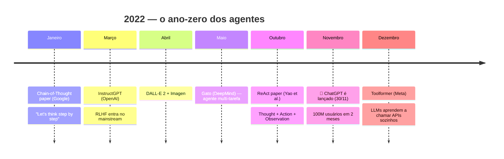

# 📜 História
## Dos primeiros modelos aos Agentes de IA

~45 min · Por que entender a história importa

---
layout: center
class: text-center
---

# Por que olhar para trás?

<v-clicks>

Cada decisão de design de um agente moderno…

…é resposta a um problema descoberto há décadas.

"Agente" não é uma palavra nova. O que mudou foi <b>quem</b> está no controle: antes eram regras escritas por humanos; hoje é um modelo estatístico treinado em ~todo o texto da internet.

</v-clicks>

---

# A linha do tempo de 70 anos — visão geral

---
layout: two-cols
---

# 🏛️ Pré-história (1950–2010)

**1950** · Alan Turing publica *Computing Machinery and Intelligence* — propõe o **Teste de Turing**.

**1958** · Frank Rosenblatt cria o **Perceptron**, primeiro modelo "neural" treinável.

**1966** · Joseph Weizenbaum cria **ELIZA** no MIT — primeiro "chatbot", simulava um psicólogo com regex.

**1980s** · Era dos **Sistemas Especialistas**: bases de regras `if-then` enormes (MYCIN, XCON).

**1997** · IBM **Deep Blue** vence Kasparov no xadrez (busca + heurística, sem ML moderno).

::right::

# 💡 Lição

Por <b>50 anos</b>, "IA" significou:  
<b>👨‍💻 Humano escreve regras → máquina executa</b>

A revolução de 2017–2022 inverteu isso:  
<b>📚 Máquina aprende padrões → humano dá objetivos</b>

Os "agentes" dos anos 80 (Soar, BDI) tinham arquitetura parecida com os de hoje — mas o "cérebro" era código <code>if-else</code>, não um LLM.

---
layout: two-cols
---

# 🌊 A era do Deep Learning (2012–2017)

**2012** · **AlexNet** vence o ImageNet — redes convolucionais profundas dominam visão computacional. Início do "boom" do deep learning.

**2013** · **Word2Vec** (Mikolov, Google) — palavras viram vetores. *"rei − homem + mulher ≈ rainha"*.

**2014** · **Seq2Seq** (Sutskever) — redes encoder/decoder para tradução.

**2015** · **Attention mechanism** (Bahdanau) — modelos aprendem a "olhar" para partes específicas da entrada.

**2016** · **AlphaGo** vence Lee Sedol — Reinforcement Learning + busca em árvore.

::right::

# Por que isso importa para agentes?

<v-clicks>

🧮 <b>Word2Vec</b> provou que <i>semântica</i> pode ser numérica → base dos <b>embeddings</b> que hoje usamos em RAG.

👁️ <b>Attention</b> é o mecanismo que permite ao modelo focar em palavras relevantes — virou o <b>coração do Transformer</b>.

🎮 <b>AlphaGo</b> mostrou que agentes podem <b>planejar</b> melhor que humanos em domínios fechados — inspirou Tree-of-Thoughts.

</v-clicks>

---

# 2017 · O artigo que mudou tudo

### *Attention Is All You Need*
**Vaswani et al., Google Brain, junho/2017**

8 autores. 11 páginas. Mudou a indústria.

A grande sacada:
- Joga fora recorrência (RNN/LSTM)
- Joga fora convolução
- **Só atenção** → paralelizável em GPU

Resultado:
- ⚡ Treina **muito mais rápido**
- 📈 Escala com dados e parâmetros
- 🌍 Funciona pra qualquer sequência

Arquitetura Transformer (simplificada) — base de TODOS os LLMs modernos.

---

# 2018 · A corrida começa

### 🔵 GPT-1
**OpenAI · Junho 2018**

- **117 milhões** de parâmetros
- Treinado em **BooksCorpus** (~7 mil livros)
- "Improving Language Understanding by Generative Pre-Training"
- Demonstrou: pré-treino + fine-tuning bate modelos especializados
- Praticamente ignorado pela mídia

### 🟢 BERT
**Google · Outubro 2018**

- **340 milhões** de parâmetros
- Bidirectional Encoder
- Bateu 11 benchmarks de NLP
- Foi a **estrela do momento** — dominou pesquisa por 2 anos
- Mas: bom em *entender*, ruim em *gerar*

<b>Curiosidade:</b> em 2018, a comunidade apostava em <b>BERT</b> (Google) como o futuro. Quase ninguém previu que a abordagem <i>generative-only</i> da OpenAI venceria.

---
layout: two-cols
---

# 2019 · GPT-2

**Fevereiro de 2019.** OpenAI anuncia o GPT-2:

- **1.5 bilhão** de parâmetros (13× maior que GPT-1)
- Treinado em **40 GB** de texto da web (WebText)
- Geração de texto **assustadoramente coerente**

📰 A OpenAI **se recusa a publicar o modelo completo** alegando "risco de uso malicioso".

→ Polêmica enorme: "OpenAI virou ClosedAI"
→ Liberam em etapas ao longo de 2019

::right::

# 🎯 Por que isso importou

<v-clicks>

Primeira vez que um modelo gerou texto que <b>passava pelo crivo humano</b> em parágrafos curtos.

Iniciou o debate <b>"AI Safety"</b> no mainstream — risco de desinformação em escala.

Validou a tese: <b>mais parâmetros + mais dados = melhor</b>. A "Bitter Lesson" de Sutton se confirmava.

<b>Sem fine-tuning</b>, o modelo já mostrava sinais de aprender tarefas só de ver exemplos no prompt.

</v-clicks>

---

# 2020 · GPT-3 — a virada

175 bilhões de parâmetros

### 📦 Escala
- 175B parâmetros
- 100× maior que GPT-2
- ~500B tokens de treino
- Custo estimado: **~US$ 5–10 milhões** para treinar

### 💡 Conceito novo
<b>In-Context Learning</b> (ICL):

Não precisa fine-tuning. Mostre 1–5 exemplos no prompt — o modelo aprende a tarefa "na hora".

→ Nasce o termo **"few-shot prompting"**.

### 🌐 API privada
- Não open-source
- Acesso por API com waitlist
- Catalisou todo o ecossistema GPT-as-a-Service

💬 Aqui nasce a <b>"engenharia de prompts"</b>. Pela primeira vez, programar uma IA significava <b>escrever em inglês</b>, não em Python.

---
layout: two-cols
---

# 2021 · Codex e o despertar

**Julho 2021** · OpenAI lança o **Codex** — um GPT-3 fine-tuned em código do GitHub.

→ Vira o motor do **GitHub Copilot** (junho/2021, beta).

Pela primeira vez, milhões de devs viram um LLM **escrever código útil** no editor.

**Setembro 2021** · WebGPT (OpenAI) — primeiro experimento sério com LLM **navegando na web**.

📚 Comunidade acadêmica começa a estudar:
- "Como o GPT-3 *raciocina*?"
- "Como dar a ele *ferramentas*?"

::right::

# 🌱 As primeiras sementes de agentes

<v-clicks>

<b>Codex</b> mostrou que um LLM pode produzir <b>código executável</b> — base do "code as action".

<b>WebGPT</b> ensinou um LLM a clicar links e ler páginas — primeiro "agente" web da OpenAI.

Surgem os primeiros papers sobre <b>"LLMs as Tool Users"</b> — a ideia que vai dominar 2023.

</v-clicks>

---

# 2022 · O ano em que tudo aconteceu

---
layout: two-cols
---

# Os 3 papers de 2022 que criaram "agentes"

### 1️⃣ Chain-of-Thought (Wei et al., jan/22)
> *"Let's think step by step"* — frase mágica que melhora reasoning em 20-40%.

### 2️⃣ ReAct (Yao et al., out/22)
> **Re**asoning + **Act**ing. Verbalizar o raciocínio antes de agir → menos erros, mais interpretabilidade.

### 3️⃣ Toolformer (Schick et al., dez/22)
> LLMs aprendem **autonomamente** quando chamar APIs (calculadora, busca, tradução) durante a geração.

::right::

# E o ChatGPT?

30/nov/2022

Lançamento do ChatGPT

<v-clicks>

📱 <b>5 dias</b> para 1 milhão de usuários 
<i>(Netflix levou 3,5 anos; Instagram, 2,5 meses)</i>

🌍 <b>2 meses</b> para 100 milhões de usuários

<b>Não era nada tecnicamente novo</b> — era GPT-3.5 + interface de chat + RLHF. 
A revolução foi <b>de acesso</b>, não de modelo.

</v-clicks>

---

# 2023 · A explosão Cambriana dos agentes

<b>Março</b> · GPT-4 — multimodal, raciocínio muito melhor

<b>Março</b> · LangChain explode (10k → 60k ⭐ no GitHub)

<b>Março</b> · <b>AutoGPT</b> — primeiro agente "autônomo" viral (150k ⭐ em 1 mês)

<b>Abril</b> · <b>BabyAGI</b> — agente com to-do list e memória vetorial

<b>Maio</b> · LlamaIndex vira referência em RAG

<b>Junho</b> · OpenAI lança <b>Function Calling</b> oficial

<b>Julho</b> · Llama 2 — primeiro LLM open source competitivo

<b>Setembro</b> · Mistral 7B — open source eficiente

<b>Novembro</b> · GPTs e Assistants API (OpenAI DevDay)

<b>Novembro</b> · <b>Tree of Thoughts</b> (Yao) — busca em árvore de raciocínio

🎢 <b>Realidade check:</b> AutoGPT era impressionante de assistir e <b>quase inútil</b> na prática — entrava em loop, gastava US$ 10/tarefa, não terminava. Mas ensinou ao mundo o que <i>poderia</i> ser feito.

---
layout: two-cols
---

# 2024 · Maturidade e novos paradigmas

**Março** · **Claude 3** (Anthropic) — primeiro modelo a bater GPT-4 em benchmarks gerais.

**Maio** · **GPT-4o** — multimodal nativo, voz em tempo real.

**Setembro** · **OpenAI o1** — primeiro modelo com **reasoning explícito** treinado via RL. Pensa antes de responder.

**Outubro** · **Computer Use** (Anthropic) — Claude controla mouse e teclado.

**Novembro** · **MCP** (Model Context Protocol) — padrão aberto para conectar LLMs a ferramentas.

**Dezembro** · **Devin** (Cognition) e **o3** anunciados.

::right::

# 🔑 Mudanças paradigmáticas

<v-clicks>

<b>Reasoning treinado</b> (o1) — não é mais só "prompt engineering". O modelo <b>aprendeu</b> a pensar passo a passo durante o RL.

<b>Computer Use</b> — quebra a barreira "LLM só fala". Agora ele <b>opera computadores</b> como nós.

<b>MCP</b> — finalmente um padrão (tipo USB) para ferramentas. Antes, cada framework tinha o seu.

</v-clicks>

---

# 2025 · A era dos produtos agentic

### 🎯 Coding Agents
- **Cursor** — IDE com agente embutido
- **Claude Code** — agente CLI da Anthropic
- **GitHub Copilot Agent** — vai além do autocomplete
- **Devin** (Cognition) — "engenheiro de software" autônomo
- **Aider, Cline, Continue**

### 🌐 General Agents
- **Manus** (China) — primeiro "general-purpose agent" viral
- **OpenAI Operator** — agente que navega na web
- **ChatGPT Tasks / Agents**
- **Perplexity Comet**

### 🏢 Enterprise
- **Salesforce Agentforce**
- **Microsoft Copilot Studio**
- **Google Agentspace**
- **Hugging Face smolagents**
- **CrewAI, AutoGen, LangGraph**

🎯 <b>O que mudou em 2025:</b> agentes deixaram de ser demos virais e viraram <b>produtos com receita</b>. Cursor sozinho chegou a US$ 100M ARR em 12 meses.

---

# Crescimento de parâmetros — escala visual

| Modelo | Ano | Parâmetros | Cresc. vs anterior |
|---|---|---|---|
| GPT-1 | 2018 | 117 M | — |
| BERT-large | 2018 | 340 M | 3× |
| GPT-2 | 2019 | 1.5 B | 4× |
| T5 | 2019 | 11 B | 7× |
| GPT-3 | 2020 | 175 B | 16× |
| PaLM | 2022 | 540 B | 3× |
| GPT-4 (estimado) | 2023 | ~1.7 T (MoE) | 3× |
| Claude 3 Opus / Gemini Ultra | 2024 | ? (não divulgado) | — |

🧊 <b>Plot twist (2024+):</b> a corrida por mais parâmetros desacelerou. O foco virou <b>melhor treinamento</b>, <b>reasoning</b> e <b>arquiteturas MoE</b> (Mixture of Experts) — mais eficientes.

---
layout: two-cols
---

# 🧬 Da pesquisa ao produto

📄 <b>2017</b>: Transformer (paper)

🔬 <b>2018-2020</b>: Modelos cada vez maiores em laboratório

💬 <b>2022</b>: ChatGPT — UX certa, produto viral

🛠️ <b>2023</b>: Function calling — LLMs viram <i>orquestradores</i>

🤖 <b>2024</b>: Reasoning treinado + uso de computador

💼 <b>2025</b>: Agentes em produção, com SLA, métricas e receita

::right::

# 🧠 O que aprendemos em 7 anos?

<v-clicks>

1. <b>Escala funciona</b> — mais dados/parâmetros = melhor. Até saturar.

2. <b>RLHF é crucial</b> — sem ele, o modelo é "inútil para humanos".

3. <b>Ferramentas > parâmetros</b> — um modelo com Python + busca bate um modelo 10× maior sem ferramentas.

4. <b>Reasoning pode ser treinado</b> (o1, DeepSeek-R1) — não é só prompt.

5. <b>O loop importa</b> — a diferença entre "chatbot" e "agente" é o <b>controle de execução</b>.

</v-clicks>

---
layout: center
class: text-center
---

# 🎬 Resumo executivo

De <b>1958 (Perceptron)</b> a <b>2017</b>, foram <b>59 anos</b> para chegar ao Transformer.

De <b>2017</b> a <b>2022 (ChatGPT)</b>, <b>5 anos</b> para sair da pesquisa e virar produto de massa.

De <b>2022</b> a <b>2025 (agentes em produção)</b>, <b>3 anos</b>.

A próxima curva está acontecendo agora.

…e vocês vão construí-la.

---
layout: section
---

# ✅ Fim da sessão histórica

Agora que sabemos *como chegamos aqui*, vamos entender *o que é* um agente.

→ Próximo: **Encontro 1 — Fundamentos**

---

# 📚 Referências públicas — Sessão histórica

<b>Marcos da IA</b>
<ul class="mt-1">
<li>Rosenblatt (1958) — <i>The Perceptron</i> · Psychological Review</li>
<li>Rumelhart, Hinton & Williams (1986) — <i>Learning Representations by Back-propagating Errors</i> · Nature</li>
<li>LeCun et al. (1998) — <i>Gradient-Based Learning Applied to Document Recognition</i> (LeNet)</li>
<li>Krizhevsky, Sutskever & Hinton (2012) — <i>ImageNet Classification with Deep CNNs</i> (AlexNet)</li>
<li>Mikolov et al. (2013) — <i>word2vec</i> · <a href="https://arxiv.org/abs/1301.3781">arXiv:1301.3781</a></li>
</ul>

<b>Era Transformer & LLMs</b>
<ul class="mt-1">
<li>Vaswani et al. (2017) — <i>Attention Is All You Need</i> · <a href="https://arxiv.org/abs/1706.03762">arXiv:1706.03762</a></li>
<li>Devlin et al. (2018) — <i>BERT</i> · <a href="https://arxiv.org/abs/1810.04805">arXiv:1810.04805</a></li>
<li>Radford et al. (2018) — <i>GPT-1</i> · <a href="https://openai.com/research/language-unsupervised">openai.com/research</a></li>
<li>Brown et al. (2020) — <i>GPT-3, Language Models are Few-Shot Learners</i> · <a href="https://arxiv.org/abs/2005.14165">arXiv:2005.14165</a></li>
<li>Ouyang et al. (2022) — <i>InstructGPT (RLHF)</i> · <a href="https://arxiv.org/abs/2203.02155">arXiv:2203.02155</a></li>
</ul>

<b>Era dos agentes</b>
<ul class="mt-1">
<li>Yao et al. (2022) — <i>ReAct</i> · <a href="https://arxiv.org/abs/2210.03629">arXiv:2210.03629</a></li>
<li>Significant-Gravitas (2023) — <i>Auto-GPT</i> · <a href="https://github.com/Significant-Gravitas/AutoGPT">github.com/Significant-Gravitas/AutoGPT</a></li>
<li>Park et al. (2023) — <i>Generative Agents</i> · <a href="https://arxiv.org/abs/2304.03442">arXiv:2304.03442</a></li>
<li>Anthropic (2024) — <i>MCP</i> · <a href="https://modelcontextprotocol.io/">modelcontextprotocol.io</a></li>
<li>Google (2025) — <i>A2A Protocol</i> · <a href="https://a2a-protocol.org/">a2a-protocol.org</a></li>
</ul>

<b>Recursos didáticos</b>
<ul class="mt-1">
<li>Goodfellow, Bengio & Courville (2016) — <i>Deep Learning</i> · <a href="https://www.deeplearningbook.org/">deeplearningbook.org</a> (livre)</li>
<li>Stanford CS25 — <i>Transformers United</i> · <a href="https://web.stanford.edu/class/cs25/">web.stanford.edu/class/cs25</a></li>
<li>3Blue1Brown — <i>Neural Networks series</i> · YouTube</li>
<li>Andrej Karpathy — <i>Neural Networks: Zero to Hero</i> · YouTube</li>
</ul>

Todo conteúdo é de domínio público. Marcas mencionadas pertencem aos respectivos donos; uso exclusivamente educacional.

