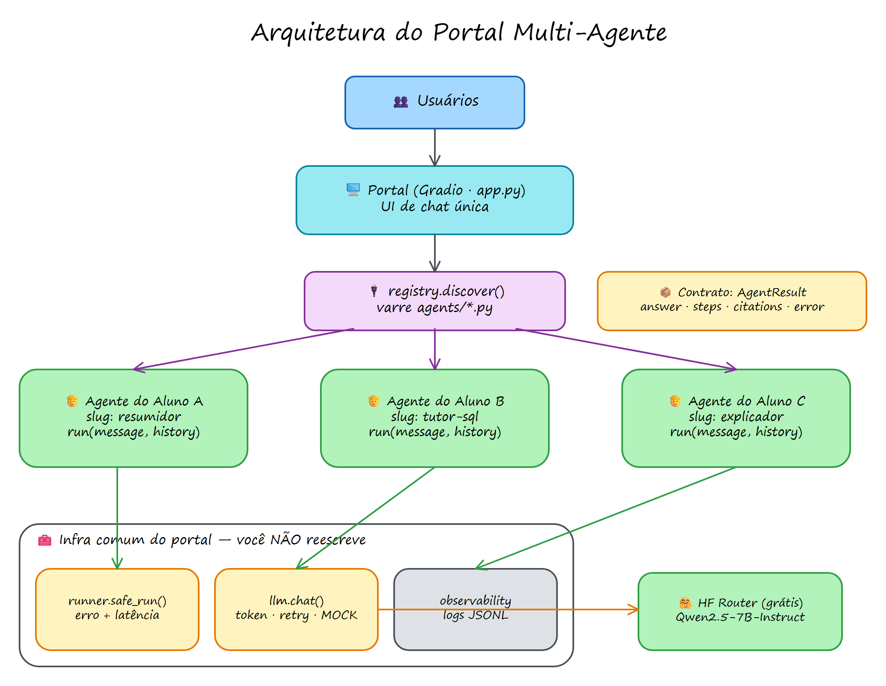
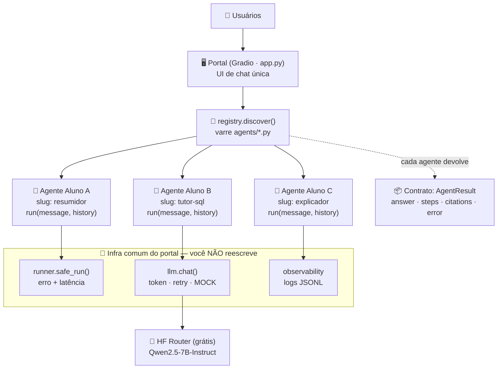
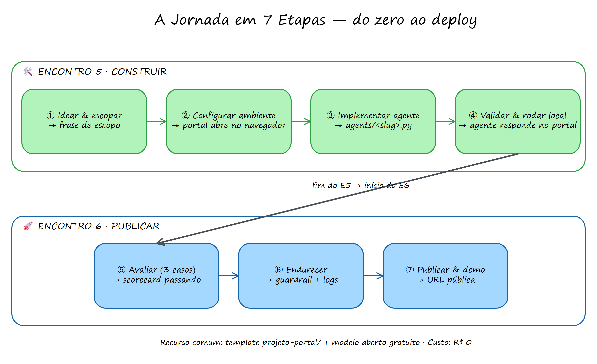
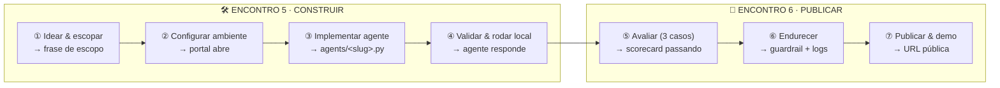

# 🎓 Guia do Professor — Encontros 5 & 6 (Imersão)

Roteiro passo a passo para conduzir os dois encontros de imersão em que os
alunos constroem e publicam um agente no **Portal Multi-Agente**.

- **Formato:** 2 encontros (sugestão: 3–4h cada).
- **Entrega:** cada aluno pluga **um** agente de tarefa única no portal comum.
- **Stack:** 100% open source. Modelo aberto (Qwen) via Hugging Face, token
  gratuito. Deploy grátis no Hugging Face Spaces.
- **Material de apoio:** slides `reveal/sections/encontro-5.html` e
  `encontro-6.html`; template de código nesta pasta (`projeto-portal/`).

---

## ✅ Antes da aula (checklist do professor)

- [ ] Suba o `projeto-portal/` num repositório Git acessível aos alunos.
- [ ] Rode você mesmo o fluxo completo uma vez (setup → agente → deploy).
- [ ] Crie um token HF gratuito e teste `python app.py` com e sem `MOCK_LLM=1`.
- [ ] Publique um Space de demonstração (mostra o resultado final logo no início).
- [ ] Prepare uma **planilha de slugs** compartilhada (evita nomes duplicados).
- [ ] Tenha 2–3 ideias de agente na manga para alunos travados na ideação.
- [ ] Peça (opcional) que instalem Python + Git antes; ou use Google Colab.

> 💡 Plano B de infraestrutura: se a rede/HF estiver instável, **todo o
> desenvolvimento roda offline com `MOCK_LLM=1`**. Só o juiz LLM e o deploy
> precisam de token/rede.

---

## 📅 Encontro 5 — Construir (roteiro)

| Tempo | Bloco | O que fazer |
|------:|-------|-------------|
| 0:00–0:15 | **Abertura** | Mostre o Space de demo pronto. "No fim do E6, o SEU agente estará assim, no ar." Apresente a regra: 1 aluno = 1 agente. |
| 0:15–0:35 | **Contrato & arquitetura** | Slides do contrato (`AgentResult` + `run`) e do fluxo `agents/ → registry → app`. Enfatize: "vocês editam UM arquivo". |
| 0:35–1:05 | **Ideação + escopo** | Cada aluno escolhe um arquétipo e escreve a **frase de escopo**. Circule e valide 1 a 1. Rejeite escopos vagos na hora. |
| 1:05–1:20 | **Setup guiado** | Todos rodam `pip install`, configuram `.env` (ou `MOCK_LLM=1`) e sobem o portal com o agente de exemplo. Ninguém avança sem o portal abrindo. |
| 1:20–1:30 | ☕ Intervalo | — |
| 1:30–2:30 | **Implementação** | Copiam o template, implementam `run()`. Você circula. Use o exemplo Resumidor/Calculadora/FAQ conforme o arquétipo de cada um. |
| 2:30–2:50 | **Validação** | Todos rodam `check_agent.py` e veem o agente no portal local. |
| 2:50–3:00 | **Fechamento** | Revise a *Definition of Done* do E5. Tarefa: deixar o agente rodando e trazer para o E6. |

### Objetivos de saída do E5
Todo aluno termina com: escopo em 1 frase · `agents/<slug>.py` criado ·
`check_agent.py` passando · agente respondendo no portal local.

### Erros que você vai ver (e a resposta rápida)
- **Escopo vago** → devolva a frase-modelo e peça a "saída verificável".
- **Slug com espaço/maiúscula** → o preflight avisa; renomeie.
- **`HF_TOKEN` não encontrado** → mande rodar com `MOCK_LLM=1` e seguir.
- **Chamada de rede no import** → mova para dentro do `run()`.

---

## 📅 Encontro 6 — Endurecer & publicar (roteiro)

| Tempo | Bloco | O que fazer |
|------:|-------|-------------|
| 0:00–0:15 | **Retomada** | Todos abrem o portal local com o próprio agente. Quem não conseguiu, resolve agora (pareie com você/monitor). |
| 0:15–0:40 | **Preflight & debug** | Percorra os erros comuns. Garanta que 100% da turma tem o agente rodando sem exceção antes de avançar. |
| 0:40–1:20 | **Avaliação** | Cada aluno escreve 3 casos (`eval/cases/<slug>.yaml`: feliz, borda, fora de escopo) e roda `run_eval.py`. Discuta um scorecard com ❌ e como iterar. |
| 1:20–1:30 | ☕ Intervalo | — |
| 1:30–1:55 | **Guardrail** | Cada aluno adiciona pelo menos 1 guardrail de entrada/saída. Menu de guardrails no slide. |
| 1:55–2:10 | **Observabilidade** | Mostre `logs/interactions.jsonl`. O que medir, o que nunca logar. |
| 2:10–2:50 | **Deploy** | Passo a passo do HF Spaces (SDK Gradio + secret `HF_TOKEN`). Alternativa: PR no portal da turma (um arquivo). |
| 2:50–3:20 | **Demos** | 2 min por aluno, com plano B. Use um timer visível. |
| 3:20–3:30 | **Encerramento** | Rubrica, próximos passos, "para além do curso". |

### Objetivos de saída do E6
Preflight ok · 3 casos de eval · ≥1 guardrail · deploy no Spaces (ou PR) ·
demo de 2 min ensaiada.

---

## 🗂️ Duas formas de entrega (escolha uma para a turma)

1. **Space individual** — cada aluno publica o próprio portal com seu agente.
   Melhor para portfólio. Mais Spaces para acompanhar.
2. **Portal da turma (recomendado)** — um repositório único; cada aluno abre um
   PR adicionando `agents/<slug>.py` + `eval/cases/<slug>.yaml`. Você faz o
   merge e publica **um** Space com todos os agentes. Reforça Git + revisão.

---

## 📋 Rubrica sugerida (100 pts)

| Critério | Peso | O que observar |
|----------|-----:|----------------|
| Escopo | 20 | Tarefa clara, útil e **verificável**; frase de escopo completa. |
| Funciona | 25 | Roda no portal, cumpre o contrato, não quebra a UI. |
| Avaliação | 20 | 3 casos relevantes; usou o scorecard para iterar. |
| Robustez | 15 | Guardrail(s) e boas mensagens de erro. |
| Deploy | 10 | Publicado e acessível por URL (ou PR mergeado). |
| Demo | 10 | Clara, dentro do tempo, com plano B. |

---

## 🧯 Kit de sobrevivência da aula

- **Rede/HF caiu:** `MOCK_LLM=1` para tudo, menos deploy/juiz. O fluxo inteiro
  (contrato, UI, evals determinísticos) continua demonstrável.
- **Aluno muito travado na ideia:** ofereça um arquétipo pronto (Resumidor,
  Tutor de SQL, Explicador de erro, Gerador de commit) e mande adaptar ao
  domínio dele.
- **"Não passa no eval":** ótimo momento pedagógico — mostre a iteração
  prompt → rodar → número sobe. É o coração da engenharia de agentes.
- **Space não builda:** confira o cabeçalho YAML do `README.md` (sdk: gradio,
  app_file: app.py) e o secret `HF_TOKEN`.

---

## 🔭 Extensões (para turmas mais avançadas)

- Ferramentas de verdade (busca web, execução de código) com um loop ReAct.
- RAG com embeddings + FAISS/Chroma quando a base de conhecimento crescer.
- Multi-agente: um agente orquestrador que chama os dos colegas.
- Observabilidade profissional com Langfuse ou Arize Phoenix (OSS).

---

## 🗺️ Diagramas

Fontes editáveis em `public/diagrams/` (abra em https://aka.ms/excalidraw):
`portal-arquitetura.excalidraw` e `jornada-7-etapas.excalidraw`.
Exports renderizados (`.png` e `.svg`) estão na mesma pasta.
Abaixo, os PNGs renderizados e as versões Mermaid (renderizam direto no GitHub).

### Arquitetura do Portal Multi-Agente

### A jornada em 7 etapas — do zero ao deploy

> Recurso comum a todas as etapas: o template `projeto-portal/` (já pronto) + modelo aberto gratuito. Custo total: **R$ 0**.
