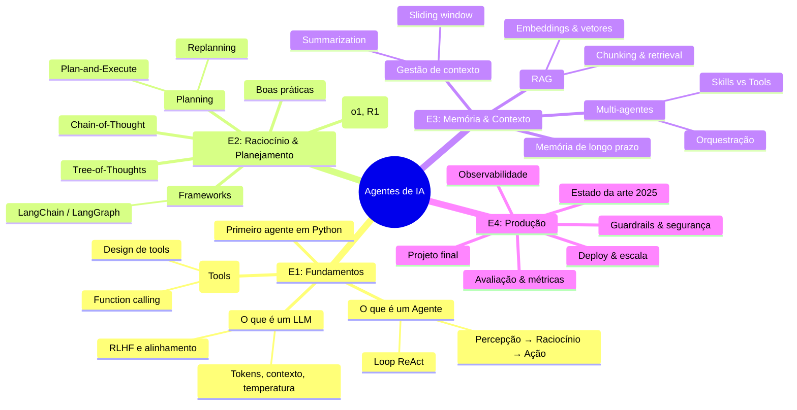

# Tópicos Especiais em IA
## 🤖 Agentes de IA — *Zero to Hero*

4 encontros · 3h cada · 100% prático

  Prof. Alan · 2026 · Material assíncrono

  Aperte <kbd>Space</kbd> para começar →

<!--
Bem-vindos! Esta disciplina vai te levar de zero ao estado-da-arte em Agentes de IA.
São 4 encontros de 3h, mais uma sessão histórica opcional.
-->

---

# 🗺️ Mapa do curso — visão geral

Use este mapa como referência ao longo dos 4 encontros.

---
layout: two-cols
---

# 👋 Bem-vindos

Esta disciplina é **prática**. Em todo encontro vocês vão:

- 🐍 Escrever código Python
- 🛠️ Instalar e rodar agentes
- 🔬 Entender o que está acontecendo *por dentro*
- 💥 Quebrar coisas (e consertar)

Pré-requisitos:

- Python básico
- Curiosidade
- Vontade de errar e iterar

::right::

# 🎯 Ao final, você vai conseguir

<v-clicks>

- Explicar o que é (e o que **não** é) um agente
- Construir um agente do zero, sem framework
- Usar LangChain / LangGraph com propósito
- Implementar RAG, memória e ferramentas custom
- Avaliar e debugar agentes em produção
- Avaliar criticamente Cursor, Claude Code, Devin & cia

</v-clicks>

---
layout: section
---

# 📚 Sumário do curso

---

# Sumário

  
SESSÃO EXTRA · ~45min

  
📜 História

  
Dos primeiros modelos (anos 50) ao GPT-1, GPT-3, ChatGPT e a era dos agentes.

  
ENCONTRO 1 · 3h

  
🧱 Fundamentos

  
O que é um agente, anatomia, padrão ReAct, primeiro agente em Python sem framework.

  
ENCONTRO 2 · 3h

  
🧠 Pensar e Agir

  
Chain-of-Thought, Tree-of-Thoughts, Planning, Function Calling, LangChain/LangGraph.

  
ENCONTRO 3 · 3h

  
💾 Memória e Skills

  
Janela de contexto, RAG, vector DBs, memória de longo prazo, skills, MCP, multi-agentes.

  
ENCONTRO 4 · 3h

  
🚀 Mundo Real & State-of-the-Art

  
Falhas comuns, avaliação (SWE-bench, GAIA), observabilidade, Cursor / Claude Code / Devin / Manus, projeto final.

---
layout: center
class: text-center
---

# 🧭 Como navegar

| Tecla | Ação |
|---|---|
| <kbd>→</kbd> / <kbd>Space</kbd> | Próximo passo |
| <kbd>←</kbd> | Anterior |
| <kbd>o</kbd> | Visão geral (overview) |
| <kbd>d</kbd> | Toggle dark mode |
| <kbd>f</kbd> | Fullscreen |
| <kbd>g</kbd> | Ir para slide N |

---

# Antes de começarmos…

Quase tudo que você vai ouvir nas próximas 12h 
existe há menos de 3 anos.

Para entender <b>onde estamos</b>, precisamos entender <b>como chegamos aqui</b>.

  📜
  
Vamos para a sessão de história →

---
src: ./pages/historia.md
---

---
src: ./pages/encontro-1.md
---

---
src: ./pages/encontro-2.md
---

---
src: ./pages/encontro-3.md
---

---
src: ./pages/encontro-4.md
---

---
layout: center
class: text-center
---

# 🎓 Fim do curso

Obrigado por chegar até aqui. 
Agora você está pronto para construir o próximo grande agente.

Material aberto · Use, adapte, compartilhe

